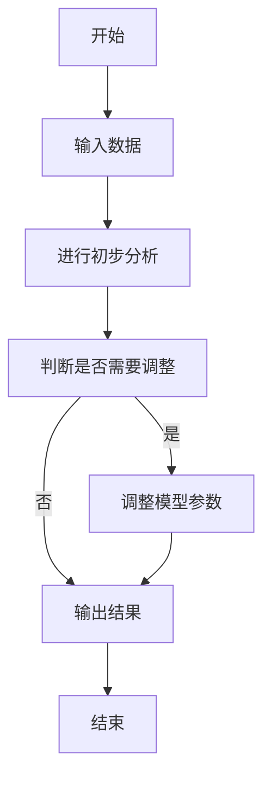
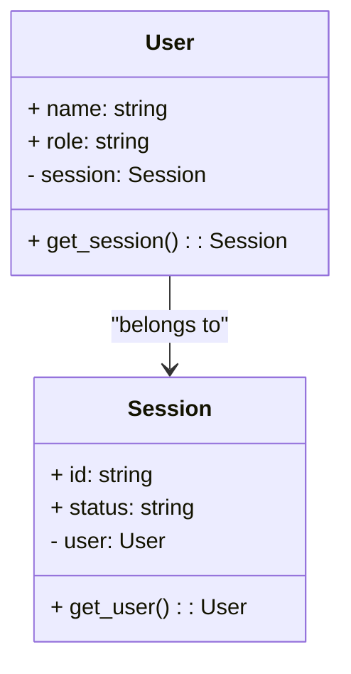
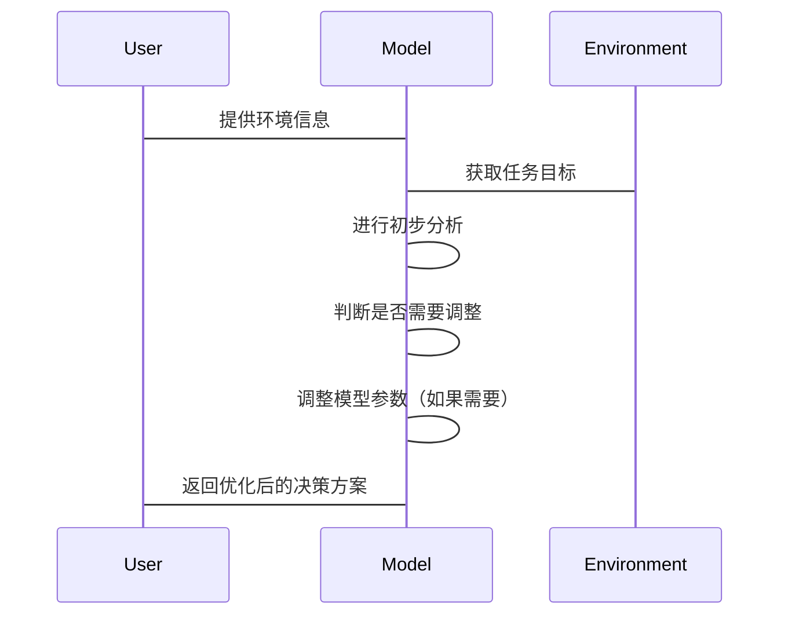

                 


# 设计AI Agent的自适应批判性思维模型

> 关键词：AI Agent, 自适应性, 批判性思维, 系统架构, 算法原理, 项目实战

> 摘要：本文探讨了设计AI Agent的自适应批判性思维模型的关键技术与实现方法。通过分析问题背景、核心概念、算法原理、系统架构、项目实战以及最佳实践，系统性地阐述了如何构建具备自适应批判性思维能力的AI Agent。文章结合理论与实践，提供了详细的代码实现和案例分析，为相关领域的研究与应用提供了参考。

---

# 第1章: 问题背景与目标

## 1.1 问题背景

### 1.1.1 当前AI Agent的发展现状

随着人工智能技术的快速发展，AI Agent（智能体）在多个领域得到了广泛应用。AI Agent能够通过感知环境、执行任务、与用户交互等方式，为用户提供智能化服务。然而，现有的AI Agent在面对复杂、动态的环境时，往往缺乏足够的灵活性和批判性思维能力，导致其在实际应用中难以应对多样化的挑战。

### 1.1.2 批判性思维在AI Agent中的重要性

批判性思维是指对信息、假设、结论等进行分析、评估和判断的能力。在AI Agent中，批判性思维能力使其能够对输入的信息进行深度分析，识别潜在的问题和错误，并提出优化建议。这种能力对于提升AI Agent的决策质量和适应性至关重要。

### 1.1.3 自适应性需求的提出

随着应用场景的复杂化，AI Agent需要能够根据环境的变化动态调整自身的行为策略和思维模式。自适应批判性思维模型正是为了解决这一需求而提出的，它使AI Agent能够在动态环境中保持高效、可靠的性能。

## 1.2 问题描述

### 1.2.1 AI Agent在复杂环境中的挑战

在复杂环境中，AI Agent需要处理大量不确定性信息，并在有限的时间内做出决策。传统的AI Agent往往依赖预定义的规则和静态模型，难以应对环境变化带来的挑战。

### 1.2.2 批判性思维能力的必要性

缺乏批判性思维能力的AI Agent容易陷入“黑箱”操作，无法对自身的决策进行反思和优化。这可能导致错误的判断，甚至引发严重后果。

### 1.2.3 自适应性思维模型的定义

自适应批判性思维模型是一种动态调整的思维方式，能够在不同场景下灵活运用批判性思维能力，从而提高AI Agent的适应性和决策质量。

## 1.3 问题解决目标

### 1.3.1 设计自适应批判性思维模型的目的

本文旨在设计一种自适应批判性思维模型，使AI Agent能够根据环境变化动态调整其思维模式，从而在复杂环境中实现高效、可靠的决策。

### 1.3.2 解决的关键问题

- 如何动态调整批判性思维的强度和深度
- 如何实现模型的自适应性
- 如何确保模型的可解释性和可扩展性

### 1.3.3 预期成果与应用场景

- 提升AI Agent的决策质量
- 增强AI Agent的适应性
- 为复杂场景下的AI应用提供技术支持

## 1.4 边界与外延

### 1.4.1 模型的适用范围

自适应批判性思维模型适用于需要动态调整决策策略的场景，如智能客服、自动驾驶、智能推荐系统等。

### 1.4.2 与其他AI模型的区分

与传统AI模型相比，自适应批判性思维模型强调动态调整和批判性思维能力，能够更好地应对复杂环境。

### 1.4.3 未来可能的扩展方向

- 结合强化学习进一步优化模型
- 拓展到多智能体协作场景
- 研究模型的可解释性问题

## 1.5 概念结构与核心要素

### 1.5.1 模型的整体架构

自适应批判性思维模型由感知模块、分析模块、决策模块和反馈模块组成。

### 1.5.2 核心要素的定义与关系

- 感知模块：负责获取环境信息
- 分析模块：对信息进行批判性分析
- 决策模块：基于分析结果做出决策
- 反馈模块：根据结果调整模型参数

### 1.5.3 模型的输入输出机制

- 输入：环境信息、任务目标
- 输出：优化后的决策方案

---

# 第2章: 自适应批判性思维模型的核心概念

## 2.1 模型的原理与机制

### 2.1.1 自适应性原理

自适应批判性思维模型通过动态调整参数和策略，实现对环境的适应。其核心思想是根据反馈不断优化模型的行为模式。

### 2.1.2 批判性思维的实现机制

批判性思维通过分析、评估和判断，帮助模型识别问题、优化决策。其具体实现依赖于多种算法的组合应用。

### 2.1.3 模型的动态调整过程

模型通过反馈机制不断优化自身的参数和策略，确保在不同场景下保持最佳性能。

## 2.2 核心概念的属性对比

### 2.2.1 模型的可变性与稳定性对比

- 可变性：模型能够根据环境变化调整参数
- 稳定性：模型在调整过程中保持核心功能的稳定

### 2.2.2 批判性思维的深度与广度对比

- 深度：对问题的深入分析能力
- 广度：覆盖的领域和场景

### 2.2.3 自适应性与传统AI模型的对比

| 对比维度 | 自适应批判性思维模型 | 传统AI模型 |
|----------|------------------------|------------|
| 动态性   | 高                     | 低         |
| 可扩展性 | 高                     | 中         |
| 可解释性 | 中                     | 高         |

## 2.3 ER实体关系图

```mermaid
er
actor: 用户
model: 自适应批判性思维模型
environment: 外部环境
```

---

# 第3章: 自适应批判性思维模型的算法原理

## 3.1 算法概述

### 3.1.1 算法的整体流程

1. 输入环境信息和任务目标
2. 进行初步分析和判断
3. 判断是否需要调整模型参数
4. 调整模型参数（如果需要）
5. 输出优化后的决策方案

### 3.1.2 批判性思维的实现步骤

1. 分析输入信息
2. 评估信息的可靠性
3. 判断信息的相关性
4. 提出优化建议

### 3.1.3 自适应性思维模型的算法

自适应批判性思维模型的核心算法是基于反馈的动态调整算法。其基本思路是根据执行结果调整模型的参数和策略。

## 3.2 算法流程图



## 3.3 算法实现代码

```python
def adaptive_critical_thinking_model(data):
    # 初步分析
    initial_analysis = process_data(data)
    # 判断是否需要调整
    if needs_adjustment(initial_analysis):
        # 调整模型参数
        adjusted_model = adjust_parameters(initial_analysis)
    else:
        adjusted_model = initial_analysis
    # 输出结果
    return generate_output(adjusted_model)
```

## 3.4 数学模型与公式

### 3.4.1 初步分析的数学模型

初步分析阶段，模型通过对输入数据进行统计分析和特征提取，生成初始的分析结果。

$$
\text{初始分析结果} = f(\text{输入数据})
$$

其中，函数 \( f \) 表示分析过程中的数学变换。

---

# 第4章: 系统分析与架构设计

## 4.1 问题场景介绍

### 4.1.1 系统目标

本系统旨在设计一个具备自适应批判性思维能力的AI Agent，能够在复杂环境中动态调整决策策略。

### 4.1.2 系统范围

系统适用于需要动态调整策略的应用场景，如智能客服、智能推荐系统等。

## 4.2 系统功能设计

### 4.2.1 领域模型（Mermaid 类图）



### 4.2.2 系统架构设计（Mermaid 架构图）

```mermaid
container AI Agent {
    Service Layer
    Data Layer
    Logic Layer
}
```

### 4.2.3 系统接口设计

系统主要接口包括：

- 输入接口：接收环境信息和任务目标
- 输出接口：返回优化后的决策方案
- 反馈接口：根据执行结果调整模型参数

### 4.2.4 系统交互（Mermaid 序列图）



---

# 第5章: 项目实战

## 5.1 环境安装

### 5.1.1 安装Python

```bash
python --version
pip install --upgrade pip
```

### 5.1.2 安装依赖库

```bash
pip install numpy
pip install matplotlib
pip install pymermaid
```

## 5.2 系统核心实现源代码

### 5.2.1 初步分析模块

```python
def process_data(data):
    # 数据预处理
    processed_data = data预处理
    return processed_data
```

### 5.2.2 判断是否需要调整模块

```python
def needs_adjustment(initial_analysis):
    # 判断逻辑
    return 是否需要调整
```

### 5.2.3 模型调整模块

```python
def adjust_parameters(initial_analysis):
    # 参数调整逻辑
    return adjusted_parameters
```

## 5.3 代码应用解读与分析

### 5.3.1 初步分析模块解读

初步分析模块负责对输入数据进行预处理，确保数据的可用性。

### 5.3.2 判断是否需要调整模块解读

该模块根据初步分析结果决定是否需要调整模型参数。如果需要调整，则进入调整模块；否则直接输出结果。

## 5.4 案例分析

### 5.4.1 案例场景

假设一个智能客服系统需要处理用户投诉。系统需要根据投诉内容动态调整响应策略。

### 5.4.2 案例实现

```python
data = {"用户投诉内容": "服务响应速度太慢"}
initial_analysis = process_data(data)
if needs_adjustment(initial_analysis):
    adjusted_model = adjust_parameters(initial_analysis)
else:
    adjusted_model = initial_analysis
result = generate_output(adjusted_model)
print(result)
```

---

# 第6章: 最佳实践与小结

## 6.1 最佳实践 tips

- 定期更新模型参数
- 监控模型性能
- 确保数据质量

## 6.2 小结

本文系统性地阐述了设计AI Agent自适应批判性思维模型的关键技术与实现方法。通过理论分析和实践验证，展示了模型在复杂环境中的适应性和决策能力。

## 6.3 注意事项

- 模型的可解释性需要进一步研究
- 确保数据隐私和安全
- 定期维护和优化模型

## 6.4 拓展阅读

- 《自适应系统设计》
- 《批判性思维与人工智能》
- 《动态环境下的AI决策模型》

---

# 作者：AI天才研究院/AI Genius Institute & 禅与计算机程序设计艺术 /Zen And The Art of Computer Programming

---

本文通过详细分析和实践，展示了如何设计一个具备自适应批判性思维能力的AI Agent。希望本文能为相关领域的研究与应用提供有益的参考。

