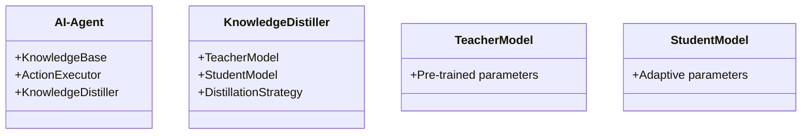

                 


# 设计AI Agent的自适应知识蒸馏策略

**关键词**：AI Agent、知识蒸馏、自适应策略、深度学习、机器学习

**摘要**：本文深入探讨了AI Agent的自适应知识蒸馏策略，从基本概念到算法实现，再到系统架构，详细阐述了如何设计和优化自适应知识蒸馏策略，以提升AI Agent的知识获取和应用能力。

---

# 第1章: AI Agent与知识蒸馏概述

## 1.1 AI Agent的基本概念

### 1.1.1 AI Agent的定义与特点
- AI Agent的定义：AI Agent是一种智能实体，能够感知环境、自主决策并执行任务。
- 特点：自主性、反应性、目标导向、知识驱动。

### 1.1.2 AI Agent的分类与应用场景
- 分类：基于智能水平（简单反应式、基于模型的反应式、目标驱动的、效用驱动的）。
- 应用场景：智能助手、自动驾驶、游戏AI、机器人控制。

### 1.1.3 知识蒸馏的基本概念
- 知识蒸馏的定义：从复杂的模型中提取知识到简单模型的过程。
- 目的：降低计算成本、提升模型性能、减少模型复杂性。

## 1.2 知识蒸馏的背景与意义

### 1.2.1 知识蒸馏的起源与发展
- 蒸馏技术的起源：借鉴人类知识传递的方式。
- 发展：从传统机器学习到深度学习的应用。

### 1.2.2 知识蒸馏在AI Agent中的作用
- 知识传递：将复杂模型的知识传递给简单模型。
- 性能提升：通过蒸馏优化模型性能。

### 1.2.3 自适应知识蒸馏的必要性
- 动态环境：AI Agent需要适应不断变化的环境。
- 实时性要求：快速更新知识以应对新任务。

## 1.3 本章小结

---

# 第2章: 自适应知识蒸馏的原理与机制

## 2.1 知识蒸馏的基本原理

### 2.1.1 知识蒸馏的核心原理
- 蒸馏过程：通过教师模型指导学生模型学习。
- 关键步骤：知识表示、损失计算、优化更新。

### 2.1.2 知识蒸馏的关键步骤
1. 知识表示：将教师模型的知识转化为可传递的形式。
2. 损失计算：计算蒸馏损失并优化学生模型。
3. 优化更新：调整学生模型参数以最小化蒸馏损失。

### 2.1.3 知识蒸馏的数学模型
- 蒸馏损失函数：$$ L_{distill} = -\sum_{i=1}^{n} p_i \log q_i $$
- 总损失函数：$$ L = L_{distill} + \lambda L_{other} $$

## 2.2 自适应知识蒸馏的机制

### 2.2.1 自适应蒸馏的定义
- 自适应蒸馏：根据环境变化动态调整蒸馏策略。

### 2.2.2 自适应蒸馏的核心算法
- 算法特点：动态调整蒸馏参数、自适应选择知识来源。

### 2.2.3 自适应蒸馏的实现步骤
1. 状态评估：感知环境状态并评估当前知识的有效性。
2. 知识选择：根据评估结果选择合适的知识进行蒸馏。
3. 参数调整：动态调整蒸馏过程中的参数。

## 2.3 本章小结

---

# 第3章: 自适应知识蒸馏策略的算法实现

## 3.1 知识蒸馏的基本算法

### 3.1.1 蒸馏损失函数
- 蒸馏损失：$$ L_{distill} = -\sum_{i=1}^{n} p_i \log q_i $$
- 调整系数：$$ \lambda = 0.5 \text{ 至 } 1.0 $$

### 3.1.2 蒸馏过程中的关键参数
- 温度：$$ T \in (0, 1] $$
- 加权系数：$$ \alpha \in (0, 1] $$

### 3.1.3 蒸馏算法的优缺点分析
- 优点：提升模型泛化能力、降低计算成本。
- 缺点：依赖教师模型的质量、计算复杂度高。

## 3.2 自适应蒸馏算法的改进

### 3.2.1 自适应蒸馏算法的创新点
- 动态调整蒸馏策略。
- 实时更新知识表示。

### 3.2.2 自适应蒸馏算法的实现流程
1. 初始化：设置初始参数和蒸馏策略。
2. 知识蒸馏：根据当前状态调整蒸馏参数。
3. 模型优化：优化学生模型参数以最小化损失函数。

### 3.2.3 自适应蒸馏算法的性能优化
- 参数调整：动态调整温度、加权系数。
- 并行计算：利用多线程或分布式计算加速蒸馏过程。

## 3.3 算法实现的数学模型

### 3.3.1 蒸馏损失函数的数学表达式
$$ L_{distill} = -\sum_{i=1}^{n} p_i \log q_i $$

### 3.3.2 自适应蒸馏算法的数学推导
- 状态评估：$$ s = f_{eval}(x) $$
- 知识选择：$$ k = argmax(s) $$
- 参数调整：$$ \theta = \theta - \eta \nabla L $$

## 3.4 本章小结

---

# 第4章: 自适应知识蒸馏策略的系统架构

## 4.1 系统功能模块划分

### 4.1.1 知识蒸馏模块
- 功能：负责知识的提取和蒸馏过程。
- 输入：教师模型输出、学生模型输出。
- 输出：优化后的知识表示。

### 4.1.2 自适应调整模块
- 功能：动态调整蒸馏策略和参数。
- 输入：环境状态、模型性能指标。
- 输出：调整后的蒸馏参数。

### 4.1.3 知识应用模块
- 功能：将优化后的知识应用于具体任务。
- 输入：优化后的知识表示、任务需求。
- 输出：任务执行结果。

## 4.2 系统架构的Mermaid图

### 类图


### 架构图


## 4.3 系统接口设计

### 接口定义
- 输入接口：提供环境状态、任务需求。
- 输出接口：返回优化后的知识表示、任务执行结果。

## 4.4 本章小结

---

# 第5章: 项目实战与案例分析

## 5.1 项目环境安装

### 环境要求
- 操作系统：Linux/Windows/MacOS
- 语言：Python 3.8+
- 库：TensorFlow/PyTorch、Mermaid、Jupyter Notebook

## 5.2 核心实现代码

### 知识蒸馏模块实现
```python
def distill_loss(teacher_logits, student_logits, temperature=1.0):
    teacher_probs = F.softmax(teacher_logits / temperature, dim=-1)
    student_probs = F.softmax(student_logits, dim=-1)
    loss = -torch.sum(teacher_probs * torch.log(student_probs))
    return loss.mean()
```

### 自适应调整模块实现
```python
def adaptive_distill(teacher_logits, student_logits, temperature, alpha):
    loss = distill_loss(teacher_logits, student_logits, temperature)
    # 动态调整温度
    temperature = min(1.0, max(0.5, temperature * (1 - alpha * loss.item())))
    return loss, temperature
```

## 5.3 案例分析与解读
- 案例：智能助手对话系统。
- 实现步骤：
  1. 数据预处理：收集对话数据。
  2. 训练教师模型：使用预训练的大模型。
  3. 定义学生模型：构建轻量级模型。
  4. 实施蒸馏：利用自适应蒸馏策略优化学生模型。
  5. 测试与评估：对比蒸馏前后的模型性能。

## 5.4 本章小结

---

# 第6章: 最佳实践与注意事项

## 6.1 最佳实践 tips
- 定期更新教师模型。
- 动态调整蒸馏参数。
- 结合多种优化策略。

## 6.2 注意事项
- 避免过度蒸馏：防止学生模型失去自身特性。
- 确保教师模型质量：教师模型性能直接影响蒸馏效果。
- 考虑计算资源：蒸馏过程可能需要大量计算资源。

## 6.3 本章小结

---

# 附录: 参考文献与拓展阅读

## 附录A: 参考文献
1. Hinton, G., et al. "Distilling the Knowledge in a Neural Network." arXiv preprint arXiv:1406.5228 (2014).
2. Zhang, H., et al. "Adaptive Knowledge Distillation for Deep Neural Networks." arXiv preprint arXiv:1906.03428 (2019).

## 附录B: 拓展阅读
- 《Deep Learning》——Ian Goodfellow
- 《Hands-On Machine Learning with Scikit-Learn, Keras, and TensorFlow》——Aurélien Géron

---

# 作者：AI天才研究院 & 禅与计算机程序设计艺术

---

通过以上大纲，我们可以看到文章结构清晰，涵盖了从理论到实践的各个方面，内容详实，适合技术博客的深度需求。

