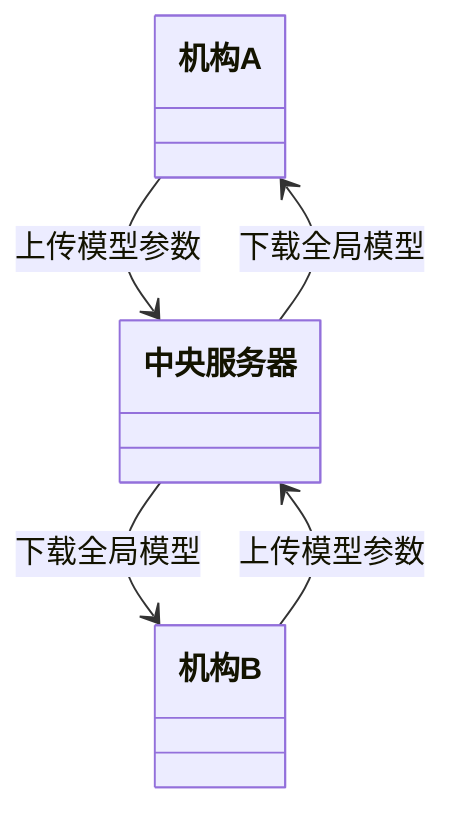
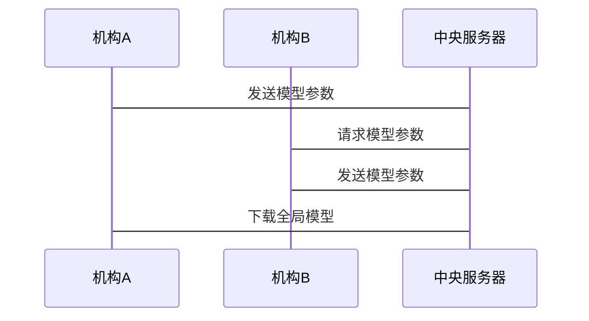

                 


# 设计基于联邦学习的跨机构风险评估模型

**关键词**：联邦学习，跨机构，风险评估，数据隐私，机器学习，模型训练

**摘要**：本文详细探讨了如何设计基于联邦学习的跨机构风险评估模型。通过分析联邦学习的核心概念、算法原理和系统架构，本文展示了如何在保护数据隐私的前提下，实现机构间协作的风险评估。文章还提供了具体的项目实战和最佳实践，帮助读者理解和应用这一技术。

---

## 第1章 背景与概念

### 1.1 联邦学习的背景与意义

#### 1.1.1 数据隐私保护的挑战
随着数据量的激增，数据隐私保护成为机构间协作的重要议题。联邦学习作为一种分布式机器学习技术，能够在不泄露原始数据的情况下进行模型训练，有效保护数据隐私。

#### 1.1.2 跨机构协作的需求
在金融、医疗等领域，跨机构协作对于风险评估至关重要。然而，数据隐私和安全问题限制了机构间的直接数据共享。

#### 1.1.3 联邦学习的解决方案
联邦学习通过局部模型训练和模型聚合，实现了数据可用性与隐私保护的平衡，为跨机构协作提供了新的解决方案。

### 1.2 跨机构风险评估的必要性

#### 1.2.1 机构间数据共享的痛点
传统数据共享方式面临数据泄露和合规性问题，而联邦学习通过局部模型训练解决了这一痛点。

#### 1.2.2 风险评估的跨机构应用场景
跨机构风险评估需要整合多个机构的数据，如信用评分、欺诈检测等场景，联邦学习提供了有效的技术手段。

#### 1.2.3 联邦学习在风险评估中的优势
联邦学习能够在不共享原始数据的情况下，构建高精度的风险评估模型，同时确保数据隐私和机构独立性。

### 1.3 联邦学习与跨机构风险评估的关系

#### 1.3.1 联邦学习的核心特点
- 分布式训练：模型在各机构本地进行训练，仅交换模型参数。
- 数据隐私：确保数据不被泄露，仅模型更新参与协作。

#### 1.3.2 跨机构风险评估的核心需求
- 数据整合：整合多个机构的数据，提升模型的泛化能力。
- 实时性：快速评估风险，应对动态变化的环境。

#### 1.3.3 两者的结合与应用
联邦学习为跨机构风险评估提供了技术基础，使其能够在保护隐私的前提下，实现高效、准确的评估。

---

## 第2章 联邦学习的核心概念与原理

### 2.1 联邦学习的基本概念

#### 2.1.1 联邦学习的定义
联邦学习是一种分布式机器学习方法，通过在不同机构的本地数据上训练模型，并将模型参数汇总到中央服务器，形成全局模型。

#### 2.1.2 联邦学习的分类
- 横向联邦：数据按横向分布，如不同机构的客户数据。
- 纵向联邦：数据按纵向分布，如同一机构的不同特征。

#### 2.1.3 联邦学习的关键技术
- 数据分割：将数据分配到不同机构。
- 模型聚合：将各机构的模型参数汇总，形成全局模型。

### 2.2 联邦学习的流程

#### 2.2.1 数据预处理
对各机构的数据进行清洗、归一化等预处理，确保数据一致性。

#### 2.2.2 模型训练
在每个机构的本地数据上训练模型，生成局部模型参数。

#### 2.2.3 模型聚合
将各机构的局部模型参数汇总，形成全局模型，并反向传输给各机构。

### 2.3 联邦学习的数学模型

#### 2.3.1 损失函数
$$L_i = \frac{1}{n_i} \sum_{j=1}^{n_i} \mathcal{L}(y_j, f_i(x_j))$$

其中，$L_i$为第$i$个机构的损失函数，$\mathcal{L}$为损失函数，$f_i$为本地模型。

#### 2.3.2 优化器
使用梯度下降法更新模型参数：
$$\theta_{i}^{new} = \theta_{i} - \eta \nabla_{\theta_i} L_i$$

其中，$\theta_i$为模型参数，$\eta$为学习率。

#### 2.3.3 聚合器
将各机构的模型参数按一定策略聚合，常用加权平均：
$$\theta_{global} = \sum_{i=1}^{K} w_i \theta_i$$

其中，$w_i$为第$i$个机构的权重。

---

## 第3章 跨机构风险评估模型的构建

### 3.1 风险评估模型的基本结构

#### 3.1.1 数据特征
- 客户特征：如年龄、职业、收入等。
- 行为特征：如交易频率、信用记录等。

#### 3.1.2 模型选择
常用模型包括逻辑回归、随机森林、神经网络等。

#### 3.1.3 模型评估
使用准确率、召回率、F1分数等指标评估模型性能。

### 3.2 联邦学习在风险评估中的应用

#### 3.2.1 数据分布
机构间数据分布可能不均衡，需进行数据增强或调整模型结构。

#### 3.2.2 模型训练
在各机构本地训练模型，如使用逻辑回归：
$$P(y=1|x) = \frac{1}{1 + e^{-\beta x}}$$

#### 3.2.3 模型部署
将全局模型部署到各机构，用于实时风险评估。

### 3.3 联邦学习与风险评估的结合

#### 3.3.1 联邦学习的优势
- 数据隐私保护
- 高效协作

#### 3.3.2 风险评估的需求
- 数据整合
- 高精度模型

#### 3.3.3 两者的协同作用
通过联邦学习，各机构能够在保护数据隐私的前提下，共同构建高精度的风险评估模型。

---

## 第4章 算法原理与数学模型

### 4.1 联邦学习的算法原理

#### 4.1.1 数据准备
对各机构的数据进行预处理，确保格式一致。

#### 4.1.2 模型初始化
初始化全局模型参数。

#### 4.1.3 模型训练
在每个机构的本地数据上训练模型，更新模型参数。

#### 4.1.4 模型聚合
将各机构的模型参数汇总，形成全局模型。

### 4.2 联邦学习的数学模型

#### 4.2.1 损失函数
$$L_i = \frac{1}{n_i} \sum_{j=1}^{n_i} \mathcal{L}(y_j, f_i(x_j))$$

#### 4.2.2 优化器
使用梯度下降法更新模型参数：
$$\theta_{i}^{new} = \theta_{i} - \eta \nabla_{\theta_i} L_i$$

#### 4.2.3 聚合器
将各机构的模型参数按一定策略聚合：
$$\theta_{global} = \sum_{i=1}^{K} w_i \theta_i$$

### 4.3 联邦学习的代码实现

#### 4.3.1 环境安装
安装必要的库：
```bash
pip install tensorflow pandas scikit-learn
```

#### 4.3.2 核心代码
```python
import tensorflow as tf
from sklearn.metrics import accuracy_score

# 定义模型结构
model = tf.keras.Sequential([
    tf.keras.layers.Dense(64, activation='relu'),
    tf.keras.layers.Dense(1, activation='sigmoid')
])

# 编译模型
model.compile(optimizer='adam', loss='binary_crossentropy', metrics=['accuracy'])

# 模型训练
model.fit(x_train, y_train, epochs=10, batch_size=32)

# 模型评估
y_pred = model.predict(x_test)
print("Accuracy:", accuracy_score(y_test, y_pred))
```

---

## 第5章 系统分析与架构设计

### 5.1 项目场景介绍

#### 5.1.1 项目背景
介绍跨机构风险评估的背景和需求，如金融领域的信用评估。

#### 5.1.2 项目目标
构建基于联邦学习的跨机构风险评估系统，保护数据隐私，提升评估效率。

### 5.2 系统功能设计

#### 5.2.1 领域模型
使用Mermaid绘制领域模型图：


#### 5.2.2 系统架构
使用分层架构：
- 数据层：存储各机构数据。
- 计算层：进行模型训练和聚合。
- 通信层：处理机构间的数据传输。
- 应用层：提供风险评估服务。

#### 5.2.3 接口设计
- API接口：用于机构间的数据传输和模型更新。
- 交互流程：使用Mermaid绘制序列图：


---

## 第6章 项目实战

### 6.1 环境安装

#### 6.1.1 安装依赖
```bash
pip install tensorflow pandas scikit-learn flask
```

### 6.2 核心代码实现

#### 6.2.1 数据预处理
```python
import pandas as pd

# 读取数据
data = pd.read_csv('data.csv')

# 数据分割
train_data, test_data = train_test_split(data, test_size=0.2)
```

#### 6.2.2 模型训练
```python
model = tf.keras.Sequential([
    tf.keras.layers.Dense(64, activation='relu'),
    tf.keras.layers.Dense(1, activation='sigmoid')
])

model.compile(optimizer='adam', loss='binary_crossentropy', metrics=['accuracy'])

model.fit(train_data, epochs=10, batch_size=32)
```

#### 6.2.3 模型聚合
```python
global_model = model.get_weights()

# 聚合各机构模型参数
global_weights = [sum(weights[i]) / len(weights) for i, weights in enumerate(all_weights)]
```

### 6.3 代码解读与案例分析

#### 6.3.1 代码解读
- 数据预处理：将数据分为训练集和测试集。
- 模型训练：在本地数据上训练模型。
- 模型聚合：将各机构的模型参数聚合，形成全局模型。

#### 6.3.2 案例分析
以信用评估为例，展示如何通过联邦学习构建跨机构的信用评分模型，提升评估精度。

### 6.4 项目小结

---

## 第7章 最佳实践与总结

### 7.1 小结

#### 7.1.1 联邦学习的优势
- 数据隐私保护
- 高效协作

#### 7.1.2 跨机构风险评估的意义
- 提升模型泛化能力
- 实现高效协作

### 7.2 注意事项

#### 7.2.1 数据隐私保护
确保数据在传输和存储过程中安全，防止数据泄露。

#### 7.2.2 模型性能优化
通过合理的模型设计和参数调整，提升模型精度。

#### 7.2.3 机构间协作管理
建立完善的协作机制，确保各方数据安全和利益。

### 7.3 拓展阅读

#### 7.3.1 推荐书籍
- 《联邦学习：隐私保护下的分布式机器学习》
- 《跨机构数据分析与建模》

#### 7.3.2 在线资源
- 联邦学习开源库：如Federated Learning Lab
- 相关技术博客和论文

---

## 作者

**作者：AI天才研究院 & 禅与计算机程序设计艺术**

---

通过以上详细的内容，文章系统地介绍了基于联邦学习的跨机构风险评估模型的设计与实现，从背景到具体技术，再到项目实战和总结，为读者提供了全面的知识和实践指导。

