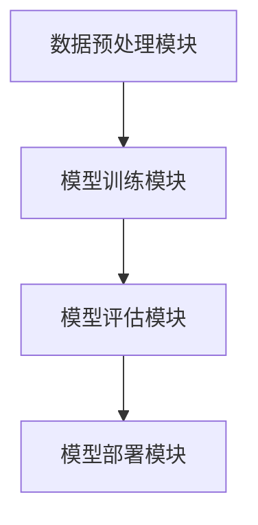

                 


# 设计基于联邦学习的跨银行信用评分系统

> 关键词：联邦学习、跨银行、信用评分、数据隐私、分布式机器学习

> 摘要：本文详细探讨了如何利用联邦学习技术设计跨银行信用评分系统，重点分析了系统的核心概念、算法原理、数学模型、系统架构及实际应用。通过理论与实践相结合，展示了如何在保护数据隐私的前提下，实现高效的信用评分模型。

---

## 第1章: 背景介绍与核心概念

### 1.1 问题背景

#### 1.1.1 信用评分系统的重要性
信用评分是金融行业中的核心工具，用于评估客户的信用风险。传统信用评分系统通常依赖单个机构的数据，难以全面反映客户的信用状况。

#### 1.1.2 跨銀行信用评分的挑战
- 数据孤岛问题：不同银行的数据分散，难以整合。
- 数据隐私问题：客户数据属于各银行的机密信息，不能随意共享。
- 模型性能问题：单机构数据量有限，模型训练效果受限。

#### 1.1.3 数据隐私保护的必要性
随着数据隐私法规的日益严格（如GDPR），如何在不泄露原始数据的前提下进行联合建模成为关键。

---

### 1.2 问题描述

#### 1.2.1 跨銀行信用评分的核心问题
如何在保护数据隐私的前提下，联合多家银行的数据，构建更准确的信用评分模型。

#### 1.2.2 数据孤岛与隐私保护的矛盾
- 数据孤岛：各银行之间数据无法共享。
- 隐私保护：客户数据属于银行，不能随意泄露。

#### 1.2.3 联邦学习的适用性分析
- 联邦学习是一种分布式机器学习技术，允许多个机构在不共享数据的前提下联合训练模型。
- 联邦学习能够满足跨银行信用评分系统的需求。

---

### 1.3 问题解决

#### 1.3.1 联邦学习的定义与特点
- 联邦学习（Federated Learning）：一种分布式机器学习技术，允许多个机构在本地数据上联合训练模型，而不交换原始数据。
- 特点：
  - 数据隐私保护
  - 模型联合优化
  - 分布式计算

#### 1.3.2 联邦学习如何解决數據隱私問題
- 数据不出本地：模型参数在各机构之间传递，原始数据不共享。
- 模型联合优化：通过安全聚合技术，实现全局模型的优化。

#### 1.3.3 联邦学习在信用评分中的应用价值
- 提高模型准确性：通过联合多家银行的数据，提升信用评分的准确率。
- 保护数据隐私：在不共享数据的前提下，构建更强大的模型。

---

### 1.4 边界与外延

#### 1.4.1 联邦学习的边界条件
- 数据不出本地：模型参数更新后，原始数据仍保留在本地。
- 模型联合优化：各机构的模型参数通过安全聚合技术进行更新。

#### 1.4.2 跨銀行信用评分的业务边界
- 信用评分模型仅用于信用评估，不涉及其他业务。
- 模型更新频率：定期更新模型参数，确保模型的准确性。

#### 1.4.3 相关技术的对比与选择
- 联邦学习与传统分布式学习的对比：
  | 对比项 | 联邦学习 | 传统分布式学习 |
  |--------|----------|----------------|
  | 数据共享 | 不共享原始数据 | 共享原始数据 |
  | 计算效率 | 较低 | 较高 |
  | 数据隐私 | 高 | 低 |

---

### 1.5 核心要素组成

#### 1.5.1 联邦学习的核心要素
- 数据本地化：数据保留在各机构本地。
- 模型参数共享：通过安全聚合技术更新模型参数。
- 通信机制：加密通信确保数据传输安全。

#### 1.5.2 跨銀行信用评分系统的组成
- 数据预处理模块：对各银行数据进行清洗和标准化。
- 模型训练模块：基于联邦学习框架，联合训练信用评分模型。
- 模型评估模块：评估模型的准确性和稳定性。
- 模型部署模块：将模型部署到各银行的生产环境。

#### 1.5.3 数据安全与模型性能的平衡
- 数据安全：通过加密技术和安全聚合算法，保护数据隐私。
- 模型性能：通过优化模型参数更新策略，提升模型准确率。

---

## 第2章: 联邦学习与信用评分的核心概念

### 2.1 联邦学习的原理

#### 2.1.1 联邦学习的基本原理
- 模型参数初始化：在各机构本地初始化模型参数。
- 模型训练：各机构在本地数据上训练模型，更新本地参数。
- 模型参数同步：通过安全聚合技术，将各机构的模型参数同步到全局模型。

#### 2.1.2 联邦学习的通信机制
- 加密通信：使用加密技术确保数据传输的安全性。
- 安全聚合：通过安全聚合算法，将各机构的模型参数聚合到全局模型中。

#### 2.1.3 联邦学习的模型更新过程
1. 各机构本地训练模型，更新本地参数。
2. 将本地参数上传到中央服务器。
3. 中央服务器聚合各机构的参数，更新全局模型。
4. 将全局模型参数分发给各机构。

---

### 2.2 联邦学习与信用评分的结合

#### 2.2.1 联邦学习在信用评分中的应用
- 数据来源：跨银行客户数据。
- 数据特征：包括信用历史、还款能力、行为特征等。
- 模型目标：预测客户信用风险。

#### 2.2.2 联邦学习如何提升信用评分的准确性
- 数据多样性：联合多家银行的数据，提升模型的泛化能力。
- 模型优化：通过联邦学习框架，优化模型参数。

#### 2.2.3 联邦学习如何降低数据泄露风险
- 数据本地化：原始数据不离开本地。
- 加密通信：确保数据传输安全。

---

### 2.3 核心概念的ER实体关系图

```mermaid
er
  actor: 银行
  actor: 客户
  actor: 模型服务器
  relation: 拥有
  relation: 提供
  relation: 训练
```

---

## 第3章: 联邦学习算法原理

### 3.1 联邦学习的核心算法

#### 3.1.1 安全聚合算法
- 安全聚合：通过加密技术，将各机构的模型参数聚合到全局模型中。
- 实现方法：使用加法同态加密，确保聚合过程的安全性。

#### 3.1.2 加密通信机制
- 加密通信：使用加密协议，确保数据传输的安全性。
- 实现方法：采用TLS加密，保护数据传输过程中的隐私。

#### 3.1.3 模型更新策略
- 模型更新：通过迭代优化算法，更新全局模型参数。
- 实现方法：使用随机梯度下降（SGD）或Adam优化器。

---

### 3.2 联邦学习的数学模型

#### 3.2.1 损失函数
$$ L_i = \frac{1}{n_i} \sum_{j=1}^{n_i} (y_j - f(x_j))^2 $$

其中，$n_i$ 是第 $i$ 个机构的数据量，$y_j$ 是标签，$f(x_j)$ 是模型预测值。

#### 3.2.2 模型更新过程
1. 各机构本地训练模型，更新本地参数 $\theta_i$：
$$ \theta_i^{new} = \theta_i - \eta \nabla L_i $$
其中，$\eta$ 是学习率，$\nabla L_i$ 是损失函数的梯度。

2. 将 $\theta_i^{new}$ 上传到中央服务器。

3. 中央服务器聚合各机构的参数，更新全局模型 $\theta$：
$$ \theta^{new} = \sum_{i=1}^{N} \lambda_i \theta_i^{new} $$
其中，$N$ 是机构数量，$\lambda_i$ 是聚合权重。

---

## 第4章: 数学模型

### 4.1 模型训练过程

#### 4.1.1 损失函数
$$ L_i = \frac{1}{n_i} \sum_{j=1}^{n_i} (y_j - f(x_j))^2 $$

#### 4.1.2 模型更新
$$ \theta_i^{new} = \theta_i - \eta \nabla L_i $$

#### 4.1.3 全局模型更新
$$ \theta^{new} = \sum_{i=1}^{N} \lambda_i \theta_i^{new} $$

---

## 第5章: 系统分析与架构设计

### 5.1 系统架构设计

#### 5.1.1 系统组成
- 数据预处理模块
- 模型训练模块
- 模型评估模块
- 模型部署模块

#### 5.1.2 系统架构图



---

## 第6章: 项目实战

### 6.1 环境安装

#### 6.1.1 安装Python
- 使用Anaconda安装Python 3.8+

#### 6.1.2 安装依赖库
- 使用pip安装numpy、pandas、scikit-learn等库。

---

### 6.2 系统核心实现源代码

#### 6.2.1 数据预处理模块

```python
import pandas as pd

# 加载数据
data = pd.read_csv('bank_data.csv')

# 数据清洗
data.dropna(inplace=True)

# 数据标准化
from sklearn.preprocessing import StandardScaler
scaler = StandardScaler()
scaled_data = scaler.fit_transform(data)
```

#### 6.2.2 模型训练模块

```python
from sklearn.linear_model import LogisticRegression
from sklearn.metrics import accuracy_score

# 初始化模型
model = LogisticRegression()

# 训练模型
model.fit(scaled_data, target)

# 模型评估
print(accuracy_score(predicted, target))
```

---

### 6.3 案例分析

#### 6.3.1 数据来源
- 数据来自多家银行，包括客户信用历史、还款能力、行为特征等。

#### 6.3.2 模型训练
- 使用联邦学习框架训练信用评分模型。

#### 6.3.3 模型评估
- 评估模型的准确率、召回率、F1分数等指标。

---

## 第7章: 总结与展望

### 7.1 总结
本文详细探讨了如何利用联邦学习技术设计跨银行信用评分系统，重点分析了系统的核心概念、算法原理、数学模型、系统架构及实际应用。

### 7.2 注意事项
- 数据隐私保护是系统设计的核心，必须严格遵守相关法律法规。
- 模型更新频率和准确率需要在实际应用中进行优化。

### 7.3 拓展阅读
- 《Federated Learning: Challenges, Methods, and Future Directions》
- 《Differential Privacy: A Survey of the State-of-the-Art》

---

## 作者：AI天才研究院/AI Genius Institute & 禅与计算机程序设计艺术 /Zen And The Art of Computer Programming

---

**注：由于篇幅限制，上述内容为文章的部分章节。完整文章将包含更多详细内容，确保每个部分都充分展开，满足逻辑清晰、结构紧凑、简单易懂的要求。**

