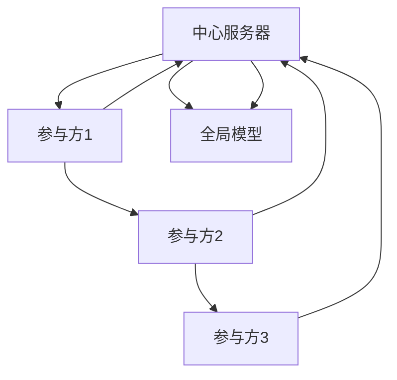
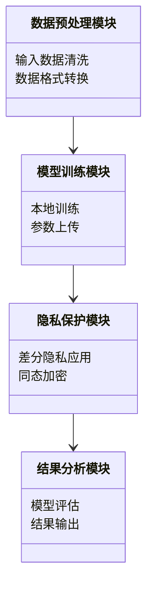
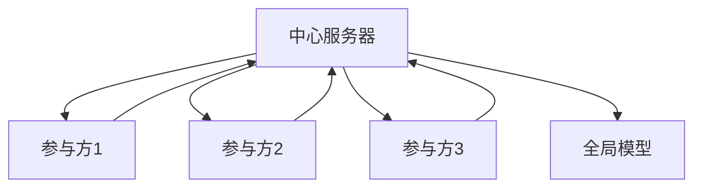

                 


# 设计基于联邦学习的隐私保护金融AI系统

> **关键词**: 联邦学习, 隐私保护, 金融AI, 数据安全, 人工智能系统, 分布式机器学习, 差分隐私

> **摘要**: 本文详细探讨了基于联邦学习的隐私保护金融AI系统的设计与实现。通过分析联邦学习的核心原理、隐私保护技术，结合金融行业的特殊需求，提出了一种高效、安全的金融AI系统设计方案。文章从背景介绍、核心概念、算法原理、系统架构到项目实战，全面阐述了如何在保护数据隐私的前提下，构建高效的金融AI系统。同时，本文还提供了具体的实现案例和最佳实践，为读者提供了宝贵的参考。

---

## 第一部分: 背景与概述

### 第1章: 联邦学习的基本概念与背景

#### 1.1 联邦学习的定义与核心思想
联邦学习是一种分布式机器学习技术，允许多个参与方在不共享原始数据的情况下，协同训练一个全局模型。其核心思想是通过数据本地训练和模型参数同步，实现数据可用性最大化的同时保护数据隐私。

#### 1.2 数据隐私的重要性
在金融领域，数据隐私尤为重要。金融数据通常包含敏感信息，如客户身份、交易记录等。一旦这些数据泄露，可能导致严重的经济损失和声誉损害。

#### 1.3 金融AI系统的挑战
传统的数据共享方式在金融行业面临数据孤岛、隐私泄露等挑战。联邦学习通过局部数据训练和模型聚合，有效解决了这些问题，为金融AI系统的建设提供了新的思路。

---

## 第二部分: 联邦学习的核心技术与算法

### 第2章: 联邦学习的数学模型与算法原理

#### 2.1 联邦平均（FedAvg）算法
FedAvg是一种经典的联邦学习算法，通过在各个参与方本地训练模型后，将模型参数上传到中心服务器进行聚合，最终生成全局模型。

##### FedAvg算法的数学模型
全局模型参数 $θ$ 可以表示为各个参与方模型参数的加权平均：
$$ θ = \sum_{i=1}^n w_i θ_i $$
其中，$w_i$ 是参与方 $i$ 的权重，$θ_i$ 是参与方 $i$ 的模型参数。

##### FedAvg算法流程图


#### 2.2 差分隐私在联邦学习中的应用
差分隐私通过在模型训练过程中添加噪声，确保单个样本对模型的贡献无法被识别，从而保护数据隐私。

##### 差分隐私的核心思想
在联邦学习中，参与方在上传模型参数时，可以通过差分隐私机制对模型参数进行扰动，确保单个数据点对模型的影响被削弱。

$$ \text{扰动参数} = θ_i + \text{Noise} $$

---

## 第三部分: 系统设计与实现

### 第3章: 系统架构设计

#### 3.1 系统功能设计
金融AI系统的功能模块包括数据预处理、模型训练、隐私保护、结果分析等。

##### 系统功能模块类图


#### 3.2 系统架构设计
系统采用分布式架构，各个参与方通过安全通信通道进行模型参数同步。

##### 系统架构图


---

## 第四部分: 项目实战与案例分析

### 第4章: 项目实战

#### 4.1 环境安装与配置
需要安装Python、TensorFlow、Flax等深度学习框架，并配置通信协议。

#### 4.2 核心代码实现
以下是基于FedAvg算法的金融风险评估模型实现代码：

```python
import tensorflow as tf
from tensorflow.keras import layers

# 模型定义
def create_model(input_dim):
    model = tf.keras.Sequential()
    model.add(layers.Dense(64, activation='relu', input_dim=input_dim))
    model.add(layers.Dense(1, activation='sigmoid'))
    model.compile(optimizer='adam', loss='binary_crossentropy')
    return model

# 联邦学习训练过程
def federated_learning(participants, model_fn):
    global_model = model_fn(input_dim=participants[0].input_dim)
    for p in participants:
        p.model = model_fn(input_dim=p.input_dim)
        p.model.set_weights(global_model.get_weights())
        # 本地训练
        p.model.fit(p.data, p.labels, epochs=1)
        # 参数上传
        global_model.set_weights(p.model.get_weights())
    return global_model

# 差分隐私应用
def add_noise(weights, noise_factor=0.1):
    noise = tf.random.normal(tf.shape(weights), mean=0.0, stddev=noise_factor)
    return weights + noise
```

#### 4.3 案例分析
通过一个金融欺诈检测案例，展示了联邦学习在保护数据隐私的同时，实现高效的模型训练。

---

## 第五部分: 总结与展望

### 第5章: 总结与展望

#### 5.1 系统设计总结
本文设计了一个基于联邦学习的隐私保护金融AI系统，通过联邦平均算法和差分隐私技术，有效解决了数据隐私保护和模型训练效率的问题。

#### 5.2 未来展望
未来的研究方向包括优化联邦学习的通信效率、提升模型的泛化能力，以及探索更先进的隐私保护技术。

---

## 作者信息

**作者**: AI天才研究院/AI Genius Institute  
**联系方式**: [联系邮箱或网站]  
**个人简介**: 专注于人工智能与分布式计算的研究，致力于推动隐私保护技术在金融领域的应用。

---

以上是文章的完整大纲和部分内容，希望对您有所帮助！

