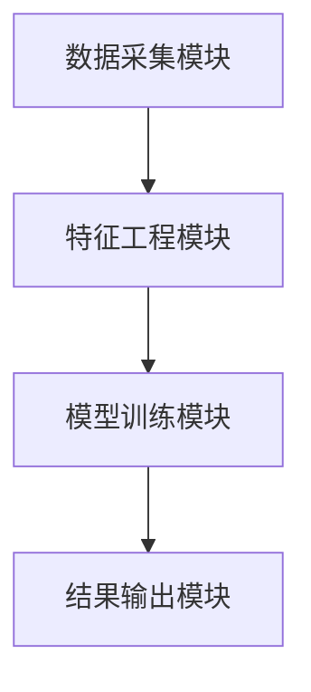
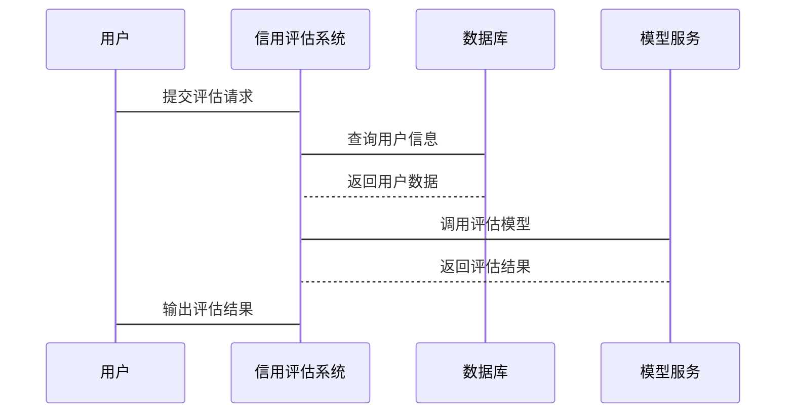

                 


# 设计智能化的个人信用评估系统

> 关键词：个人信用评估、智能化、机器学习、大数据分析、自然语言处理、系统架构设计

> 摘要：本文详细探讨了设计智能化个人信用评估系统的各个方面，从背景介绍到系统架构设计，再到项目实战和扩展阅读，旨在为读者提供一个全面的技术视角。通过分析传统信用评估的局限性，引入机器学习和大数据分析等技术，构建一个高效、准确的智能化信用评估系统，解决传统方法的不足。

---

# 第一部分: 智能化个人信用评估系统背景与核心概念

## 第1章: 智能化个人信用评估系统背景介绍

### 1.1 个人信用评估的背景与问题背景

#### 1.1.1 传统信用评估的局限性
传统的个人信用评估主要依赖于金融机构的手动审核和简单的评分模型，存在以下问题：
- **信息孤岛**：传统评估主要依赖少量的信用记录和财务数据，忽略了社交媒体、消费行为等多维度信息。
- **效率低下**：人工审核耗时长，难以快速响应用户的信用需求。
- **主观性高**：评分模型缺乏深度分析，容易受到人工干预的影响。

#### 1.1.2 智能化信用评估的需求与目标
随着人工智能和大数据技术的发展，智能化信用评估的需求日益迫切：
- **实时性**：通过自动化处理，实现快速、实时的信用评估。
- **准确性**：利用机器学习算法，提高评估的准确性和全面性。
- **个性化**：基于多维度数据，提供个性化的信用评分。

#### 1.1.3 信用评估的边界与外延
智能化信用评估不仅包括传统的财务数据，还涉及以下方面：
- **行为数据**：用户的消费记录、社交网络活动等。
- **文本数据**：信用报告、合同文本等非结构化数据。
- **外部数据**：如公开的新闻、法律法规等。

---

### 1.2 个人信用评估的核心概念与问题描述

#### 1.2.1 信用评估的核心要素
智能化信用评估的核心要素包括：
- **信用历史**：过去的借款记录、还款情况。
- **收入能力**：用户的收入来源、稳定性。
- **消费行为**：用户的消费习惯、信用评分。
- **社交网络**：用户的社交关系、影响力。

#### 1.2.2 智能化信用评估的定义与特点
智能化信用评估是指利用机器学习、大数据分析等技术，从多维度数据中提取特征，构建预测模型，评估个人信用风险的过程。其特点包括：
- **数据驱动**：依赖大量数据进行分析。
- **自动化**：从数据采集到评估结果输出，实现自动化处理。
- **动态调整**：根据实时数据更新模型，提高评估的准确性。

#### 1.2.3 信用评估中的关键问题与挑战
- **数据隐私**：如何在保护用户隐私的前提下，利用多维度数据进行评估。
- **模型泛化能力**：如何确保模型在不同场景下的适用性。
- **实时性与稳定性**：如何在保证评估速度的同时，确保系统的稳定性。

---

## 第2章: 智能化个人信用评估的核心概念与联系

### 2.1 核心概念与原理

#### 2.1.1 机器学习在信用评估中的应用
- **监督学习**：用于分类问题，如信用评分。
- **无监督学习**：用于聚类分析，发现潜在的信用风险群体。
- **深度学习**：用于处理非结构化数据，如文本分析。

#### 2.1.2 大数据分析与特征工程
- **数据清洗**：去除噪声数据，确保数据质量。
- **特征提取**：从多维度数据中提取有意义的特征，如用户的行为模式。
- **特征工程**：通过数据变换和特征组合，提高模型性能。

#### 2.1.3 自然语言处理在信用报告中的应用
- **文本挖掘**：从信用报告、合同文本中提取关键信息。
- **情感分析**：分析文本中的情感倾向，评估信用风险。

---

### 2.2 核心概念对比与ER实体关系图

#### 2.2.1 核心概念对比表格

| 核心概念 | 传统信用评估 | 智能化信用评估 |
|----------|--------------|----------------|
| 数据来源 | 信用记录、财务数据 | 多维度数据（行为、文本等） |
| 方法论   | 简单模型、人工审核 | 机器学习、大数据分析 |
| 精度     | 较低 | 较高 |
| 效率     | 较低 | 高 |

#### 2.2.2 ER实体关系图（使用mermaid）

```mermaid
erDiagram
    actor 用户
    actor 金融机构
    actor 政府机构
    database 信用数据
    database 评估模型
    database 用户信息
    用户 --> 信用数据: 提供
    用户 --> 用户信息: 提供
    金融机构 --> 信用数据: 查询
    政府机构 --> 信用数据: 监管
    信用数据 --> 评估模型: 训练
    用户信息 --> 评估模型: 输入
    评估模型 --> 用户: 输出结果
```

---

## 第3章: 智能化个人信用评估系统的算法原理

### 3.1 算法选择与原理

#### 3.1.1 逻辑回归模型

- **原理**：通过sigmoid函数将线性回归结果映射到概率空间。
- **公式**：
  $$ P(y=1|x) = \frac{1}{1 + e^{-\beta x}} $$
- **优缺点**：
  - 优点：简单、易于解释。
  - 缺点：假设线性关系，可能无法捕捉复杂特征。

#### 3.1.2 随机森林模型

- **原理**：通过构建多个决策树，取其结果的平均值。
- **公式**：无显式公式，基于树结构进行投票。
- **优缺点**：
  - 优点：能够处理非线性关系，抗过拟合。
  - 缺点：解释性较差。

---

### 3.2 算法实现与代码示例

#### 3.2.1 数据预处理

```python
import pandas as pd
from sklearn.preprocessing import StandardScaler

# 假设data是包含特征和标签的数据框
data = pd.read_csv('credit_data.csv')
X = data.drop('label', axis=1)
y = data['label']

# 标准化处理
scaler = StandardScaler()
X_scaled = scaler.fit_transform(X)
```

#### 3.2.2 模型训练与评估

```python
from sklearn.model_selection import train_test_split
from sklearn.linear_model import LogisticRegression
from sklearn.ensemble import RandomForestClassifier
from sklearn.metrics import accuracy_score

# 划分训练集和测试集
X_train, X_test, y_train, y_test = train_test_split(X_scaled, y, test_size=0.2)

# 逻辑回归模型
lr_model = LogisticRegression()
lr_model.fit(X_train, y_train)
y_pred_lr = lr_model.predict(X_test)
accuracy_lr = accuracy_score(y_test, y_pred_lr)

# 随机森林模型
rf_model = RandomForestClassifier()
rf_model.fit(X_train, y_train)
y_pred_rf = rf_model.predict(X_test)
accuracy_rf = accuracy_score(y_test, y_pred_rf)

print(f'逻辑回归准确率：{accuracy_lr}')
print(f'随机森林准确率：{accuracy_rf}')
```

---

## 第4章: 智能化个人信用评估系统的系统架构设计

### 4.1 系统功能设计

#### 4.1.1 系统模块划分

- **数据采集模块**：负责采集多维度数据，如行为数据、文本数据。
- **特征工程模块**：对数据进行清洗、特征提取和工程处理。
- **模型训练模块**：基于特征数据，训练机器学习模型。
- **结果输出模块**：输出信用评估结果，并提供解释。

#### 4.1.2 系统功能流程



---

### 4.2 系统架构设计

#### 4.2.1 前端与后端交互



---

## 第5章: 项目实战与优化

### 5.1 项目实战

#### 5.1.1 环境搭建

```bash
pip install pandas numpy scikit-learn
```

#### 5.1.2 核心代码实现

```python
import pandas as pd
from sklearn.ensemble import RandomForestClassifier
from sklearn.metrics import classification_report

# 加载数据
data = pd.read_csv('credit_data.csv')

# 特征选择
features = data.columns[:-1]
target = data.columns[-1]

# 划分数据集
X_train, X_test, y_train, y_test = train_test_split(data[features], data[target], test_size=0.2)

# 初始化模型
model = RandomForestClassifier(n_estimators=100, random_state=42)
model.fit(X_train, y_train)

# 预测结果
y_pred = model.predict(X_test)

# 输出结果
print(classification_report(y_test, y_pred))
```

---

## 第6章: 扩展阅读与最佳实践

### 6.1 智能化信用评估的前沿技术

- **深度学习**：用于处理非结构化数据，如图像和视频。
- **联邦学习**：在保护隐私的前提下，联合多个机构的数据进行模型训练。

### 6.2 系统优化与部署

- **模型优化**：通过超参数调优和特征选择，提高模型性能。
- **系统部署**：将模型部署到云平台，提供API接口，方便调用。

---

## 作者信息

作者：AI天才研究院/AI Genius Institute & 禅与计算机程序设计艺术 /Zen And The Art of Computer Programming

---

以上是《设计智能化的个人信用评估系统》的技术博客文章的详细内容，涵盖从背景介绍到系统架构设计的各个方面，结合实际代码示例和图表，为读者提供一个全面的技术视角。

