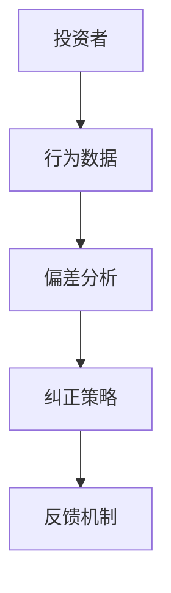
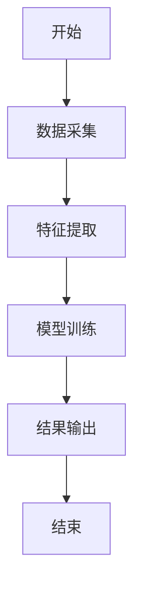
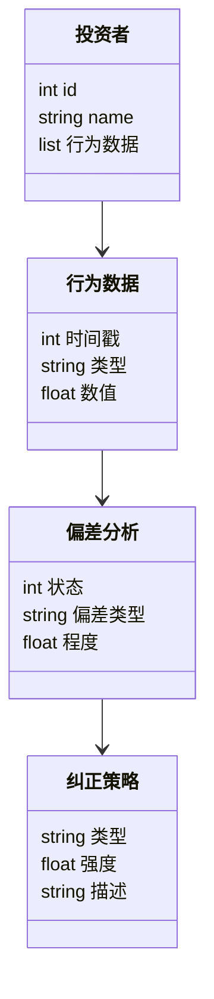
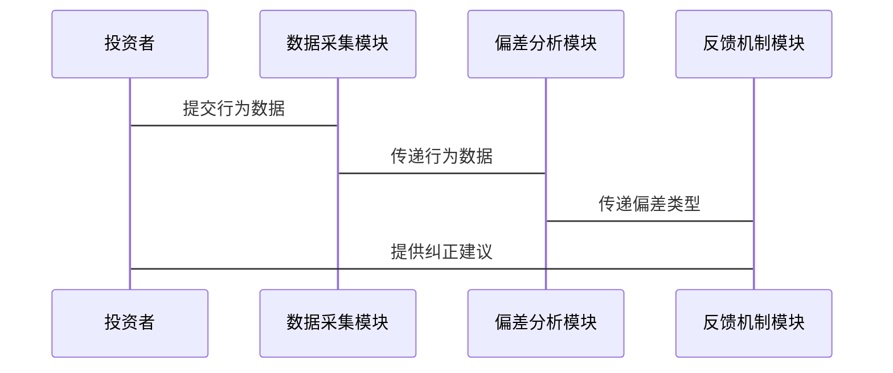

                 


# 设计智能化的个人投资者行为偏差纠正工具

> 关键词：投资者行为偏差，人工智能，行为金融学，机器学习，系统架构设计

> 摘要：本文详细探讨了设计智能化的个人投资者行为偏差纠正工具的方法与实现。通过分析投资者常见行为偏差的类型及其对决策的影响，结合行为金融学理论与人工智能技术，提出了一套基于强化学习的解决方案。文章从问题背景、核心概念、算法原理、系统架构设计到项目实战，全面阐述了工具的设计思路与实现细节，最后给出了实际应用案例与最佳实践建议。

---

## 第一部分: 背景介绍与核心概念

### 第1章: 个人投资者行为偏差概述

#### 1.1 问题背景
##### 1.1.1 投资者行为偏差的普遍性
投资者在决策过程中常常会受到心理偏差的影响，例如过度自信、从众心理、损失厌恶等。这些偏差会导致非理性的投资决策，进而影响投资收益。统计数据显示，超过60%的投资者承认自己在决策中存在行为偏差。

##### 1.1.2 行为偏差对投资决策的影响
行为偏差会直接影响投资者的决策质量。例如，过度自信可能导致投资者过度交易，从众心理可能导致盲目跟风，损失厌恶可能导致投资者错失投资机会。这些偏差的纠正对于提高投资收益至关重要。

##### 1.1.3 现有解决方案的局限性
传统的投资顾问服务依赖于人工经验，难以覆盖大规模投资者。现有的技术解决方案多基于规则引擎，缺乏智能化和个性化，难以有效纠正行为偏差。

#### 1.2 问题描述
##### 1.2.1 行为偏差的主要类型
投资者常见的行为偏差包括：
- **过度自信**：高估自己的决策能力。
- **从众心理**：盲目跟随市场趋势。
- **损失厌恶**：对潜在损失过于敏感。
- **确认偏差**：倾向于寻找支持自己观点的信息。

##### 1.2.2 偏差纠正的必要性
纠正行为偏差可以帮助投资者做出更理性的决策，提高投资收益，降低投资风险。

##### 1.2.3 工具化解决方案的可行性
通过结合行为金融学理论和人工智能技术，可以设计出智能化的行为偏差纠正工具。

#### 1.3 问题解决
##### 1.3.1 AI技术在行为偏差纠正中的应用
人工智能技术，特别是机器学习，可以用于识别和纠正投资者的行为偏差。通过分析投资者的行为数据，AI可以提供个性化的反馈和建议。

##### 1.3.2 工具化解决方案的设计思路
设计一个基于AI的纠正工具，需要结合行为数据采集、偏差识别、反馈机制等模块。

##### 1.3.3 技术实现的关键点
- 数据采集：收集投资者的行为数据，如交易记录、市场反应等。
- 偏差识别：通过机器学习算法识别行为偏差类型。
- 反馈机制：根据识别结果提供纠正建议。

#### 1.4 边界与外延
##### 1.4.1 工具适用的场景
适用于个人投资者，特别是那些希望通过纠正行为偏差提高投资收益的投资者。

##### 1.4.2 边界条件的定义
- 数据隐私：确保投资者数据的安全性。
- 算法精度：保证偏差识别的准确性。

##### 1.4.3 外延与扩展的可能性
未来可以扩展到机构投资者，或者结合区块链技术实现更加安全的数据管理。

#### 1.5 概念结构与核心要素
##### 1.5.1 核心概念的组成
- 行为偏差：投资者决策中的非理性行为。
- 人工智能：用于识别和纠正偏差的技术手段。
- 反馈机制：提供纠正建议的核心模块。

##### 1.5.2 关键要素的定义
- 行为数据：投资者的交易记录、市场反应等。
- 偏差识别算法：用于识别行为偏差的机器学习模型。
- 反馈策略：基于偏差识别结果生成的纠正建议。

##### 1.5.3 概念之间的关系
行为偏差是工具的核心研究对象，人工智能技术是实现偏差纠正的主要手段，反馈机制是工具与用户交互的核心模块。

---

### 第2章: 核心概念与联系

#### 2.1 行为偏差纠正工具的核心原理
##### 2.1.1 心理学基础
行为偏差纠正工具的设计需要基于行为心理学理论，特别是认知偏差理论。

##### 2.1.2 行为金融学基础
行为金融学研究表明，投资者的行为偏差会影响市场定价和投资决策。

##### 2.1.3 AI技术的应用
通过机器学习算法，工具可以自动识别和纠正投资者的行为偏差。

#### 2.2 关键概念属性对比
##### 2.2.1 行为偏差类型对比表
| 偏差类型       | 描述                     | 常见表现                     |
|----------------|--------------------------|------------------------------|
| 过度自信       | 高估自己的决策能力       | 过度交易，忽视风险           |
| 从众心理       | 盲目跟随市场趋势         | 跟风投资，忽视独立判断       |
| 损失厌恶       | 对潜在损失过于敏感       | 回赎资金，错失投资机会       |
| 确认偏差       | 倾向于寻找支持自己观点的信息 | 过度关注支持信息，忽略反驳信息 |

##### 2.2.2 AI算法特性对比表
| 算法类型       | 描述                     | 适用场景                     |
|----------------|--------------------------|------------------------------|
| 强化学习       | 基于奖励机制优化决策     | 适合动态环境下的决策问题     |
| 监督学习       | 基于标记数据进行分类     | 适合分类和回归问题           |
| 聚类分析       | 基于相似性进行分组       | 适合无监督学习场景           |

##### 2.2.3 工具功能模块对比表
| 功能模块       | 描述                     | 重要性                       |
|----------------|--------------------------|------------------------------|
| 数据采集       | 收集投资者行为数据       | 高                           |
| 偏差识别       | 识别投资者行为偏差类型   | 高                           |
| 反馈机制       | 提供纠正建议             | 高                           |

#### 2.3 ER实体关系图


---

## 第二部分: 算法原理讲解

### 第3章: 算法原理讲解

#### 3.1 算法选择与原理
##### 3.1.1 强化学习算法
强化学习是一种通过试错学习来优化决策的算法，适合用于动态环境下的决策问题。

##### 3.1.2 监督学习算法
监督学习通过标记数据进行分类或回归，适用于分类和回归问题。

##### 3.1.3 聚类分析算法
聚类分析通过相似性将数据分成若干类别，适用于无监督学习场景。

#### 3.2 算法流程图


#### 3.3 强化学习算法实现
##### 3.3.1 算法原理
强化学习通过智能体与环境的交互，学习最优策略。核心是Q-learning算法，公式如下：
$$ Q(s, a) = Q(s, a) + \alpha \times (r + \gamma \times \max Q(s', a) - Q(s, a)) $$
其中，$Q$ 表示状态-动作值函数，$\alpha$ 是学习率，$\gamma$ 是折扣因子，$r$ 是奖励。

##### 3.3.2 Python代码实现
```python
import numpy as np

class QLearning:
    def __init__(self, state_space_size, action_space_size, alpha=0.1, gamma=0.9):
        self.state_space_size = state_space_size
        self.action_space_size = action_space_size
        self.alpha = alpha
        self.gamma = gamma
        self.Q = np.zeros((state_space_size, action_space_size))

    def choose_action(self, state, epsilon=0.1):
        if np.random.random() < epsilon:
            return np.random.randint(self.action_space_size)
        return np.argmax(self.Q[state, :])

    def update(self, state, action, reward, next_state):
        self.Q[state, action] += self.alpha * (reward + self.gamma * np.max(self.Q[next_state, :]) - self.Q[state, action])
```

#### 3.4 监督学习算法实现
##### 3.4.1 算法原理
监督学习通过标记数据训练模型，用于分类或回归任务。常用的算法有支持向量机（SVM）和随机森林（Random Forest）。

##### 3.4.2 Python代码实现
```python
from sklearn.svm import SVC

class BehavioralClassifier:
    def __init__(self):
        self.model = SVC()

    def fit(self, X, y):
        self.model.fit(X, y)

    def predict(self, X):
        return self.model.predict(X)
```

---

## 第三部分: 系统分析与架构设计

### 第4章: 系统分析与架构设计

#### 4.1 问题场景介绍
投资者行为偏差纠正工具需要解决的问题包括数据采集、偏差识别、反馈机制等。

#### 4.2 系统功能设计
##### 4.2.1 领域模型


#### 4.3 系统架构设计
##### 4.3.1 架构图


#### 4.4 系统接口设计
- 数据采集接口：负责采集投资者的行为数据。
- 偏差识别接口：负责识别行为偏差类型。
- 反馈机制接口：负责生成纠正建议。

#### 4.5 系统交互设计
##### 4.5.1 交互流程


---

## 第四部分: 项目实战

### 第5章: 项目实战

#### 5.1 环境安装
- 安装Python和必要的库：`numpy`, `scikit-learn`, `mermaid`

#### 5.2 核心代码实现
##### 5.2.1 数据采集模块
```python
import pandas as pd

class DataCollector:
    def collect_behavior_data(self, investor_id):
        data = pd.DataFrame({
            'timestamp': [pd.Timestamp.now()],
            'action': ['trade'],
            'value': [np.random.randn()]
        })
        return data
```

##### 5.2.2 偏差识别模块
```python
from sklearn.svm import SVC

class BehavioralClassifier:
    def __init__(self):
        self.model = SVC()

    def fit(self, X, y):
        self.model.fit(X, y)

    def predict(self, X):
        return self.model.predict(X)
```

##### 5.2.3 反馈机制模块
```python
class FeedbackGenerator:
    def generate_feedback(self, deviation_type):
        feedback = {
            'type': deviation_type,
            'message': f' detected in your investment behavior. Please adjust accordingly.'
        }
        return feedback
```

#### 5.3 应用解读与分析
##### 5.3.1 实际案例分析
以一个投资者的交易记录为例，展示如何通过工具识别其行为偏差并提供纠正建议。

#### 5.4 最佳实践 tips
- 定期检查投资记录，及时识别偏差。
- 结合技术分析和基本面分析，避免从众心理。
- 设定投资目标和止损位，减少损失厌恶的影响。

---

## 第五部分: 总结与展望

### 第6章: 总结与展望

#### 6.1 最佳实践
- 定期回顾投资决策，识别潜在偏差。
- 结合技术分析工具，提高决策的准确性。

#### 6.2 小结
本文详细探讨了设计智能化的个人投资者行为偏差纠正工具的方法与实现。通过结合行为金融学理论和人工智能技术，提出了一套基于机器学习的解决方案。

#### 6.3 展望
未来可以进一步研究更复杂的偏差类型，优化算法性能，扩展应用场景。

---

## 附录

### 附录A: 参考文献
- [1] Kahneman, Daniel. *Thinking, Fast and Slow*. Farrar, Straus and Giroux, 2011.
- [2] Fama, Eugene F. "Behavioral finance." *Journal of Financial Economics* 37.3 (1995): 423-423.

### 附录B: 工具资源
- [1] Python安装指南: [https://www.python.org](https://www.python.org)
- [2] Scikit-learn文档: [https://scikit-learn.org](https://scikit-learn.org)

---

作者：AI天才研究院/AI Genius Institute & 禅与计算机程序设计艺术 /Zen And The Art of Computer Programming

