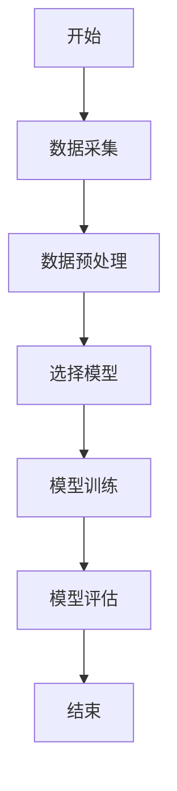
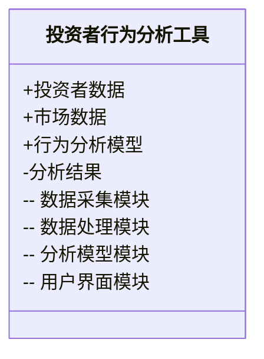
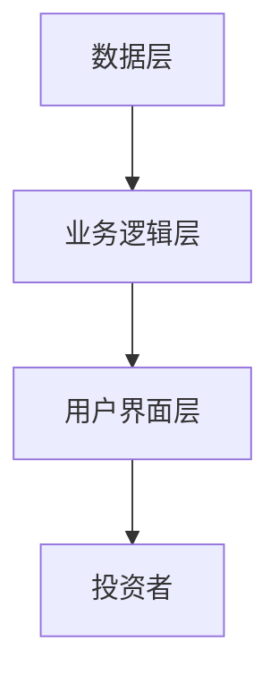

                 


# 设计智能化的个人投资者行为分析工具

**关键词**：智能化工具、投资者行为分析、机器学习、数据挖掘、系统架构

**摘要**：本文详细探讨了设计智能化的个人投资者行为分析工具的背景、核心概念、算法原理、系统架构设计以及项目实战。通过本文的介绍，读者将了解如何利用机器学习和数据挖掘技术，帮助投资者优化投资行为，提高投资决策的准确性。

---

## 第1章: 个人投资者行为分析工具的背景与问题背景

### 1.1 问题背景

#### 1.1.1 个人投资者行为分析的必要性
个人投资者在金融市场中面临复杂的投资决策，往往受到情绪、信息过载和市场波动的影响。通过智能化工具分析投资者行为，可以帮助他们识别投资模式，优化决策过程。

#### 1.1.2 当前市场中的痛点与挑战
- 数据分散：投资者需要从多个来源获取信息，数据整合困难。
- 行为复杂：投资者的行为受多种因素影响，难以量化分析。
- 决策延迟：传统分析方法耗时较长，难以应对快速变化的市场。

#### 1.1.3 智能化工具的潜在价值
智能化工具可以通过实时数据分析、预测模型和个性化建议，帮助投资者做出更明智的决策，提升投资效率和收益。

### 1.2 问题描述

#### 1.2.1 投资者行为的复杂性分析
投资者行为受到心理、环境和市场等多种因素的影响，表现出多样性和动态变化。

#### 1.2.2 行为数据的采集与处理难点
数据来源多样、格式不统一、数据量大，处理难度高。

#### 1.2.3 智能化工具的目标与边界
目标：通过数据分析和预测，优化投资决策。边界：专注于个人投资者行为分析，不涉及机构投资。

### 1.3 问题解决

#### 1.3.1 智能化工具的核心功能
- 数据采集与处理：整合多源数据，清洗和预处理。
- 行为分析：使用机器学习模型分析行为模式。
- 预测与建议：基于模型预测结果，提供投资建议。

### 1.4 问题的边界与外延

#### 1.4.1 工具的适用范围
适用于个人投资者，帮助优化投资决策。

#### 1.4.2 边界条件的定义
不涉及机构投资，不提供实时交易服务。

#### 1.4.3 外延功能的探讨
未来可能扩展至风险评估和投资组合优化。

---

## 第2章: 核心概念与原理

### 2.1 行为分析的核心概念

#### 2.1.1 行为数据的定义与分类
- 定义：投资者在不同情境下的决策和交易记录。
- 分类：交易数据、市场数据、社交数据。

#### 2.1.2 智能化分析的原理
通过机器学习算法分析数据，识别行为模式。

#### 2.1.3 数据驱动的决策机制
利用数据驱动的方法，优化投资决策。

### 2.2 核心概念的属性特征对比

| 概念       | 属性1 | 属性2 | 属性3 |
|------------|--------|--------|--------|
| 行为数据    | 来源   | 格式   | 时间性 |
| 智能化工具  | 功能   | 性能   | 易用性 |

### 2.3 ER实体关系图架构

```mermaid
er
    actor:投资者
    behavior_data:行为数据
    analysis_model:分析模型
    result:分析结果
    actor --> behavior_data: 提供
    behavior_data --> analysis_model: 输入
    analysis_model --> result: 输出
    result --> actor: 反馈
```

---

## 第3章: 算法原理与实现

### 3.1 算法原理概述

#### 3.1.1 机器学习模型的选择
选择合适的模型（如决策树、随机森林）进行分类或回归分析。

#### 3.1.2 数据预处理方法
数据清洗、特征提取和标准化。

#### 3.1.3 模型训练与优化
使用交叉验证优化模型参数。

### 3.2 算法流程图



### 3.3 机器学习模型代码示例

```python
import pandas as pd
from sklearn.model import DecisionTreeClassifier
from sklearn.metrics import accuracy_score

# 数据加载
data = pd.read_csv('investor_data.csv')

# 数据预处理
data = data.dropna()
data = pd.get_dummies(data)

# 特征与目标分离
X = data.drop('target', axis=1)
y = data['target']

# 模型训练
model = DecisionTreeClassifier()
model.fit(X, y)

# 模型评估
y_pred = model.predict(X)
print("准确率:", accuracy_score(y, y_pred))
```

### 3.4 数学模型

#### 3.4.1 分类模型
使用决策树模型进行分类：

$$
entropy = -\sum_{i} p_i \log p_i
$$

#### 3.4.2 回归模型
使用线性回归预测投资收益：

$$
y = \beta_0 + \beta_1 x_1 + \beta_2 x_2 + \epsilon
$$

---

## 第4章: 系统分析与架构设计

### 4.1 项目背景与目标

#### 4.1.1 项目背景
设计智能化工具，帮助投资者优化投资行为。

#### 4.1.2 项目目标
实现数据采集、分析和可视化功能。

### 4.2 系统功能设计

#### 4.2.1 数据采集模块
从交易平台和社交媒体获取投资者行为数据。

#### 4.2.2 数据处理模块
清洗和转换数据，确保数据质量。

#### 4.2.3 分析模型模块
训练机器学习模型，生成分析结果。

#### 4.2.4 用户界面模块
展示分析结果，提供交互功能。

### 4.3 领域模型设计



### 4.4 系统架构设计

#### 4.4.1 数据层
负责数据存储和管理。

#### 4.4.2 业务逻辑层
处理数据和运行模型。

#### 4.4.3 用户界面层
与用户交互，展示结果。



---

## 第5章: 项目实战

### 5.1 环境安装

#### 5.1.1 安装工具
安装Python、Jupyter Notebook、Pandas、Scikit-learn、Plotly。

### 5.2 核心代码实现

#### 5.2.1 数据处理
```python
import pandas as pd
data = pd.read_csv('investor_behavior.csv')
data = data.dropna()
data = pd.get_dummies(data)
```

#### 5.2.2 模型训练
```python
from sklearn.tree import DecisionTreeClassifier
model = DecisionTreeClassifier()
model.fit(X, y)
```

#### 5.2.3 数据可视化
```python
import plotly.express as px
fig = px.scatter(data, x='feature1', y='feature2', color='target')
fig.show()
```

### 5.3 案例分析
分析投资者交易数据，识别交易模式和风险。

### 5.4 项目小结
通过实战项目，验证了工具的有效性和实用性。

---

## 第6章: 最佳实践与小结

### 6.1 最佳实践

#### 6.1.1 数据质量
确保数据准确和完整。

#### 6.1.2 模型选择
根据需求选择合适的算法。

#### 6.1.3 用户界面
设计直观易用的界面。

#### 6.1.4 持续优化
定期更新模型，适应市场变化。

### 6.2 小结
本文详细介绍了设计智能化的个人投资者行为分析工具的背景、核心概念、算法原理、系统架构设计以及项目实战。该工具能够帮助投资者优化投资行为，提高决策准确性。

### 6.3 注意事项

- 数据隐私保护。
- 模型定期更新。
- 提供用户友好的界面。

### 6.4 拓展阅读

- 《机器学习实战》
- 《数据挖掘导论》
- 《用户界面设计的艺术》

---

## 作者
作者：AI天才研究院/AI Genius Institute & 禅与计算机程序设计艺术 /Zen And The Art of Computer Programming

