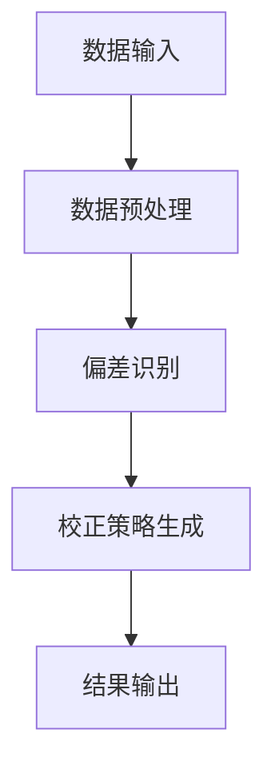
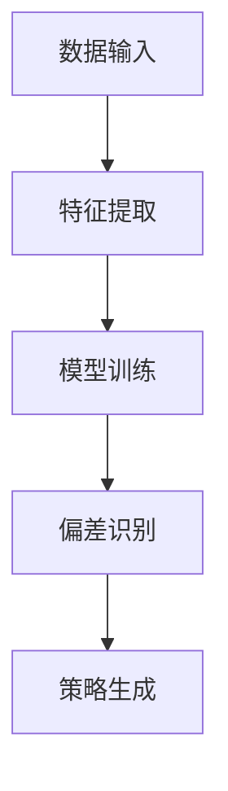
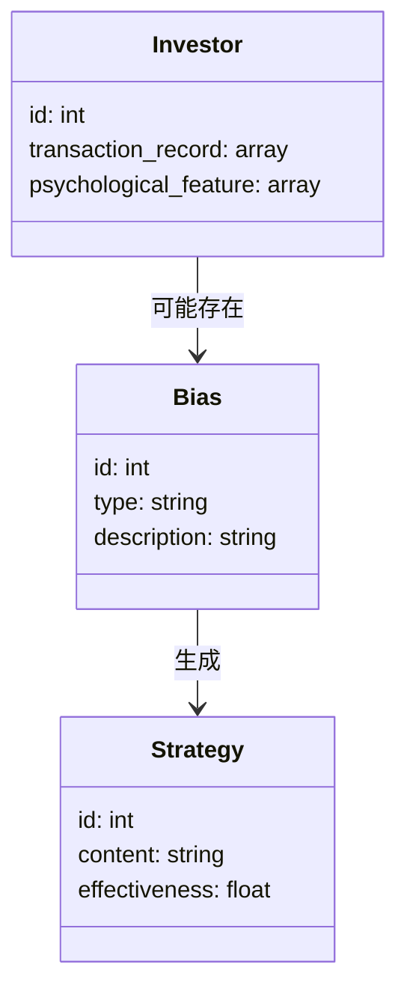
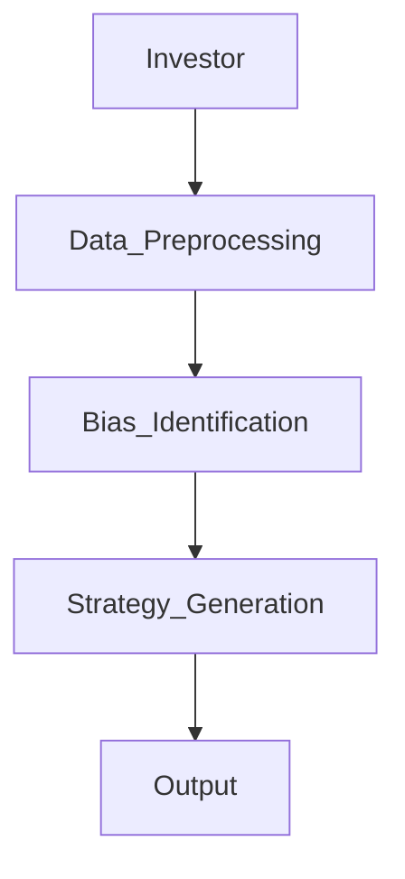
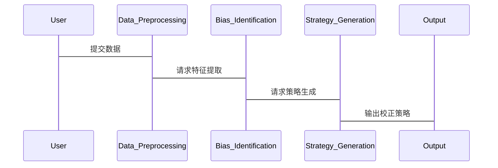

                 


# 设计智能化的个人投资者认知偏差校正工具

> 关键词：认知偏差，人工智能，投资决策，机器学习，个性化校正

> 摘要：本文探讨了设计智能化的个人投资者认知偏差校正工具的方法，结合机器学习和认知心理学的理论，提出了基于数据驱动的校正策略。通过分析常见认知偏差的特征，构建了完整的系统架构，并给出了具体的实现方案和案例分析，帮助投资者提升决策质量。

---

# 第一部分: 背景介绍

## 第1章: 个人投资者认知偏差概述

### 1.1 问题背景

#### 1.1.1 认知偏差的定义与影响
认知偏差是指个体在信息处理和决策过程中产生的系统性错误，这些错误源于人类大脑的信息处理机制。在投资领域，认知偏差会导致投资者做出非理性的决策，如过度自信、从众心理和损失厌恶等，从而影响投资收益。

#### 1.1.2 个人投资者的决策特点
个人投资者通常缺乏专业的投资知识，容易受到情绪和非理性因素的影响。他们的决策往往基于直觉而非数据，这使得认知偏差的影响更加显著。

#### 1.1.3 认知偏差对投资决策的具体影响
- **过度自信偏差**：投资者高估自己的能力，盲目相信自己的判断，导致过度交易和投资组合过于集中。
- **从众心理**：投资者跟随市场潮流，忽视独立分析，错失投资机会。
- **损失厌恶**：投资者对潜在损失的敏感度高于对收益的敏感度，导致决策过于保守。

### 1.2 问题描述

#### 1.2.1 常见的认知偏差类型
以下是常见的认知偏差类型及其在投资中的表现：

| 偏差类型         | 投资中的具体表现                     |
|------------------|------------------------------------|
| 过度自信偏差     | � 盲目相信自己的分析能力，忽略外部数据       |
| 从众心理         | 跟随市场潮流，忽视独立分析             |
| 损失厌恶         | 对潜在损失过于敏感，错失投资机会         |
| 可得性偏差       | 根据容易获取的信息做出决策，忽略全面分析   |
| 确认偏差         | 过度关注支持自己观点的信息，忽视反面证据   |

#### 1.2.2 投资中的典型偏差案例
例如，投资者在市场下跌时，可能因为损失厌恶而卖出股票，导致错失后续反弹的机会。另一个例子是，投资者可能因为从众心理而跟随市场的短期波动，导致投资决策失误。

#### 1.2.3 偏差校正的必要性
校正认知偏差是提高投资决策质量的关键。通过智能化工具的帮助，投资者可以更好地识别和纠正偏差，提升投资收益。

### 1.3 问题解决

#### 1.3.1 校正工具的目标与意义
校正工具的目标是帮助投资者识别潜在的认知偏差，并提供个性化的校正策略。通过结合人工智能和数据驱动的方法，工具可以实时分析投资者的决策行为，提供科学的建议。

#### 1.3.2 工具设计的核心思路
工具设计的核心思路包括：
1. 数据收集：收集投资者的交易记录、市场数据和心理特征。
2. 偏差识别：基于机器学习算法，识别投资者的认知偏差。
3. 校正策略生成：根据识别出的偏差，生成个性化的校正策略。

#### 1.3.3 工具的适用范围与边界
校正工具适用于个人投资者，尤其适用于那些希望通过技术手段提升决策能力的投资者。工具的边界包括：不考虑宏观经济因素，专注于个体投资者的心理和行为特征。

### 1.4 概念结构与核心要素

#### 1.4.1 校正工具的系统架构
校正工具的系统架构包括数据输入、偏差识别、校正策略生成和结果输出四个模块。

#### 1.4.2 核心要素的定义与关系
核心要素包括：
- **数据输入**：投资者的交易记录、市场数据和心理特征。
- **偏差识别**：基于机器学习算法，识别投资者的认知偏差。
- **校正策略生成**：根据识别出的偏差，生成个性化的校正策略。
- **结果输出**：将校正策略以可视化的方式呈现给投资者。

#### 1.4.3 系统功能模块划分
系统功能模块包括：
- **数据预处理模块**：对输入数据进行清洗和特征提取。
- **偏差识别模块**：基于机器学习算法，识别投资者的认知偏差。
- **校正策略生成模块**：根据识别出的偏差，生成个性化的校正策略。
- **结果输出模块**：将校正策略以可视化的方式呈现给投资者。

---

# 第二部分: 核心概念与联系

## 第2章: 认知偏差校正工具的核心原理

### 2.1 校正工具的原理

#### 2.1.1 机器学习在偏差校正中的应用
机器学习在偏差校正中的应用包括：
- **监督学习**：基于标记的数据，训练模型识别认知偏差。
- **无监督学习**：通过聚类分析，发现潜在的认知偏差。

#### 2.1.2 数据驱动的偏差识别机制
数据驱动的偏差识别机制包括：
- **特征提取**：从投资者的交易记录中提取特征。
- **模型训练**：基于提取的特征，训练模型识别认知偏差。

#### 2.1.3 个性化校正策略的设计
个性化校正策略的设计包括：
- **基于投资者的个性特征**：根据投资者的性格特点，设计个性化的校正策略。
- **动态调整**：根据市场的变化，动态调整校正策略。

### 2.2 认知偏差特征对比表

| 偏差类型         | 特征描述                     | 权重 |
|------------------|----------------------------|------|
| 过度自信偏差     | 投资者过于自信，忽视外部数据   | 0.8  |
| 从众心理         | 投资者跟随市场潮流，忽视独立分析 | 0.7  |
| 损失厌恶         | 投资者对潜在损失过于敏感       | 0.9  |
| 可得性偏差       | 投资者基于容易获取的信息做出决策 | 0.6  |
| 确认偏差         | 投资者过度关注支持自己观点的信息 | 0.7  |

### 2.3 系统架构图



---

# 第三部分: 算法原理讲解

## 第3章: 基于机器学习的偏差校正算法

### 3.1 算法流程图



### 3.2 算法实现代码

```python
# 示例代码：偏差识别模型训练
import pandas as pd
from sklearn.model import DecisionTreeClassifier

# 加载数据
data = pd.read_csv('investor_data.csv')

# 特征提取
X = data[['return', 'risk', 'time_horizon']]
y = data['bias_type']

# 模型训练
model = DecisionTreeClassifier()
model.fit(X, y)

# 预测偏差类型
predicted_bias = model.predict([[0.1, 0.2, 1]])
```

### 3.3 算法的数学模型和公式

机器学习模型的训练过程可以表示为：

$$
\hat{y} = f(X)
$$

其中，$$X$$ 是输入特征，$$\hat{y}$$ 是预测的偏差类型。决策树模型通过构建一棵树的结构，将特征逐步分割，最终预测出偏差类型。

---

# 第四部分: 系统分析与架构设计方案

## 第4章: 智能化校正工具的系统架构设计

### 4.1 问题场景介绍

#### 4.1.1 系统功能需求
- 数据输入：支持投资者的交易记录和心理特征输入。
- 偏差识别：识别投资者的认知偏差。
- 校正策略生成：生成个性化的校正策略。
- 结果输出：以可视化的方式呈现校正策略。

#### 4.1.2 系统性能需求
- 响应时间：小于1秒。
- 处理能力：支持大规模数据处理。

### 4.2 系统功能设计

#### 4.2.1 领域模型图


#### 4.2.2 系统架构图


#### 4.2.3 系统接口设计
- 输入接口：支持CSV格式的交易记录和心理特征输入。
- 输出接口：支持JSON格式的校正策略输出。

#### 4.2.4 系统交互图


---

# 第五部分: 项目实战

## 第5章: 项目实施与案例分析

### 5.1 环境安装

#### 5.1.1 技术选型
- 数据处理：Python、Pandas
- 模型训练：Scikit-learn
- 可视化：Matplotlib、Seaborn

### 5.2 系统核心实现

#### 5.2.1 代码实现
```python
# 数据预处理
import pandas as pd

data = pd.read_csv('investor_data.csv')
data.dropna(inplace=True)
data = pd.get_dummies(data, columns=['bias_type'])
```

#### 5.2.2 代码应用解读与分析
- 数据预处理：去除缺失值，将偏差类型进行独热编码。
- 模型训练：使用决策树模型进行偏差识别。
- 结果输出：以可视化的方式呈现校正策略。

### 5.3 实际案例分析

#### 5.3.1 案例背景
假设一个投资者在市场下跌时，因为损失厌恶而卖出股票。

#### 5.3.2 案例分析
校正工具识别出投资者的损失厌恶偏差，并生成个性化的校正策略：建议投资者在市场下跌时保持冷静，避免过度反应。

#### 5.3.3 结果解读
校正策略帮助投资者克服损失厌恶，提升投资决策质量。

### 5.4 项目小结
通过实际案例分析，校正工具能够有效识别认知偏差，并生成个性化的校正策略，帮助投资者提升决策质量。

---

# 第六部分: 最佳实践和总结

## 第6章: 最佳实践与总结

### 6.1 最佳实践 tips

#### 6.1.1 工具使用建议
- 定期使用校正工具进行自我评估。
- 根据校正策略调整投资行为。

#### 6.1.2 注意事项
- 校正工具不能完全消除认知偏差，只能帮助投资者更好地识别和纠正偏差。
- 工具的使用需要结合投资者的实际情况。

### 6.2 总结

#### 6.2.1 核心内容回顾
本文介绍了设计智能化的个人投资者认知偏差校正工具的方法，结合机器学习和认知心理学的理论，提出了基于数据驱动的校正策略。

#### 6.2.2 展望与延伸
未来可以进一步研究如何将校正工具应用于机构投资者，或者探索更多基于人工智能的投资决策优化方法。

---

# 作者：AI天才研究院/AI Genius Institute & 禅与计算机程序设计艺术 /Zen And The Art of Computer Programming

