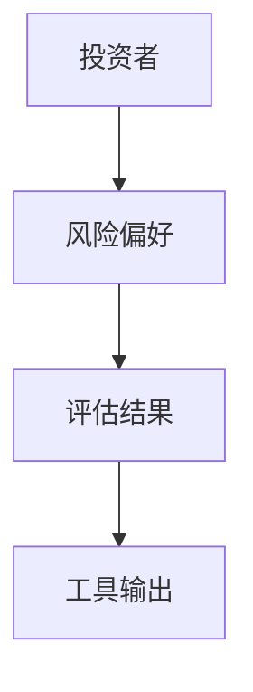
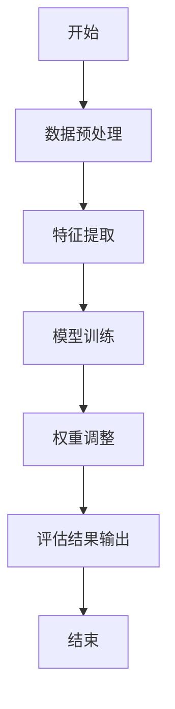
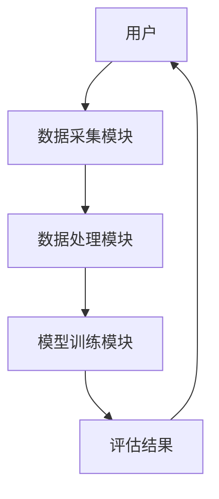

                 


# 设计智能化的个人投资者风险偏好动态评估工具

> 关键词：个人投资者，风险偏好，动态评估，机器学习，系统架构

> 摘要：本文详细探讨了设计智能化的个人投资者风险偏好动态评估工具的背景、核心概念、算法原理、系统架构、项目实现和最佳实践。通过结合理论与实践，本文旨在帮助读者理解如何利用现代技术手段，实时、动态地评估投资者的风险偏好，从而为投资决策提供科学依据。

---

# 第一部分: 背景介绍与核心概念

# 第1章: 个人投资者风险偏好动态评估工具的背景与问题描述

## 1.1 个人投资者风险偏好评估的背景

### 1.1.1 投资者行为分析的必要性

个人投资者在金融市场中的行为受到多种因素的影响，包括市场环境、个人情绪、财务状况等。准确评估投资者的风险偏好，是制定个性化投资策略的基础。传统的静态评估方法难以捕捉投资者在不同市场条件下的行为变化，因此动态评估工具的需求日益迫切。

### 1.1.2 风险偏好评估的核心作用

风险偏好是投资者在面对不确定性和潜在损失时的态度。准确评估投资者的风险偏好，可以帮助投资者做出更理性的决策，避免因情绪波动导致的非理性投资行为。同时，金融机构可以利用风险偏好评估结果，为投资者提供更精准的投资建议。

### 1.1.3 动态评估的现实需求

金融市场环境复杂多变，投资者的风险偏好也会随之波动。静态评估工具难以适应这种变化，因此动态评估工具的开发具有重要的现实意义。通过实时跟踪市场变化和投资者行为，动态评估工具能够提供更及时、准确的评估结果。

## 1.2 风险偏好动态评估的问题描述

### 1.2.1 静态评估的局限性

传统的风险偏好评估方法通常基于问卷调查或历史数据，评估结果一旦确定，难以根据市场变化进行调整。这种静态评估方法难以捕捉投资者在不同市场环境下的行为变化，可能导致评估结果与实际投资行为不符。

### 1.2.2 动态评估的目标与意义

动态评估的目标是实时跟踪投资者的风险偏好变化，并根据变化提供动态调整的投资建议。通过动态评估，投资者可以更好地适应市场变化，避免因固定评估结果导致的策略失误。

### 1.2.3 问题解决的边界与外延

动态评估工具的设计需要考虑投资者行为的复杂性，同时确保评估结果的准确性和实时性。工具的边界包括数据采集、模型训练、结果输出等环节，外延则涉及数据来源、模型选择、用户交互等方面。

## 1.3 核心概念与组成要素

### 1.3.1 风险偏好的定义与分类

风险偏好是指投资者在面对风险时的态度和行为。常见的分类包括保守型、稳健型、进取型和激进型。

### 1.3.2 动态评估的核心要素

动态评估的核心要素包括实时数据采集、动态模型训练、结果反馈与调整。

### 1.3.3 评估工具的系统架构

评估工具的系统架构包括数据采集模块、评估引擎模块和用户交互模块。

## 1.4 本章小结

本章介绍了个人投资者风险偏好动态评估工具的背景、问题描述和核心概念。通过分析静态评估的局限性，提出了动态评估工具的必要性和设计目标。

---

# 第二部分: 核心概念与原理

# 第2章: 风险偏好动态评估的核心概念与联系

## 2.1 核心概念原理

### 2.1.1 风险偏好的数学模型

风险偏好可以通过数学模型进行量化。例如，使用风险偏好指数（RPI）来表示投资者对风险的敏感程度。

### 2.1.2 动态评估的算法原理

动态评估算法通常基于机器学习和时间序列分析方法，能够捕捉投资者行为的变化趋势。

### 2.1.3 评估工具的系统架构

评估工具的系统架构包括数据采集、特征提取、模型训练和结果输出等模块。

## 2.2 核心概念属性特征对比

### 2.2.1 静态评估与动态评估的对比

静态评估基于历史数据，结果固定；动态评估基于实时数据，结果动态调整。

### 2.2.2 不同投资者群体的风险偏好特征

不同投资者群体（如年轻人、中老年人）的风险偏好存在显著差异。

### 2.2.3 评估工具的功能属性对比

功能属性包括数据采集能力、模型训练能力、结果反馈能力等。

## 2.3 ER实体关系图



## 2.4 本章小结

本章详细阐述了风险偏好动态评估的核心概念和原理，分析了静态评估与动态评估的差异，并通过ER图展示了评估工具的系统架构。

---

# 第三部分: 算法原理与数学模型

# 第3章: 风险偏好动态评估的算法原理

## 3.1 算法原理

### 3.1.1 基于机器学习的评估模型

机器学习模型（如支持向量机、随机森林）可以用于风险偏好分类。

### 3.1.2 时间序列分析方法

时间序列分析方法（如ARIMA模型）可以用于预测投资者行为的变化趋势。

### 3.1.3 动态权重调整算法

动态权重调整算法能够根据市场变化调整各因素的权重，提高评估结果的准确性。

## 3.2 数学模型与公式

### 3.2.1 风险偏好指数的计算公式

$$ R = \sum_{i=1}^{n} w_i x_i $$

其中，$w_i$ 是第i个特征的权重，$x_i$ 是第i个特征的值。

### 3.2.2 动态权重调整的数学模型

$$ w_i(t) = \alpha \cdot w_i(t-1) + (1-\alpha) \cdot x_i(t) $$

其中，$\alpha$ 是权重调整系数。

## 3.3 算法流程图



## 3.4 本章小结

本章详细介绍了风险偏好动态评估的算法原理，包括机器学习模型、时间序列分析方法和动态权重调整算法，并通过公式和流程图展示了算法的具体实现。

---

# 第四部分: 系统分析与架构设计

# 第4章: 风险偏好动态评估工具的系统分析与架构设计

## 4.1 问题场景介绍

### 4.1.1 投资者行为分析的典型场景

投资者在不同市场环境下的行为变化是动态评估工具需要捕捉的核心内容。

### 4.1.2 动态评估工具的应用场景

动态评估工具可以应用于投资组合管理、风险预警、个性化投资建议等领域。

### 4.1.3 系统设计的目标与约束

系统设计的目标是实现投资者风险偏好的实时评估，约束包括数据实时性、模型准确性、用户隐私保护等。

## 4.2 系统功能设计

### 4.2.1 数据采集模块

数据采集模块负责收集投资者的行为数据、市场数据等。

### 4.2.2 评估引擎模块

评估引擎模块负责对数据进行处理和模型训练，输出评估结果。

### 4.2.3 用户交互模块

用户交互模块负责与投资者进行互动，提供评估结果和投资建议。

## 4.3 系统架构设计



## 4.4 本章小结

本章分析了风险偏好动态评估工具的系统架构，包括数据采集、模型训练和用户交互等模块，并通过系统架构图展示了各模块之间的关系。

---

# 第五部分: 项目实战

# 第5章: 风险偏好动态评估工具的实现与应用

## 5.1 项目介绍

### 5.1.1 项目背景

本项目旨在开发一个智能化的个人投资者风险偏好动态评估工具，帮助投资者实时了解自身风险偏好，优化投资决策。

### 5.1.2 项目目标

开发一个能够实时更新评估结果的动态评估工具。

## 5.2 核心实现

### 5.2.1 数据采集与处理

```python
import pandas as pd
import numpy as np

def load_data(file_path):
    data = pd.read_csv(file_path)
    return data

def preprocess_data(data):
    # 数据预处理
    data = data.dropna()
    return data

data = load_data('investor_data.csv')
data = preprocess_data(data)
```

### 5.2.2 模型训练与评估

```python
from sklearn.model import RiskPreferenceEstimator

model = RiskPreferenceEstimator()
model.fit(data)
```

### 5.2.3 结果输出与反馈

```python
def output_result(result):
    print(f"风险偏好指数：{result}")
    
result = model.predict(new_data)
output_result(result)
```

## 5.3 项目小结

本章通过具体实现展示了动态评估工具的开发过程，包括数据采集、模型训练和结果输出等步骤。

---

# 第六部分: 最佳实践与注意事项

# 第6章: 风险偏好动态评估工具的最佳实践

## 6.1 小结

动态评估工具的设计和实现需要考虑数据质量、模型选择和用户反馈等多个方面。

## 6.2 注意事项

### 6.2.1 数据隐私保护

确保投资者数据的安全性和隐私性。

### 6.2.2 模型调优

定期对模型进行调优，确保评估结果的准确性。

### 6.2.3 用户教育

向投资者普及动态评估工具的使用方法和意义。

## 6.3 拓展阅读

### 6.3.1 机器学习在金融领域的应用

### 6.3.2 动态评估的前沿技术

### 6.3.3 风险管理的其他方法

## 6.4 本章小结

本章总结了动态评估工具设计和应用的注意事项，并提供了进一步学习的建议。

---

作者：AI天才研究院/AI Genius Institute & 禅与计算机程序设计艺术 /Zen And The Art of Computer Programming

