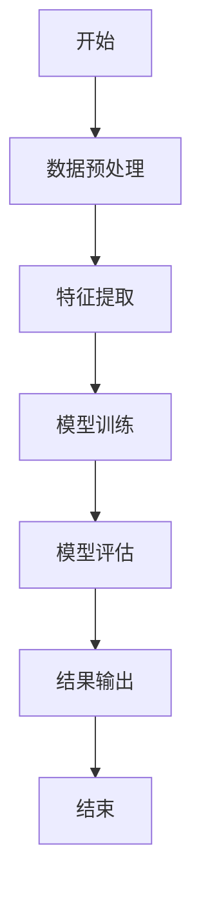
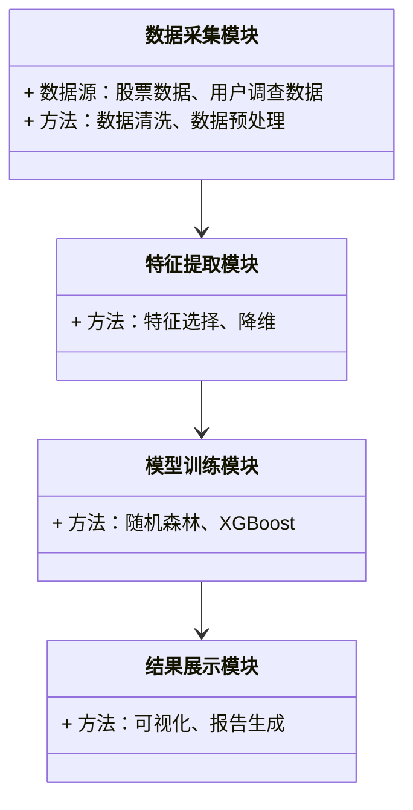
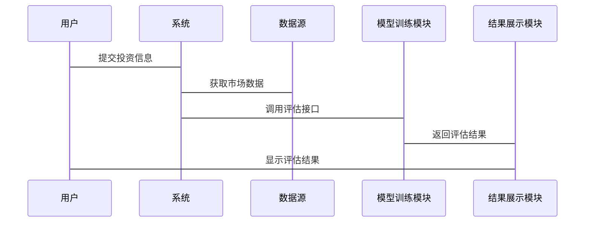

                 


# 设计智能化的个人投资风险承受能力评估工具

## 关键词
- 投资风险评估
- 人工智能
- 风险承受能力
- 系统架构设计
- 机器学习算法

## 摘要
本文详细探讨了设计智能化个人投资风险承受能力评估工具的全过程，从背景分析到系统实现，再到案例分析，系统性地介绍了该工具的设计思路、算法原理和实现方案。通过结合机器学习算法和系统架构设计，本文旨在为投资者提供一个高效、准确的风险评估工具，帮助其做出明智的投资决策。文章还深入分析了系统的核心模块，包括数据采集、特征提取、模型训练等，并通过实际案例展示了工具的实际应用价值，为后续的研究和实践提供了参考。

---

# 第1章：背景介绍

## 1.1 问题背景
### 1.1.1 传统投资风险评估的局限性
传统的投资风险评估方法依赖于人工分析，存在效率低、主观性强、覆盖面窄等问题。投资者的个性化需求难以被充分满足，且传统方法难以应对复杂多变的市场环境。

### 1.1.2 智能化评估的必要性
随着人工智能技术的发展，智能化工具能够快速处理大量数据，提供精准的评估结果。智能化评估工具可以实时跟踪市场变化，帮助投资者及时调整投资策略。

### 1.1.3 技术进步带来的新机遇
大数据和人工智能技术的进步为投资风险评估工具的智能化提供了技术支持。通过机器学习算法，工具能够从海量数据中提取有价值的信息，为投资者提供科学的决策支持。

## 1.2 问题描述
### 1.2.1 投资者风险承受能力的定义
风险承受能力是指投资者在面对投资损失时的心理和财务承受能力。它不仅涉及投资者的财务状况，还与其心理预期、投资目标等因素密切相关。

### 1.2.2 传统评估方法的不足
传统评估方法通常基于静态数据和简单模型，难以全面反映投资者的真实风险承受能力。例如，传统的问卷调查方法容易受到投资者主观因素的影响，且难以动态更新。

### 1.2.3 智能化工具的需求分析
智能化工具需要具备以下特点：
- 实时性：能够快速响应市场变化和投资者需求。
- 个性化：根据投资者的具体情况提供定制化的评估结果。
- 可解释性：评估结果需要清晰明了，便于投资者理解和应用。

## 1.3 核心概念与组成
### 1.3.1 核心概念
- 风险承受能力：投资者在面对投资损失时的心理和财务承受能力。
- 智能化评估工具：基于人工智能技术的工具，用于评估投资者的风险承受能力。
- 投资决策支持系统：为投资者提供科学决策支持的系统。

### 1.3.2 概念属性对比
表1-1：核心概念属性对比表

| 概念                | 输入数据类型 | 输出结果类型 | 核心功能描述                               |
|---------------------|--------------|--------------|-------------------------------------------|
| 风险承受能力        | 用户问卷、财务数据 | 风险承受等级 | 评估投资者在面对损失时的承受能力         |
| 智能化评估工具       | 用户行为数据、市场数据 | 评估报告 | 提供个性化的风险评估结果                 |
| 投资决策支持系统     | 市场数据、用户数据 | 投资建议 | 根据评估结果提供投资策略建议             |

### 1.3.3 实体关系图
```mermaid
er
actor: 投资者
actor: 投资顾问
actor: 系统管理员
database: 用户信息
database: 投资记录
database: 风险评估结果
}
```

---

# 第2章：核心概念与联系

## 2.1 风险承受能力评估模型
### 2.1.1 模型的基本原理
风险承受能力评估模型通过分析投资者的财务状况、投资行为和心理特征，综合评估其风险承受能力。模型通常包括数据预处理、特征提取、模型训练和结果输出等步骤。

### 2.1.2 模型的输入与输出
#### 输入：
- 用户的基本信息（年龄、收入、职业等）
- 用户的投资行为数据（历史投资记录、交易频率等）
- 市场数据（股票指数、利率等）

#### 输出：
- 风险承受能力等级（保守型、稳健型、进取型等）
- 投资建议（如推荐的投资组合）

### 2.1.3 模型的评估标准
模型的评估标准主要包括准确性、实时性和可解释性。准确性指模型预测结果与实际结果的接近程度；实时性指模型能够快速响应市场变化；可解释性指模型结果易于被投资者理解和应用。

## 2.2 智能化工具的实现机制
### 2.2.1 数据采集与处理
数据采集是智能化工具的第一步，包括从多种来源获取数据，并进行清洗和预处理。例如，从股票交易平台获取实时数据，从用户调查问卷中获取用户信息。

### 2.2.2 模型训练与优化
通过机器学习算法对数据进行训练，优化模型参数，提高模型的预测能力。例如，使用支持向量机（SVM）或随机森林（Random Forest）进行分类或回归分析。

### 2.2.3 结果呈现与反馈
将模型的评估结果以用户友好的方式呈现，并根据结果提供个性化的投资建议。例如，通过可视化图表展示评估结果，或生成定制化的投资报告。

---

# 第3章：算法原理讲解

## 3.1 算法选择与实现
### 3.1.1 机器学习算法的选择
在众多机器学习算法中，随机森林和梯度提升树（如XGBoost）是常用的分类和回归算法，适用于风险承受能力评估。

### 3.1.2 算法实现步骤
1. 数据预处理：清洗数据，处理缺失值，标准化数据。
2. 特征提取：从原始数据中提取有用的特征，例如用户年龄、收入、投资历史等。
3. 模型训练：使用训练数据训练模型，调整模型参数。
4. 模型评估：通过测试数据评估模型的准确率、召回率等指标。

### 3.1.3 算法流程图


### 3.1.4 代码实现
```python
import pandas as pd
from sklearn.ensemble import RandomForestClassifier
from sklearn.model_selection import train_test_split
from sklearn.metrics import accuracy_score

# 数据加载
data = pd.read_csv('risk_assessment.csv')

# 特征提取
X = data[['age', 'income', 'investment_experience']]
y = data['risk_level']

# 数据分割
X_train, X_test, y_train, y_test = train_test_split(X, y, test_size=0.2)

# 模型训练
model = RandomForestClassifier(n_estimators=100)
model.fit(X_train, y_train)

# 模型评估
y_pred = model.predict(X_test)
print('准确率:', accuracy_score(y_test, y_pred))
```

### 3.1.5 数学模型与公式
随机森林算法基于决策树的集成思想，通过构建多个决策树并进行投票或平均来提高模型的准确性和鲁棒性。其数学模型可以表示为：
$$
y = \sum_{i=1}^{n} \text{Tree}(x_i)
$$
其中，$x_i$ 表示每个决策树的输入特征，$n$ 表示决策树的数量。

---

# 第4章：系统分析与架构设计

## 4.1 问题场景介绍
### 4.1.1 问题场景
投资者需要根据自身的风险承受能力选择合适的投资组合。传统的评估方法难以满足个性化和实时性的需求，而智能化工具可以通过数据分析和机器学习算法提供精准的评估结果。

## 4.2 系统功能设计
### 4.2.1 功能模块
- 数据采集模块：从多种数据源获取数据。
- 特征提取模块：从原始数据中提取有用特征。
- 模型训练模块：训练机器学习模型。
- 结果展示模块：将评估结果以用户友好的方式呈现。

### 4.2.2 系统功能图


## 4.3 系统架构设计
### 4.3.1 分层架构
系统采用分层架构，包括数据层、业务逻辑层和用户界面层。数据层负责数据的存储和管理；业务逻辑层负责数据处理和模型训练；用户界面层负责与用户的交互。

### 4.3.2 系统架构图
```mermaid
archi
title 系统架构图
partition 数据层 {
    service 数据采集模块
    service 数据存储模块
}
partition 业务逻辑层 {
    service 特征提取模块
    service 模型训练模块
}
partition 用户界面层 {
    service 结果展示模块
}
```

## 4.4 接口设计与交互
### 4.4.1 系统接口设计
- 数据接口：提供REST API，供其他系统调用数据。
- 模型接口：提供评估接口，供其他系统调用评估结果。

### 4.4.2 交互流程图


---

# 第5章：项目实战

## 5.1 环境安装与配置
### 5.1.1 安装Python
安装Python 3.8及以上版本，确保环境支持机器学习库（如scikit-learn、xgboost）。

### 5.1.2 安装依赖库
使用pip安装以下库：
```
pip install pandas scikit-learn xgboost matplotlib
```

## 5.2 系统核心实现
### 5.2.1 数据预处理
```python
import pandas as pd
import numpy as np

data = pd.read_csv('investment.csv')
data = data.dropna()
data['income'] = data['income'].astype(float)
```

### 5.2.2 特征提取与模型训练
```python
from sklearn.ensemble import RandomForestClassifier
from sklearn.model_selection import train_test_split

X = data[['age', 'income', 'investment_experience']]
y = data['risk_level']

X_train, X_test, y_train, y_test = train_test_split(X, y, test_size=0.2)

model = RandomForestClassifier(n_estimators=100)
model.fit(X_train, y_train)
```

### 5.2.3 结果展示
```python
import matplotlib.pyplot as plt

importances = model.feature_importances_
indices = np.argsort(importances)[::-1]

plt.title('特征重要性排序')
plt.xlabel('特征')
plt.ylabel('重要性')
plt.bar(range(X.shape[1]), importances[indices])
plt.xticks(range(X.shape[1]), X.columns[indices], rotation=90)
plt.show()
```

## 5.3 实际案例分析
### 5.3.1 案例背景
假设一位投资者，年龄30岁，年收入50万元，投资经验3年。根据模型评估，其风险承受能力为稳健型，推荐的投资组合为60%股票、30%债券、10%现金。

### 5.3.2 模型解释
模型通过分析投资者的年龄、收入和投资经验，结合市场数据，评估出投资者的风险承受能力。在本案例中，稳健型意味着投资者能够承受一定的市场波动，但更倾向于保本和稳定收益。

---

# 第6章：最佳实践与总结

## 6.1 小结
智能化个人投资风险承受能力评估工具通过结合大数据和机器学习技术，能够为投资者提供个性化、动态化的风险评估服务。工具的核心在于数据的采集与处理、模型的训练与优化，以及结果的展示与反馈。

## 6.2 注意事项
- 数据隐私保护：确保投资者数据的安全性和隐私性。
- 模型的可解释性：评估结果需要清晰明了，便于投资者理解和应用。
- 模型的实时性：工具需要能够快速响应市场变化和投资者需求。

## 6.3 拓展阅读
- 《机器学习实战》：学习更多机器学习算法和应用场景。
- 《投资学基础》：了解投资风险的基本理论和方法。

---

# 作者：AI天才研究院/AI Genius Institute & 禅与计算机程序设计艺术/Zen And The Art of Computer Programming

---

**文章总结：** 本文详细探讨了设计智能化个人投资风险承受能力评估工具的全过程，从背景分析到系统实现，再到案例分析，系统性地介绍了该工具的设计思路、算法原理和实现方案。通过结合机器学习算法和系统架构设计，本文旨在为投资者提供一个高效、准确的风险评估工具，帮助其做出明智的投资决策。

