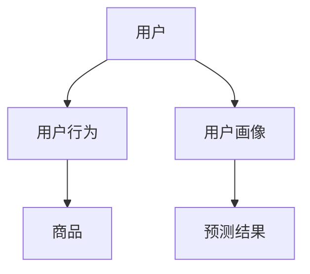
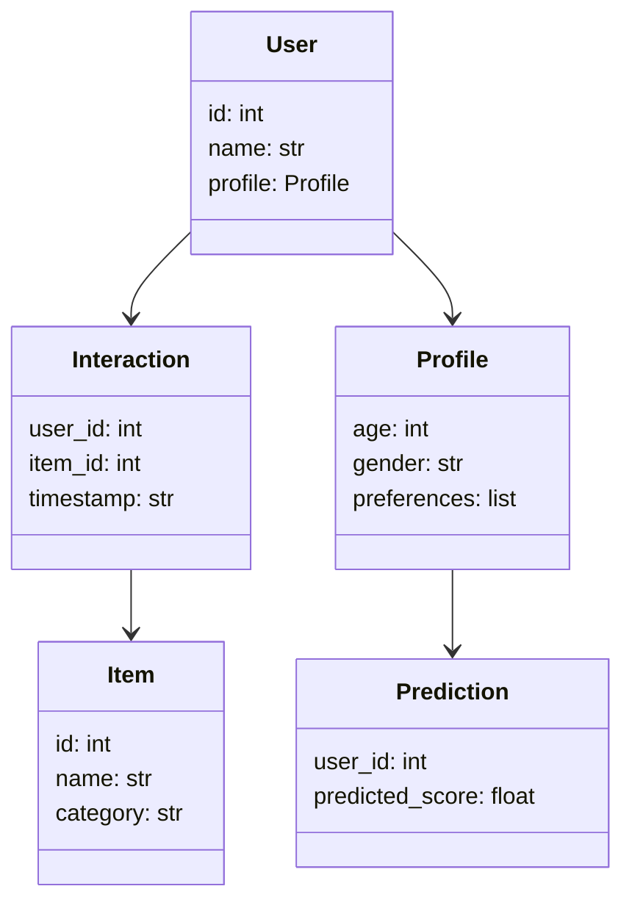
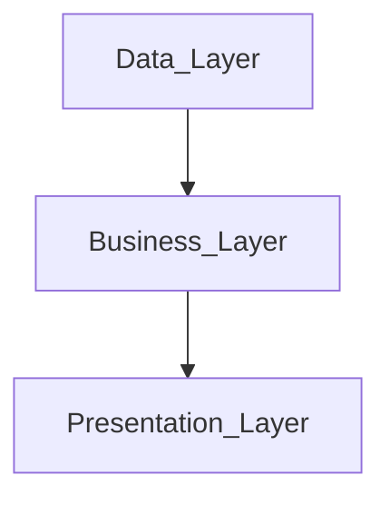
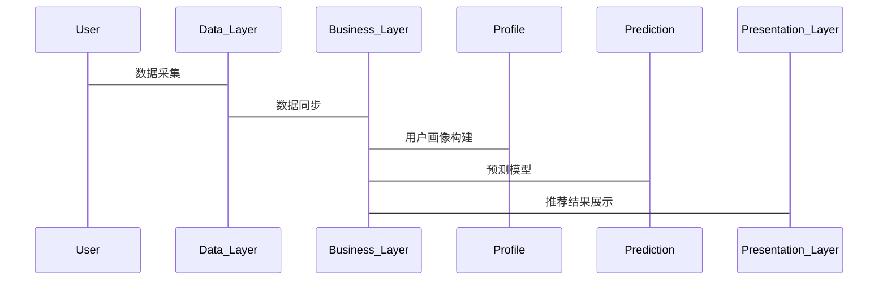

                 


# 设计智能化的个人消费行为分析系统

**关键词**：智能化、个人消费行为、分析系统、算法原理、系统架构、项目实战

**摘要**：  
智能化的个人消费行为分析系统是一种结合大数据和人工智能技术，通过对用户行为数据的深度挖掘和分析，实现个性化消费预测、行为推荐和决策支持的系统。本文从背景介绍、核心概念、算法原理、系统架构到项目实战，全面阐述了设计智能化个人消费行为分析系统的全过程，并提供了丰富的代码示例和实际案例分析。

---

# 第一部分: 智能化个人消费行为分析系统背景与核心概念

## 第1章: 智能化个人消费行为分析系统概述

### 1.1 问题背景与目标
#### 1.1.1 传统消费行为分析的局限性
传统消费行为分析主要依赖统计分析方法，难以应对用户行为的多样性和实时性变化。例如，传统的基于规则的推荐系统无法捕捉用户的实时需求变化，且难以处理大规模数据。

#### 1.1.2 智能化分析的必要性与目标
随着人工智能和大数据技术的快速发展，智能化个人消费行为分析系统能够通过机器学习算法实时捕捉用户行为特征，预测用户的消费倾向，并提供个性化的推荐服务。

#### 1.1.3 系统的核心价值与应用场景
- 核心价值：通过智能化分析，提升用户的消费体验，优化商家的营销策略。
- 应用场景：个性化推荐、消费预测、用户画像构建等。

### 1.2 问题描述与解决思路
#### 1.2.1 个人消费行为的多维度特征
消费行为的多维度特征包括时间特征、空间特征、用户特征和产品特征。

#### 1.2.2 数据采集与处理的挑战
- 数据采集：实时性、准确性、完整性。
- 数据处理：数据清洗、特征提取、数据建模。

#### 1.2.3 智能化分析的实现路径
通过机器学习算法（如协同过滤、聚类分析）和深度学习模型（如神经网络）实现智能化分析。

### 1.3 系统的边界与外延
#### 1.3.1 系统的功能边界
- 数据采集：用户行为数据、产品数据。
- 数据分析：用户画像、行为分析、预测模型。
- 推荐系统：个性化推荐、实时反馈。

#### 1.3.2 与相关系统的交互关系
- 用户端：用户行为数据采集。
- 商店端：消费数据同步。
- 推荐系统：个性化推荐结果输出。

#### 1.3.3 系统的可扩展性与灵活性
系统设计需要考虑模块化和扩展性，便于后续功能的添加和优化。

### 1.4 核心概念与系统架构
#### 1.4.1 用户画像构建
用户画像是基于用户行为数据构建的用户特征模型，包括用户的基本信息、消费习惯、偏好等。

#### 1.4.2 行为序列分析
行为序列分析是通过分析用户的行为序列，发现用户的消费模式和偏好。

#### 1.4.3 预测模型设计
预测模型通过机器学习算法，预测用户的消费行为，如购买概率、消费金额等。

---

## 第2章: 核心概念与系统联系

### 2.1 核心概念原理
#### 2.1.1 用户画像的构建方法
用户画像是通过数据挖掘技术，从用户的行为数据中提取特征，构建用户画像的过程。

#### 2.1.2 行为分析的特征提取
行为分析的特征提取包括时间特征、空间特征、行为频率等。

#### 2.1.3 预测模型的算法选择
预测模型的算法选择需要根据数据特征和应用场景来决定，如协同过滤、聚类分析等。

### 2.2 核心概念属性特征对比
#### 2.2.1 用户画像与行为分析的对比表格
| 特征维度 | 用户画像 | 行为分析 |
|----------|----------|----------|
| 数据来源 | 用户信息、行为数据 | 用户行为数据 |
| 目标 | 描述用户特征 | 分析用户行为模式 |

#### 2.2.2 预测模型与实际结果的对比分析
通过对比预测模型的输出结果与实际数据，评估模型的准确性。

### 2.3 ER实体关系图


---

# 第二部分: 算法原理与数学模型

## 第3章: 算法原理讲解

### 3.1 协同过滤算法
#### 3.1.1 基于用户的协同过滤
基于用户的行为相似性，推荐用户喜欢的商品。

#### 3.1.2 基于物品的协同过滤
基于商品的相似性，推荐用户可能感兴趣的商品。

#### 3.1.3 混合协同过滤的实现
结合基于用户和基于物品的协同过滤，提高推荐的准确性。

### 3.2 聚类分析算法
#### 3.2.1 K-means聚类
将用户分成不同的群组，基于群组特征进行推荐。

#### 3.2.2 DBSCAN聚类
基于密度的聚类算法，适用于用户行为数据的非均匀分布。

#### 3.2.3 层次聚类的应用
将用户按照层次结构进行聚类，便于分析用户行为的层次特征。

### 3.3 预测模型的数学公式
#### 3.3.1 矩阵分解公式
$$X = U \cdot V^T$$

#### 3.3.2 预测评分公式
$$\hat{r}_{ui} = \alpha + \beta_u + \gamma_i$$

---

## 第4章: 算法实现与代码示例

### 4.1 协同过滤算法实现
#### 4.1.1 基于用户的协同过滤代码
```python
def user_based_recommendation(user_id, data):
    # 计算用户相似性
    similarity = cosine_similarity(data[user_id])
    # 返回推荐结果
    return similarity.argsort()[::-1]
```

#### 4.1.2 基于物品的协同过滤代码
```python
def item_based_recommendation(item_id, data):
    # 计算商品相似性
    similarity = cosine_similarity(data[item_id])
    # 返回推荐结果
    return similarity.argsort()[::-1]
```

### 4.2 聚类分析算法实现
#### 4.2.1 K-means聚类代码
```python
from sklearn.cluster import KMeans

def kmeans_clustering(data, n_clusters):
    model = KMeans(n_clusters=n_clusters)
    model.fit(data)
    return model.labels_
```

#### 4.2.2 DBSCAN聚类代码
```python
from sklearn.cluster import DBSCAN

def dbscan_clustering(data, eps, min_samples):
    model = DBSCAN(eps=eps, min_samples=min_samples)
    model.fit(data)
    return model.labels_
```

---

# 第三部分: 系统分析与架构设计

## 第5章: 系统分析与架构设计

### 5.1 系统功能设计
#### 5.1.1 领域模型类图


### 5.2 系统架构设计
#### 5.2.1 分层架构
- 数据层：数据采集、存储。
- 业务逻辑层：用户画像构建、行为分析、预测模型。
- 表现层：推荐结果展示、用户反馈。

#### 5.2.2 系统架构图


### 5.3 系统接口设计
#### 5.3.1 接口定义
- 数据接口：数据采集、数据同步。
- 业务接口：用户画像构建、行为分析、预测模型。

#### 5.3.2 接口交互流程图


---

## 第6章: 项目实战

### 6.1 环境安装与配置
- 安装Python、Jupyter Notebook、Pandas、Scikit-learn等工具。

### 6.2 系统核心功能实现
#### 6.2.1 数据预处理
```python
import pandas as pd

data = pd.read_csv('user_behavior.csv')
data.head()
```

#### 6.2.2 特征提取
```python
from sklearn.feature_extraction.text import TfidfVectorizer

vectorizer = TfidfVectorizer()
features = vectorizer.fit_transform(data['description'])
```

#### 6.2.3 模型训练
```python
from sklearn.neighbors import NearestNeighbors

model = NearestNeighbors(n_neighbors=5)
model.fit(features)
```

### 6.3 实际案例分析
通过实际数据集，展示系统如何进行用户画像构建、行为分析和预测模型训练。

### 6.4 代码应用解读与分析
详细解读代码实现，分析每一步的功能和作用。

### 6.5 项目小结
总结项目实现的关键点和注意事项。

---

## 第7章: 最佳实践

### 7.1 小结
总结智能化个人消费行为分析系统的实现过程和关键点。

### 7.2 注意事项
- 数据隐私保护
- 系统性能优化
- 算法选择与调优

### 7.3 未来趋势
智能化个人消费行为分析系统的发展趋势，如深度学习的应用、实时推荐系统的优化等。

### 7.4 拓展阅读
推荐相关领域的书籍和论文，供读者进一步学习。

---

**作者**：AI天才研究院/AI Genius Institute & 禅与计算机程序设计艺术 /Zen And The Art of Computer Programming

