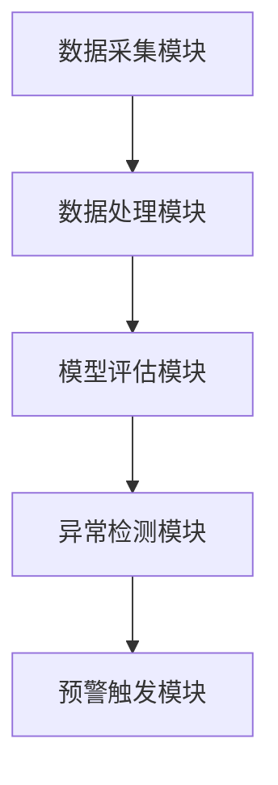
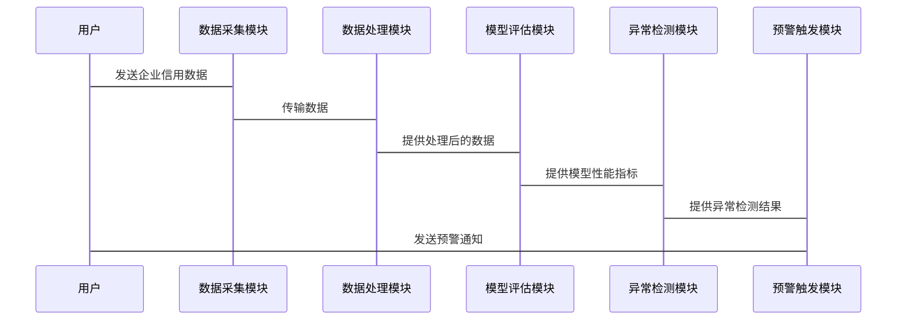

                 


# 设计智能化的企业信用评级模型性能监控与预警系统

---

## 关键词：
企业信用评级、模型性能监控、智能化预警、异常检测、机器学习、大数据分析

---

## 摘要：
随着企业融资需求的增加和金融市场风险的加剧，信用评级模型在企业信用评估中扮演着越来越重要的角色。然而，信用评级模型的性能会受到数据质量、市场变化和模型老化等因素的影响，导致其预测能力下降，甚至引发严重的金融风险。本文旨在设计一个智能化的企业信用评级模型性能监控与预警系统，通过结合机器学习、大数据分析和实时监控技术，实现对信用评级模型的性能评估、异常检测和实时预警。本文将从模型构建、性能监控算法、系统架构设计、项目实战等方面进行详细探讨，为读者提供一个完整的解决方案。

---

# 第一部分: 企业信用评级模型性能监控与预警系统背景

---

## 第1章: 企业信用评级模型概述

### 1.1 企业信用评级的定义与重要性

#### 1.1.1 企业信用评级的基本概念
企业信用评级是对企业在一定时期内的财务状况、经营能力和偿债能力进行综合评估的过程。评级结果反映了企业违约的可能性，是金融机构进行信贷决策的重要依据。

#### 1.1.2 信用评级在企业融资中的作用
企业信用评级是企业获得融资的关键因素之一。高信用评级的企业更容易获得较低利率的贷款，而低信用评级的企业则可能面临融资困难或高利率。

#### 1.1.3 信用评级对风险管理的意义
信用评级能够帮助金融机构识别和评估风险，从而制定合理的风险管理策略，降低因企业违约带来的损失。

---

### 1.2 信用评级模型的分类与特点

#### 1.2.1 信用评级模型的分类
信用评级模型主要分为以下几类：
1. **财务指标模型**：基于企业的财务数据（如资产负债率、利润率等）进行评级。
2. **专家判断模型**：结合行业专家的经验进行综合评估。
3. **统计模型**：基于统计方法（如逻辑回归、决策树等）进行预测。
4. **机器学习模型**：利用机器学习算法（如随机森林、XGBoost等）进行预测。

#### 1.2.2 不同模型的特点与适用场景
| 模型类型       | 特点                     | 适用场景                       |
|----------------|--------------------------|--------------------------------|
| 财务指标模型   | 数据简单，易于解释       | 中小企业，数据有限的情况       |
| 专家判断模型   | 结合行业经验，结果灵活   | 行业特性明显，数据不足的情况   |
| 统计模型       | 方法成熟，结果稳定       | 数据量较大，行业特性不明显的情况 |
| 机器学习模型   | 高精度，非线性关系       | 数据量充足，复杂关系的情况     |

#### 1.2.3 信用评级模型的核心要素
1. **数据来源**：企业财务数据、行业数据、市场数据等。
2. **特征选择**：如资产负债率、流动比率、净利润率等。
3. **模型训练**：基于历史数据进行模型训练。
4. **模型评估**：通过准确率、召回率等指标评估模型性能。

---

### 1.3 信用评级模型的构建过程

#### 1.3.1 数据采集与处理
1. **数据来源**：企业财务报表、行业数据、市场数据等。
2. **数据清洗**：处理缺失值、异常值和重复数据。
3. **数据预处理**：标准化、归一化等。

#### 1.3.2 特征选择与建模
1. **特征选择**：通过相关性分析、主成分分析等方法选择关键特征。
2. **模型训练**：使用逻辑回归、随机森林等算法训练模型。

#### 1.3.3 模型评估与优化
1. **模型评估**：使用准确率、F1分数等指标评估模型性能。
2. **模型优化**：通过网格搜索、交叉验证等方法优化模型参数。

---

### 1.4 信用评级模型的监控需求

#### 1.4.1 模型性能监控的重要性
1. **及时发现模型失效**：避免因模型性能下降导致的误判。
2. **降低金融风险**：通过实时监控，及时发现潜在风险，减少损失。
3. **提升模型更新效率**：通过监控，识别模型性能下降的原因，及时进行再训练。

#### 1.4.2 模型失效的风险与影响
1. **误判风险**：模型失效可能导致信用评估错误，引发金融风险。
2. **损失扩大化**：模型失效可能导致金融机构的经济损失。

#### 1.4.3 预警机制的必要性
1. **实时预警**：通过实时监控，及时发现模型异常，触发预警机制。
2. **自动化处理**：通过自动化流程，快速响应模型异常。

---

### 1.5 本章小结

---

## 第2章: 智能化监控与预警系统的背景

### 2.1 传统信用评级模型监控的局限性

#### 2.1.1 人工监控的低效性
1. **效率低下**：人工监控需要大量时间和资源，难以应对海量数据。
2. **主观性**：人工监控依赖专家经验，存在主观判断误差。

#### 2.1.2 现有技术的不足
1. **传统监控工具**：功能单一，难以满足复杂需求。
2. **数据处理能力有限**：传统工具难以处理大数据量和复杂场景。

#### 2.1.3 数据量激增带来的挑战
1. **数据爆炸式增长**：企业信用数据量急剧增加，传统方法难以处理。
2. **数据复杂性**：数据来源多样，结构复杂，难以统一处理。

---

### 2.2 智能化监控的优势

#### 2.2.1 自动化数据处理能力
1. **高效的数据处理**：智能化系统能够快速处理海量数据，提升监控效率。
2. **自动化异常检测**：通过机器学习算法，自动发现模型异常。

#### 2.2.2 高效的异常检测能力
1. **实时监控**：智能化系统能够实时监控模型性能，快速发现异常。
2. **精准预警**：通过算法分析，精准识别潜在风险，触发预警。

#### 2.2.3 实时预警机制
1. **实时反馈**：系统能够实时监控模型性能，及时反馈异常情况。
2. **快速响应**：通过自动化流程，快速响应模型异常，减少损失。

---

### 2.3 智能化监控系统的应用场景

#### 2.3.1 银行信贷领域
1. **实时监控贷款客户信用风险**：银行可以通过智能化系统实时监控贷款客户的信用风险，及时调整信贷策略。
2. **自动化预警机制**：当客户信用风险超过阈值时，系统自动触发预警，通知相关人员采取措施。

#### 2.3.2 企业融资服务
1. **评估企业信用风险**：融资平台可以通过智能化系统快速评估企业的信用风险，为投资者提供参考。
2. **动态调整信用评级**：根据实时数据，动态调整企业的信用评级，确保评估结果准确。

#### 2.3.3 信用风险管理
1. **实时监控信用风险**：金融机构可以通过智能化系统实时监控信用风险，及时发现潜在问题。
2. **制定风险管理策略**：基于系统提供的数据和分析结果，制定合理的风险管理策略。

---

### 2.4 本章小结

---

# 第二部分: 信用评级模型性能监控的核心概念

---

## 第3章: 模型性能监控的核心概念

### 3.1 模型性能监控的定义与目标

#### 3.1.1 定义
模型性能监控是对信用评级模型的预测能力和稳定性进行实时或定期评估的过程，旨在及时发现模型失效或性能下降的情况。

#### 3.1.2 监控目标
1. **及时发现模型异常**：通过监控，及时发现模型预测能力下降或失效的情况。
2. **评估模型稳定性**：通过监控，评估模型在不同时间段内的稳定性。
3. **优化模型性能**：通过监控结果，优化模型参数和结构，提升预测能力。

---

### 3.2 模型性能监控的关键技术

#### 3.2.1 数据分析技术
1. **描述性分析**：通过统计分析，了解数据分布、趋势和异常值。
2. **诊断性分析**：通过分析模型错误案例，找出模型失效的原因。

#### 3.2.2 异常检测算法
1. **基于统计的方法**：如Z-score、孤立森林等。
2. **基于机器学习的方法**：如Isolation Forest、One-Class SVM等。

#### 3.2.3 时间序列分析
1. **趋势分析**：通过时间序列分析，发现模型预测能力的下降趋势。
2. **周期性分析**：分析模型性能在不同时间段内的周期性变化。

---

### 3.3 模型性能监控的流程

#### 3.3.1 数据采集
1. **实时数据采集**：从企业信用评级系统中实时采集信用数据。
2. **历史数据存储**：将历史数据存储在数据库中，便于后续分析。

#### 3.3.2 数据预处理
1. **数据清洗**：处理缺失值、异常值等。
2. **数据转换**：将数据转换为适合模型输入的格式。

#### 3.3.3 性能评估
1. **模型评估指标**：如准确率、召回率、F1分数等。
2. **性能趋势分析**：通过时间序列分析，发现模型性能的下降趋势。

#### 3.3.4 异常检测
1. **基于统计的异常检测**：如Z-score方法。
2. **基于机器学习的异常检测**：如Isolation Forest算法。

#### 3.3.5 预警触发
1. **预警规则设置**：根据模型性能指标，设置预警阈值。
2. **预警触发**：当模型性能指标低于阈值时，触发预警。

---

### 3.4 本章小结

---

# 第三部分: 系统架构设计

---

## 第4章: 系统架构设计

### 4.1 系统功能设计

#### 4.1.1 功能模块划分
1. **数据采集模块**：负责采集企业信用数据。
2. **数据处理模块**：对数据进行清洗、转换和存储。
3. **模型评估模块**：评估信用评级模型的性能。
4. **异常检测模块**：检测模型性能异常。
5. **预警触发模块**：根据异常检测结果，触发预警。

#### 4.1.2 功能流程设计
1. 数据采集模块将企业信用数据传输到数据处理模块。
2. 数据处理模块对数据进行清洗、转换和存储。
3. 模型评估模块定期评估信用评级模型的性能。
4. 异常检测模块对模型性能指标进行分析，发现异常。
5. 预警触发模块根据异常检测结果，触发预警。

---

### 4.2 系统架构设计

#### 4.2.1 系统架构图


#### 4.2.2 关键模块实现
1. **数据采集模块**：使用Flask或FastAPI等框架，开发API接口，接收企业信用数据。
2. **数据处理模块**：使用Pandas库，对数据进行清洗、转换和存储。
3. **模型评估模块**：使用Scikit-learn库，评估信用评级模型的性能。
4. **异常检测模块**：使用Isolation Forest算法，检测模型性能异常。
5. **预警触发模块**：根据异常检测结果，触发预警，通知相关人员。

---

### 4.3 系统交互设计

#### 4.3.1 系统交互流程


---

### 4.4 本章小结

---

# 第四部分: 项目实战

---

## 第5章: 项目实战

### 5.1 环境安装与配置

#### 5.1.1 安装Python
```bash
python --version
pip install --upgrade pip
```

#### 5.1.2 安装依赖库
```bash
pip install numpy pandas scikit-learn matplotlib
```

---

### 5.2 数据采集与预处理

#### 5.2.1 数据采集
```python
import pandas as pd
data = pd.read_csv('credit_data.csv')
```

#### 5.2.2 数据预处理
```python
# 删除缺失值
data.dropna(inplace=True)

# 标准化处理
from sklearn.preprocessing import StandardScaler
scaler = StandardScaler()
data[['revenue', 'profit']] = scaler.fit_transform(data[['revenue', 'profit']])
```

---

### 5.3 模型训练与评估

#### 5.3.1 模型训练
```python
from sklearn.ensemble import RandomForestClassifier
model = RandomForestClassifier(n_estimators=100, random_state=42)
model.fit(X_train, y_train)
```

#### 5.3.2 模型评估
```python
from sklearn.metrics import accuracy_score, recall_score, f1_score
y_pred = model.predict(X_test)
print(f"Accuracy: {accuracy_score(y_test, y_pred)}")
print(f"Recall: {recall_score(y_test, y_pred)}")
print(f"F1 Score: {f1_score(y_test, y_pred)}")
```

---

### 5.4 性能监控与异常检测

#### 5.4.1 性能监控
```python
from sklearn.metrics import accuracy_score
y_pred_train = model.predict(X_train)
y_pred_test = model.predict(X_test)
train_accuracy = accuracy_score(y_train, y_pred_train)
test_accuracy = accuracy_score(y_test, y_pred_test)
print(f"Train Accuracy: {train_accuracy}")
print(f"Test Accuracy: {test_accuracy}")
```

#### 5.4.2 异常检测
```python
from isolation_forest import IsolationForest
model_if = IsolationForest(random_state=42)
model_if.fit(y_pred_train, y_train)
outliers = model_if.predict_outliers(y_pred_test)
print(f"Number of outliers: {len(outliers)}")
```

---

### 5.5 预警触发

#### 5.5.1 预警规则设置
```python
threshold = 0.8
```

#### 5.5.2 预警触发
```python
if train_accuracy < threshold or test_accuracy < threshold:
    print("Model performance has decreased, trigger warning!")
```

---

### 5.6 本章小结

---

# 第五部分: 总结与展望

---

## 第6章: 总结与展望

### 6.1 总结

#### 6.1.1 系统设计总结
1. **系统优势**：智能化监控与预警系统能够实时监控信用评级模型的性能，快速发现异常，降低金融风险。
2. **系统特点**：结合机器学习和大数据分析技术，实现自动化、高效的性能监控和预警。

#### 6.1.2 项目成果
1. **实现目标**：完成了智能化监控与预警系统的开发，实现了模型性能监控、异常检测和实时预警功能。
2. **实际应用价值**：该系统能够帮助金融机构及时发现信用评级模型的异常，降低金融风险，提升信用评估的准确性。

---

### 6.2 未来展望

#### 6.2.1 系统优化方向
1. **算法优化**：引入更先进的机器学习算法，如深度学习模型，提升异常检测的准确性。
2. **功能扩展**：增加更多监控指标，如模型解释性、特征重要性分析等。
3. **系统集成**：将该系统与其他金融系统集成，实现更全面的金融风险管理。

#### 6.2.2 技术发展趋势
1. **人工智能技术**：随着人工智能技术的不断发展，信用评级模型将更加智能化和自动化。
2. **大数据分析**：大数据分析技术的提升将为信用评级模型的监控提供更强大的支持。

---

### 6.3 本章小结

---

# 作者：AI天才研究院/AI Genius Institute & 禅与计算机程序设计艺术/Zen And The Art of Computer Programming

---

**本文通过系统设计、算法实现和项目实战，全面介绍了智能化的企业信用评级模型性能监控与预警系统的构建过程。希望本文能够为读者提供一个完整的解决方案，帮助金融机构更好地进行信用风险管理，降低金融风险，提升信用评估的准确性。**

