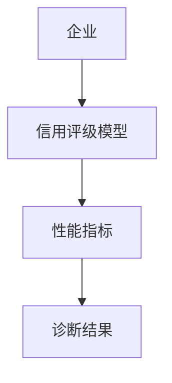
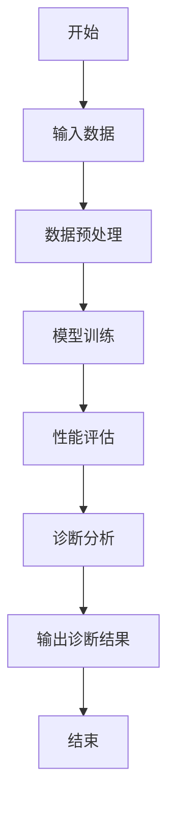
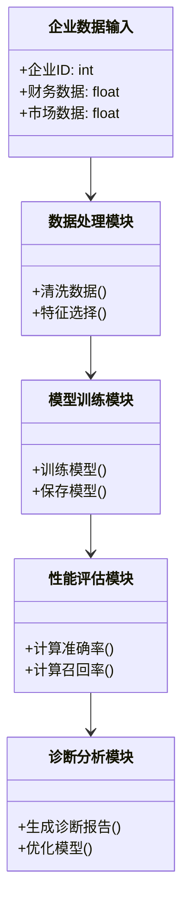
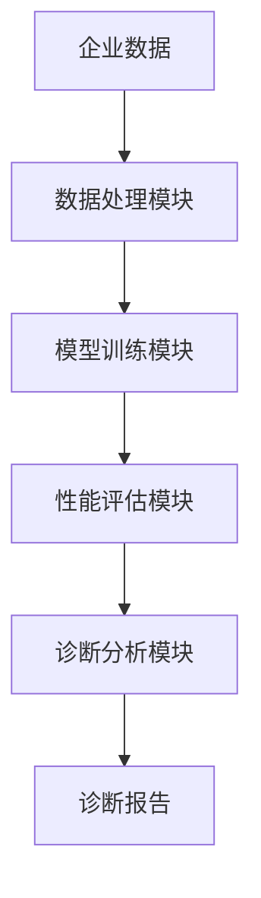

                 


# 设计智能化的企业信用评级模型性能诊断系统

> 关键词：企业信用评级、智能化诊断系统、性能分析、机器学习、深度学习

> 摘要：本文旨在设计一个智能化的企业信用评级模型性能诊断系统，通过分析现有信用评级模型的局限性，提出一种基于智能化算法的性能诊断方法，结合系统架构设计与实际项目案例，详细阐述了该系统的实现过程与应用价值。

---

# 第一部分: 企业信用评级模型性能诊断系统背景与核心概念

## 第1章: 企业信用评级模型性能诊断系统概述

### 1.1 问题背景与描述

#### 1.1.1 企业信用评级的重要性
企业信用评级是企业在金融市场上融资的重要依据，直接影响企业的融资成本和市场信任度。传统信用评级模型主要基于财务数据和简单的统计分析，难以捕捉企业经营中的动态风险因素。

#### 1.1.2 现有信用评级模型的局限性
- 数据维度单一，难以覆盖企业的多维风险特征。
- 模型缺乏动态性，无法及时反映市场变化对企业信用的影响。
- 传统模型对非结构化数据的处理能力较弱，难以充分利用企业内外部信息。

#### 1.1.3 性能诊断系统的必要性
为了提高信用评级模型的准确性和可靠性，需要一个智能化的性能诊断系统，能够实时监控模型表现，优化模型参数，提升模型的适应性和预测能力。

### 1.2 问题解决与边界

#### 1.2.1 系统的目标与功能
- 目标：提供一种智能化的信用评级模型性能诊断方法，优化模型表现，降低模型风险。
- 功能：实时监控模型性能、分析模型误差、优化模型参数、提供诊断报告。

#### 1.2.2 边界与外延
- 仅关注信用评级模型的性能诊断，不涉及模型的具体实现。
- 适用于多种信用评级模型，包括传统模型和机器学习模型。

#### 1.2.3 核心要素组成
- 数据输入：企业的财务数据、市场数据、行业数据等。
- 模型输出：信用评级结果。
- 诊断指标：模型准确率、召回率、F1值等。

### 1.3 智能化诊断的核心概念

#### 1.3.1 信用评级模型的定义与特点
- 定义：基于企业特征数据，预测企业信用风险的模型。
- 特点：数据驱动、模型复杂性高、结果具有风险决策价值。

#### 1.3.2 性能诊断系统的定义与特点
- 定义：用于评估和优化信用评级模型性能的系统。
- 特点：智能化、实时性、数据驱动。

#### 1.3.3 智能化诊断的关键技术
- 机器学习算法：用于模型性能分析和优化。
- 数据挖掘技术：用于发现数据中的潜在模式。
- 自然语言处理：用于分析非结构化数据。

## 第2章: 核心概念与联系

### 2.1 核心概念原理

#### 2.1.1 信用评级模型的原理
信用评级模型通过对企业特征的分析，预测企业的信用风险等级。常见的模型包括线性回归、逻辑回归、决策树等。

#### 2.1.2 性能诊断系统的原理
性能诊断系统通过分析模型的输出结果，评估模型的性能，并提出改进建议。主要依赖于性能指标的计算和诊断算法的实现。

#### 2.1.3 智能化诊断的原理
智能化诊断系统利用机器学习和人工智能技术，自动分析模型性能，发现潜在问题，并提出优化方案。

### 2.2 概念属性特征对比

| 概念       | 信用评级模型 | 性能诊断系统 | 智能化诊断 |
|------------|--------------|--------------|------------|
| 目标       | 信用评分     | 诊断模型性能 | 优化模型   |
| 输入数据   | 企业数据     | 模型输出     | 综合数据   |
| 输出结果   | 信用等级     | 诊断报告     | 优化方案   |

### 2.3 ER实体关系图架构



---

# 第3章: 模型性能诊断算法原理

## 3.1 算法原理概述

### 3.1.1 信用评级模型的评估指标
- 准确率：模型预测正确的比例。
- 召回率：模型正确识别正类的比例。
- F1值：准确率和召回率的调和平均数。

### 3.1.2 性能诊断的基本方法
- 分析模型的误差分布。
- 比较模型在不同数据集上的表现。
- 检查模型的特征重要性。

### 3.1.3 智能化诊断的核心算法
- 机器学习算法：随机森林、支持向量机、神经网络等。
- 数据预处理技术：特征选择、数据清洗等。

## 3.2 算法流程图



## 3.3 算法实现

### 3.3.1 Python代码示例

```python
import pandas as pd
from sklearn.metrics import accuracy_score, recall_score, f1_score

# 加载数据
data = pd.read_csv('credit_data.csv')

# 划分训练集和测试集
X_train, X_test, y_train, y_test = train_test_split(data.drop('target', axis=1), data['target'], test_size=0.2)

# 训练模型
model = LogisticRegression().fit(X_train, y_train)

# 预测结果
y_pred = model.predict(X_test)

# 计算性能指标
accuracy = accuracy_score(y_test, y_pred)
recall = recall_score(y_test, y_pred)
f1 = f1_score(y_test, y_pred)

print(f'Accuracy: {accuracy}\nRecall: {recall}\nF1: {f1}')
```

### 3.3.2 数学模型与公式

$$
\text{Accuracy} = \frac{\text{正确预测数}}{\text{总样本数}}
$$

$$
\text{Recall} = \frac{\text{真阳性}}{\text{真阳性 + 假阴性}}
$$

$$
\text{F1} = \frac{2 \cdot \text{Precision} \cdot \text{Recall}}{\text{Precision} + \text{Recall}}
$$

---

# 第4章: 系统分析与架构设计

## 4.1 系统分析

### 4.1.1 问题场景介绍
- 数据来源：企业财务数据、市场数据、行业数据等。
- 数据规模：中小型企业数据，数据量较大，数据维度较高。

## 4.2 系统功能设计

### 4.2.1 功能模块划分
- 数据输入模块：接收企业数据。
- 数据处理模块：清洗和预处理数据。
- 模型训练模块：训练信用评级模型。
- 性能评估模块：计算模型性能指标。
- 诊断分析模块：分析模型性能，提出优化建议。

### 4.2.2 系统功能类图



## 4.3 系统架构设计

### 4.3.1 架构设计概述



---

# 第5章: 项目实战

## 5.1 环境安装与配置

### 5.1.1 安装依赖
```bash
pip install pandas scikit-learn matplotlib
```

## 5.2 系统核心实现

### 5.2.1 数据处理模块实现

```python
import pandas as pd

def data_preprocessing(data):
    # 数据清洗
    data.dropna(inplace=True)
    # 特征选择
    selected_features = ['revenue', 'profit', 'debt']
    data = data[selected_features]
    return data
```

### 5.2.2 模型训练模块实现

```python
from sklearn.linear_model import LogisticRegression

def train_model(X, y):
    model = LogisticRegression()
    model.fit(X, y)
    return model
```

### 5.2.3 性能评估模块实现

```python
from sklearn.metrics import accuracy_score, recall_score, f1_score

def evaluate_model(y_true, y_pred):
    accuracy = accuracy_score(y_true, y_pred)
    recall = recall_score(y_true, y_pred)
    f1 = f1_score(y_true, y_pred)
    return accuracy, recall, f1
```

### 5.2.4 诊断分析模块实现

```python
def diagnose_model(model, X_test, y_test):
    y_pred = model.predict(X_test)
    accuracy, recall, f1 = evaluate_model(y_test, y_pred)
    print(f'Accuracy: {accuracy}\nRecall: {recall}\nF1: {f1}')
    # 分析模型性能
    # 这里可以添加更多的诊断逻辑
```

## 5.3 实际案例分析

### 5.3.1 数据集介绍
使用中小型企业信用数据，包含企业的财务数据和市场数据。

### 5.3.2 代码实现

```python
import pandas as pd
from sklearn.model_selection import train_test_split
from sklearn.linear_model import LogisticRegression
from sklearn.metrics import accuracy_score, recall_score, f1_score

# 加载数据
data = pd.read_csv('credit_data.csv')

# 划分训练集和测试集
X_train, X_test, y_train, y_test = train_test_split(data.drop('target', axis=1), data['target'], test_size=0.2)

# 数据预处理
def data_preprocessing(data):
    data.dropna(inplace=True)
    selected_features = ['revenue', 'profit', 'debt']
    data = data[selected_features]
    return data

processed_data = data_preprocessing(data)

# 训练模型
model = LogisticRegression().fit(processed_data, data['target'])

# 预测结果
y_pred = model.predict(X_test)

# 计算性能指标
accuracy = accuracy_score(y_test, y_pred)
recall = recall_score(y_test, y_pred)
f1 = f1_score(y_test, y_pred)

print(f'Accuracy: {accuracy}\nRecall: {recall}\nF1: {f1}')
```

---

# 第6章: 总结与展望

## 6.1 小结
本文设计了一个智能化的企业信用评级模型性能诊断系统，通过分析现有模型的局限性，提出了基于机器学习的性能诊断方法，并通过实际案例验证了系统的有效性。

## 6.2 注意事项
- 数据质量对模型性能的影响较大，需确保数据的准确性和完整性。
- 模型的可解释性是实际应用中的重要考虑因素。

## 6.3 拓展阅读
- 《机器学习实战》
- 《深度学习导论》
- 《信用评级模型的优化与应用》

---

作者：AI天才研究院/AI Genius Institute & 禅与计算机程序设计艺术 /Zen And The Art of Computer Programming

