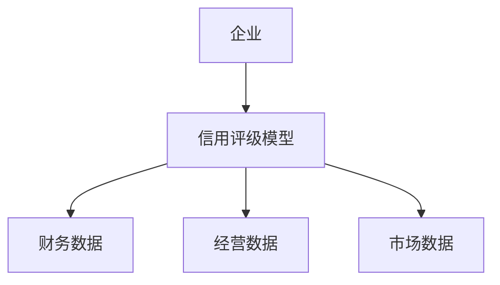
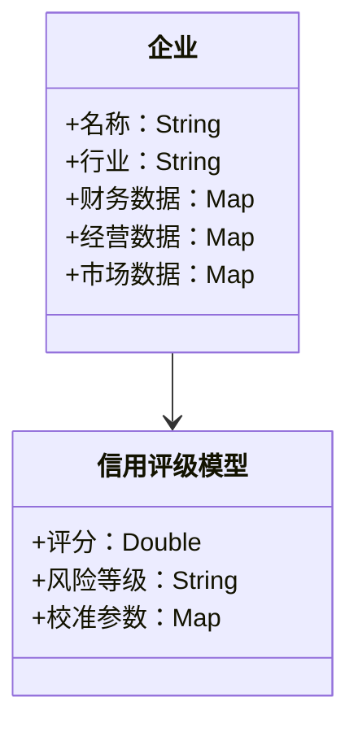
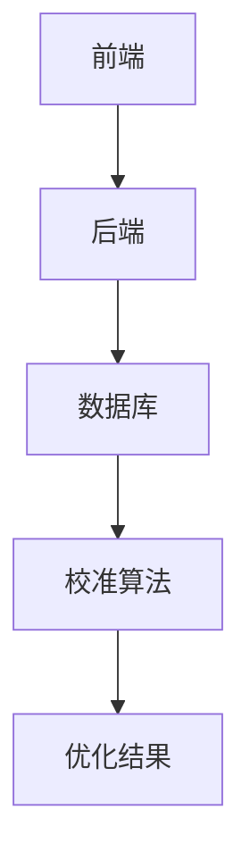
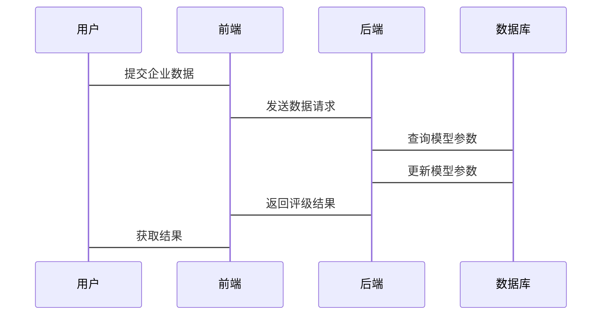

                 


# 设计智能化的企业信用评级模型校准系统

## 关键词：企业信用评级，模型校准，智能化系统，算法原理，系统架构，项目实战

## 摘要：本文详细探讨了设计智能化企业信用评级模型校准系统的核心概念、算法原理、系统架构及项目实现。通过分析传统信用评级模型的局限性，提出了一种基于机器学习的智能化校准方法，结合实际案例，展示了如何通过系统设计和优化实现更精准的企业信用评级。

---

## 第一章：企业信用评级模型校准系统概述

### 1.1 问题背景与描述

#### 1.1.1 企业信用评级的重要性
企业信用评级是衡量企业信用风险的重要指标，直接影响企业的融资成本和市场信任度。传统的信用评级模型通常基于财务数据和简单统计方法，难以捕捉企业的动态风险和复杂信用特征。

#### 1.1.2 传统信用评级模型的局限性
- 数据维度有限，难以反映企业的多维风险特征。
- 模型更新周期长，难以应对市场变化的实时性需求。
- 缺乏智能化校准机制，导致评级结果的准确性和一致性不足。

#### 1.1.3 智能化校准系统的必要性
通过引入机器学习和大数据分析技术，构建智能化校准系统，能够实时优化信用评级模型，提升评级结果的准确性和可靠性。

### 1.2 问题解决与边界

#### 1.2.1 校准系统的功能目标
- 实时收集和处理企业多维度数据。
- 基于机器学习算法优化信用评级模型。
- 提供动态、精准的信用评级结果。

#### 1.2.2 系统的边界与外延
- 系统边界：仅针对企业的信用评级模型校准，不涉及企业外部信用数据的采集。
- 系统外延：可扩展至供应链金融、风险评估等领域。

#### 1.2.3 核心要素与组成结构
- 数据输入：企业财务数据、经营数据、市场数据。
- 校准算法：机器学习算法、优化算法。
- 输出结果：优化后的信用评级模型、评级结果。

---

## 第二章：核心概念与联系

### 2.1 模型校准系统的核心原理

#### 2.1.1 模型校准的基本概念
模型校准是指通过调整模型参数或引入新数据，使得模型输出结果更接近真实值的过程。在信用评级中，校准的目标是使评级结果与实际信用风险更加一致。

#### 2.1.2 系统架构的属性特征对比
| 属性 | 传统信用评级模型 | 智能化校准系统 |
|------|------------------|----------------|
| 数据来源 | 单一维度数据    | 多维度实时数据 |
| 模型更新 | 定期更新        | 实时动态更新    |
| 精准度 | 较低            | 高              |

#### 2.1.3 ER实体关系图架构



---

## 第三章：算法原理与数学模型

### 3.1 算法原理

#### 3.1.1 梯度下降法
梯度下降法是一种常用的优化算法，用于最小化损失函数。在信用评级模型中，可以通过梯度下降法优化模型参数，使得预测评级结果与实际评级结果的误差最小。

#### 3.1.2 随机森林算法
随机森林是一种基于树模型的集成算法，能够有效处理高维数据和非线性关系。在信用评级中，随机森林可以用于特征选择和模型优化。

#### 3.1.3 XGBoost算法
XGBoost是一种高效的梯度提升算法，具有较高的计算效率和准确性。在信用评级中，XGBoost可以用于构建高精度的信用评级模型。

### 3.2 数学模型与公式

#### 3.2.1 损失函数
$$ L = \sum_{i=1}^{n} (y_i - \hat{y}_i)^2 $$

#### 3.2.2 梯度下降
$$ \theta = \theta - \eta \frac{\partial L}{\partial \theta} $$

#### 3.2.3 优化目标
$$ \min_{\theta} L(\theta) $$

---

## 第四章：系统分析与架构设计

### 4.1 系统功能设计

#### 4.1.1 领域模型


#### 4.1.2 系统架构设计


### 4.2 接口设计与交互流程

#### 4.2.1 接口设计
- 输入接口：企业数据输入接口、模型参数配置接口。
- 输出接口：评级结果输出接口、校准结果反馈接口。

#### 4.2.2 交互流程


---

## 第五章：项目实战

### 5.1 环境安装与配置

#### 5.1.1 安装Python环境
使用Anaconda安装Python 3.8及以上版本。

#### 5.1.2 安装依赖库
```bash
pip install numpy pandas scikit-learn xgboost
```

### 5.2 核心功能实现

#### 5.2.1 数据预处理
```python
import pandas as pd
import numpy as np

data = pd.read_csv('企业数据.csv')
data = data.dropna()
```

#### 5.2.2 模型训练与优化
```python
from sklearn.model_selection import train_test_split
from xgboost import XGBClassifier
from sklearn.metrics import accuracy_score

X_train, X_test, y_train, y_test = train_test_split(data.drop('评级结果', axis=1), data['评级结果'], test_size=0.2)
model = XGBClassifier()
model.fit(X_train, y_train)
```

#### 5.2.3 模型校准
```python
import xgboost as xgb

dtrain = xgb.DMatrix(X_train, label=y_train)
dtest = xgb.DMatrix(X_test, label=y_test)

params = {'n_estimators': 100, 'learning_rate': 0.05}
model = xgb.XGBClassifier(**params)
model.fit(X_train, y_train)
```

### 5.3 项目小结

通过实际案例，我们展示了如何基于XGBoost算法构建智能化的企业信用评级模型校准系统。通过数据预处理、模型训练和校准，最终实现了高精度的信用评级结果。

---

## 第六章：最佳实践与拓展

### 6.1 最佳实践 tips
- 数据清洗和特征工程是提升模型性能的关键。
- 模型校准需要结合业务场景进行参数调整。
- 系统设计应注重模块化和可扩展性。

### 6.2 小结
本文详细探讨了设计智能化企业信用评级模型校准系统的核心概念、算法原理、系统架构及项目实现。通过分析传统信用评级模型的局限性，提出了一种基于机器学习的智能化校准方法，结合实际案例，展示了如何通过系统设计和优化实现更精准的企业信用评级。

### 6.3 注意事项
- 数据隐私和安全问题需要高度重视。
- 模型的实时性和可解释性是未来研究的重要方向。

### 6.4 拓展阅读
- 《机器学习实战》
- 《深入理解XGBoost》
- 《企业信用评级与风险管理》

---

## 作者：AI天才研究院/AI Genius Institute & 禅与计算机程序设计艺术 /Zen And The Art of Computer Programming

