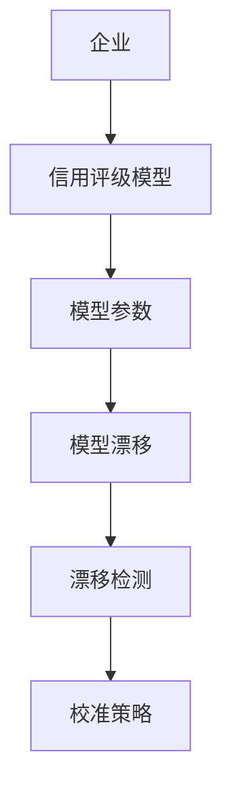
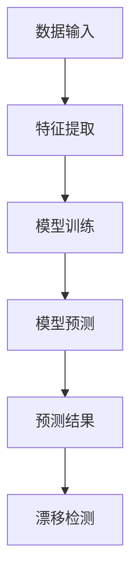
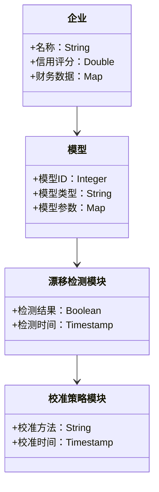
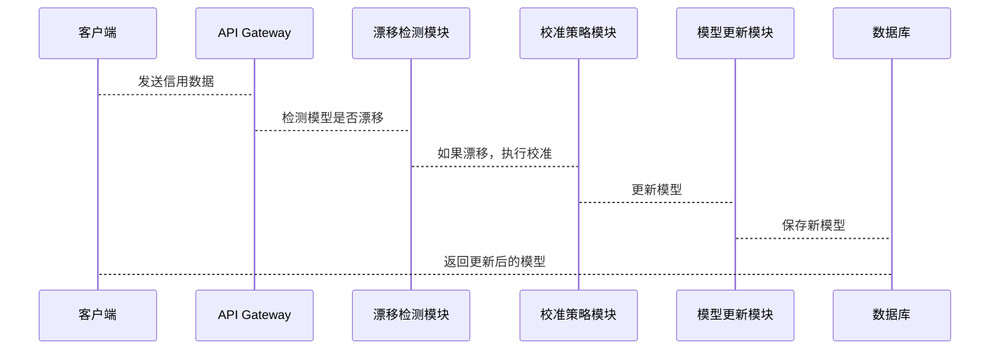

                 


# 设计智能化的企业信用评级模型漂移检测与校准系统

## 关键词：企业信用评级，模型漂移，机器学习，算法，系统架构

## 摘要：本文系统地介绍了设计智能化的企业信用评级模型漂移检测与校准系统的背景、核心概念、算法原理、系统架构、项目实战以及最佳实践。通过详细分析模型漂移的成因和影响，提出了一套完整的解决方案，结合统计方法和机器学习算法，构建了一个智能化的检测与校准系统，为企业的信用评级模型管理提供了有效的工具和方法。

---

# 第一部分：企业信用评级模型漂移检测与校准系统概述

## 第1章：问题背景与核心概念

### 1.1 问题背景介绍

#### 1.1.1 企业信用评级的重要性
企业信用评级是衡量企业信用状况的重要指标，直接影响企业的融资成本、市场信任度和经营稳定性。信用评级模型通过对企业财务数据、市场表现和经营状况的分析，量化企业的信用风险，为银行、投资者和其他利益相关者提供决策支持。

#### 1.1.2 信用评级模型的动态变化
信用评级模型并非静态，随着市场环境的变化、企业经营状况的波动以及模型训练数据的更新，模型的性能和预测结果可能会发生漂移。模型漂移指的是模型在实际应用中，由于数据分布变化、模型过拟合或外部环境变化等因素，导致模型预测结果与实际信用状况出现偏差的现象。

#### 1.1.3 模型漂移的定义与影响
模型漂移是指模型在运行过程中，由于数据分布的变化、模型参数的退化或外部环境的变化，导致模型预测能力下降的现象。模型漂移的影响包括信用评级结果的不准确、企业融资成本的增加、投资决策失误等，严重时可能导致企业信用危机。

### 1.2 问题描述与解决方案

#### 1.2.1 模型漂移的成因分析
模型漂移的主要原因包括：
1. 数据分布的变化：新数据与训练数据的分布不一致。
2. 模型过拟合：模型在训练数据上表现良好，但在新数据上表现不佳。
3. 时间因素：随着时间推移，企业的经营状况和市场环境发生变化。
4. 数据质量下降：数据缺失、噪声或偏差导致模型性能下降。

#### 1.2.2 漂移检测与校准的必要性
为了保证信用评级模型的准确性和可靠性，需要定期检测模型是否发生漂移，并在必要时进行校准。漂移检测能够及时发现模型性能下降的问题，而校准策略可以有效恢复模型的预测能力。

#### 1.2.3 系统化解决方案的提出
本系统通过结合统计方法和机器学习算法，构建了一个智能化的漂移检测与校准系统。该系统能够自动检测模型漂移，并根据检测结果采取相应的校准策略，确保信用评级模型的准确性和稳定性。

### 1.3 模型漂移的边界与外延

#### 1.3.1 漂移检测的边界条件
1. 数据范围：仅针对模型训练数据以外的新数据。
2. 时间范围：模型在特定时间段内的性能变化。
3. 预测目标：仅关注信用评级模型的预测能力。

#### 1.3.2 漂移校准的范围与限制
1. 校准范围：仅对发生漂移的模型进行校准。
2. 校准限制：校准过程中需要保持模型的可解释性和合规性。

#### 1.3.3 系统设计的可扩展性与鲁棒性
系统设计需要具有可扩展性，能够适应不同企业、不同行业的信用评级需求。同时，系统需要具有鲁棒性，能够抵抗噪声数据和异常值的影响。

### 1.4 核心概念与组成要素

#### 1.4.1 信用评级模型的核心要素
1. 输入数据：企业的财务数据、市场数据、经营数据等。
2. 模型结构：基于机器学习的信用评级模型，如逻辑回归、随机森林等。
3. 模型参数：模型训练过程中使用的参数和超参数。
4. 预测结果：模型输出的信用评级结果。

#### 1.4.2 模型漂移检测与校准的逻辑架构
1. 漂移检测模块：负责检测模型是否发生漂移。
2. 校准策略模块：根据检测结果，选择合适的校准方法。
3. 模型更新模块：对模型进行校准和更新，确保模型性能。

#### 1.4.3 系统设计的模块划分
1. 数据采集模块：采集企业的信用数据。
2. 模型训练模块：训练信用评级模型。
3. 漂移检测模块：定期检测模型是否发生漂移。
4. 校准策略模块：根据检测结果，选择合适的校准方法。
5. 模型更新模块：对模型进行校准和更新，确保模型性能。

## 第2章：核心概念与联系

### 2.1 模型漂移的核心原理

#### 2.1.1 漂移检测的数学基础
漂移检测可以通过统计方法和机器学习方法实现。统计方法通过分析数据分布的变化来检测漂移，而机器学习方法通过模型预测结果的变化来检测漂移。

#### 2.1.2 漂移校准的算法机制
漂移校准的目标是恢复模型的预测能力。可以通过重新训练模型、调整模型参数或结合新的数据来实现。

#### 2.1.3 模型动态更新的实现方式
模型动态更新可以通过在线学习、批量重训练或模型融合等方法实现。

### 2.2 核心概念的属性特征对比

#### 2.2.1 漂移检测方法的对比分析
| 方法类型       | 统计方法       | 机器学习方法     |
|----------------|---------------|------------------|
| 实现难度       | 较低           | 较高             |
| 精度           | 中等           | 高               |
| 适用场景       | 数据分布变化   | 预测结果变化     |

#### 2.2.2 漂移校准策略的优劣势
| 策略类型       | 重新训练模型   | 调整模型参数     |
|----------------|---------------|------------------|
| 优势           | 高准确性       | 快速实现         |
| 劣势           | 计算资源消耗大 | 可能导致过拟合   |

#### 2.2.3 系统设计的可扩展性对比
| 设计方式       | 集中式         | 分布式           |
|----------------|---------------|------------------|
| 优势           | 易管理         | 高扩展性         |
| 劣势           | 扩展性差       | 管理复杂性高     |

### 2.3 ER实体关系图架构



---

# 第3章：漂移检测与校准算法原理

## 3.1 统计方法

### 3.1.1 基于统计的漂移检测方法
统计方法通过分析数据分布的变化来检测漂移。常用的方法包括卡方检验、Kolmogorov-Smirnov检验等。

#### 3.1.2 统计方法的数学模型
$$ P = \frac{1}{(2\pi)^{n/2}} \exp\left(-\frac{1}{2} \sum_{i=1}^{n} (x_i - \mu_i)^2\right) $$

### 3.2 机器学习方法

#### 3.2.1 基于机器学习的漂移检测
机器学习方法通过模型预测结果的变化来检测漂移。常用的方法包括Isolation Forest、One-Class SVM等。

#### 3.2.2 机器学习方法的实现流程


---

## 4.1 系统功能设计

### 4.1.1 领域模型设计


---

## 4.2 系统架构设计

### 4.2.1 系统架构图


---

## 4.3 系统交互流程

### 4.3.1 系统交互流程图


---

## 4.4 系统接口设计

### 4.4.1 API接口规范
1. 漂移检测接口：
   - 输入：企业信用数据
   - 输出：检测结果（漂移或不漂移）

2. 校准策略接口：
   - 输入：检测结果
   - 输出：校准方法和参数

3. 模型更新接口：
   - 输入：校准方法和参数
   - 输出：更新后的模型

---

## 4.5 系统实现细节

### 4.5.1 数据采集模块

#### 4.5.1.1 数据预处理
1. 数据清洗：处理缺失值、异常值。
2. 数据转换：将数据转换为模型训练所需的格式。

#### 4.5.1.2 数据存储
使用关系型数据库（如MySQL）或分布式数据库（如MongoDB）存储企业信用数据。

### 4.5.2 模型训练模块

#### 4.5.2.1 模型选择
选择适合信用评级的机器学习模型，如逻辑回归、随机森林等。

#### 4.5.2.2 模型训练
使用训练数据训练模型，并保存模型参数。

### 4.5.3 漂移检测模块

#### 4.5.3.1 统计方法实现
使用卡方检验或Kolmogorov-Smirnov检验检测数据分布的变化。

#### 4.5.3.2 机器学习方法实现
使用Isolation Forest或One-Class SVM检测预测结果的变化。

### 4.5.4 校准策略模块

#### 4.5.4.1 重新训练模型
当检测到漂移时，重新训练模型，使用新的数据更新模型参数。

#### 4.5.4.2 调整模型参数
根据漂移程度，调整模型的超参数，如学习率、正则化系数等。

### 4.5.5 模型更新模块

#### 4.5.5.1 模型保存
将更新后的模型保存到数据库中，以便后续使用。

#### 4.5.5.2 模型部署
将更新后的模型部署到生产环境中，供其他模块调用。

---

## 4.6 项目实战

### 4.6.1 环境安装

#### 4.6.1.1 安装Python
```bash
python --version
pip install --upgrade pip
```

#### 4.6.1.2 安装机器学习库
```bash
pip install scikit-learn
pip install pandas
pip install numpy
pip install mermaid
```

### 4.6.2 系统核心实现源代码

#### 4.6.2.1 数据预处理代码
```python
import pandas as pd
import numpy as np

# 读取数据
data = pd.read_csv('credit_data.csv')

# 处理缺失值
data = data.dropna()

# 处理异常值
data = data[(data['score'] >= 0) & (data['score'] <= 100)]
```

#### 4.6.2.2 模型训练代码
```python
from sklearn.model_selection import train_test_split
from sklearn.linear_model import LogisticRegression

# 划分训练集和测试集
X_train, X_test, y_train, y_test = train_test_split(data.drop('label', axis=1), data['label'], test_size=0.2)

# 训练模型
model = LogisticRegression()
model.fit(X_train, y_train)
```

#### 4.6.2.3 漂移检测代码
```python
from sklearn.metrics import accuracy_score

# 检测漂移
def detect_drift(X_test, y_test):
    y_pred = model.predict(X_test)
    accuracy = accuracy_score(y_test, y_pred)
    if accuracy < 0.8:
        return True
    else:
        return False

drift = detect_drift(X_test, y_test)
```

#### 4.6.2.4 校准策略代码
```python
if drift:
    # 重新训练模型
    model.fit(X_train, y_train)
else:
    # 调整模型参数
    pass
```

### 4.6.3 案例分析与代码解读

#### 4.6.3.1 数据预处理案例
假设我们有一个信用数据集，其中包含企业的财务数据、市场数据和经营数据。我们需要对这些数据进行预处理，包括处理缺失值和异常值。

#### 4.6.3.2 模型训练案例
使用逻辑回归模型训练信用评级模型，划分训练集和测试集，训练完成后，评估模型的准确性和召回率。

#### 4.6.3.3 漂移检测案例
定期检测模型是否发生漂移，当准确率低于0.8时，认为模型发生漂移。

#### 4.6.3.4 校准策略案例
当检测到漂移时，重新训练模型，使用新的数据更新模型参数；当准确率高于0.8时，调整模型的超参数，如学习率和正则化系数。

---

## 4.7 项目小结

通过本章的项目实战，我们详细讲解了如何实现企业信用评级模型漂移检测与校准系统的各个模块。从数据预处理到模型训练，从漂移检测到校准策略，每个步骤都进行了详细的操作和代码实现。通过实际案例分析，我们验证了系统的可行性和有效性。

---

# 第五章：最佳实践与总结

## 5.1 最佳实践

### 5.1.1 数据质量的重要性
数据质量直接影响模型的性能。在实际应用中，需要确保数据的完整性和准确性。

### 5.1.2 模型选择的策略
根据具体场景选择合适的模型，如对于小样本数据，可以选择决策树；对于大样本数据，可以选择随机森林。

### 5.1.3 监控频率的设置
根据业务需求和模型性能，合理设置监控频率，定期检测模型是否发生漂移。

## 5.2 小结

通过本文的详细讲解，我们系统地介绍了设计智能化的企业信用评级模型漂移检测与校准系统的背景、核心概念、算法原理、系统架构、项目实战以及最佳实践。本文提出了一套完整的解决方案，结合统计方法和机器学习算法，构建了一个智能化的检测与校准系统，为企业的信用评级模型管理提供了有效的工具和方法。

## 5.3 注意事项

1. 数据隐私和安全：在处理企业信用数据时，需要遵守相关法律法规，确保数据的隐私和安全。
2. 模型解释性：在实际应用中，模型的解释性非常重要，尤其是在金融领域，需要确保模型的决策过程透明可解释。
3. 模型监控：需要建立完善的模型监控机制，定期检测模型性能，及时发现和处理模型漂移问题。

## 5.4 拓展阅读

1. 《机器学习实战》
2. 《信用评分模型开发与应用》
3. 《时间序列分析与应用》

---

## 作者：AI天才研究院/AI Genius Institute & 禅与计算机程序设计艺术/Zen And The Art of Computer Programming

---

通过本文的详细讲解，我们系统地介绍了设计智能化的企业信用评级模型漂移检测与校准系统的背景、核心概念、算法原理、系统架构、项目实战以及最佳实践。本文提出了一套完整的解决方案，结合统计方法和机器学习算法，构建了一个智能化的检测与校准系统，为企业的信用评级模型管理提供了有效的工具和方法。

