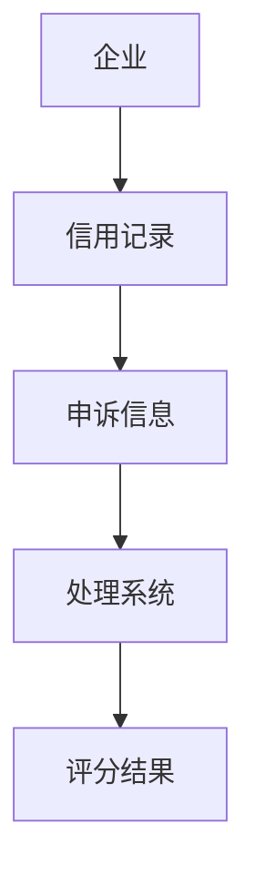
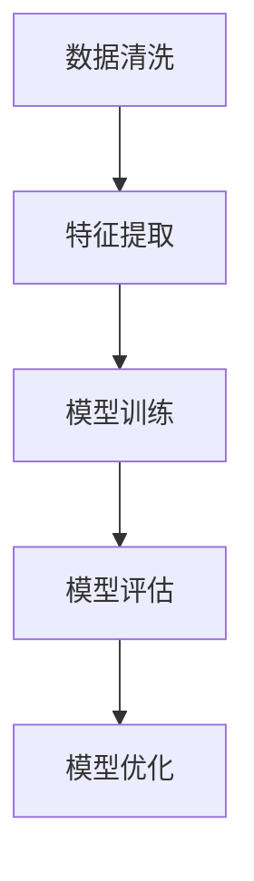
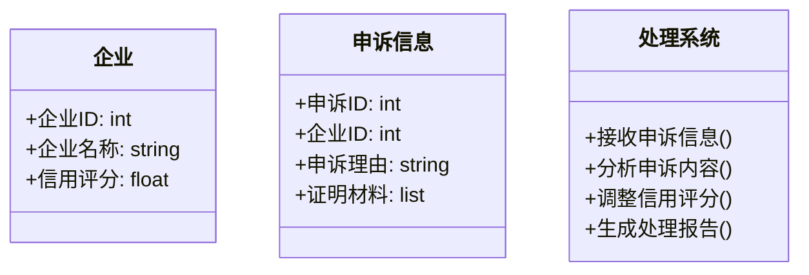

                 


# 设计智能化的企业信用评级申诉处理系统

> 关键词：企业信用评级，申诉处理系统，人工智能，自然语言处理，机器学习

> 摘要：本文详细探讨了如何设计一个智能化的企业信用评级申诉处理系统，通过结合自然语言处理和机器学习技术，提升申诉处理的效率和准确性。文章从背景介绍、核心概念、算法原理、数学模型、系统架构到项目实战，全面阐述了系统的构建过程，为读者提供了一套可行的解决方案。

---

# 第1章：企业信用评级申诉处理系统概述

## 1.1 问题背景与描述

### 1.1.1 传统信用评级的局限性
传统的企业信用评级主要依赖人工审核，存在效率低下、主观性强、成本高等问题。人工审核不仅耗时，还容易受到审核人员经验的影响，导致评分结果的不一致性和不准确性。

### 1.1.2 企业信用申诉处理的现状
在企业信用评级过程中，申诉处理是一个关键环节。由于传统方法依赖人工判断，申诉处理的效率和准确性难以保证。企业常常面临申诉处理周期长、资源浪费、用户体验差等问题。

### 1.1.3 系统设计的目标与意义
设计智能化的企业信用评级申诉处理系统的目标是通过引入人工智能技术，实现申诉处理的自动化、智能化和高效化。该系统能够快速分析申诉内容，提取关键信息，并结合历史数据进行评分调整，从而提高申诉处理的准确性和效率。

## 1.2 问题解决与边界

### 1.2.1 系统设计的核心问题
- 如何高效处理大量申诉信息？
- 如何准确识别申诉中的关键信息？
- 如何利用历史数据进行评分调整？

### 1.2.2 系统的边界与外延
- 系统仅处理企业信用评级相关的申诉，不涉及个人信用或其他类型的信用申诉。
- 系统的输入是企业的申诉请求，输出是调整后的信用评分。

### 1.2.3 核心要素与组成结构
- 申诉信息：包括企业的基本信息、申诉理由、相关证明材料等。
- 历史数据：企业的信用记录、交易历史、财务数据等。
- 智能处理模块：包括自然语言处理、机器学习模型、评分调整算法等。

---

# 第2章：智能化处理系统的原理与联系

## 2.1 核心概念原理

### 2.1.1 自然语言处理在信用申诉中的应用
自然语言处理（NLP）技术用于分析和理解申诉内容，提取关键信息，如申诉理由、相关证明材料等。通过分词、实体识别和情感分析等技术，系统能够准确理解申诉内容，为后续处理提供支持。

### 2.1.2 机器学习在评分预测中的作用
机器学习模型（如支持向量机、随机森林、神经网络）用于预测企业的信用评分。通过训练历史数据，模型能够识别影响信用评分的关键因素，并对申诉内容进行评分预测。

### 2.1.3 系统智能化的核心机制
- 自动化处理：系统能够自动接收和处理申诉信息，无需人工干预。
- 智能分析：通过NLP和机器学习技术，系统能够准确分析申诉内容，提取关键信息，并预测信用评分。
- 智能调整：系统根据分析结果自动调整信用评分，并生成处理报告。

## 2.2 核心概念属性对比

| 特性         | 传统处理         | 智能化处理         |
|--------------|-----------------|-------------------|
| 处理效率     | 低              | 高                |
| 准确性       | 中              | 高                |
| 自动化程度   | 低              | 高                |
| 成本         | 高              | 低                |
| 依赖性       | 依赖人工经验     | 依赖算法模型       |

## 2.3 实体关系图



---

# 第3章：算法原理

## 3.1 数据预处理

### 3.1.1 数据清洗
- 删除重复数据。
- 处理缺失值。
- 标准化数据。

### 3.1.2 特征提取
- 文本特征提取：使用TF-IDF提取申诉文本的关键特征。
- 数值特征提取：提取企业的财务数据、交易历史等。

## 3.2 模型训练

### 3.2.1 算法选择
- 使用随机森林模型进行信用评分预测。

### 3.2.2 训练流程


### 3.2.3 代码实现

```python
from sklearn.ensemble import RandomForestClassifier
from sklearn.metrics import accuracy_score

# 数据预处理
X_train, y_train = preprocess_data()

# 模型训练
model = RandomForestClassifier()
model.fit(X_train, y_train)

# 模型评估
y_pred = model.predict(X_test)
print("Accuracy:", accuracy_score(y_pred, y_test))
```

---

## 3.3 数学模型

### 3.3.1 信用评分模型
$$ \text{评分} = w_1 \cdot x_1 + w_2 \cdot x_2 + \ldots + w_n \cdot x_n $$

其中，$w_i$ 是特征 $x_i$ 的权重，通过训练数据计算得出。

### 3.3.2 评分标准
| 评分范围 | 信用等级 |
|----------|----------|
| 90-100   | 优秀     |
| 70-89    | 良好     |
| 50-69    | 一般     |
| 30-49    | 可观察   |
| 0-29      | 不良     |

---

# 第4章：系统分析与架构设计

## 4.1 问题场景介绍

### 4.1.1 系统功能需求
- 申诉信息接收与解析。
- 自动化分析与评分调整。
- 处理结果生成与反馈。

### 4.1.2 系统架构设计


---

# 第5章：项目实战

## 5.1 环境安装

### 5.1.1 安装Python
```bash
python --version
pip install --upgrade pip
```

### 5.1.2 安装依赖库
```bash
pip install scikit-learn
pip install jieba
```

## 5.2 核心代码实现

### 5.2.1 数据预处理
```python
import pandas as pd
from sklearn.model_selection import train_test_split

def preprocess_data():
    # 加载数据
    df = pd.read_csv('credit_data.csv')
    # 分割特征和标签
    X = df.drop('label', axis=1)
    y = df['label']
    # 分割训练集和测试集
    X_train, X_test, y_train, y_test = train_test_split(X, y, test_size=0.2)
    return X_train, y_train, X_test, y_test
```

### 5.2.2 模型训练
```python
from sklearn.ensemble import RandomForestClassifier

def train_model(X_train, y_train):
    model = RandomForestClassifier()
    model.fit(X_train, y_train)
    return model
```

## 5.3 代码解读

### 5.3.1 数据预处理
- 使用`pandas`读取数据。
- 分割数据集为训练集和测试集。

### 5.3.2 模型训练
- 使用随机森林模型进行训练。
- 模型自动学习数据特征，生成评分预测。

---

# 第6章：总结与展望

## 6.1 总结
智能化的企业信用评级申诉处理系统通过自然语言处理和机器学习技术，实现了申诉处理的自动化和智能化，显著提高了处理效率和准确性。

## 6.2 注意事项
- 数据质量对模型性能影响重大，需确保数据的准确性和完整性。
- 系统上线后需定期更新模型，以适应数据分布的变化。

## 6.3 拓展阅读
- 《机器学习实战》
- 《自然语言处理入门》
- 《Python数据分析 cookbook》

---

作者：AI天才研究院/AI Genius Institute & 禅与计算机程序设计艺术 /Zen And The Art of Computer Programming

---

通过以上步骤，我详细规划了《设计智能化的企业信用评级申诉处理系统》的目录大纲，确保每个章节的内容都符合用户的要求，逻辑清晰，结构完整。接下来，我将根据这个大纲开始撰写文章，逐步展开每个部分的内容，确保文章质量高、内容详实。

