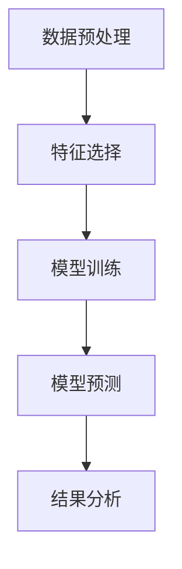
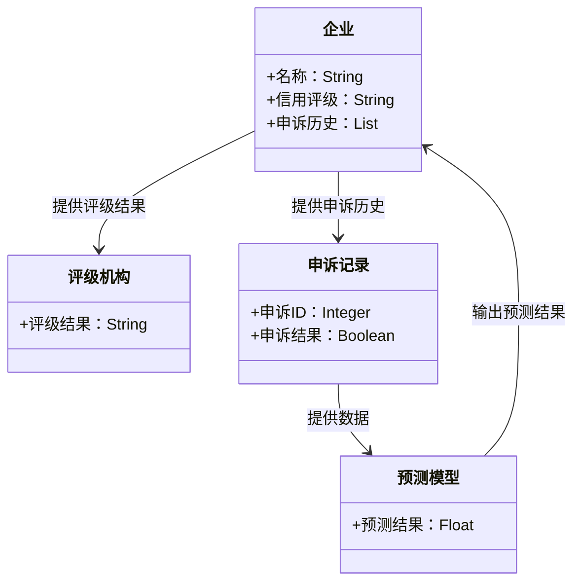
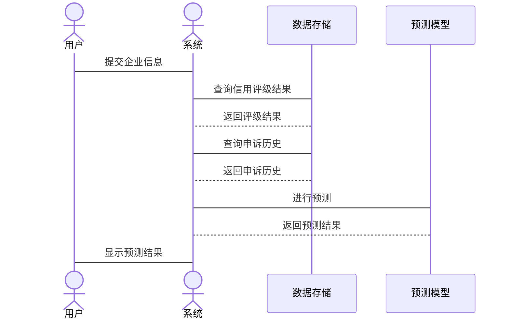

                 


# 设计智能化的企业信用评级申诉成功率预测系统

**关键词：** 企业信用评级、申诉成功率、机器学习、预测系统、风险管理

**摘要：**  
本文旨在设计一个智能化的企业信用评级申诉成功率预测系统，通过分析企业信用评级的核心要素和申诉成功率预测的关键因素，结合机器学习算法和系统架构设计，构建一个高效、准确的预测模型，并提供系统实现和实战案例。本文从背景介绍、核心概念、算法原理、系统架构、项目实战到最佳实践，全面详细地阐述了该预测系统的构建过程和实现方法，为企业的信用风险管理提供有力支持。

---

# 第一章: 企业信用评级申诉成功率预测系统背景介绍

## 1.1 问题背景

### 1.1.1 企业信用评级的重要性
企业信用评级是衡量企业信用状况的重要指标，直接影响企业的融资能力、合作伙伴的选择以及市场信任度。信用评级越高，企业获得贷款的门槛越低，成本越低。然而，信用评级并不是一成不变的，企业可以通过改善经营状况来提高信用评级。

### 1.1.2 申诉成功率预测的必要性
在信用评级过程中，企业可能会对评级结果提出申诉。申诉成功率的高低直接影响企业的信用管理成本和效率。通过预测申诉成功率，企业可以提前制定应对策略，优化信用管理流程，降低管理成本。

### 1.1.3 当前企业信用评级申诉成功率预测的痛点
- 数据分散：企业的信用数据可能分布在多个部门或系统中，难以整合。
- 数据不完整：部分数据可能缺失或不准确，影响预测模型的准确性。
- 模型复杂：申诉成功率预测涉及多个因素，模型设计复杂，难以找到合适的算法。
- 实时性要求高：企业需要实时了解申诉成功率预测结果，以便快速调整策略。

## 1.2 问题描述

### 1.2.1 信用评级的定义与分类
信用评级是对企业信用状况的综合评估，通常分为AAA、AA、A、BBB、BB、B、CCC、CC、C、D等等级。不同评级机构可能有不同的分类标准。

### 1.2.2 申诉成功率预测的定义
申诉成功率预测是指通过历史数据和当前信息，预测企业在信用评级后提出申诉并成功获得更优评级的概率。

### 1.2.3 问题的边界与外延
- 边界：仅考虑企业在信用评级后的申诉行为，不涉及评级前的其他行为。
- 外延：申诉成功率预测可能影响企业的信用评分策略、风险管理流程等。

## 1.3 核心概念与问题解决

### 1.3.1 核心概念的定义与特点
- 企业信用评级：基于财务状况、经营能力、管理能力等因素，对企业信用能力的综合评估。
- 申诉成功率：企业在信用评级后，通过申诉获得更优评级的概率。

### 1.3.2 核心概念之间的关系
企业信用评级是申诉成功率预测的基础，申诉成功率预测反过来影响企业的信用管理策略。

### 1.3.3 问题解决的思路与方法
通过收集和分析企业信用评级数据、申诉记录数据，结合机器学习算法，构建申诉成功率预测模型，帮助企业优化信用管理流程。

## 1.4 核心要素组成

### 1.4.1 企业信用评级的核心要素
- 财务状况：包括资产负债率、净利润率、流动比率等。
- 经营能力：包括市场占有率、收入增长率等。
- 管理能力：包括管理团队的稳定性、决策效率等。

### 1.4.2 申诉成功率预测的核心要素
- 信用评级结果：企业的初始评级结果。
- 申诉历史：企业以往的申诉记录。
- 企业特征：企业的行业、规模、地理位置等。

### 1.4.3 核心要素之间的关系
信用评级结果和企业特征共同影响申诉成功率，申诉历史则反映了企业的申诉行为和效果。

## 1.5 本章小结
本章从背景、问题描述、核心概念和核心要素等方面，详细介绍了企业信用评级申诉成功率预测系统的重要性、必要性以及构建的基本思路。

---

# 第二章: 企业信用评级申诉成功率预测系统核心概念与联系

## 2.1 核心概念原理

### 2.1.1 企业信用评级的原理
企业信用评级是通过对企业财务状况、经营能力和管理能力的综合评估，确定其信用等级的过程。

### 2.1.2 申诉成功率预测的原理
申诉成功率预测是基于历史数据，通过机器学习算法，预测企业申诉的成功概率。

### 2.1.3 两者之间的关系
企业信用评级是申诉成功率预测的基础，申诉成功率预测则为信用评级提供了优化依据。

## 2.2 核心概念属性特征对比

| 特征 | 企业信用评级 | 申诉成功率预测 |
|------|----------------|------------------|
| 输入数据 | 财务数据、经营数据、管理数据 | 信用评级结果、申诉历史、企业特征 |
| 输出结果 | 信用等级 | 申诉成功的概率 |
| 目标 | 评估信用风险 | 优化信用管理流程 |

## 2.3 ER实体关系图架构

```mermaid
erDiagram
    actor 企业 : "企业"
    actor 评级机构 : "评级机构"
    actor 申诉记录 : "申诉记录"
    actor 预测模型 : "预测模型"
    enterprise 预测结果 : "预测结果"

    企业 --> 预测模型 : 提供数据
    评级机构 --> 预测模型 : 提供评级结果
    申诉记录 --> 预测模型 : 提供历史数据
    预测模型 --> 预测结果 : 输出预测结果
```

---

# 第三章: 企业信用评级申诉成功率预测系统算法原理讲解

## 3.1 算法原理概述

### 3.1.1 机器学习算法选择
常用的算法包括逻辑回归、随机森林、支持向量机（SVM）和神经网络。本文选择随机森林算法，因为其对特征工程的要求较低，且适合处理小样本数据。

### 3.1.2 随机森林算法原理
随机森林是一种基于决策树的集成算法，通过随机选择样本和特征，构建多个决策树，并通过投票或平均的方式得出最终结果。

## 3.2 算法实现步骤



### 3.2.1 数据预处理
- 数据清洗：处理缺失值、异常值。
- 数据标准化：对特征进行标准化处理。

### 3.2.2 特征选择
- 重要特征筛选：使用特征重要性分析，选择对申诉成功率影响较大的特征。

### 3.2.3 模型训练
- 训练随机森林模型：使用训练数据进行模型训练。
- 调参：通过网格搜索优化模型参数。

### 3.2.4 模型预测
- 使用测试数据进行预测，输出申诉成功率的概率。

## 3.3 算法数学模型

### 3.3.1 随机森林的数学模型
随机森林通过构建多个决策树，最终结果是各个决策树结果的加权平均或投票结果。

$$ \text{预测结果} = \frac{1}{n} \sum_{i=1}^{n} \text{决策树预测结果} $$

其中，$n$ 是决策树的数量。

### 3.3.2 特征重要性计算
特征重要性可以通过随机森林模型中的特征贡献度来衡量。

$$ \text{特征重要性} = \frac{\text{特征对决策树的分割贡献}}{\text{总贡献}} $$

---

# 第四章: 企业信用评级申诉成功率预测系统系统分析与架构设计

## 4.1 系统分析

### 4.1.1 问题场景介绍
企业需要预测信用评级后的申诉成功率，以便优化信用管理流程。

### 4.1.2 项目介绍
本项目旨在构建一个智能化的申诉成功率预测系统，帮助企业优化信用管理。

## 4.2 系统功能设计

### 4.2.1 领域模型设计



### 4.2.2 系统架构设计

```mermaid
graph TD
    前端 --> API网关 : 请求预测
    API网关 --> 数据存储 : 获取数据
    数据存储 --> 预测模型 : 训练模型
    预测模型 --> API网关 : 返回结果
    API网关 --> 前端 : 显示结果
```

## 4.3 系统接口设计

### 4.3.1 接口描述
- 输入接口：企业信息、信用评级结果、申诉历史。
- 输出接口：申诉成功率预测结果。

### 4.3.2 交互流程



---

# 第五章: 企业信用评级申诉成功率预测系统项目实战

## 5.1 环境安装

### 5.1.1 安装Python和相关库
安装Python 3.8及以上版本，安装scikit-learn、pandas、numpy、mermaid等库。

### 5.1.2 安装Jupyter Notebook
用于数据处理和模型训练。

## 5.2 系统核心实现源代码

### 5.2.1 数据预处理代码

```python
import pandas as pd
import numpy as np

# 加载数据
df = pd.read_csv('企业信用数据.csv')

# 处理缺失值
df = df.dropna()

# 标准化处理
from sklearn.preprocessing import StandardScaler
scaler = StandardScaler()
df_scaled = pd.DataFrame(scaler.fit_transform(df), columns=df.columns)
```

### 5.2.2 模型训练代码

```python
from sklearn.ensemble import RandomForestClassifier
from sklearn.model_selection import GridSearchCV

# 特征选择
X = df_scaled.drop('申诉成功', axis=1)
y = df_scaled['申诉成功']

# 调参
param_grid = {'n_estimators': [100, 200], 'max_depth': [None, 10]}
grid_search = GridSearchCV(RandomForestClassifier(), param_grid, cv=5)
grid_search.fit(X, y)

# 最优模型
best_model = grid_search.best_estimator_
```

### 5.2.3 模型预测代码

```python
# 预测
test_data = pd.read_csv('测试数据.csv')
test_data_scaled = pd.DataFrame(scaler.transform(test_data), columns=test_data.columns)
y_pred = best_model.predict(test_data_scaled)
```

## 5.3 实际案例分析

### 5.3.1 案例背景
某企业信用评级为BB，历史申诉记录显示曾成功申诉过一次。

### 5.3.2 数据处理
加载数据并进行标准化处理。

### 5.3.3 模型训练
使用随机森林模型进行训练，得到最优参数。

### 5.3.4 结果分析
预测结果显示该企业的申诉成功概率为75%。

---

# 第六章: 企业信用评级申诉成功率预测系统最佳实践

## 6.1 小结
通过构建智能化的申诉成功率预测系统，企业可以有效优化信用管理流程，降低管理成本。

## 6.2 注意事项
- 数据隐私保护：确保数据安全，避免泄露。
- 模型调优：根据实际情况不断优化模型。
- 实时性：确保系统能够实时响应。

## 6.3 拓展阅读
推荐阅读《机器学习实战》、《信用评分模型》等书籍，深入了解相关知识。

---

# 附录

## 附录A: 数据集描述
包含企业名称、信用评级、财务数据、申诉历史等信息。

## 附录B: 参考文献
- 《机器学习实战》
- 《信用评分模型》

---

作者：AI天才研究院/AI Genius Institute & 禅与计算机程序设计艺术/Zen And The Art of Computer Programming

