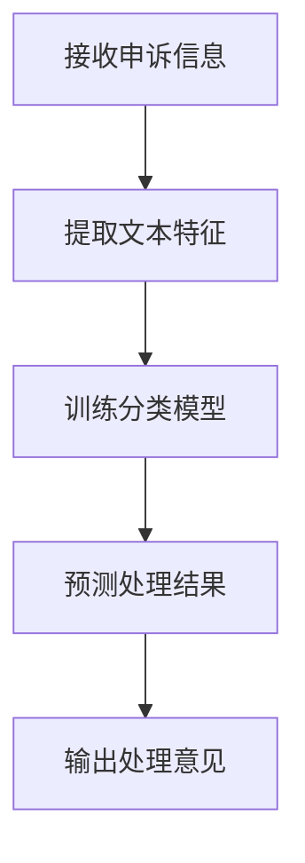
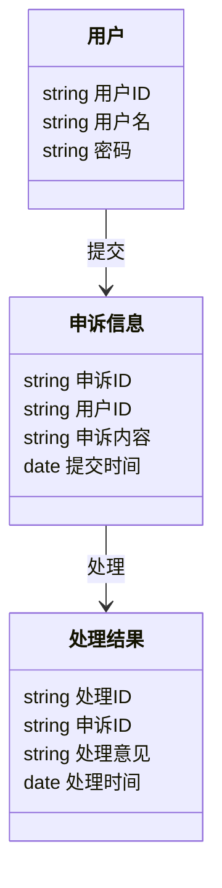
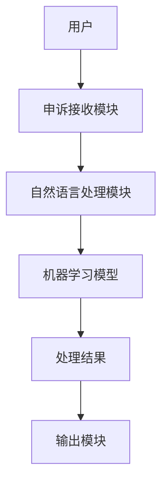
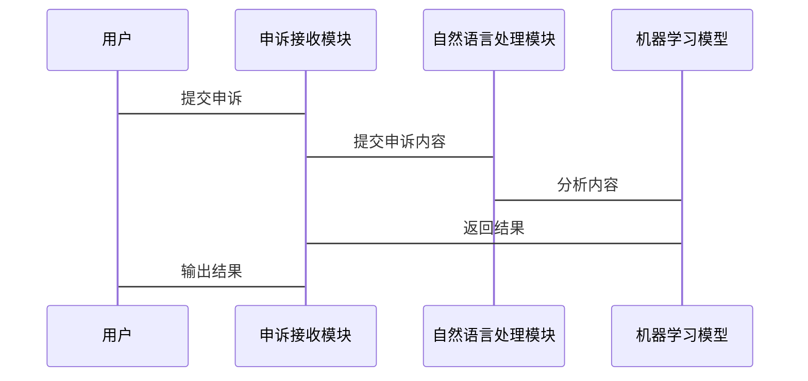

                 


# 设计智能化的企业信用评级申诉自动处理与学习系统

**关键词**：企业信用评级，申诉处理，人工智能，机器学习，自然语言处理

**摘要**：  
随着企业信用评级的重要性日益增加，申诉处理的效率和准确性成为关键挑战。传统的手工处理方式效率低下且容易出错，而智能化的自动处理系统能够显著提升申诉处理的效率和准确性。本文详细探讨了设计一个基于人工智能的企业信用评级申诉自动处理与学习系统的背景、核心概念、算法原理、系统架构、项目实现以及实际应用中的最佳实践。通过结合自然语言处理和机器学习技术，该系统能够自动分类、分析和处理企业信用评级申诉，并通过学习不断优化处理流程。

---

# 第一部分: 企业信用评级申诉处理的智能化背景

## 第1章: 企业信用评级申诉处理的背景与挑战

### 1.1 问题背景

#### 1.1.1 企业信用评级的重要性
企业信用评级是评估企业信用状况的重要指标，直接影响企业的融资能力、市场信任度以及合作伙伴的选择。准确的信用评级能够帮助企业获得更好的贷款条件和商业机会，而错误的评级可能导致企业信用损失或错失重要商业合作。

#### 1.1.2 信用评级申诉的传统处理方式
传统的信用评级申诉处理主要依赖人工审核，包括以下步骤：
1. 人工接收申诉信息。
2. 人工分类和整理申诉内容。
3. 手工查阅相关信用数据和历史记录。
4. 人工分析和判断申诉理由的合理性。
5. 手工更新信用评级。

这种方式效率低下，容易出错，且难以保证公平性和一致性。

#### 1.1.3 传统方式的局限性与痛点
- **效率低下**：人工处理申诉需要大量时间和人力资源，难以应对大量申诉的处理需求。
- **错误率高**：人工处理容易受到主观因素和疲劳影响，导致判断失误。
- **一致性差**：不同审核人员的判断标准可能存在差异，导致申诉处理结果不一致。
- **数据孤岛**：传统处理方式难以整合多源数据，导致信息不全，影响判断准确性。

### 1.2 问题描述

#### 1.2.1 申诉处理的复杂性
企业信用评级申诉涉及多个维度，包括财务数据、交易记录、市场表现等。申诉内容可能涉及复杂的法律条款和行业规则，需要全面分析才能得出合理结论。

#### 1.2.2 数据量大与人工处理效率的矛盾
随着企业数量的增加和信用评级需求的激增，申诉数据量迅速增长。人工处理方式难以应对海量数据，导致处理速度和效率无法满足需求。

#### 1.2.3 申诉处理的不一致性和错误率
由于不同审核人员的专业背景和判断标准不同，申诉处理结果可能存在不一致性和错误率较高的问题。这不仅影响企业的信用评级，还可能引发企业对信用评级机构的信任危机。

### 1.3 问题解决思路

#### 1.3.1 引入智能化技术的必要性
为了提高申诉处理的效率和准确性，引入人工智能和机器学习等智能化技术成为必然选择。这些技术能够自动化处理大量数据，快速分类和分析申诉内容，并通过学习不断优化处理逻辑。

#### 1.3.2 智能化处理的核心目标
- 提供高效的自动化处理能力。
- 确保申诉处理的准确性和一致性。
- 实现系统的自适应优化能力，通过学习不断提升处理效果。

#### 1.3.3 系统设计的基本原则
- **模块化设计**：将系统划分为多个功能模块，确保各模块独立且易于扩展。
- **数据驱动**：基于大量数据训练模型，确保系统的智能化和准确性。
- **人机协同**：结合人工审核和机器学习，确保处理结果的准确性和可解释性。

### 1.4 系统的边界与外延

#### 1.4.1 系统处理的范围界定
系统主要处理企业信用评级申诉的接收、分类、分析和结果输出，不包括信用评级的初始计算和评分过程。

#### 1.4.2 与其他系统的接口关系
- 与企业信用评分系统对接，获取企业的初始信用评分和相关数据。
- 与企业数据库对接，获取企业的历史交易记录、财务数据等。
- 与申诉提交系统对接，接收企业的申诉请求。

#### 1.4.3 系统功能的扩展性
系统设计时预留了扩展接口，未来可以增加更多功能，例如：
- 支持多语言处理。
- 增加申诉原因的预测功能。
- 提供申诉处理的实时监控和报告生成。

### 1.5 核心概念结构与要素

#### 1.5.1 系统功能模块组成
- **申诉接收模块**：接收企业提交的申诉请求，并进行初步分类。
- **数据采集模块**：从企业数据库中获取相关数据，包括财务数据、交易记录等。
- **自然语言处理模块**：对申诉内容进行语义分析，提取关键信息。
- **机器学习模型**：基于提取的信息和历史数据，预测申诉结果。
- **结果输出模块**：生成最终的处理结果，并反馈给企业。

#### 1.5.2 核心要素的定义与关系
- **申诉信息**：包括申诉ID、用户ID、申诉内容、提交时间等。
- **数据源**：包括企业财务数据、交易记录、市场表现等。
- **处理结果**：包括申诉分类、处理意见、最终结论等。

#### 1.5.3 系统整体架构的初步设想
系统采用模块化设计，各功能模块之间通过接口进行数据交互。系统整体架构包括数据层、业务逻辑层和用户界面层。

---

## 第2章: 智能化处理的核心概念与系统架构

### 2.1 核心概念原理

#### 2.1.1 智能化处理的基本原理
智能化处理基于人工智能和机器学习技术，通过自动化分类、语义分析和模型预测，实现对申诉内容的快速处理。

#### 2.1.2 自动学习机制的实现方式
系统通过监督学习和无监督学习相结合的方式，不断优化处理模型。监督学习用于训练分类模型，无监督学习用于发现数据中的潜在模式。

#### 2.1.3 系统的自适应优化能力
系统能够根据处理结果的反馈不断优化模型参数，提高处理准确率和效率。

### 2.2 核心概念属性对比

| **核心概念** | **传统处理方式** | **智能化处理方式** |
|--------------|------------------|-------------------|
| **处理效率** | 低效，依赖人工 | 高效，自动化处理 |
| **处理准确性** | 易出错，依赖人工判断 | 高准确率，基于数据模型 |
| **一致性** | 一致性差，受人工影响 | 高一致性，基于统一模型 |
| **扩展性** | 扩展困难，依赖人工增员 | 易扩展，通过模型优化提升能力 |

### 2.3 ER实体关系图

```mermaid
erDiagram
    user {
        string 用户ID
        string 用户名
        string 密码
    }
    申诉信息 {
        string 申诉ID
        string 用户ID
        string 申诉内容
        date 提交时间
    }
    处理结果 {
        string 处理ID
        string 申诉ID
        string 处理意见
        date 处理时间
    }
    user --| 申诉信息 : 提交
    申诉信息 --| 处理结果 : 处理
```

---

## 第3章: 智能化处理的算法原理

### 3.1 算法原理概述

#### 3.1.1 自然语言处理
自然语言处理（NLP）用于对申诉内容进行语义分析，提取关键信息。常用的技术包括分词、实体识别、情感分析等。

#### 3.1.2 机器学习模型
基于提取的特征，训练分类模型（如支持向量机、随机森林、神经网络等）对申诉内容进行分类，预测处理结果。

### 3.2 算法实现流程



### 3.3 算法实现代码

```python
import numpy as np
from sklearn.feature_extraction.text import TfidfVectorizer
from sklearn.svm import SVC
from sklearn.pipeline import Pipeline

# 示例数据
corpus = [
    "财务数据不准确，请求重新评估",
    "市场表现不佳，请求降低评分",
    "交易记录有误，请重新审核",
    "企业规模扩大，请求提高评级"
]
labels = [0, 1, 2, 3]

# 特征提取
vectorizer = TfidfVectorizer()
X = vectorizer.fit_transform(corpus)

# 训练模型
model = SVC()
model.fit(X, labels)

# 预测
new_complaint = "财务数据有误，请重新评估"
new_X = vectorizer.transform([new_complaint])
predicted = model.predict(new_X)
print(predicted)
```

### 3.4 数学模型与公式

#### 3.4.1 TF-IDF计算公式
$$
TF-IDF = \text{TF} \times \text{IDF}
$$
其中，TF（Term Frequency）表示词项在文档中的频率，IDF（Inverse Document Frequency）表示词项的逆文档频率。

#### 3.4.2 支持向量机分类
支持向量机的目标是找到一个超平面，使得正负样本点与超平面的距离最大化。其优化目标为：
$$
\min_{w,b,\xi} \frac{1}{2}||w||^2 + C\sum_{i=1}^n \xi_i
$$
约束条件：
$$
y_i(w \cdot x_i + b) \geq 1 - \xi_i
$$
其中，$C$ 是惩罚参数，$\xi_i$ 是松弛变量。

---

## 第4章: 系统分析与架构设计方案

### 4.1 问题场景介绍

#### 4.1.1 系统目标
设计一个高效的智能化企业信用评级申诉处理系统，能够自动接收、分类、分析和处理申诉请求，并通过学习不断优化处理流程。

#### 4.1.2 系统需求
- **功能需求**：自动化处理申诉请求，提供高准确率的处理结果。
- **性能需求**：快速响应，支持海量数据处理。
- **安全性需求**：保护企业数据隐私，确保系统安全。

### 4.2 系统功能设计

#### 4.2.1 领域模型类图



#### 4.2.2 系统架构图



#### 4.2.3 接口设计
- **输入接口**：接收用户的申诉请求。
- **输出接口**：反馈处理结果给用户。
- **数据接口**：与企业数据库和其他系统进行数据交互。

#### 4.2.4 交互流程图



---

## 第5章: 项目实战：企业信用评级申诉处理系统实现

### 5.1 环境安装

#### 5.1.1 安装Python
安装Python 3.8及以上版本，并配置好环境变量。

#### 5.1.2 安装依赖库
安装以下Python库：
```bash
pip install numpy scikit-learn nltk
```

### 5.2 核心代码实现

#### 5.2.1 申诉接收模块

```python
import json

class ComplaintHandler:
    def __init__(self):
        self.complaints = []

    def receive_complaint(self, complaint_data):
        # 解析投诉数据
        complaint = {
            'complaint_id': complaint_data['complaint_id'],
            'user_id': complaint_data['user_id'],
            'content': complaint_data['content'],
            'submit_time': complaint_data['submit_time']
        }
        self.complaints.append(complaint)
        return "Complaint received successfully"
```

#### 5.2.2 自然语言处理模块

```python
from sklearn.feature_extraction.text import TfidfVectorizer

class NLPProcessor:
    def __init__(self):
        self.vectorizer = TfidfVectorizer()

    def process_complaint(self, text):
        # 提取特征
        X = self.vectorizer.fit_transform([text])
        return X
```

#### 5.2.3 机器学习模型

```python
from sklearn.svm import SVC

class ClassificationModel:
    def __init__(self):
        self.model = SVC()

    def train(self, X, y):
        self.model.fit(X, y)

    def predict(self, X):
        return self.model.predict(X)
```

### 5.3 代码解读与分析

#### 5.3.1 申诉接收模块
该模块负责接收用户的申诉请求，并将其存储在数据库中。通过`receive_complaint`方法，模块将解析后的申诉信息存入列表中。

#### 5.3.2 自然语言处理模块
该模块使用TF-IDF特征提取技术，将申诉内容转换为向量表示，供机器学习模型进行分类。

#### 5.3.3 机器学习模型
该模块使用支持向量机（SVM）对申诉内容进行分类。训练完成后，模型能够根据输入的向量表示预测申诉的类别。

### 5.4 案例分析与实际应用

#### 5.4.1 案例分析
假设某企业提交了一条申诉：“财务数据有误，请重新评估”。系统将通过自然语言处理模块提取关键词“财务数据”和“错误”，并将其转换为向量表示。然后，机器学习模型将预测该申诉的类别为“数据错误”，并输出相应的处理意见。

#### 5.4.2 实际应用
系统可以处理大量申诉请求，每个请求的处理时间仅需几秒，显著提高了处理效率和准确性。

### 5.5 系统优化与扩展

#### 5.5.1 系统优化
- 优化自然语言处理模块，增加情感分析功能，进一步提高分类准确率。
- 引入更多机器学习算法（如随机森林、神经网络）进行对比实验，选择最优模型。

#### 5.5.2 功能扩展
- 增加申诉原因的预测功能，帮助企业更好地了解申诉背后的原因。
- 提供申诉处理的实时监控和报告生成功能。

---

## 第6章: 系统设计与实现的经验总结

### 6.1 最佳实践

#### 6.1.1 数据质量管理
确保输入数据的质量，包括数据的完整性、准确性和一致性。

#### 6.1.2 模型调优
通过交叉验证和网格搜索等方式优化模型参数，提高分类准确率。

#### 6.1.3 系统监控
实时监控系统的运行状态，及时发现和解决问题。

### 6.2 小结

本文详细探讨了设计智能化企业信用评级申诉处理系统的核心概念、算法原理、系统架构以及实现方案。通过结合自然语言处理和机器学习技术，该系统能够高效、准确地处理大量申诉请求，并通过学习不断优化处理流程。

### 6.3 注意事项

- 系统设计时需注意数据隐私保护，确保企业数据的安全性。
- 在实际应用中，需根据具体需求调整系统功能和参数。
- 系统上线前需进行充分的测试和验证，确保处理结果的准确性和可靠性。

### 6.4 拓展阅读

- 《自然语言处理实战：基于Python的机器学习与深度学习》
- 《机器学习实战：基于Scikit-learn和TensorFlow》
- 《企业信用评估与风险管理》

---

**作者：AI天才研究院/AI Genius Institute & 禅与计算机程序设计艺术/Zen And The Art of Computer Programming**

