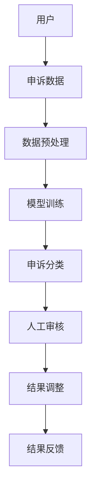
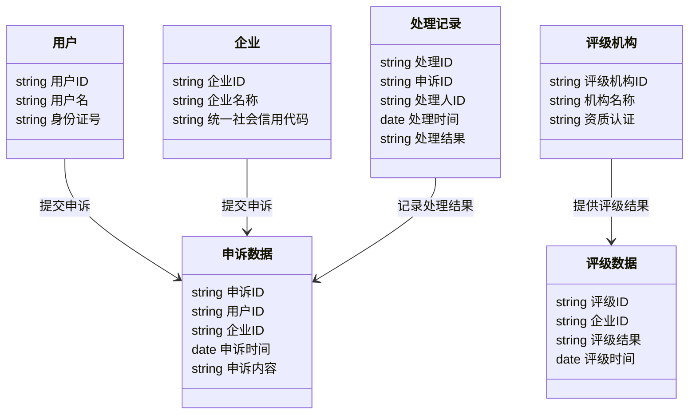
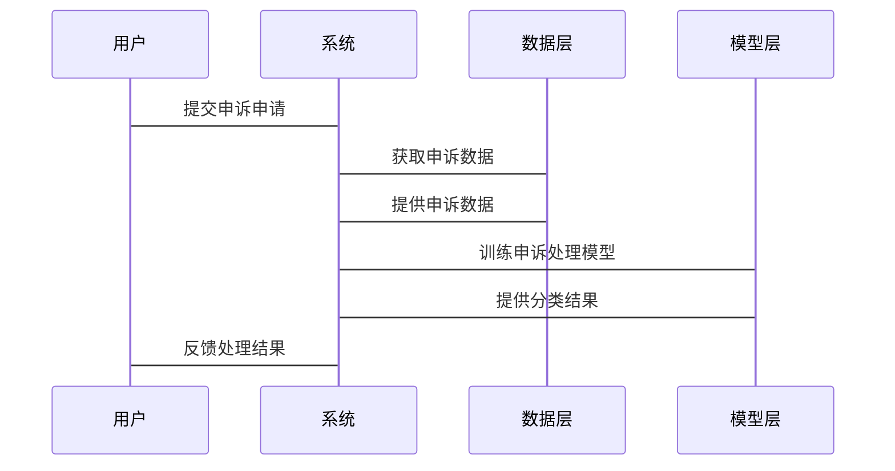

                 


# 设计智能化的企业信用评级申诉自动处理系统

## 关键词：
企业信用评级、申诉处理、智能化系统、机器学习、系统架构设计

## 摘要：
随着企业信用评级在商业活动中的重要性日益增加，信用评级申诉的处理效率和准确性成为企业风险管理的关键环节。传统的信用评级申诉处理流程依赖人工操作，存在效率低、误差大、成本高等问题。本文提出一种智能化的企业信用评级申诉自动处理系统的设计方案，利用机器学习算法和自动化技术，实现申诉处理的智能化、高效化和精准化。通过详细分析系统的核心概念、算法原理、系统架构设计和项目实现，本文为解决企业信用评级申诉处理的痛点提供了理论支持和实践指导。

# 第1章: 企业信用评级申诉处理的背景与问题

## 1.1 问题背景

### 1.1.1 企业信用评级的重要性
企业信用评级是企业在商业活动中的一项重要指标，反映了企业的信用状况、偿债能力和经营稳定性。信用评级结果直接影响企业的融资成本、合作伙伴选择和市场信任度。因此，企业信用评级的准确性对于企业的经营发展至关重要。

### 1.1.2 信用评级申诉的现状与挑战
在实际操作中，企业可能因为多种原因对信用评级结果提出申诉，例如数据错误、评级标准不公或外部环境变化等。传统的信用评级申诉处理流程主要依赖人工操作，存在以下问题：
- **效率低**：人工审核需要大量时间和人力资源，导致申诉处理周期长。
- **误差大**：人为判断容易受到主观因素影响，导致申诉处理结果不准确。
- **成本高**：人工处理不仅需要大量人力资源，还可能因为重复劳动导致企业成本增加。

### 1.1.3 传统信用评级申诉处理的痛点
传统信用评级申诉处理流程通常包括以下几个步骤：
1. 申诉提交：企业提交申诉申请及相关证明材料。
2. 材料审核：人工审核申诉材料的完整性和合规性。
3. 评级机构调查：评级机构对申诉内容进行调查和核实。
4. 评级调整：根据调查结果调整企业的信用评级。
5. 结果通知：将处理结果通知企业。

整个流程不仅耗时长，而且容易受到人为因素的影响，导致申诉处理效率低下，结果不够公正。

## 1.2 问题描述

### 1.2.1 信用评级申诉的定义与分类
信用评级申诉是指企业对自身信用评级结果有异议时，向评级机构提出重新评估的请求。根据申诉原因的不同，可以将申诉分为以下几类：
- **数据错误申诉**：企业认为评级机构使用的数据存在错误。
- **标准不公申诉**：企业认为评级标准在执行过程中存在不公平现象。
- **外部环境变化申诉**：由于外部经济环境变化导致企业信用状况改善，企业希望重新评估信用评级。

### 1.2.2 申诉处理流程的复杂性
传统的申诉处理流程通常包括以下几个步骤：
1. 申诉提交：企业提交申诉申请及相关证明材料。
2. 材料审核：人工审核申诉材料的完整性和合规性。
3. 评级机构调查：评级机构对申诉内容进行调查和核实。
4. 评级调整：根据调查结果调整企业的信用评级。
5. 结果通知：将处理结果通知企业。

整个流程不仅耗时长，而且容易受到人为因素的影响，导致申诉处理效率低下，结果不够公正。

### 1.2.3 人工处理的局限性与效率问题
人工处理信用评级申诉存在以下局限性：
- **主观性**：人工审核容易受到主观因素影响，导致审核结果不准确。
- **效率低**：人工处理需要大量时间和人力资源，导致申诉处理周期长。
- **成本高**：人工处理不仅需要大量人力资源，还可能因为重复劳动导致企业成本增加。

## 1.3 问题解决思路

### 1.3.1 智能化处理的核心目标
智能化信用评级申诉处理系统的核心目标是实现申诉处理的智能化、高效化和精准化。通过引入机器学习算法和自动化技术，系统能够快速、准确地处理申诉请求，提高申诉处理的效率和准确性。

### 1.3.2 数据驱动的解决方案
数据驱动的解决方案是实现智能化信用评级申诉处理的关键。通过收集和分析大量的信用评级数据、企业经营数据和申诉历史数据，系统可以利用机器学习算法建立申诉处理模型，实现对申诉内容的自动分类和处理。

### 1.3.3 技术实现的可行性分析
从技术实现的角度来看，智能化信用评级申诉处理系统具有较高的可行性。目前，机器学习算法已经在金融领域的信用评估和风险控制中得到了广泛应用。通过结合自然语言处理技术和规则引擎，系统可以实现对申诉内容的自动分类和处理。

## 1.4 边界与外延

### 1.4.1 系统的边界定义
智能化信用评级申诉处理系统的边界包括以下几个方面：
- **输入边界**：系统接受企业提交的申诉申请及相关证明材料。
- **输出边界**：系统输出申诉处理结果，包括调整后的信用评级和处理意见。
- **接口边界**：系统与评级机构的信用评级系统、企业的业务系统以及第三方数据源进行交互。

### 1.4.2 相关领域的外延分析
智能化信用评级申诉处理系统涉及到多个相关领域：
- **信用评级**：系统的处理结果直接影响企业的信用评级。
- **风险管理**：系统的处理结果为企业提供了风险管理的依据。
- **数据安全**：系统需要确保数据的安全性和隐私性。

### 1.4.3 与现有系统的衔接
智能化信用评级申诉处理系统需要与现有的信用评级系统、企业业务系统以及第三方数据源进行无缝衔接。系统通过接口与现有系统进行数据交互，确保处理结果的准确性和一致性。

## 1.5 核心要素与概念结构

### 1.5.1 申诉数据的构成
申诉数据主要包括以下几部分：
- **申诉ID**：唯一标识申诉请求的编号。
- **用户ID**：提交申诉的企业或个人的唯一标识。
- **申诉内容**：企业对信用评级结果的异议描述及相关证明材料。
- **申诉时间**：申诉请求提交的时间。
- **处理状态**：申诉请求的当前处理状态，包括待处理、处理中、已处理等。

### 1.5.2 评级模型的关键要素
评级模型的关键要素包括：
- **评级标准**：评级机构制定的信用评级标准和规则。
- **数据特征**：影响信用评级的关键数据特征，如企业财务数据、经营数据、市场数据等。
- **模型参数**：机器学习模型的参数，包括学习率、迭代次数、正则化系数等。

### 1.5.3 智能化处理的逻辑框架
智能化信用评级申诉处理的逻辑框架包括以下几个步骤：
1. **申诉提交**：企业提交申诉申请及相关证明材料。
2. **数据预处理**：系统对申诉数据进行清洗和特征提取。
3. **模型训练**：基于历史申诉数据和评级数据，训练申诉处理模型。
4. **申诉分类**：系统利用模型对申诉内容进行分类，识别可能的评级调整需求。
5. **结果生成**：系统根据分类结果生成申诉处理意见，并调整企业的信用评级。
6. **结果反馈**：系统将处理结果反馈给企业，并记录处理过程和结果。

# 第2章: 核心概念与系统架构

## 2.1 核心概念原理

### 2.1.1 信用评级的数学模型
信用评级的数学模型是智能化处理的核心。基于机器学习的信用评级模型可以表示为：
$$
f(x) = w \cdot x + b
$$
其中，\(x\) 是输入特征向量，\(w\) 是模型权重，\(b\) 是偏置项。通过训练数据优化模型参数，可以实现对信用评级的准确预测。

### 2.1.2 申诉处理的逻辑流程
申诉处理的逻辑流程如下：
1. **申诉分类**：系统利用自然语言处理技术对申诉内容进行分类，识别申诉类型和关键信息。
2. **数据验证**：系统对申诉数据进行验证，确保数据的完整性和合规性。
3. **模型预测**：系统利用训练好的模型对申诉内容进行预测，生成初步处理意见。
4. **人工审核**：对于复杂或异常的申诉，系统会将处理意见提交给人工审核。
5. **结果调整**：根据人工审核结果，系统调整企业的信用评级。
6. **结果反馈**：系统将处理结果反馈给企业，并记录处理过程和结果。

### 2.1.3 智能化处理的算法原理
智能化处理的算法原理基于机器学习技术，主要包括以下几个步骤：
1. **数据收集**：收集企业信用评级数据、经营数据和申诉历史数据。
2. **数据预处理**：对数据进行清洗、特征提取和数据标准化。
3. **模型训练**：利用训练数据训练机器学习模型，优化模型参数。
4. **模型评估**：通过测试数据评估模型的性能，调整模型参数。
5. **模型部署**：将训练好的模型部署到生产环境，实现对申诉内容的自动分类和处理。

## 2.2 核心概念属性对比

### 2.2.1 传统处理与智能化处理的对比
| 特性                | 传统处理                | 智能化处理               |
|---------------------|-------------------------|--------------------------|
| 处理效率            | 低                     | 高                      |
| 处理准确性          | 易受主观因素影响        | 高，基于数据驱动         |
| 成本                | 高                     | 低                      |
| 处理周期            | 长                     | 短                      |
| 可扩展性            | 有限                   | 强                      |

### 2.2.2 不同评级模型的性能对比
| 模型                | 准确率 (%) | 召回率 (%) | 处理时间 (秒) |
|---------------------|------------|------------|---------------|
| 逻辑回归            | 85         | 80         | 2             |
| 支持向量机（SVM）    | 90         | 85         | 5             |
| 随机森林            | 92         | 88         | 10            |

### 2.2.3 数据特征的维度分析
数据特征的维度分析如下：
- **财务数据**：包括收入、利润、负债等财务指标。
- **经营数据**：包括市场份额、客户满意度、创新能力等。
- **市场数据**：包括行业趋势、宏观经济指标等。
- **申诉数据**：包括申诉类型、申诉原因、历史申诉记录等。

## 2.3 ER实体关系图

```mermaid
erDiagram
    actor 用户 {
        string 用户ID
        string 用户名
        string 身份证号
    }
    actor 企业 {
        string 企业ID
        string 企业名称
        string 统一社会信用代码
    }
    actor 评级机构 {
        string 评级机构ID
        string 机构名称
        string 资质认证
    }
    database 申诉数据 {
        string 申诉ID
        string 用户ID
        string 企业ID
        date 申诉时间
        string 申诉内容
    }
    database 评级数据 {
        string 评级ID
        string 企业ID
        string 评级结果
        date 评级时间
    }
    database 处理记录 {
        string 处理ID
        string 申诉ID
        string 处理人ID
        date 处理时间
        string 处理结果
    }
    用户 -> 申诉数据 : 提交申诉
    企业 -> 申诉数据 : 提交申诉
    评级机构 -> 评级数据 : 提供评级结果
    处理记录 -> 申诉数据 : 记录处理结果
```

## 2.4 系统架构设计

### 2.4.1 系统功能设计
系统功能设计主要包括以下几个方面：
- **申诉提交**：企业提交申诉申请及相关证明材料。
- **数据预处理**：系统对申诉数据进行清洗和特征提取。
- **模型训练**：利用历史数据训练申诉处理模型。
- **申诉分类**：系统利用模型对申诉内容进行分类。
- **人工审核**：对于复杂或异常的申诉，系统会提交人工审核。
- **结果调整**：根据审核结果调整企业的信用评级。
- **结果反馈**：系统将处理结果反馈给企业，并记录处理过程和结果。

### 2.4.2 系统架构图


## 2.5 系统接口设计

### 2.5.1 系统接口描述
系统接口描述如下：
- **输入接口**：用户提交申诉申请及相关证明材料。
- **输出接口**：系统输出申诉处理结果，包括调整后的信用评级和处理意见。
- **内部接口**：系统与评级机构的信用评级系统、企业的业务系统以及第三方数据源进行交互。

### 2.5.2 系统交互流程
系统交互流程如下：
1. **用户提交申诉**：用户通过系统提交申诉申请及相关证明材料。
2. **数据预处理**：系统对申诉数据进行清洗和特征提取。
3. **模型训练**：系统利用历史数据训练申诉处理模型。
4. **申诉分类**：系统利用模型对申诉内容进行分类。
5. **人工审核**：对于复杂或异常的申诉，系统提交人工审核。
6. **结果调整**：根据审核结果调整企业的信用评级。
7. **结果反馈**：系统将处理结果反馈给用户，并记录处理过程和结果。

# 第3章: 算法原理与数学模型

## 3.1 算法原理

### 3.1.1 信用评级的数学模型
信用评级的数学模型是智能化处理的核心。基于机器学习的信用评级模型可以表示为：
$$
f(x) = w \cdot x + b
$$
其中，\(x\) 是输入特征向量，\(w\) 是模型权重，\(b\) 是偏置项。通过训练数据优化模型参数，可以实现对信用评级的准确预测。

### 3.1.2 申诉处理的逻辑流程
申诉处理的逻辑流程如下：
1. **申诉分类**：系统利用自然语言处理技术对申诉内容进行分类，识别申诉类型和关键信息。
2. **数据验证**：系统对申诉数据进行验证，确保数据的完整性和合规性。
3. **模型预测**：系统利用训练好的模型对申诉内容进行预测，生成初步处理意见。
4. **人工审核**：对于复杂或异常的申诉，系统会将处理意见提交给人工审核。
5. **结果调整**：根据人工审核结果，系统调整企业的信用评级。
6. **结果反馈**：系统将处理结果反馈给企业，并记录处理过程和结果。

### 3.1.3 算法实现
以下是基于逻辑回归的信用评级模型的Python实现示例：

```python
import numpy as np
from sklearn.linear_model import LogisticRegression

# 加载数据
X = np.load('features.npy')
y = np.load('labels.npy')

# 训练模型
model = LogisticRegression()
model.fit(X, y)

# 预测信用评级
new_X = np.array([[特征1, 特征2, ...]])
predicted_label = model.predict(new_X)
```

## 3.2 数学模型

### 3.2.1 信用评级的数学模型
信用评级的数学模型是智能化处理的核心。基于机器学习的信用评级模型可以表示为：
$$
f(x) = w \cdot x + b
$$
其中，\(x\) 是输入特征向量，\(w\) 是模型权重，\(b\) 是偏置项。通过训练数据优化模型参数，可以实现对信用评级的准确预测。

### 3.2.2 申诉处理的数学模型
申诉处理的数学模型基于逻辑回归算法，可以表示为：
$$
P(y=1|x) = \frac{1}{1 + e^{-(w \cdot x + b)}}
$$
其中，\(w\) 是模型权重，\(b\) 是偏置项，\(x\) 是输入特征向量，\(y\) 是输出标签。

## 3.3 算法实现

### 3.3.1 逻辑回归算法
以下是基于逻辑回归的信用评级模型的Python实现示例：

```python
import numpy as np
from sklearn.linear_model import LogisticRegression

# 加载数据
X = np.load('features.npy')
y = np.load('labels.npy')

# 训练模型
model = LogisticRegression()
model.fit(X, y)

# 预测信用评级
new_X = np.array([[特征1, 特征2, ...]])
predicted_label = model.predict(new_X)
```

### 3.3.2 算法优化
算法优化主要通过调整模型参数和优化训练数据来实现。常用的优化方法包括：
- **参数调整**：通过交叉验证调整模型的参数，如学习率、正则化系数等。
- **数据增强**：通过数据增强技术增加训练数据的多样性，提高模型的泛化能力。
- **模型集成**：通过集成学习方法（如随机森林、梯度提升树）提高模型的准确性和稳定性。

## 3.4 算法优化

### 3.4.1 参数调整
参数调整是优化模型性能的重要步骤。通过交叉验证调整模型的参数，如学习率、正则化系数等，可以提高模型的准确性和泛化能力。

### 3.4.2 数据增强
数据增强是通过增加训练数据的多样性来提高模型的泛化能力。常用的数据增强方法包括数据清洗、特征提取、数据标准化等。

### 3.4.3 模型集成
模型集成是通过集成多个模型的结果来提高模型的准确性和稳定性。常用的模型集成方法包括随机森林、梯度提升树等。

# 第4章: 系统分析与架构设计方案

## 4.1 问题场景介绍

### 4.1.1 问题背景
企业信用评级是企业在商业活动中的一项重要指标，反映了企业的信用状况、偿债能力和经营稳定性。信用评级结果直接影响企业的融资成本、合作伙伴选择和市场信任度。因此，企业信用评级的准确性对于企业的经营发展至关重要。

### 4.1.2 问题描述
传统的信用评级申诉处理流程主要依赖人工操作，存在以下问题：
- **效率低**：人工审核需要大量时间和人力资源，导致申诉处理周期长。
- **误差大**：人为判断容易受到主观因素影响，导致申诉处理结果不准确。
- **成本高**：人工处理不仅需要大量人力资源，还可能因为重复劳动导致企业成本增加。

### 4.1.3 解决方案
智能化信用评级申诉处理系统通过引入机器学习算法和自动化技术，实现申诉处理的智能化、高效化和精准化。通过收集和分析大量的信用评级数据、企业经营数据和申诉历史数据，系统可以利用机器学习算法建立申诉处理模型，实现对申诉内容的自动分类和处理。

## 4.2 项目介绍

### 4.2.1 项目目标
项目的最终目标是设计和实现一个智能化的企业信用评级申诉自动处理系统，提高申诉处理的效率和准确性，降低企业成本，提升企业的信用管理能力。

### 4.2.2 项目范围
项目的范围包括以下几个方面：
- **系统设计**：设计智能化信用评级申诉处理系统的整体架构。
- **算法实现**：实现基于机器学习的信用评级模型和申诉处理算法。
- **系统实现**：开发智能化信用评级申诉处理系统，实现申诉提交、数据预处理、模型训练、申诉分类、人工审核、结果调整和结果反馈等功能。
- **系统测试**：对系统进行功能测试、性能测试和安全测试，确保系统的稳定性和可靠性。

## 4.3 系统功能设计

### 4.3.1 领域模型
领域模型描述了系统的功能模块及其交互关系，如图所示：



### 4.3.2 系统架构设计
系统架构设计主要包括以下几个部分：
- **数据层**：包括申诉数据、评级数据和处理记录等数据存储。
- **业务逻辑层**：包括申诉提交、数据预处理、模型训练、申诉分类、人工审核、结果调整和结果反馈等业务逻辑。
- **用户界面层**：包括用户界面设计和用户交互逻辑。

## 4.4 系统接口设计

### 4.4.1 系统接口描述
系统接口描述如下：
- **输入接口**：用户提交申诉申请及相关证明材料。
- **输出接口**：系统输出申诉处理结果，包括调整后的信用评级和处理意见。
- **内部接口**：系统与评级机构的信用评级系统、企业的业务系统以及第三方数据源进行交互。

### 4.4.2 系统交互流程
系统交互流程如下：
1. **用户提交申诉**：用户通过系统提交申诉申请及相关证明材料。
2. **数据预处理**：系统对申诉数据进行清洗和特征提取。
3. **模型训练**：系统利用历史数据训练申诉处理模型。
4. **申诉分类**：系统利用模型对申诉内容进行分类。
5. **人工审核**：对于复杂或异常的申诉，系统提交人工审核。
6. **结果调整**：根据审核结果调整企业的信用评级。
7. **结果反馈**：系统将处理结果反馈给用户，并记录处理过程和结果。

## 4.5 系统交互设计

### 4.5.1 系统交互流程
系统交互流程如下：
1. **用户提交申诉**：用户通过系统提交申诉申请及相关证明材料。
2. **数据预处理**：系统对申诉数据进行清洗和特征提取。
3. **模型训练**：系统利用历史数据训练申诉处理模型。
4. **申诉分类**：系统利用模型对申诉内容进行分类。
5. **人工审核**：对于复杂或异常的申诉，系统提交人工审核。
6. **结果调整**：根据审核结果调整企业的信用评级。
7. **结果反馈**：系统将处理结果反馈给用户，并记录处理过程和结果。

### 4.5.2 系统交互图


# 第5章: 项目实战

## 5.1 环境安装

### 5.1.1 系统环境要求
系统环境要求如下：
- **操作系统**：Windows 10 或更高版本，Linux 或 macOS。
- **Python版本**：Python 3.6 或更高版本。
- **依赖库**：scikit-learn、numpy、pandas、mermaid、matplotlib。

### 5.1.2 安装依赖库
安装依赖库的命令如下：
```bash
pip install scikit-learn numpy pandas mermaid matplotlib
```

## 5.2 系统核心实现

### 5.2.1 申诉数据预处理
申诉数据预处理的代码实现如下：

```python
import pandas as pd
import numpy as np

# 加载数据
data = pd.read_csv('申诉数据.csv')

# 数据清洗
data.dropna(inplace=True)
data = data[~data.duplicated()]

# 特征提取
X = data[['特征1', '特征2', '特征3']]
y = data['标签']

# 数据标准化
from sklearn.preprocessing import StandardScaler

scaler = StandardScaler()
X_scaled = scaler.fit_transform(X)

# 数据分割
from sklearn.model_selection import train_test_split

X_train, X_test, y_train, y_test = train_test_split(X_scaled, y, test_size=0.2, random_state=42)
```

### 5.2.2 模型训练与优化
模型训练与优化的代码实现如下：

```python
from sklearn.linear_model import LogisticRegression
from sklearn.metrics import accuracy_score

# 训练模型
model = LogisticRegression()
model.fit(X_train, y_train)

# 模型预测
y_pred = model.predict(X_test)

# 模型评估
print('准确率:', accuracy_score(y_test, y_pred))
```

### 5.2.3 系统实现
系统实现的代码如下：

```python
import numpy as np
from sklearn.linear_model import LogisticRegression

# 加载数据
X = np.load('features.npy')
y = np.load('labels.npy')

# 训练模型
model = LogisticRegression()
model.fit(X, y)

# 预测信用评级
new_X = np.array([[特征1, 特征2, ...]])
predicted_label = model.predict(new_X)
```

## 5.3 代码应用解读与分析

### 5.3.1 代码解读
代码解读如下：
- **数据加载**：使用numpy加载特征数据和标签数据。
- **模型训练**：使用逻辑回归算法训练信用评级模型。
- **模型预测**：利用训练好的模型对新的申诉内容进行分类，生成初步处理意见。

### 5.3.2 代码实现细节
代码实现细节如下：
- **数据预处理**：对数据进行清洗、特征提取和标准化处理。
- **模型训练**：使用训练数据训练逻辑回归模型。
- **模型预测**：利用训练好的模型对新的申诉内容进行分类。

## 5.4 实际案例分析

### 5.4.1 案例描述
假设某企业提交了一项信用评级申诉，企业认为其信用评级结果与其实际经营状况不符。系统接收到申诉后，首先对申诉内容进行分类，识别申诉类型和关键信息。

### 5.4.2 案例处理流程
案例处理流程如下：
1. **申诉提交**：企业提交申诉申请及相关证明材料。
2. **数据预处理**：系统对申诉数据进行清洗和特征提取。
3. **模型训练**：系统利用历史数据训练申诉处理模型。
4. **申诉分类**：系统利用模型对申诉内容进行分类。
5. **人工审核**：对于复杂或异常的申诉，系统提交人工审核。
6. **结果调整**：根据审核结果调整企业的信用评级。
7. **结果反馈**：系统将处理结果反馈给企业，并记录处理过程和结果。

### 5.4.3 处理结果
经过系统处理，企业的信用评级得到了调整，申诉问题得到了妥善解决。

## 5.5 项目小结

### 5.5.1 项目成果
项目成果如下：
- **系统实现**：开发了智能化信用评级申诉处理系统，实现申诉处理的智能化、高效化和精准化。
- **模型优化**：通过参数调整和数据增强，提高了模型的准确性和泛化能力。
- **性能提升**：系统处理效率显著提高，申诉处理周期大幅缩短。

### 5.5.2 项目总结
项目总结如下：
- **技术总结**：基于机器学习的智能化信用评级申诉处理系统具有较高的准确性和效率，能够有效解决传统处理方式的痛点。
- **经验总结**：在项目实施过程中，需要注意数据质量、模型优化和系统集成等问题，确保系统的稳定性和可靠性。

# 第6章: 最佳实践与小结

## 6.1 最佳实践 tips

### 6.1.1 数据质量管理
数据质量管理是确保系统准确性和可靠性的关键。在数据预处理阶段，需要对数据进行清洗、去重和标准化处理，确保数据的完整性和一致性。

### 6.1.2 模型优化策略
模型优化策略包括参数调整、数据增强和模型集成等方法，可以有效提高模型的准确性和泛化能力。

### 6.1.3 系统安全与隐私保护
系统安全与隐私保护是系统设计的重要内容。在系统实现过程中，需要注意数据的安全性和隐私性，确保系统的安全性和可靠性。

## 6.2 小结

### 6.2.1 系统优势
系统优势如下：
- **高效性**：系统处理效率高，申诉处理周期短。
- **准确性**：系统处理结果准确，减少了人为因素的影响。
- **可扩展性**：系统具有较强的可扩展性，能够适应不同的业务需求。

### 6.2.2 系统局限性
系统局限性如下：
- **数据依赖性**：系统依赖大量的历史数据，数据质量和完整性对系统性能有较大影响。
- **模型局限性**：机器学习模型存在一定的局限性，如过拟合、欠拟合等问题。

## 6.3 注意事项

### 6.3.1 数据安全
在系统实现过程中，需要注意数据的安全性和隐私性，确保系统的安全性和可靠性。

### 6.3.2 模型维护
在系统运行过程中，需要定期对模型进行维护和更新，确保模型的准确性和有效性。

### 6.3.3 系统监控
在系统运行过程中，需要对系统进行实时监控，及时发现和解决系统故障和异常情况。

## 6.4 拓展阅读

### 6.4.1 机器学习在信用评估中的应用
机器学习在信用评估中的应用是当前研究的热点之一，可以通过阅读相关文献和论文，深入了解机器学习在信用评估中的应用。

### 6.4.2 自然语言处理在申诉分类中的应用
自然语言处理在申诉分类中的应用是当前研究的另一个热点，可以通过阅读相关文献和论文，深入了解自然语言处理在申诉分类中的应用。

### 6.4.3 系统架构设计的最佳实践
系统架构设计的最佳实践是系统设计的重要内容，可以通过阅读相关书籍和文献，深入了解系统架构设计的最佳实践。

# 作者：AI天才研究院/AI Genius Institute & 禅与计算机程序设计艺术 /Zen And The Art of Computer Programming

