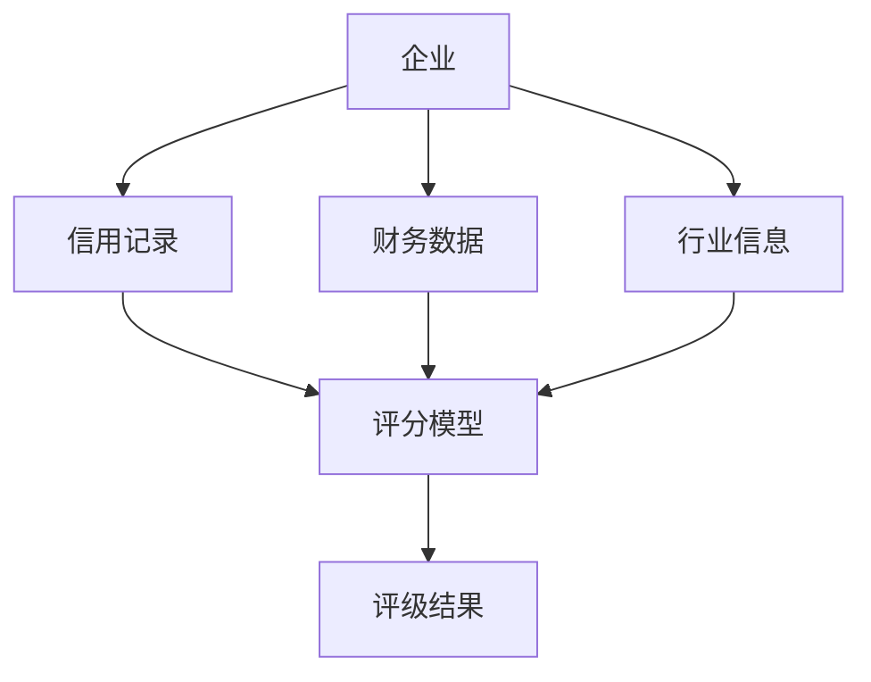
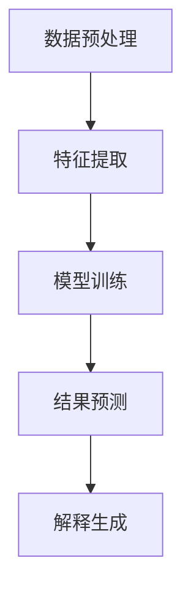
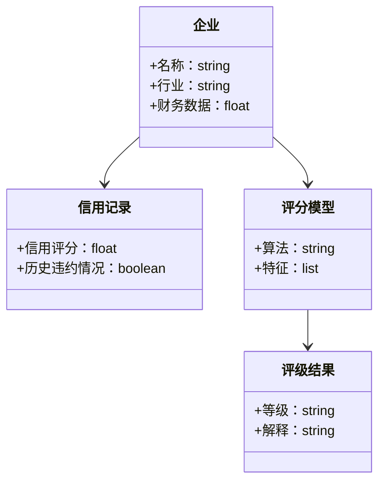
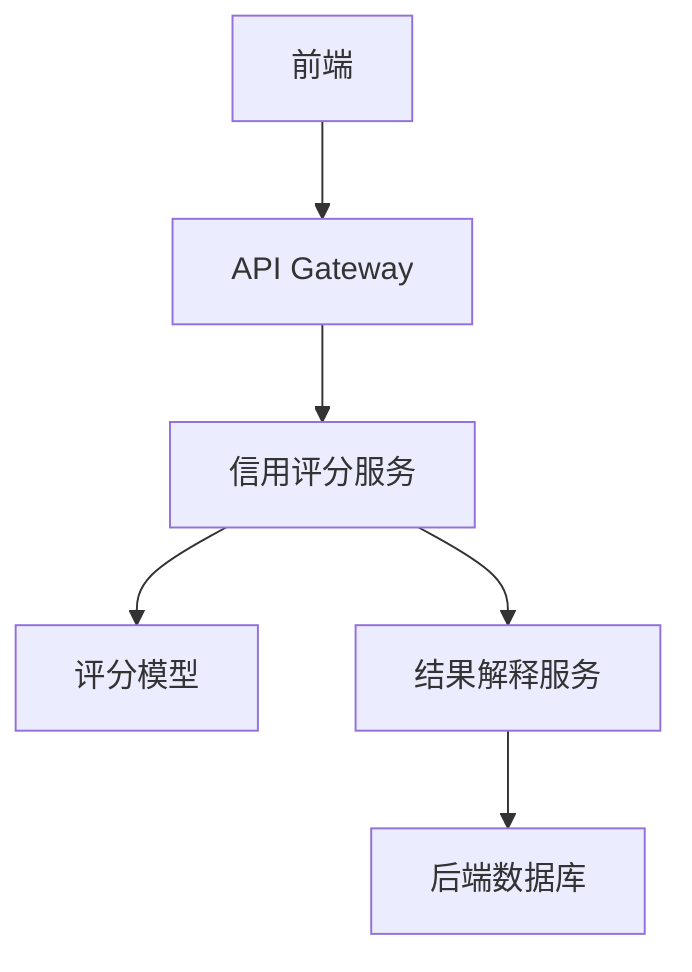
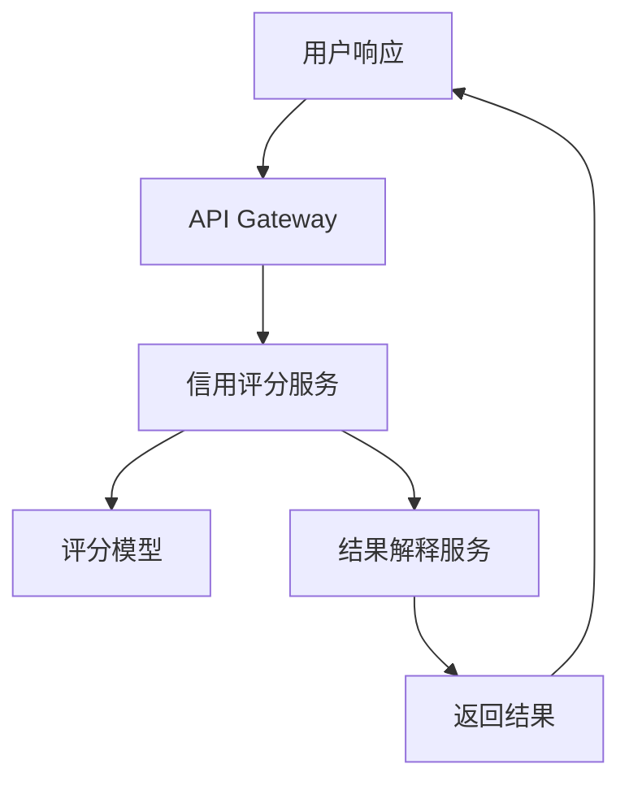

                 


# 设计智能化的企业信用评级解释系统

---

## 关键词：企业信用评级、智能化解释系统、机器学习、风险管理、数据驱动决策

---

## 摘要：  
随着企业融资需求的不断增长，信用评级成为企业融资过程中至关重要的一环。然而，传统信用评级方法存在解释性差、效率低、主观性强等问题。本文将从技术角度出发，系统地介绍如何设计一个智能化的企业信用评级解释系统。通过结合机器学习算法、自然语言处理技术和知识图谱，本文提出了一种高效、可解释的信用评级系统设计方案，并详细阐述了系统的实现过程和实际应用场景。  

---

## 目录

### 第一章：企业信用评级解释系统背景与需求

1.1 企业信用评级的定义与重要性  
1.2 智能化解释系统的需求背景  
1.3 问题背景与目标  

### 第二章：企业信用评级解释系统的核心概念与联系

2.1 核心概念解析  
2.2 核心概念之间的关系  
2.3 实体关系图（ER图）  

### 第三章：智能化解释系统的算法原理

3.1 算法选择与原理  
3.2 算法流程图  
3.3 算法实现代码  

### 第四章：系统分析与架构设计

4.1 系统分析  
4.2 系统架构设计  
4.3 接口设计与交互流程  

### 第五章：项目实战

5.1 环境安装与配置  
5.2 系统核心代码实现  
5.3 实际案例分析  

### 第六章：系统优化与扩展

6.1 系统性能优化策略  
6.2 功能扩展与新场景应用  
6.3 持续集成与自动化测试  

### 第七章：总结与展望

7.1 项目总结  
7.2 未来展望  
7.3 注意事项与最佳实践  

---

## 第一章：企业信用评级解释系统背景与需求

### 1.1 企业信用评级的定义与重要性

#### 1.1.1 企业信用评级的基本概念  
企业信用评级是通过对企业的财务状况、经营能力、管理团队、行业环境等多方面因素的综合评估，给出一个反映企业信用风险的等级。  

#### 1.1.2 信用评级在企业融资中的作用  
信用评级是企业获取贷款、发行债券等融资活动的重要依据。良好的信用评级能够降低企业的融资成本，提高融资成功的概率。  

#### 1.1.3 信用评级对风险管理的意义  
信用评级能够帮助金融机构识别和评估企业的信用风险，从而制定合理的风险管理策略。  

### 1.2 智能化解释系统的需求背景

#### 1.2.1 传统信用评级的局限性  
传统信用评级方法主要依赖人工分析，存在主观性强、效率低、解释性差等问题。  

#### 1.2.2 智能化解释系统的核心需求  
智能化解释系统需要具备高效性、可解释性、实时性和个性化定制能力。  

#### 1.2.3 企业信用评级解释系统的应用场景  
企业信用评级解释系统可以应用于银行贷款审批、债券发行评级、企业并购风险评估等场景。  

### 1.3 问题背景与目标

#### 1.3.1 企业信用评级中的信息不对称问题  
信息不对称会导致金融机构难以准确评估企业的信用风险，增加金融系统的不稳定性。  

#### 1.3.2 解释系统的目标与边界  
系统的目标是通过智能化技术，提供高精度、可解释的信用评级服务。系统的边界包括数据输入、模型训练、结果输出和解释生成。  

#### 1.3.3 系统的核心问题解决思路  
通过机器学习算法对多源异构数据进行分析，提取关键特征，构建信用评级模型，并生成可解释的评级结果。  

---

## 第二章：企业信用评级解释系统的核心概念与联系

### 2.1 核心概念解析

#### 2.1.1 信用评级的核心要素  
包括企业财务状况、经营能力、管理团队、行业环境和市场风险等。  

#### 2.1.2 智能化解释的核心原理  
基于机器学习模型的特征重要性分析，生成可解释的评分规则。  

#### 2.1.3 系统的关键组成部分  
包括数据采集模块、特征提取模块、模型训练模块和结果解释模块。  

### 2.2 核心概念之间的关系

#### 2.2.1 信用评分与评级的关系  
信用评分是信用评级的基础，评级是评分的分层结果。  

#### 2.2.2 数据特征与评级结果的关联  
关键特征（如财务指标）对评级结果具有显著影响。  

#### 2.2.3 系统模块之间的交互关系  
数据输入 → 特征提取 → 模型训练 → 结果输出 → 解释生成。  

### 2.3 实体关系图（ER图）



---

## 第三章：智能化解释系统的算法原理

### 3.1 算法选择与原理

#### 3.1.1 机器学习在信用评级中的应用  
常用的算法包括逻辑回归、随机森林和梯度提升树（如XGBoost）。  

#### 3.1.2 常见算法对比与选择  
从准确率、可解释性和计算效率等维度进行对比，选择适合场景的算法。  

#### 3.1.3 算法的核心原理  
以XGBoost为例，通过梯度提升算法优化模型性能。  

### 3.2 算法流程图



### 3.3 算法实现代码

```python
def credit_score_prediction(data):
    # 数据预处理
    preprocessed_data = preprocess(data)
    # 特征提取
    features = extract_features(preprocessed_data)
    # 模型预测
    model = train_model(features)
    prediction = model.predict(features)
    return prediction
```

### 3.4 算法的数学模型与公式

#### 3.4.1 XGBoost算法的核心公式  
$$
\text{目标函数} = \sum_{i=1}^n \left( y_i - \hat{y}_i \right)^2 + \lambda \sum_{j=1}^m \theta_j^2
$$  

#### 3.4.2 特征重要性计算  
$$
\text{特征重要性} = \frac{\text{特征对模型的贡献}}{\text{所有特征的总贡献}}
$$  

---

## 第四章：系统分析与架构设计

### 4.1 系统分析

#### 4.1.1 问题场景介绍  
企业信用评级系统的输入包括财务数据、行业信息和市场数据。  

#### 4.1.2 项目介绍  
设计一个支持多源数据接入、智能分析和可解释结果输出的系统。  

### 4.2 系统架构设计

#### 4.2.1 领域模型设计  


#### 4.2.2 系统架构图  


### 4.3 接口设计与交互流程

#### 4.3.1 系统交互流程图  


---

## 第五章：项目实战

### 5.1 环境安装与配置

#### 5.1.1 安装Python环境  
使用Anaconda安装Python 3.8及以上版本。  

#### 5.1.2 安装依赖库  
安装pandas、numpy、xgboost和scikit-learn等库。  

### 5.2 系统核心代码实现

#### 5.2.1 数据预处理代码  
```python
import pandas as pd
from sklearn.preprocessing import StandardScaler

def preprocess(data):
    # 数据清洗
    data = data.dropna()
    # 标准化处理
    scaler = StandardScaler()
    processed_data = scaler.fit_transform(data)
    return processed_data
```

#### 5.2.2 模型训练代码  
```python
import xgboost as xgb

def train_model(features, labels):
    # 训练模型
    model = xgb.XGBClassifier()
    model.fit(features, labels)
    return model
```

### 5.3 实际案例分析

#### 5.3.1 数据来源与预处理  
以某行业内的企业财务数据为例，进行数据清洗和标准化处理。  

#### 5.3.2 模型训练与评估  
通过交叉验证评估模型的准确率和F1分数。  

---

## 第六章：系统优化与扩展

### 6.1 系统性能优化策略

#### 6.1.1 并行计算优化  
使用分布式计算框架（如Spark）加速模型训练。  

#### 6.1.2 模型压缩与轻量化  
通过剪枝优化减少模型大小，提升推理速度。  

### 6.2 功能扩展与新场景应用

#### 6.2.1 多语言支持  
支持多种语言的API接口，便于不同地区的企业接入。  

#### 6.2.2 实时监控功能  
实时监控企业的信用状况变化，动态更新评级结果。  

### 6.3 持续集成与自动化测试

#### 6.3.1 持续集成流程  
使用Jenkins或GitHub Actions实现代码的自动化构建和测试。  

#### 6.3.2 自动化测试策略  
制定单元测试、集成测试和性能测试的自动化流程。  

---

## 第七章：总结与展望

### 7.1 项目总结

#### 7.1.1 核心成果  
设计并实现了一个高效、可解释的企业信用评级解释系统。  

#### 7.1.2 经验与教训  
在算法选择和数据预处理阶段需要充分考虑业务场景和数据质量。  

### 7.2 未来展望

#### 7.2.1 技术方向  
探索图神经网络和大语言模型在信用评级中的应用。  

#### 7.2.2 应用场景扩展  
拓展至供应链金融、融资租赁等新兴领域。  

### 7.3 注意事项与最佳实践

#### 7.3.1 数据安全  
确保企业数据的隐私保护和合规性。  

#### 7.3.2 模型解释性  
始终关注模型的可解释性，避免“黑箱”模型的滥用。  

---

## 作者：AI天才研究院/AI Genius Institute & 禅与计算机程序设计艺术 /Zen And The Art of Computer Programming

