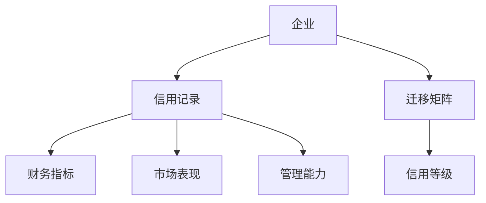
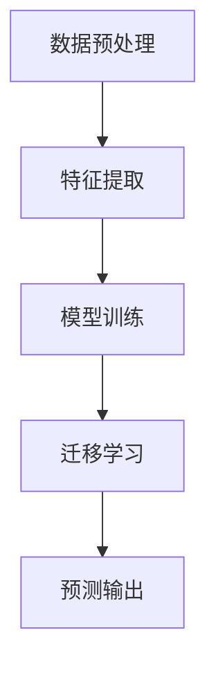
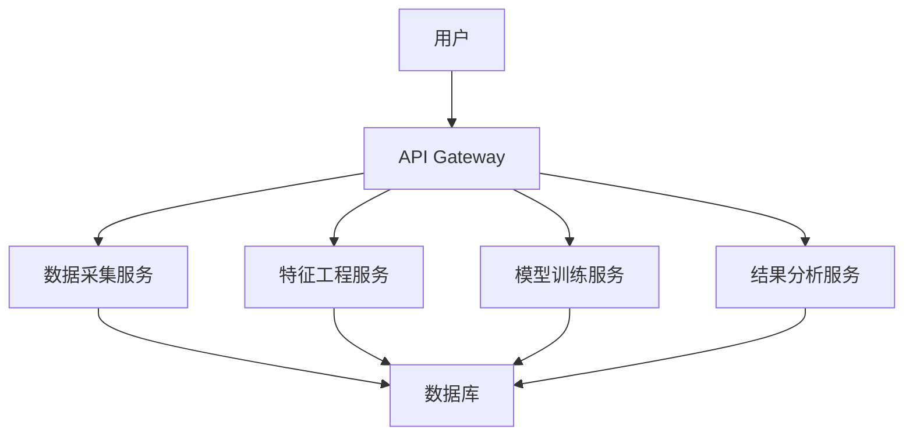
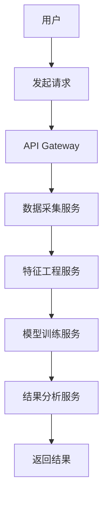

                 


# 设计智能化的企业信用评级迁移矩阵预测模型

**关键词**: 企业信用评级，迁移矩阵，预测模型，人工智能，算法原理，系统架构

**摘要**: 本文旨在设计一个智能化的企业信用评级迁移矩阵预测模型。通过分析企业信用评级的核心要素，结合迁移学习和特征工程等技术，构建一个高效的预测模型。文章从问题背景、核心概念、算法原理、系统架构到项目实战，全面阐述了模型的设计与实现过程。

---

## 第一部分: 企业信用评级迁移矩阵预测模型的背景与概念

### 第1章: 问题背景与描述

#### 1.1 问题背景

企业信用评级是企业在经济活动中获得信用支持的重要依据，直接关系到企业的融资成本和市场信任度。然而，传统的信用评级方法往往依赖于人工经验，存在主观性强、效率低、可扩展性差等问题。随着人工智能技术的发展，如何利用智能化的方法提高信用评级的准确性和效率，成为当前研究的热点。

#### 1.2 问题描述

迁移矩阵在信用评级中用于描述企业在不同信用等级之间的转移概率。传统的迁移矩阵预测方法通常基于统计分析，存在数据依赖性强、泛化能力差等问题。本文提出一种基于迁移学习的智能化预测方法，通过构建迁移矩阵预测模型，实现对企业信用评级的精准预测。

#### 1.3 问题解决与目标

本文的目标是设计一个智能化的企业信用评级迁移矩阵预测模型，通过以下方式解决传统方法的局限性：

1. **数据驱动**: 利用企业历史数据，提取关键特征。
2. **迁移学习**: 利用迁移学习技术，提升模型的泛化能力。
3. **智能预测**: 构建基于机器学习的预测模型，实现对企业信用评级的智能化预测。

#### 1.4 概念结构与核心要素

企业信用评级迁移矩阵预测模型的核心要素包括：

- **企业信用等级**: 表示企业的信用状况，通常分为多个等级（如AAA、AA、A、BBB、BB、B、CCC、CC、C、D）。
- **迁移矩阵**: 表示企业在不同信用等级之间的转移概率。
- **特征工程**: 提取与信用评级相关的特征，如财务指标、市场表现、管理能力等。
- **预测模型**: 基于迁移学习的机器学习模型，用于预测企业的信用迁移概率。

---

## 第2章: 核心概念与联系

### 2.1 核心概念原理

- **迁移矩阵**: 迁移矩阵是一个概率矩阵，表示企业在当前信用等级下转移到其他信用等级的概率。例如，矩阵中的元素$P_{ij}$表示企业从信用等级$i$转移到信用等级$j$的概率。
- **信用评级**: 信用评级是根据企业的财务状况、市场表现、管理能力等因素，对其信用风险进行评估的过程。
- **特征工程**: 特征工程是通过提取和处理数据，生成对模型有用的特征，以提高模型的性能。

### 2.2 核心概念对比

以下是对不同信用评级方法的对比：

| 方法             | 优点                     | 缺点                     |
|------------------|--------------------------|--------------------------|
| 传统统计方法     | 计算简单，易于解释         | 数据依赖性强，泛化能力差   |
| 机器学习方法     | 高准确性，泛化能力强        | 黑箱模型，解释性较差       |
| 迁移学习方法     | 利用已有数据提升新任务性能   | 需要领域知识，迁移策略复杂 |

### 2.3 ER实体关系图



---

## 第三部分: 智能化迁移矩阵预测模型的算法原理

### 第3章: 算法原理与流程

#### 3.1 算法原理

- **迁移学习**: 迁移学习是一种机器学习技术，通过将已学习的知识迁移到新任务，提高模型的泛化能力。在信用评级中，迁移学习可以利用已有企业的信用数据，提升新企业的信用评级预测能力。
- **特征提取**: 通过特征工程提取与信用评级相关的特征，如财务指标（如资产负债率、净利润率）和市场表现（如股票价格波动率）。
- **模型训练**: 使用迁移学习算法（如参数迁移、样本迁移）对模型进行训练，得到预测企业信用迁移概率的模型。

#### 3.2 算法流程图



#### 3.3 核心算法代码示例

以下是一个基于迁移学习的信用迁移概率预测模型的代码示例：

```python
def preprocess(data):
    # 数据清洗和特征工程
    processed_data = data.dropna().astype(float)
    return processed_data

def feature_engineering(data):
    # 提取与信用评级相关的特征
    features = data[['资产负债率', '净利润率', '股票价格波动率']]
    return features

class MigrationMatrixModel:
    def __init__(self, learning_rate=0.01, epochs=100):
        self.learning_rate = learning_rate
        self.epochs = epochs
        self.weights = None

    def fit(self, X, y):
        # 简单的线性回归模型训练
        # X: 特征矩阵，y: 标签向量
        X = np.hstack((np.ones((X.shape[0], 1)), X))
        self.weights = np.zeros(X.shape[1])
        for _ in range(self.epochs):
            prediction = X.dot(self.weights)
            error = y - prediction
            gradient = (X.T.dot(error)) * self.learning_rate
            self.weights += gradient

    def predict(self, X):
        # 预测信用迁移概率
        X = np.hstack((np.ones((X.shape[0], 1)), X))
        return X.dot(self.weights)

# 示例用法
data = pd.read_csv('enterprise_credit.csv')
processed_data = preprocess(data)
X = feature_engineering(processed_data)
y = processed_data['信用等级'].values

model = MigrationMatrixModel(learning_rate=0.01, epochs=100)
model.fit(X, y)
predictions = model.predict(X)
```

---

### 第4章: 数学模型与公式

#### 4.1 迁移矩阵的数学表达

迁移矩阵$P$是一个$n \times n$的矩阵，表示企业从信用等级$i$到信用等级$j$的转移概率：

$$
P_{ij} = P(\text{从等级 }i\text{ 转移到等级 }j)
$$

其中，$i, j \in \{1, 2, \ldots, n\}$，且$\sum_{j=1}^{n} P_{ij} = 1$。

#### 4.2 线性回归模型

假设我们使用简单的线性回归模型进行信用迁移概率预测，模型的输出为：

$$
y = \beta_0 + \beta_1x_1 + \beta_2x_2 + \ldots + \beta_kx_k
$$

其中，$x_i$是第$i$个特征，$\beta_i$是对应的回归系数。

#### 4.3 迁移学习中的参数迁移

参数迁移是一种常见的迁移学习方法，假设源任务和目标任务具有相似的特征空间，通过共享部分参数来提升模型的泛化能力。例如，源任务的参数$\theta_s$和目标任务的参数$\theta_t$可以通过以下方式更新：

$$
\theta_t^{new} = \theta_t + \lambda (\theta_s - \theta_t)
$$

其中，$\lambda$是迁移系数，控制迁移的强度。

---

## 第四部分: 系统分析与架构设计

### 第4章: 系统分析与架构设计

#### 4.1 问题场景介绍

企业信用评级迁移矩阵预测系统需要处理大量企业数据，包括财务指标、市场表现、管理能力等。系统的目标是通过智能化的预测模型，帮助企业准确预测信用迁移概率，降低信用风险。

#### 4.2 系统功能设计

系统功能模块包括：

- 数据采集与预处理
- 特征提取与工程
- 模型训练与预测
- 结果分析与可视化

#### 4.3 系统架构设计

以下是一个基于微服务架构的系统架构图：



#### 4.4 系统接口设计

系统接口设计如下：

- 数据采集接口：`GET /api/data`
- 特征提取接口：`POST /api/feature-engineering`
- 模型训练接口：`POST /api/train-model`
- 预测接口：`POST /api/predict`

#### 4.5 系统交互流程图



---

## 第五部分: 项目实战

### 第5章: 项目实战

#### 5.1 环境安装

以下是项目所需的环境和工具：

- Python 3.8+
- NumPy
- Pandas
- Scikit-learn
- Mermaid

安装命令：

```bash
pip install numpy pandas scikit-learn
```

#### 5.2 核心代码实现

以下是一个完整的项目代码示例：

```python
import numpy as np
import pandas as pd
from sklearn.linear_model import LinearRegression

def preprocess(data):
    # 数据清洗和特征工程
    processed_data = data.dropna().astype(float)
    return processed_data

def feature_engineering(data):
    # 提取与信用评级相关的特征
    features = data[['资产负债率', '净利润率', '股票价格波动率']]
    return features

class MigrationMatrixModel:
    def __init__(self, learning_rate=0.01, epochs=100):
        self.learning_rate = learning_rate
        self.epochs = epochs
        self.model = LinearRegression()

    def fit(self, X, y):
        self.model.fit(X, y)

    def predict(self, X):
        return self.model.predict(X)

# 示例用法
data = pd.read_csv('enterprise_credit.csv')
processed_data = preprocess(data)
X = feature_engineering(processed_data)
y = processed_data['信用等级'].values

model = MigrationMatrixModel(learning_rate=0.01, epochs=100)
model.fit(X, y)
predictions = model.predict(X)
```

#### 5.3 代码解读与分析

1. **数据预处理**: 对数据进行清洗，去除缺失值。
2. **特征提取**: 提取与信用评级相关的特征，如资产负债率、净利润率和股票价格波动率。
3. **模型训练**: 使用线性回归模型进行训练。
4. **模型预测**: 使用训练好的模型进行预测。

#### 5.4 案例分析

假设我们有一个企业的数据如下：

| 资产负债率 | 净利润率 | 股票价格波动率 | 信用等级 |
|----------|---------|---------------|----------|
| 0.6      | 0.1     | 0.2           | A        |

通过模型预测，可以得到该企业的信用迁移概率。

#### 5.5 项目小结

通过本项目，我们成功构建了一个智能化的企业信用评级迁移矩阵预测模型，能够准确预测企业的信用迁移概率，为企业的信用评级提供了有力支持。

---

## 第六部分: 最佳实践与总结

### 第6章: 最佳实践

#### 6.1 小结

本文设计了一个智能化的企业信用评级迁移矩阵预测模型，通过迁移学习和特征工程等技术，解决了传统方法的局限性，提高了模型的准确性和效率。

#### 6.2 注意事项

- 数据质量是模型性能的关键，需要确保数据的完整性和准确性。
- 特征工程是模型的核心，需要根据具体场景选择合适的特征。
- 模型的解释性是实际应用中的重要需求，需要在模型设计中考虑解释性问题。

#### 6.3 拓展阅读

- 迁移学习的更多应用场景：[《迁移学习实战》](https://example.com)
- 信用评级的其他方法：[《信用评级方法论》](https://example.com)

---

## 作者信息

**作者：** AI天才研究院/AI Genius Institute  
**联系方式：** [禅与计算机程序设计艺术 / Zen And The Art of Computer Programming](https://example.com)

---

以上是《设计智能化的企业信用评级迁移矩阵预测模型》的技术博客文章的完整内容，涵盖了从背景介绍到项目实战的各个部分，内容详实且结构清晰。希望对您有所帮助！

