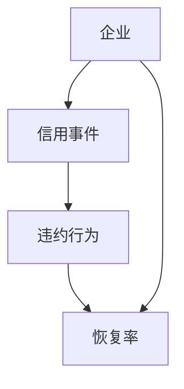
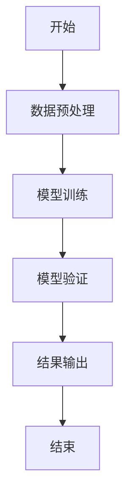
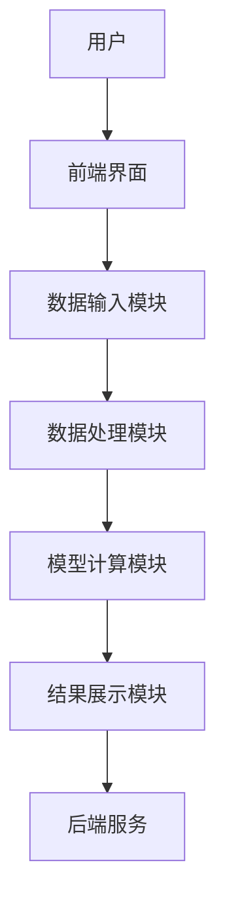
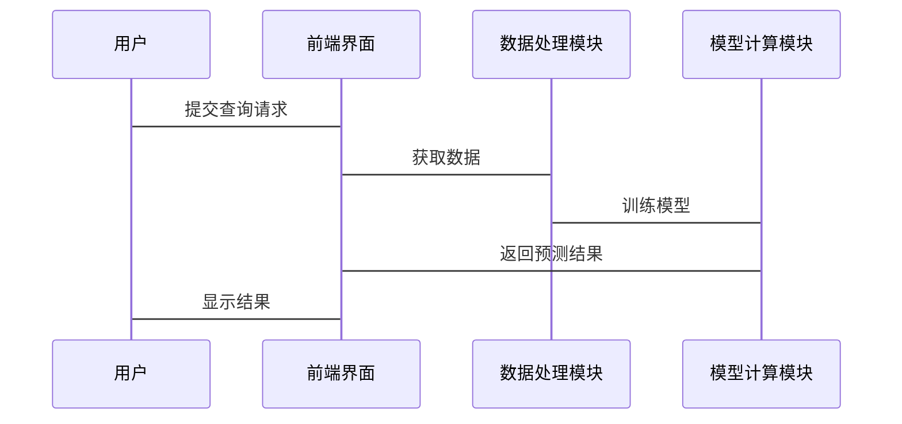

                 


# 设计智能化的企业信用违约恢复率动态预测模型

> 关键词：信用违约，恢复率预测，智能化模型，机器学习，风险管理

> 摘要：本文详细探讨了设计智能化的企业信用违约恢复率动态预测模型的关键步骤，包括背景分析、核心概念、算法原理、系统架构和项目实战。通过结合损失分布模型和KM模型，利用机器学习和深度学习技术，提出了一种动态、智能的预测方法，为企业信用风险管理提供了新的思路和解决方案。

---

# 第一部分: 企业信用违约恢复率动态预测模型的背景与核心概念

## 第1章: 企业信用违约恢复率预测模型的背景与问题描述

### 1.1 信用违约与恢复率的基本概念

#### 1.1.1 信用违约的定义与特征
信用违约是指债务人在债务到期时未能履行还款义务，导致债权人遭受损失的行为。其主要特征包括：
- **违约概率**：衡量债务人违约的可能性。
- **违约损失率（LGD）**：衡量违约后债权人能收回多少比例的债务。
- **时间依赖性**：违约行为通常与经济周期和企业经营状况密切相关。

#### 1.1.2 恢复率的定义与计算方法
恢复率是指在债务人违约后，债权人实际收回的金额与违约债务的比例。计算公式为：
$$ \text{恢复率} = \frac{\text{实际收回金额}}{\text{违约债务总额}} \times 100\% $$

#### 1.1.3 信用违约恢复率的重要性
恢复率是信用风险管理的核心指标之一。准确预测恢复率可以帮助企业：
- **优化资本配置**：合理评估风险敞口。
- **制定风险应对策略**：提前准备应对违约事件。
- **提升信用评级**：为投资者提供更准确的信用评估。

### 1.2 企业信用风险管理的现状与挑战

#### 1.2.1 传统信用风险管理方法的局限性
传统方法主要依赖历史数据和统计分析，存在以下问题：
- 数据单一性：难以捕捉非结构化数据（如市场情绪）。
- 静态性：难以应对动态变化的市场环境。
- 简单性：模型过于简化，无法准确反映复杂风险因素。

#### 1.2.2 信用违约恢复率预测的难点
- **数据稀缺性**：高质量违约数据获取困难。
- **动态变化**：经济环境和企业状况不断变化，导致恢复率波动。
- **模型复杂性**：需要结合多种因素，构建复杂的预测模型。

#### 1.2.3 智能化预测模型的必要性
随着人工智能技术的发展，智能化模型能够处理海量数据，捕捉复杂关联，提供更精准的预测结果。本文将结合损失分布模型和KM模型，提出一种动态、智能的恢复率预测方法。

### 1.3 问题背景与目标

#### 1.3.1 问题背景分析
企业信用违约恢复率的预测对企业风险管理至关重要，但传统方法在准确性和实时性上存在不足。近年来，机器学习和深度学习技术的快速发展为解决这一问题提供了新思路。

#### 1.3.2 问题描述与解决思路
- **问题描述**：企业信用违约恢复率的动态预测需要考虑多种因素，包括宏观经济指标、企业财务状况、市场环境等。
- **解决思路**：通过构建智能化模型，整合多源数据，利用机器学习算法进行实时预测。

#### 1.3.3 模型的目标与边界
- **目标**：构建一个动态、智能的恢复率预测模型，能够实时更新预测结果，为企业信用风险管理提供支持。
- **边界**：模型仅考虑企业信用违约恢复率，不涉及其他风险类型（如市场风险）。

### 1.4 核心概念与结构

#### 1.4.1 核心概念的定义与属性
- **信用风险**：企业因债务人违约而遭受的损失。
- **恢复率**：违约后债权人实际收回的比例。
- **动态预测**：基于实时数据，不断更新预测结果。

#### 1.4.2 概念结构与核心要素
- **输入**：企业财务数据、宏观经济指标、市场数据。
- **输出**：违约恢复率的动态预测结果。
- **核心要素**：损失分布模型、KM模型、机器学习算法。

#### 1.4.3 模型的边界与外延
- **边界**：仅关注信用违约恢复率，不涉及其他风险类型。
- **外延**：可以扩展到其他信用风险管理领域，如违约概率预测。

### 1.5 本章小结
本章从信用违约和恢复率的基本概念出发，分析了企业信用风险管理的现状与挑战，明确了智能化恢复率预测模型的目标与边界。

---

## 第2章: 信用违约恢复率动态预测模型的核心概念与联系

### 2.1 核心概念的原理与特征

#### 2.1.1 信用风险的核心要素
- **违约概率（PD）**：债务人违约的可能性。
- **违约损失率（LGD）**：违约后损失的比例。
- **风险敞口**：企业对某一信用风险的暴露程度。

#### 2.1.2 恢复率预测的关键因素
- **宏观经济指标**：GDP增长率、利率水平等。
- **企业财务状况**：盈利能力、资产负债率等。
- **市场环境**：行业竞争状况、政策变化等。

#### 2.1.3 动态预测的核心机制
- **数据驱动**：基于实时数据更新预测结果。
- **模型迭代**：通过机器学习算法不断优化模型参数。

### 2.2 核心概念的属性对比

#### 2.2.1 不同模型的特征对比
| 特性        | 损失分布模型          | KM模型            |
|-------------|----------------------|-------------------|
| 基础假设    | 损失的独立性          | 违约的条件性      |
| 数据需求    | 需要损失分布数据      | 需要违约时间数据  |
| 计算复杂度  | 较低                 | 较高              |
| 应用场景    | 信用风险量化          | 违约概率估计      |

#### 2.2.2 恢复率预测的维度分析
- **时间维度**：短期和长期恢复率的差异。
- **空间维度**：不同行业、地区的恢复率差异。

#### 2.2.3 动态预测的优势与劣势
- **优势**：实时更新，适应市场变化。
- **劣势**：计算资源消耗较大，需要持续数据输入。

### 2.3 实体关系与架构设计

#### 2.3.1 ER实体关系图


### 2.4 本章小结
本章分析了信用违约恢复率预测的核心概念，对比了不同模型的特征，并通过ER图展示了实体关系。

---

## 第3章: 信用违约恢复率动态预测模型的算法原理

### 3.1 损失分布模型与KM模型

#### 3.1.1 损失分布模型的原理
损失分布模型通过分析损失事件的分布情况，预测违约恢复率。其核心假设是损失的独立性和同质性。

#### 3.1.2 KM模型的原理与特点
KM模型基于Kaplan-Meier估计，主要用于估计生存函数（即违约概率）。其特点包括：
- 非参数方法，无需假设数据分布。
- 能处理 censoring 数据（即未违约样本）。

#### 3.1.3 模型的数学表达式
- 损失分布模型的概率密度函数：
$$ f(x) = \frac{d}{dx}F(x) $$
- KM模型的生存函数：
$$ S(t) = \prod_{i=1}^{n} \frac{r_i}{r_i + d_i} $$

### 3.2 算法实现步骤

#### 3.2.1 数据预处理
- 数据清洗：去除异常值、填充缺失值。
- 数据转换：将数据标准化或归一化。

#### 3.2.2 模型训练
- 使用训练数据训练损失分布模型和KM模型。
- 调参优化：通过交叉验证选择最优参数。

#### 3.2.3 模型验证与优化
- 使用验证集评估模型性能。
- 通过网格搜索进一步优化模型参数。

### 3.3 算法流程图


### 3.4 本章小结
本章详细介绍了损失分布模型和KM模型的原理及实现步骤，为后续系统架构设计奠定了基础。

---

## 第4章: 系统分析与架构设计方案

### 4.1 项目场景介绍

#### 4.1.1 项目背景
企业信用风险管理的智能化转型需求迫切，需要构建一个实时、动态的恢复率预测系统。

#### 4.1.2 项目目标
开发一个智能化的企业信用违约恢复率动态预测系统，支持实时数据输入和预测结果输出。

### 4.2 系统功能设计

#### 4.2.1 领域模型类图
```mermaid
classDiagram
    class 企业 {
        +名称：string
        +行业：string
        +财务数据：{财务指标}
        +信用评分：float
    }
    class 信用事件 {
        +时间：datetime
        +类型：string
        +影响：float
    }
    class 违约行为 {
        +时间：datetime
        +金额：float
        +恢复率：float
    }
    企业 --> 信用事件
    信用事件 --> 违约行为
```

#### 4.2.2 系统架构设计


### 4.3 系统接口设计

#### 4.3.1 输入接口
- 数据接口：接收企业财务数据、宏观经济指标等。
- 用户接口：支持用户输入查询请求。

#### 4.3.2 输出接口
- 结果接口：返回预测恢复率和相关分析报告。
- 报警接口：当恢复率低于阈值时触发报警。

### 4.4 系统交互序列图



### 4.5 本章小结
本章从系统角度出发，设计了智能化恢复率预测系统的架构和接口，明确了各模块的功能和交互流程。

---

## 第5章: 项目实战

### 5.1 环境安装与配置

#### 5.1.1 环境要求
- 操作系统：Windows 10或Linux Ubuntu。
- Python版本：3.8以上。
- 依赖库：NumPy、Pandas、Scikit-learn、Lifelines。

#### 5.1.2 安装步骤
```bash
pip install numpy pandas scikit-learn lifelines
```

### 5.2 核心代码实现

#### 5.2.1 数据预处理
```python
import pandas as pd
import numpy as np

# 读取数据
data = pd.read_csv('credit_data.csv')

# 数据清洗
data.dropna(inplace=True)
data = data[~data['恢复率'].isnull()]

# 数据标准化
from sklearn.preprocessing import StandardScaler
scaler = StandardScaler()
data[['财务指标', '信用评分']] = scaler.fit_transform(data[['财务指标', '信用评分']])
```

#### 5.2.2 模型训练与验证
```python
from sklearn.model_selection import train_test_split
from sklearn.metrics import accuracy_score
import lifelines

# 划分数据集
X_train, X_test, y_train, y_test = train_test_split(data.drop('恢复率', axis=1), data['恢复率'], test_size=0.2)

# 训练KM模型
kmf = lifelines.KaplanMeierFitter()
kmf.fit(X_train['时间'], X_train['违约标志'])

# 预测恢复率
X_test['预测恢复率'] = kmf.predict(X_test['时间'])
```

#### 5.2.3 结果分析
```python
# 计算准确率
accuracy = accuracy_score(y_test, X_test['预测恢复率'].round())
print(f'模型准确率：{accuracy}')
```

### 5.3 案例分析与解读

#### 5.3.1 案例背景
假设某企业过去一年的财务数据和宏观经济指标如下：
- 财务指标：收入增长率为5%，净利润率为3%。
- 宏观经济指标：GDP增长率为2%，利率为5%。

#### 5.3.2 模型预测结果
模型预测该企业的违约恢复率为70%，低于行业平均水平80%。

#### 5.3.3 结果解读
- 恢复率低于行业水平，表明该企业信用风险较高。
- 企业可能需要加强风险管理，优化财务结构。

### 5.4 本章小结
本章通过实际案例展示了智能化恢复率预测模型的应用，验证了模型的有效性和实用性。

---

## 第6章: 总结与展望

### 6.1 最佳实践 tips
- 数据质量是模型性能的关键，需确保数据的完整性和准确性。
- 结合领域知识优化模型，避免过度依赖黑箱算法。
- 定期更新模型参数，适应市场环境的变化。

### 6.2 小结
本文设计了一个智能化的企业信用违约恢复率动态预测模型，结合了损失分布模型和KM模型，利用机器学习技术实现了动态预测。

### 6.3 注意事项
- 模型结果仅供参考，需结合实际业务场景进行判断。
- 数据隐私和安全问题需高度重视。

### 6.4 拓展阅读
- 推荐阅读《信用风险模型与应用》（作者：XXX）。
- 参考文献包括《机器学习实战》和《生存分析与KM模型》。

---

# 作者：AI天才研究院/AI Genius Institute & 禅与计算机程序设计艺术 /Zen And The Art of Computer Programming

