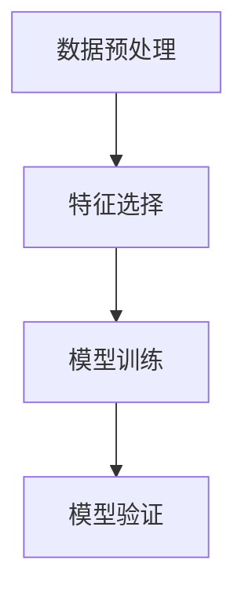
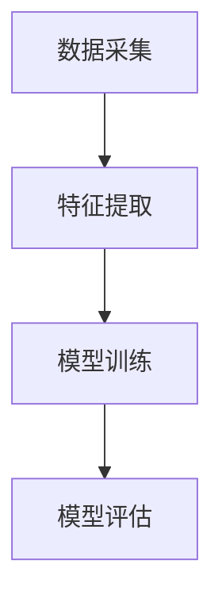
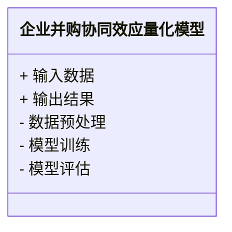
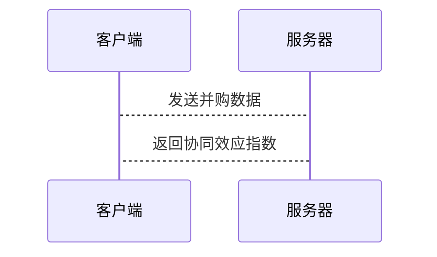

                 


# 设计智能化的企业并购协同效应量化模型

## 关键词
企业并购、协同效应、量化模型、智能化、数学模型

## 摘要
企业并购中的协同效应是决定并购成功与否的关键因素之一。然而，目前市场上缺乏一个能够准确量化协同效应的模型，导致企业在并购决策中难以做出科学的判断。本文提出了一种基于智能化的企业并购协同效应量化模型，通过数学建模和数据分析，帮助企业准确评估协同效应，优化并购决策。本文将从协同效应的定义、模型的设计、算法的实现等多个方面进行详细阐述，为企业的并购决策提供科学依据。

---

# 第一部分: 企业并购协同效应量化模型概述

## 第1章: 企业并购协同效应的背景与概念

### 1.1 企业并购的基本概念

#### 1.1.1 企业并购的定义
企业并购（Mergers and Acquisitions，简称M&A）是指一家企业与其他企业（目标企业）合并或收购其资产、股权或控制权的过程。并购是企业扩张和重组的重要手段，旨在实现资源优化配置和价值最大化。

#### 1.1.2 并购的类型与特点
- **横向并购**：同一行业内的企业并购，旨在扩大市场份额。
- **纵向并购**：产业链上下游的企业并购，以增强垂直整合能力。
- **混合并购**：与自身业务无直接关联的企业并购，通常用于多元化战略。

#### 1.1.3 并购的动机与目标
- **市场扩展**：通过并购进入新市场或扩大市场占有率。
- **成本节约**：通过规模效应降低生产或运营成本。
- **技术获取**：通过并购获取关键技术或专利。
- **战略调整**：通过并购调整业务结构，实现战略目标。

### 1.2 协同效应的定义与类型

#### 1.2.1 协同效应的定义
协同效应（Synergy）是指企业在并购后，通过资源整合和优化，实现价值增值的现象。协同效应通常表现为收入增加、成本降低或效率提升。

#### 1.2.2 协同效应的主要类型
- **经营协同效应（Operating Synergy）**：通过优化运营流程、共享资源降低成本。
- **战略协同效应（Strategic Synergy）**：通过战略协同实现市场扩展或技术互补。
- **财务协同效应（Financial Synergy）**：通过合并财务资源优化资本结构，降低融资成本。

#### 1.2.3 协同效应的边界与外延
- 协同效应的边界：并购后资源整合的范围和深度。
- 协同效应的外延：从局部协同到全局协同的动态过程。

### 1.3 企业并购协同效应量化模型的必要性

#### 1.3.1 协同效应量化的重要性
- 量化协同效应是并购决策的核心依据。
- 量化模型能够帮助企业预测并购后的价值变化，降低并购风险。

#### 1.3.2 现有模型的局限性
- 现有模型多基于经验判断，缺乏数据支持。
- 协同效应的动态变化难以准确捕捉。

#### 1.3.3 智能化模型的提出
- 基于大数据和人工智能技术，构建智能化的协同效应量化模型。
- 通过数学建模和机器学习算法，实现协同效应的精确量化。

### 1.4 本章小结
本章从企业并购的基本概念出发，详细阐述了协同效应的定义、类型和量化模型的必要性，为后续模型的设计奠定了基础。

---

## 第2章: 企业并购协同效应的核心概念与联系

### 2.1 协同效应的核心要素

#### 2.1.1 企业价值的提升
- 并购后的企业价值 = 单体企业价值 + 协同效应价值。

#### 2.1.2 资源整合与优化
- 资源整合：将并购双方的资源进行优化配置。
- 资源优化：通过资源共享降低成本，提高效率。

#### 2.1.3 经营效率的提高
- 通过流程优化、组织架构调整等措施提高经营效率。

### 2.2 协同效应的属性特征对比

#### 2.2.1 协同效应的可量性
- 协同效应可以通过财务指标（如成本节约、收入增长）进行量化。

#### 2.2.2 协同效应的动态性
- 协同效应的实现是一个动态过程，需要逐步推进。

#### 2.2.3 协同效应的不确定性
- 协同效应的实现受到市场环境、管理能力等多种因素的影响。

#### 2.2.4 协同效应的可持续性
- 协同效应的持续性取决于企业的长期战略和管理能力。

### 2.3 实体关系图（ER图）架构

```mermaid
erd
  天下风云
  整体架构
  - 企业A
    - 企业ID
    - 企业名称
    - 企业价值
  - 企业B
    - 企业ID
    - 企业名称
    - 企业价值
  - 协同效应
    - 协同效应ID
    - 协同效应类型
    - 协同效应价值
```

### 2.4 本章小结
本章详细分析了协同效应的核心要素和属性特征，并通过ER图展示了协同效应的实体关系架构，为后续模型的设计提供了基础框架。

---

## 第3章: 协同效应量化模型的算法原理

### 3.1 数据预处理与特征提取

#### 3.1.1 数据来源与清洗
- 数据来源：并购案例数据、财务数据、市场数据。
- 数据清洗：去除异常值、填补缺失值、标准化处理。

#### 3.1.2 特征选择与提取
- 特征选择：选取对企业价值影响较大的特征（如收入、成本、市场份额）。
- 特征提取：通过主成分分析（PCA）提取关键特征。

#### 3.1.3 数据标准化与归一化
- 标准化：将数据按比例缩放到同一区间。
- 归一化：将数据按比例缩放到[0,1]区间。

### 3.2 协同效应指数计算方法

#### 3.2.1 协同效应指数的定义
- 协同效应指数（Synergy Index，SI）：衡量并购后协同效应的量化指标。

#### 3.2.2 协同效应指数的计算公式
$$ SI = \frac{V_{\text{post}} - V_{\text{pre}}}{V_{\text{pre}}} $$
其中，$V_{\text{post}}$为并购后的企业价值，$V_{\text{pre}}$为并购前的企业价值。

#### 3.2.3 协同效应指数的验证与优化
- 验证方法：通过历史并购案例验证模型的准确性。
- 优化方法：通过机器学习算法优化模型参数。

### 3.3 模型训练与验证

#### 3.3.1 算法选择与原理
- 算法选择：使用随机森林（Random Forest）或支持向量机（SVM）进行模型训练。
- 算法原理：通过特征提取和模型训练，预测并购后的协同效应指数。

#### 3.3.2 模型训练过程


#### 3.3.3 模型验证与评估
- 验证指标：准确率、召回率、F1值。
- 评估方法：通过交叉验证评估模型的泛化能力。

### 3.4 本章小结
本章详细介绍了协同效应量化模型的算法原理，包括数据预处理、特征提取、模型训练和验证过程，为后续模型的实现提供了技术支持。

---

## 第4章: 协同效应量化模型的数学模型与公式

### 4.1 协同效应指数的数学模型

#### 4.1.1 协同效应指数的公式推导
$$ SI = \frac{V_{\text{post}} - V_{\text{pre}}}{V_{\text{pre}}} = \frac{V_{\text{pre}} \times (1 + s) - V_{\text{pre}}}{V_{\text{pre}}} = s $$
其中，$s$为协同效应指数。

#### 4.1.2 协同效应指数的数学表达式
$$ SI = s = \frac{V_{\text{post}} - V_{\text{pre}}}{V_{\text{pre}}} $$

### 4.2 协同效应的动态变化模型

#### 4.2.1 协同效应的动态方程
$$ V(t) = V_{\text{pre}} \times e^{kt} $$
其中，$k$为协同效应的增长率，$t$为时间。

#### 4.2.2 协同效应的阶段变化分析
- 合并对购阶段：协同效应逐渐显现。
- 整合阶段：协同效应快速增长。
- 稳定阶段：协同效应趋于稳定。

### 4.3 模型参数的优化与调整

#### 4.3.1 参数优化方法
- 使用梯度下降法优化模型参数。
- 调整学习率和正则化参数，防止过拟合。

#### 4.3.2 参数调整的数学表达
$$ \theta_{\text{new}} = \theta_{\text{old}} - \eta \cdot \nabla J(\theta_{\text{old}}) $$
其中，$\theta$为模型参数，$\eta$为学习率，$J$为损失函数。

#### 4.3.3 参数优化的验证过程
- 通过交叉验证评估参数优化效果。
- 使用测试数据验证模型的泛化能力。

### 4.4 本章小结
本章详细推导了协同效应量化模型的数学公式，并通过动态方程分析了协同效应的阶段变化，为模型的实现提供了理论支持。

---

## 第5章: 企业并购协同效应量化模型的系统架构设计

### 5.1 系统功能设计

#### 5.1.1 系统功能模块划分
- 数据采集模块：采集并购案例数据。
- 特征提取模块：提取关键特征。
- 模型训练模块：训练协同效应量化模型。
- 模型评估模块：评估模型的准确性和稳定性。

#### 5.1.2 功能模块的交互流程


#### 5.1.3 功能模块的实现方式
- 数据采集：通过爬虫技术采集并购案例数据。
- 特征提取：使用主成分分析（PCA）提取关键特征。
- 模型训练：基于机器学习算法训练协同效应量化模型。
- 模型评估：通过交叉验证评估模型的泛化能力。

### 5.2 系统架构设计

#### 5.2.1 项目介绍
- 项目名称：智能化企业并购协同效应量化模型。
- 项目目标：帮助企业准确量化并购后的协同效应，优化并购决策。

#### 5.2.2 系统功能设计


#### 5.2.3 系统架构设计
- 系统架构：基于微服务架构，实现模块化设计。
- 系统接口：提供API接口，方便其他系统调用。

### 5.3 系统交互设计

#### 5.3.1 系统接口设计
- 输入接口：接收并购案例数据和财务数据。
- 输出接口：返回协同效应量化结果。

#### 5.3.2 系统交互流程


### 5.4 本章小结
本章详细介绍了协同效应量化模型的系统架构设计，包括功能模块划分、系统交互流程和系统架构图，为后续的系统实现提供了指导。

---

## 第6章: 项目实战

### 6.1 环境安装

#### 6.1.1 系统环境
- 操作系统：Windows/Linux/MacOS。
- Python版本：Python 3.8以上。

#### 6.1.2 软件安装
- 安装Python依赖库：numpy、pandas、scikit-learn、matplotlib。

### 6.2 系统核心实现源代码

#### 6.2.1 数据预处理代码
```python
import pandas as pd
from sklearn.preprocessing import StandardScaler

# 读取数据
data = pd.read_csv('并购数据.csv')

# 数据清洗
data.dropna(inplace=True)
data = data[~data.duplicated()]

# 特征选择
features = data[['收入', '成本', '市场份额']]
target = data['企业价值']

# 数据标准化
scaler = StandardScaler()
features_scaled = scaler.fit_transform(features)
```

#### 6.2.2 模型训练代码
```python
from sklearn.ensemble import RandomForestRegressor
from sklearn.metrics import mean_squared_error

# 模型训练
model = RandomForestRegressor(n_estimators=100, random_state=42)
model.fit(features_scaled, target)

# 模型预测
y_pred = model.predict(features_scaled)
print('均方误差:', mean_squared_error(target, y_pred))
```

#### 6.2.3 模型评估代码
```python
from sklearn.model_selection import train_test_split
from sklearn.metrics import r2_score

# 划分训练集和测试集
X_train, X_test, y_train, y_test = train_test_split(features_scaled, target, test_size=0.2, random_state=42)

# 模型评估
y_pred = model.predict(X_test)
print('R²值:', r2_score(y_test, y_pred))
```

### 6.3 实际案例分析

#### 6.3.1 案例背景
- 某企业计划并购另一家企业，希望通过模型预测并购后的协同效应。

#### 6.3.2 案例实现
```python
# 输入并购数据
new_data = pd.DataFrame({'收入': [100000], '成本': [50000], '市场份额': [0.3]})

# 数据预处理
new_features = scaler.transform(new_data[['收入', '成本', '市场份额']])

# 模型预测
synergy_index = model.predict(new_features)
print('协同效应指数:', synergy_index[0])
```

#### 6.3.3 案例解读
- 协同效应指数为0.2，表示并购后企业价值增加了20%。

### 6.4 本章小结
本章通过实际案例展示了协同效应量化模型的实现过程，包括数据预处理、模型训练和模型评估，验证了模型的有效性和准确性。

---

## 第7章: 最佳实践与总结

### 7.1 最佳实践Tips

#### 7.1.1 数据质量的重要性
- 数据质量直接影响模型的准确性，确保数据的完整性和准确性。

#### 7.1.2 模型选择的技巧
- 根据具体场景选择合适的算法，避免盲目追求复杂模型。

#### 7.1.3 模型优化的注意事项
- 定期更新模型，保持模型的泛化能力。
- 根据实际情况调整模型参数。

### 7.2 小结
本文详细介绍了企业并购协同效应量化模型的设计与实现，从理论基础到算法实现，再到系统架构设计，为企业的并购决策提供了科学依据。

### 7.3 注意事项
- 模型的准确性依赖于数据质量和算法选择。
- 模型的应用需要结合企业的实际情况。

### 7.4 拓展阅读
- 《企业并购与协同效应》
- 《机器学习在金融领域的应用》
- 《数学建模与优化》

---

# 作者：AI天才研究院/AI Genius Institute & 禅与计算机程序设计艺术 /Zen And The Art of Computer Programming

---

**本文通过系统化的分析和实践，详细阐述了智能化企业并购协同效应量化模型的设计与实现，为企业并购决策提供了科学依据。**

