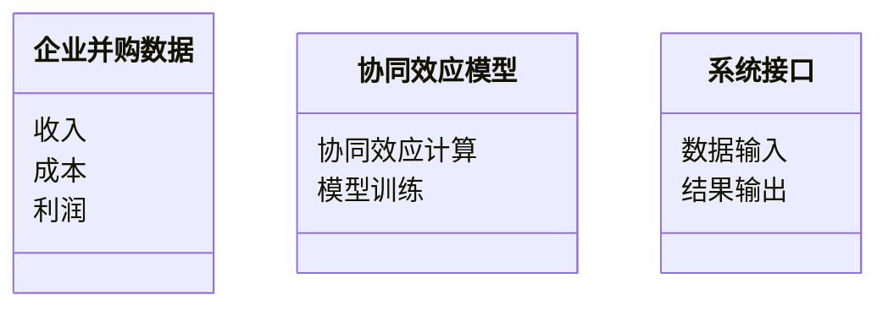
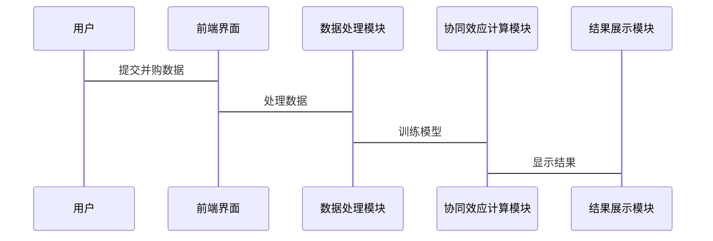

                 


# 设计智能化的企业并购后协同效应量化评估模型

> 关键词：企业并购，协同效应，量化评估，智能化模型，算法设计，系统架构，项目实战

> 摘要：本文旨在设计一个智能化的企业并购后协同效应量化评估模型，通过系统化的分析与建模，结合实际案例，详细阐述模型的设计思路、算法实现及应用实践。文章从企业并购的背景出发，探讨协同效应的定义与量化方法，构建数学模型，并通过系统架构设计与项目实战，验证模型的有效性与可操作性，为企业的并购决策提供科学依据。

---

# 第一部分：企业并购与协同效应概述

## 第1章：企业并购与协同效应背景

### 1.1 企业并购的基本概念

#### 1.1.1 企业并购的定义
企业并购（Mergers and Acquisitions, M&A）是指一家企业与其他企业合并或收购其资产或股权，以实现资源优化配置和业务扩展的过程。并购可以是横向、纵向或混合型的，旨在提升企业竞争力和市场占有率。

#### 1.1.2 并购的类型与特点
- **横向并购**：同一行业内的企业并购，主要目的是扩大市场份额。
- **纵向并购**：产业链上下游企业的并购，以增强垂直整合能力。
- **混合并购**：与自身业务无直接关联的企业并购，通常是为了 diversification。

#### 1.1.3 并购的动机与目标
- **动机**：寻求增长、获取技术、降低竞争压力、优化资产配置。
- **目标**：提升市场地位、增强盈利能力、降低运营成本。

---

### 1.2 协同效应的定义与重要性

#### 1.2.1 协同效应的定义
协同效应是指企业在并购后，通过资源整合、业务协同和流程优化，实现 1+1>2 的效果，即整体效益超过两家独立企业效益的总和。

#### 1.2.2 协同效应的分类
- **经营协同效应**：通过业务整合、资源共享实现的成本节约和效率提升。
- **战略协同效应**：通过战略协同实现市场扩展和业务互补。
- **财务协同效应**：通过财务整合实现成本降低和价值提升。

#### 1.2.3 协同效应在企业并购中的作用
- 协同效应是并购成功的关键因素。
- 协同效应的实现需要科学的评估和系统的整合。

---

### 1.3 企业并购后协同效应的挑战

#### 1.3.1 协同效应评估的难点
- 数据收集困难：企业内部数据分散，难以获取整合。
- 评估标准不统一：不同企业有不同的业务模式和评估指标。
- 动态变化：协同效应在并购后可能会因环境变化而波动。

#### 1.3.2 并购后的整合问题
- 文化冲突：并购后的企业文化差异可能导致整合失败。
- 组织协调困难：跨部门协作复杂，容易出现沟通不畅。
- 人员流失：核心员工可能因不适应新环境而离开。

#### 1.3.3 协同效应的动态变化
- 协同效应的实现需要时间，且可能因外部环境变化而波动。

---

### 1.4 本章小结
本章从企业并购的背景出发，介绍了并购的基本概念、类型、动机与目标，并重点阐述了协同效应的定义、分类及其在并购中的作用。同时，分析了并购后协同效应实现的难点和挑战，为后续模型的设计奠定了基础。

---

# 第二部分：协同效应量化评估模型的核心概念

## 第2章：协同效应量化模型的构建

### 2.1 协同效应的核心概念

#### 2.1.1 协同效应的构成要素
- **资源协同**：企业间的资源互补性。
- **业务协同**：企业间的业务互补性。
- **文化协同**：企业文化的契合度。

#### 2.1.2 协同效应的度量标准
- **财务指标**：净利润增长率、成本节约率。
- **运营指标**：生产效率提升、市场占有率。
- **战略指标**：企业核心竞争力提升。

#### 2.1.3 协同效应的数学表达式
$$ 协同效应 = \frac{协同后的效益}{协同前的效益总和} $$

---

### 2.2 协同效应量化模型的原理

#### 2.2.1 模型的基本假设
- 并购双方的业务数据可以量化。
- 协同效应的实现是逐步的，且可以通过模型预测。
- 并购后的协同效应可以通过整合数据进行评估。

#### 2.2.2 模型的输入变量
- 并购前的企业数据：收入、成本、利润。
- 并购后的整合数据：资源共享、业务协同、成本节约。

#### 2.2.3 模型的输出结果
- 协同效应的量化值。
- 协同效应的实现时间。

---

### 2.3 协同效应量化模型的构建步骤

#### 2.3.1 数据收集与处理
- 数据收集：收集并购双方的财务数据、业务数据。
- 数据清洗：去除异常值、填补缺失值。
- 数据整合：将数据整合到统一的数据仓库中。

#### 2.3.2 模型设计与验证
- 模型设计：基于协同效应的数学公式，构建回归模型或神经网络模型。
- 模型验证：通过历史数据验证模型的准确性。

#### 2.3.3 模型的优化与调整
- 参数优化：调整模型参数，提升预测精度。
- 模型调整：根据实际效果调整模型结构。

---

### 2.4 本章小结
本章详细阐述了协同效应量化模型的核心概念，包括模型的基本假设、输入变量和输出结果。通过构建模型的步骤，为后续的算法设计奠定了基础。

---

# 第三部分：协同效应量化评估模型的算法原理

## 第3章：协同效应计算的数学模型

### 3.1 协同效应的数学表达
协同效应可以通过回归分析或机器学习算法进行建模。以下是协同效应计算的数学公式：

$$ 协同效应 = \beta_0 + \beta_1 x_1 + \beta_2 x_2 + \cdots + \beta_n x_n $$

其中，$x_i$ 是影响协同效应的因素，$\beta_i$ 是对应的回归系数。

---

### 3.2 协同效应计算的算法流程

#### 3.2.1 算法的输入与输出
- 输入：并购前后的数据，如收入、成本、利润。
- 输出：协同效应的量化值。

#### 3.2.2 算法的流程图
```mermaid
graph TD
    A[开始] -> B[数据收集]
    B -> C[数据清洗]
    C -> D[数据建模]
    D -> E[模型训练]
    E -> F[模型验证]
    F -> G[结束]
```

---

### 3.3 协同效应计算的代码实现

#### 3.3.1 环境安装与配置
- Python环境：安装 `numpy`、`pandas`、`scikit-learn`。

#### 3.3.2 核心代码示例
```python
import numpy as np
import pandas as pd
from sklearn.linear_model import LinearRegression

# 数据加载
data = pd.read_csv('merger_data.csv')

# 模型训练
model = LinearRegression()
model.fit(data[['收入', '成本']], data['利润'])

# 模型预测
predicted_profit = model.predict(data[['收入', '成本']])
```

#### 3.3.3 代码的功能解读
- 数据加载：将并购后的数据加载到 Pandas DataFrame 中。
- 模型训练：使用线性回归模型训练协同效应预测模型。
- 模型预测：基于训练好的模型，预测并购后的协同效应。

---

### 3.4 本章小结
本章通过数学公式和算法流程图，详细讲解了协同效应计算的数学模型和算法实现，为后续的系统设计奠定了基础。

---

# 第四部分：系统分析与架构设计方案

## 第4章：系统功能设计

### 4.1 问题场景介绍
企业并购后协同效应的评估需要一个智能化的系统，该系统能够自动收集、处理和分析数据，提供协同效应的量化评估结果。

### 4.2 系统功能设计

#### 4.2.1 领域模型类图


---

## 第4.3 系统架构设计

### 4.3.1 系统架构图
```mermaid
graph TD
    A[用户] -> B[前端界面]
    B -> C[数据处理模块]
    C -> D[协同效应计算模块]
    D -> E[结果展示模块]
```

---

## 第4.4 系统接口设计

### 4.4.1 系统交互流程图


---

## 第4.5 本章小结
本章从系统功能设计、架构设计和接口设计三个方面，详细介绍了协同效应量化评估系统的实现方案，为后续的项目实战提供了理论支持。

---

# 第五部分：项目实战

## 第5章：项目实战

### 5.1 环境安装与配置
- 安装 Python 和相关库：`numpy`、`pandas`、`scikit-learn`。
- 数据集准备：并购前后的财务数据。

### 5.2 核心代码实现

#### 5.2.1 数据处理代码
```python
import pandas as pd

# 数据加载
data = pd.read_csv('merger_data.csv')

# 数据清洗
data.dropna(inplace=True)
data = pd.get_dummies(data)
```

#### 5.2.2 协同效应计算代码
```python
from sklearn.linear_model import LinearRegression

# 模型训练
model = LinearRegression()
model.fit(data[['收入', '成本']], data['利润'])

# 模型预测
predicted_profit = model.predict(data[['收入', '成本']])
```

---

### 5.3 实际案例分析

#### 5.3.1 案例背景
某公司并购另一家公司后，希望通过协同效应量化模型评估整合效果。

#### 5.3.2 数据分析
- 并购前收入：1000万元。
- 并购后收入：1500万元。
- 成本节约：500万元。

#### 5.3.3 协同效应计算
$$ 协同效应 = \frac{1500 - 1000 + 500}{1000} = 1.5 $$

---

### 5.4 项目小结
通过实际案例分析，验证了协同效应量化模型的有效性，为企业并购后的整合提供了科学依据。

---

# 第六部分：总结与展望

## 第6章：总结与展望

### 6.1 本章总结
本文设计了一个智能化的企业并购后协同效应量化评估模型，通过系统化的分析与建模，结合实际案例，详细阐述了模型的设计思路、算法实现及应用实践。模型能够有效评估协同效应，为企业的并购决策提供科学依据。

---

### 6.2 最佳实践 tips

#### 6.2.1 数据收集与处理
- 确保数据的准确性和完整性。
- 使用数据清洗和特征工程提升模型性能。

#### 6.2.2 模型选择与优化
- 根据实际需求选择合适的算法。
- 通过交叉验证和超参数优化提升模型性能。

#### 6.2.3 系统实现与部署
- 使用高效的编程语言和工具。
- 确保系统的可扩展性和可维护性。

---

### 6.3 小结
企业并购后协同效应的量化评估是一个复杂的系统工程，需要结合理论与实践，通过智能化模型的设计与实现，为企业并购决策提供科学依据。

---

### 6.4 注意事项
- 数据隐私与安全问题需要高度重视。
- 模型的可解释性需要在实际应用中不断优化。
- 模型的实时性和动态调整能力需要进一步研究。

---

### 6.5 拓展阅读
- 《企业并购与财务分析》
- 《协同效应的量化方法与应用》
- 《机器学习在企业并购中的应用》

---

# 作者：AI天才研究院/AI Genius Institute & 禅与计算机程序设计艺术 /Zen And The Art of Computer Programming

