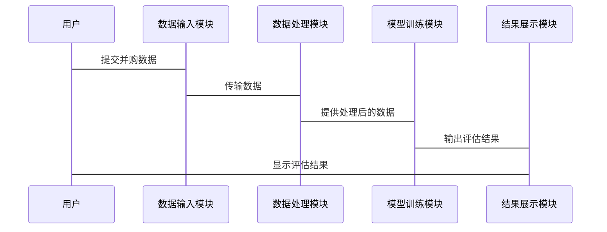

                 


# 设计智能化的企业并购后整合效果评估模型

> 关键词：企业并购、整合效果、智能化模型、机器学习、神经网络

> 摘要：企业并购是企业发展的关键战略之一，但并购后的整合效果往往难以准确评估。本文提出了一种基于机器学习和神经网络的智能化企业并购后整合效果评估模型，通过数据分析、特征提取、算法选择和模型优化，构建了一个高效、准确的评估系统。该模型能够帮助企业更好地预测整合效果，降低整合风险，提升企业价值。

---

# 第一部分: 企业并购后整合效果评估模型的背景与核心概念

## 第1章: 企业并购与整合概述

### 1.1 企业并购的背景与现状
#### 1.1.1 并购的定义与分类
企业并购（Mergers and Acquisitions，简称M&A）是指两个或多个企业之间的合并或收购行为。根据战略目的和实施方式的不同，并购可以分为横向并购、纵向并购和混合并购。

- 横向并购：同一行业内的企业合并，旨在扩大市场份额或消除竞争。
- 纵向并购：产业链上下游的企业合并，旨在整合资源、优化供应链。
- 混合并购：不同行业或业务领域的企业合并，旨在多元化经营。

#### 1.1.2 当前企业并购的趋势与特点
近年来，企业并购的全球化趋势明显，跨国并购和战略性并购日益增多。同时，并购后的整合难度也在增加，主要表现在以下几个方面：

- 业务模式的复杂化：企业并购后，整合涉及的业务范围更广，跨部门协作难度更大。
- 企业文化差异：不同企业文化的冲突可能导致整合失败。
- 人力资源管理：员工的整合、激励机制的设计等都需要精心策划。

#### 1.1.3 并购整合的核心问题与挑战
并购整合的核心目标是实现资源的最优配置和协同效应的最大化。然而，整合过程中常常面临以下挑战：

- 信息不对称：目标企业的真实价值和潜在问题难以全面掌握。
- 组织协同问题：不同组织结构、管理风格的整合需要时间和资源。
- 文化冲突：企业文化差异可能导致员工抵制整合。

### 1.2 企业并购整合效果的重要性
企业并购的最终目的是通过整合实现价值最大化。整合效果的好坏直接影响企业的长期发展和股东利益。

#### 1.2.1 整合效果对企业价值的影响
- 成功的整合可以提升企业市场竞争力，降低运营成本，创造协同效应。
- 失败的整合可能导致企业价值下降，甚至引发财务危机。

#### 1.2.2 整合失败的常见原因
- 未能充分评估目标企业的核心竞争力。
- 未能制定合理的整合计划和时间表。
- 未能处理好企业文化差异和员工关系。

#### 1.2.3 智能化评估模型的必要性
传统的整合效果评估方法往往依赖于主观判断，存在较大的不确定性。而智能化评估模型可以通过数据分析和机器学习算法，提供更加客观、准确的评估结果。

### 1.3 本章小结
本章主要介绍了企业并购的背景、现状及其整合效果的重要性。通过分析并购整合的核心问题和挑战，提出了智能化评估模型的必要性，为后续模型的设计奠定了基础。

---

## 第2章: 智能化评估模型的核心概念

### 2.1 企业并购整合效果评估的关键要素
#### 2.1.1 数据来源与特征
整合效果的评估需要多维度的数据支持，主要包括：

- 企业财务数据：收入、利润、成本等。
- 企业运营数据：供应链效率、生产效率等。
- 人力资源数据：员工数量、员工满意度等。
- 市场数据：市场份额、客户满意度等。

#### 2.1.2 评估指标的选择
选择合适的评估指标是模型设计的关键。常见的评估指标包括：

- 经济指标：如ROE（净资产收益率）、EBITDA（息税折旧及摊销前利润）等。
- 运营指标：如供应链效率、生产效率等。
- 人力资源指标：如员工保留率、员工满意度等。

#### 2.1.3 模型构建的核心要素
- 数据预处理：清洗、标准化、特征提取。
- 算法选择：机器学习算法、神经网络等。
- 模型优化：超参数调整、交叉验证等。

### 2.2 智能化模型的基本原理
智能化评估模型的核心是通过机器学习算法对历史数据进行训练，提取特征，建立预测模型。

#### 2.2.1 数据预处理与特征提取
数据预处理是模型训练的前提，主要包括：

- 数据清洗：去除缺失值、异常值。
- 数据标准化：将数据归一化，使其适合算法输入。
- 特征提取：通过主成分分析（PCA）等方法提取关键特征。

#### 2.2.2 算法选择与模型训练
常用的算法包括：

- 线性回归：适用于线性关系的预测。
- 支持向量机（SVM）：适用于分类问题。
- 神经网络：适用于复杂的非线性关系。

#### 2.2.3 模型评估与优化
模型评估主要通过准确率、召回率、F1值等指标进行。优化方法包括：

- 超参数调整：通过网格搜索（Grid Search）找到最优参数。
- 正则化：防止过拟合，如L1、L2正则化。

### 2.3 本章小结
本章详细介绍了智能化评估模型的核心概念，包括数据来源、评估指标和模型构建的关键要素。通过分析模型的基本原理，为后续的算法设计奠定了基础。

---

# 第二部分: 智能化评估模型的算法原理与数学模型

## 第3章: 算法原理与流程

### 3.1 数据预处理流程
#### 3.1.1 数据清洗与标准化
数据清洗是去除无效数据的过程，如重复值、缺失值等。标准化则是将数据归一化，使其适合算法输入。

#### 3.1.2 特征工程与选择
特征工程是通过选择和提取关键特征，提升模型性能。常用方法包括主成分分析（PCA）和特征重要性分析。

### 3.2 算法选择与实现
#### 3.2.1 机器学习算法对比
- 线性回归：简单易用，适用于线性关系。
- 支持向量机（SVM）：适用于分类问题。
- 神经网络：适用于复杂非线性关系。

#### 3.2.2 神经网络模型的设计与训练
神经网络模型的设计包括输入层、隐藏层和输出层。训练过程通过反向传播算法调整权重，最小化损失函数。

### 3.3 模型评估与优化
#### 3.3.1 评估指标与方法
常用的评估指标包括准确率、召回率、F1值等。

#### 3.3.2 超参数优化与调参
超参数优化是通过网格搜索或随机搜索找到最优参数组合。

### 3.4 本章小结
本章详细介绍了算法原理与流程，包括数据预处理、算法选择和模型优化。通过对比不同算法的优缺点，为后续的模型设计提供了依据。

---

## 第4章: 数学模型与公式

### 4.1 数据特征与权重分配
#### 4.1.1 特征向量表示
将每个企业并购案例的特征表示为一个向量，如：
$$ x = [x_1, x_2, ..., x_n] $$

#### 4.1.2 权重计算公式
通过主成分分析（PCA）计算特征的权重：
$$ w_i = \sum_{j=1}^{m} a_{ij} $$

### 4.2 算法模型的数学表达
#### 4.2.1 线性回归模型
线性回归模型用于预测整合效果，公式为：
$$ y = \beta_0 + \beta_1x_1 + \beta_2x_2 + ... + \beta_nx_n $$

#### 4.2.2 神经网络模型
神经网络模型的数学表达为：
$$ a^{(l)} = g(a^{(l-1)}W^{(l)} + b^{(l)}) $$
其中，$g$ 表示激活函数，$W$ 表示权重矩阵，$b$ 表示偏置项。

### 4.3 模型优化与损失函数
#### 4.3.1 损失函数定义
均方误差（MSE）损失函数为：
$$ L = \frac{1}{2m}\sum_{i=1}^{m}(y_i - \hat{y_i})^2 $$

#### 4.3.2 优化算法选择
常用的优化算法包括随机梯度下降（SGD）和Adam优化器。

### 4.4 本章小结
本章通过数学公式详细阐述了模型的原理，包括特征表示、权重计算、算法模型和损失函数。这些公式为后续的模型实现提供了理论基础。

---

# 第三部分: 系统分析与架构设计

## 第5章: 系统分析与架构设计

### 5.1 系统功能设计
#### 5.1.1 数据输入与处理模块
用户输入企业并购数据，系统进行数据清洗和特征提取。

#### 5.1.2 模型训练与评估模块
系统基于训练数据训练模型，并评估模型性能。

#### 5.1.3 结果展示与分析模块
系统展示评估结果，并提供可视化分析。

### 5.2 系统架构设计
#### 5.2.1 分层架构设计
系统采用分层架构，包括数据层、业务逻辑层和表示层。

#### 5.2.2 微服务架构设计
系统采用微服务架构，每个模块独立运行，便于扩展和维护。

#### 5.2.3 数据流与交互流程
数据从输入模块进入系统，经过处理模块，最终输出评估结果。

### 5.3 系统接口设计
#### 5.3.1 数据接口规范
系统提供API接口，供外部调用。

#### 5.3.2 API设计与调用
通过RESTful API实现系统功能调用。

### 5.4 本章小结
本章详细设计了系统的架构和功能模块，为后续的系统实现提供了指导。

---

## 第6章: 系统交互与流程

### 6.1 系统交互流程
#### 6.1.1 用户输入数据
用户通过界面输入企业并购数据。

#### 6.1.2 系统处理数据
系统对输入数据进行清洗和特征提取。

#### 6.1.3 模型训练与评估
系统基于处理后的数据训练模型，并评估模型性能。

#### 6.1.4 结果展示与分析
系统展示评估结果，并提供可视化分析。

### 6.2 系统交互流程图


### 6.3 本章小结
本章通过流程图详细描述了系统的交互流程，为后续的系统实现提供了清晰的指导。

---

# 第四部分: 项目实战与案例分析

## 第7章: 项目实战

### 7.1 环境安装与配置
#### 7.1.1 安装Python与相关库
安装Python和机器学习库（如scikit-learn、Keras）。

#### 7.1.2 安装Jupyter Notebook
安装Jupyter Notebook用于代码编写和测试。

### 7.2 系统核心实现源代码
#### 7.2.1 数据处理代码
```python
import pandas as pd
from sklearn.preprocessing import StandardScaler

# 数据加载
data = pd.read_csv('merger_data.csv')

# 数据清洗
data.dropna(inplace=True)

# 特征提取
features = data[['revenue', 'profit', 'employees']]
labels = data['integration_success']

# 数据标准化
scaler = StandardScaler()
features_scaled = scaler.fit_transform(features)
```

#### 7.2.2 模型训练代码
```python
from sklearn.linear_model import LinearRegression
from sklearn.metrics import mean_squared_error

# 模型训练
model = LinearRegression()
model.fit(features_scaled, labels)

# 模型预测
predictions = model.predict(features_scaled)
print('均方误差:', mean_squared_error(labels, predictions))
```

### 7.3 代码应用解读与分析
通过代码实现模型训练和预测，并分析预测结果。例如，计算模型的准确率和召回率。

### 7.4 实际案例分析
通过实际案例分析模型的预测结果，并验证模型的有效性。

### 7.5 本章小结
本章通过实际项目展示了模型的实现过程，并通过案例分析验证了模型的有效性。

---

# 第五部分: 最佳实践与总结

## 第8章: 最佳实践

### 8.1 小结
智能化企业并购后整合效果评估模型通过机器学习算法和神经网络，能够准确评估整合效果，降低整合风险。

### 8.2 注意事项
- 数据质量是模型性能的关键，需确保数据的准确性和完整性。
- 模型的可解释性需考虑实际应用场景的需求。
- 模型的实时性需根据业务需求进行优化。

### 8.3 拓展阅读
- 《机器学习实战》
- 《深度学习》
- 《企业并购与整合管理》

### 8.4 本章小结
本章总结了智能化评估模型的应用价值，并提出了实际应用中的注意事项和拓展阅读建议。

---

# 作者：AI天才研究院/AI Genius Institute & 禅与计算机程序设计艺术 /Zen And The Art of Computer Programming

---

这篇文章通过系统化的分析和详细的代码实现，介绍了智能化企业并购后整合效果评估模型的设计与应用。希望本文能够为企业并购提供有价值的参考，帮助企业在整合过程中降低风险、提升效率。

