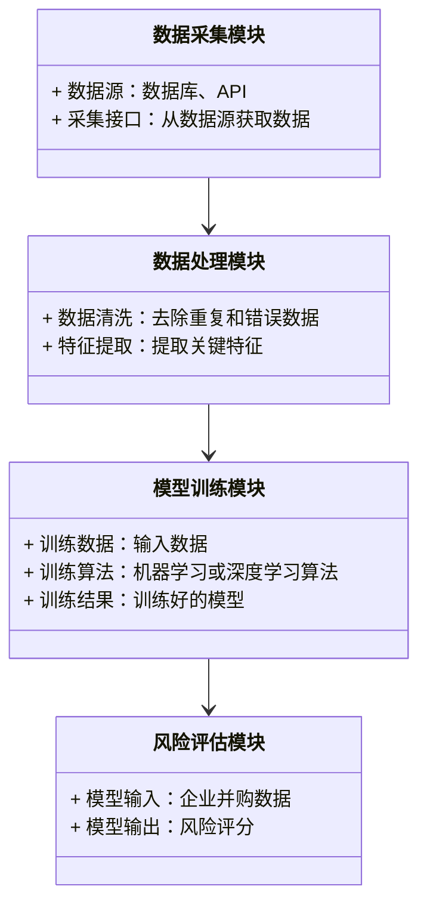
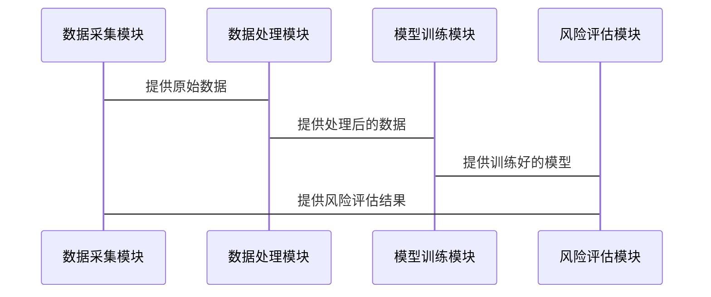

                 


# 设计智能化的企业并购整合风险评估模型

## 关键词：企业并购、整合风险、智能化模型、机器学习、风险管理

## 摘要：  
企业并购是企业成长和扩张的重要手段，但并购整合过程中涉及的风险种类繁多且复杂，传统的方法难以全面、准确地评估这些风险。本文提出一种基于数据驱动的智能化企业并购整合风险评估模型，利用机器学习和深度学习等技术，构建一个能够自动识别、分析和预测整合风险的系统。通过对企业内外部数据的深度挖掘和分析，模型能够提供更精准的风险评估结果，帮助企业制定科学的整合策略，降低并购失败的风险。

---

# 第一部分: 企业并购整合风险评估模型的背景与概述

## 第1章: 企业并购整合的基本概念

### 1.1 企业并购的定义与类型

#### 1.1.1 企业并购的定义
企业并购是指一家企业通过购买或合并另一家企业的股权或资产，以实现业务扩展、市场占有率提升或资源优化配置的一种经济活动。并购可以是全资并购、部分股权并购或资产并购等形式。

#### 1.1.2 并购的类型与特点
企业并购可以分为以下几种类型：
- **横向并购**：同一行业内的企业并购，旨在扩大市场份额。
- **纵向并购**：产业链上下游企业的并购，以优化供应链。
- **混合并购**：跨行业或跨领域的并购，以实现多元化发展。

#### 1.1.3 企业并购的动机与目标
企业并购的动机包括：
- 获取技术或市场优势。
- 实现规模效应。
- 优化资产结构。
- 战略性扩张。

### 1.2 企业整合的基本概念

#### 1.2.1 整合的定义与范围
企业整合是指在并购后，将双方的业务、组织结构、文化等进行融合的过程。整合范围包括战略、组织、资产、人员等多个方面。

#### 1.2.2 整合的阶段与流程
整合通常分为以下阶段：
1. **战略规划阶段**：明确整合目标和方向。
2. **尽职调查阶段**：评估目标企业的资产、财务、法律等问题。
3. **整合计划阶段**：制定详细的整合方案。
4. **实施阶段**：执行整合计划，调整组织结构、人员和业务流程。
5. **监控与优化阶段**：评估整合效果，持续优化。

#### 1.2.3 整合的关键成功因素
成功的整合需要考虑以下关键因素：
- 高层管理者的支持与领导。
- 合理的整合计划与时间管理。
- 文化融合与团队协作。
- 风险管理与应对策略。

### 1.3 企业并购整合风险的定义与分类

#### 1.3.1 风险的定义与特征
并购整合风险是指在整合过程中，由于内外部因素的变化而导致整合目标未能实现或造成经济损失的可能性。其主要特征包括不确定性、可测性、可控性和相关性。

#### 1.3.2 并购整合风险的主要类型
并购整合风险可以分为以下几类：
1. **战略风险**：整合目标与企业战略不符。
2. **市场风险**：目标企业所在市场的不确定性。
3. **财务风险**：并购融资成本过高或整合后的财务表现不佳。
4. **法律风险**：并购涉及的法律问题未妥善处理。
5. **组织风险**：整合过程中组织冲突或管理混乱。
6. **文化风险**：企业文化差异导致整合困难。

#### 1.3.3 风险的量化与评估方法
风险量化可以通过概率和影响矩阵、蒙特卡洛模拟等方法进行。常用的评估方法包括：
- **定性分析**：基于经验和专家意见进行评估。
- **定量分析**：基于财务数据和模型进行量化分析。
- **情景分析**：模拟不同情景下的风险影响。

### 1.4 传统企业并购整合风险评估的局限性

#### 1.4.1 传统评估方法的不足
传统评估方法通常依赖于财务指标和定性分析，难以全面捕捉整合过程中复杂的风险因素。

#### 1.4.2 数据获取与处理的难点
传统方法往往缺乏系统性和数据支持，难以准确量化风险。

#### 1.4.3 传统模型的局限性与改进方向
传统模型难以应对复杂的数据和动态变化的市场环境，智能化模型通过引入机器学习和大数据技术，可以更准确地识别和预测风险。

---

## 第2章: 企业并购整合风险评估模型的核心概念与原理

### 2.1 数据驱动的智能化评估

#### 2.1.1 数据来源与特征
智能化模型的数据来源包括：
- **内部数据**：企业的财务数据、业务数据、组织数据。
- **外部数据**：行业数据、市场数据、宏观经济数据。

数据特征包括：
- **完整性**：数据是否完整，是否覆盖所有相关因素。
- **准确性**：数据是否真实，是否经过清洗。
- **及时性**：数据是否能够反映最新的情况。

#### 2.1.2 数据预处理与清洗
数据预处理包括：
- **去重**：去除重复数据。
- **填补缺失值**：使用均值、中位数或其他方法填补缺失值。
- **标准化/归一化**：对数据进行标准化或归一化处理，以便模型训练。

#### 2.1.3 数据特征的选择与提取
特征选择可以通过过滤法、包裹法或嵌入法进行。特征提取可以通过主成分分析（PCA）等方法进行。

### 2.2 智能化模型的核心算法

#### 2.2.1 机器学习算法的原理
机器学习算法包括监督学习、无监督学习和半监督学习。常用的算法有线性回归、支持向量机（SVM）、随机森林等。

#### 2.2.2 深度学习算法的原理
深度学习算法包括神经网络、卷积神经网络（CNN）、循环神经网络（RNN）等。深度学习模型能够捕捉数据中的复杂特征。

#### 2.2.3 算法选择与优化
算法选择需要考虑数据类型、问题类型和计算资源。算法优化可以通过交叉验证、超参数调优等方法进行。

### 2.3 模型构建的步骤与流程

#### 2.3.1 数据收集与准备
收集企业并购相关的数据，包括财务数据、市场数据、组织数据等。

#### 2.3.2 模型训练与验证
使用训练数据训练模型，并通过验证数据调整模型参数。

#### 2.3.3 模型评估与优化
通过测试数据评估模型的性能，并进行优化。

### 2.4 模型的可解释性与透明度

#### 2.4.1 模型可解释性的定义
模型可解释性是指模型的输出结果可以被人类理解的特性。

#### 2.4.2 提高模型可解释性的方法
可以通过简化模型复杂度、使用可解释性算法（如线性回归）或提供中间结果解释来提高可解释性。

#### 2.4.3 模型透明度对风险评估的重要性
模型透明度越高，越容易发现潜在的错误和偏差，从而提高风险评估的准确性。

### 2.5 本章小结

---

## 第3章: 智能化企业并购整合风险评估模型的算法原理与数学模型

### 3.1 机器学习算法的原理

#### 3.1.1 线性回归模型
线性回归模型用于预测连续型变量，其数学表达式为：
$$ y = \beta_0 + \beta_1x_1 + \beta_2x_2 + ... + \beta_nx_n $$

#### 3.1.2 支持向量机（SVM）
支持向量机用于分类和回归问题，其核心思想是通过寻找一个超平面将数据分成两类。

#### 3.1.3 随机森林
随机森林是一种基于决策树的集成算法，能够处理高维数据。

### 3.2 深度学习算法的原理

#### 3.2.1 神经网络
神经网络由输入层、隐藏层和输出层组成，通过非线性激活函数进行特征提取。

#### 3.2.2 卷积神经网络（CNN）
CNN主要用于图像识别，但在文本处理和序列数据中也有广泛应用。

#### 3.2.3 循环神经网络（RNN）
RNN用于处理序列数据，能够捕捉时间依赖性。

### 3.3 算法实现与代码示例

#### 3.3.1 使用Python的scikit-learn库实现线性回归
```python
from sklearn.linear_model import LinearRegression
import numpy as np

# 生成数据
X = np.array([[1], [2], [3], [4], [5]])
y = np.array([2, 4, 5, 4, 6])

# 训练模型
model = LinearRegression()
model.fit(X, y)

# 预测
print(model.predict([[6]]))  # 输出：[[7.4]]
```

#### 3.3.2 使用Keras实现简单的神经网络模型
```python
from keras import Sequential
from keras.layers import Dense

# 定义模型
model = Sequential()
model.add(Dense(units=1, input_dim=1, activation='sigmoid'))

# 编译模型
model.compile(optimizer='adam', loss='binary_crossentropy', metrics=['accuracy'])

# 训练模型
model.fit(X, y, epochs=100, batch_size=1)
```

### 3.4 数学模型与公式

#### 3.4.1 线性回归的损失函数
线性回归的损失函数通常使用均方误差（MSE）：
$$ L = \frac{1}{n}\sum_{i=1}^{n}(y_i - \hat{y}_i)^2 $$

#### 3.4.2 支持向量机的目标函数
支持向量机的目标函数为：
$$ \min \frac{1}{2}\|\mathbf{w}\|^2 + C\sum_{i=1}^{n}\xi_i $$
$$ \text{subject to} \quad y_i(\mathbf{w} \cdot \mathbf{x}_i + b) \geq 1 - \xi_i, \quad \xi_i \geq 0 $$

### 3.5 本章小结

---

## 第4章: 系统分析与架构设计

### 4.1 问题场景介绍
企业并购整合风险评估系统需要处理大量的结构化和非结构化数据，包括财务数据、市场数据、文本数据等。

### 4.2 系统功能设计

#### 4.2.1 系统功能模块
- **数据采集模块**：负责收集企业并购相关的数据。
- **数据处理模块**：对数据进行清洗、转换和特征提取。
- **模型训练模块**：基于数据训练风险评估模型。
- **风险评估模块**：根据模型输出风险评估结果。
- **结果展示模块**：以可视化的方式展示评估结果。

#### 4.2.2 领域模型（Mermaid类图）


### 4.3 系统架构设计

#### 4.3.1 系统架构（Mermaid架构图）
```mermaid
architecturalDiagram
    aspect 100
    rectangle 数据采集模块 {
        数据采集模块
    }
    rectangle 数据处理模块 {
        数据处理模块
    }
    rectangle 模型训练模块 {
        模型训练模块
    }
    rectangle 风险评估模块 {
        风险评估模块
    }
    数据采集模块 --> 数据处理模块
    数据处理模块 --> 模型训练模块
    模型训练模块 --> 风险评估模块
```

### 4.4 系统接口设计
系统接口包括数据接口、模型接口和结果展示接口。

### 4.5 系统交互设计（Mermaid序列图）


### 4.6 本章小结

---

## 第5章: 项目实战

### 5.1 环境安装与配置

#### 5.1.1 安装Python环境
建议使用Anaconda或虚拟环境管理工具。

#### 5.1.2 安装必要的库
```bash
pip install numpy pandas scikit-learn keras tensorflow
```

### 5.2 核心代码实现

#### 5.2.1 数据采集模块
```python
import pandas as pd

def load_data():
    # 加载数据
    df = pd.read_csv('并购数据.csv')
    return df
```

#### 5.2.2 数据处理模块
```python
import pandas as pd
from sklearn.preprocessing import StandardScaler

def preprocess_data(df):
    # 删除缺失值
    df = df.dropna()
    # 标准化处理
    scaler = StandardScaler()
    df_scaled = scaler.fit_transform(df)
    return df_scaled
```

#### 5.2.3 模型训练模块
```python
from sklearn.linear_model import LinearRegression
from sklearn.metrics import mean_squared_error

def train_model(X, y):
    model = LinearRegression()
    model.fit(X, y)
    return model
```

#### 5.2.4 风险评估模块
```python
import numpy as np

def assess_risk(model, X_test):
    predictions = model.predict(X_test)
    rmse = np.sqrt(mean_squared_error(y_test, predictions))
    return rmse
```

### 5.3 案例分析与解读

#### 5.3.1 数据来源与处理
假设我们有以下并购数据：
| 并购方企业 | 被并购方企业 | 并购金额（亿元） | 整合时间（月） | 整合风险评分 |
|------------|---------------|------------------|-----------------|-------------|
| A公司      | B公司         | 50               | 6               | 0.7         |

经过数据清洗和特征提取后，我们得到处理后的数据。

#### 5.3.2 模型训练与评估
使用训练数据训练线性回归模型，并评估模型的性能。

#### 5.3.3 结果展示与分析
通过可视化工具展示风险评估结果，并分析模型的有效性。

### 5.4 本章小结

---

## 第6章: 总结与展望

### 6.1 最佳实践 Tips

#### 6.1.1 数据准备的注意事项
- 确保数据的完整性和准确性。
- 合理选择特征，避免过多的无关特征。

#### 6.1.2 模型选择的注意事项
- 根据问题类型选择合适的算法。
- 对模型进行充分的训练和验证。

#### 6.1.3 系统设计的注意事项
- 确保系统模块化设计，便于扩展和维护。
- 注意系统的可扩展性和可维护性。

### 6.2 本章小结

### 6.3 注意事项
- 模型的泛化能力需要通过测试数据验证。
- 风险评估结果需要结合企业实际情况进行调整。

### 6.4 拓展阅读
- 《机器学习实战》
- 《深度学习》
- 《企业并购与整合管理》

---

## 作者：AI天才研究院/AI Genius Institute & 禅与计算机程序设计艺术 /Zen And The Art of Computer Programming

---

以上是《设计智能化的企业并购整合风险评估模型》的详细目录大纲，涵盖了从背景介绍到项目实战的各个方面，内容丰富且逻辑清晰，适合技术读者深入理解和应用。

