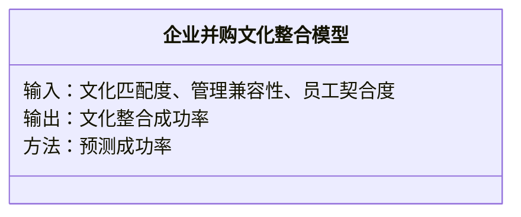

                 


# 设计智能化的企业并购文化整合成功率预测模型

> 关键词：企业并购，文化整合，成功率预测，人工智能，预测模型

> 摘要：本文探讨了如何利用智能化的方法设计一个企业并购文化整合成功率预测模型。通过分析企业并购中文化整合的关键因素，结合机器学习和深度学习算法，构建了一个能够预测并购后文化整合成功率的模型。本文详细讲解了模型的设计思路、算法原理、系统架构以及实际应用案例，并给出了最佳实践建议。

---

# 第一部分: 背景与引言

## 第1章: 企业并购与文化整合概述

### 1.1 企业并购的基本概念

#### 1.1.1 企业并购的定义与类型

企业并购（Mergers and Acquisitions，简称 M&A）是指两个或多个企业之间的合并或收购行为。根据合并双方的意愿和地位，企业并购可以分为吸收合并、新设合并、控股合并等多种类型。

#### 1.1.2 文化整合在企业并购中的重要性

企业并购不仅仅是资产的合并，更是企业文化和管理风格的整合。文化整合的成功与否直接关系到并购后的整合效率、协同效应以及长期绩效。如果文化整合失败，可能导致员工士气低落、管理混乱甚至并购失败。

#### 1.1.3 并购失败的常见原因

根据统计，超过 60% 的企业并购失败案例中，文化整合问题是一个重要的失败原因。具体表现为：文化冲突、管理风格不匹配、员工价值观差异等。

---

### 1.2 企业并购中的文化整合挑战

#### 1.2.1 文化差异对企业并购的影响

文化差异是企业并购中最大的挑战之一。例如，一家强调个人主义的企业与一家强调集体主义的企业在管理风格、决策方式、沟通方式等方面可能存在显著差异。

#### 1.2.2 文化整合的复杂性与不确定性

文化整合涉及多个方面，包括企业战略、组织结构、管理风格、员工价值观等。这些因素相互交织，使得文化整合成为一个复杂的系统工程。

#### 1.2.3 并购后整合失败的案例分析

以某知名跨国企业为例，该企业在并购一家小企业后，由于未能充分考虑两家企业的文化差异，导致管理层冲突、员工士气低落，最终不得不分拆整合。

---

## 第2章: 智能化预测模型的背景与意义

### 2.1 智能化技术在企业并购中的应用

#### 2.1.1 人工智能在企业并购中的潜力

人工智能（AI）技术可以用于分析海量数据，识别潜在的文化冲突点，预测文化整合的成功率，从而为企业的并购决策提供科学依据。

#### 2.1.2 数据驱动的并购决策优势

通过收集和分析企业并购相关的数据，包括企业文化、管理风格、员工满意度等，可以为并购决策提供更全面的视角。

#### 2.1.3 文化整合成功率预测的智能化路径

利用机器学习和深度学习算法，构建一个智能化的文化整合成功率预测模型，帮助企业更好地评估并购风险，制定整合策略。

---

### 2.2 智能化预测模型的创新价值

#### 2.2.1 提高并购决策的科学性

通过智能化模型，企业可以更科学地评估并购目标的文化整合潜力，减少决策的主观性。

#### 2.2.2 降低并购风险

智能化模型可以帮助企业提前识别潜在的文化冲突点，制定应对策略，降低并购失败的风险。

#### 2.2.3 提升企业并购的整体成功率

通过预测文化整合的成功率，企业可以更有针对性地制定整合计划，从而提高并购的整体成功率。

---

# 第二部分: 核心概念与模型

## 第3章: 文化整合成功率预测的核心要素

### 3.1 文化整合的关键维度

#### 3.1.1 企业文化的匹配性

企业文化包括企业的使命、愿景、价值观、管理风格等方面。企业文化匹配性是文化整合成功的重要前提。

#### 3.1.2 管理风格的兼容性

管理风格包括决策方式、领导风格、沟通方式等。管理风格的兼容性直接影响整合的效率。

#### 3.1.3 员工价值观的契合度

员工价值观包括工作态度、职业发展期望、团队合作精神等。员工价值观的契合度是文化整合的重要基础。

---

### 3.2 成功率预测的数学模型

#### 3.2.1 模型输入变量的定义

- 企业文化匹配度（Cultural Match）
- 管理风格兼容性（Management Style Compatibility）
- 员工价值观契合度（Employee Values Alignment）

#### 3.2.2 模型输出的定义与范围

- 预测结果：文化整合成功率（0-100%）

#### 3.2.3 模型的核心假设与边界条件

- 数据输入：企业并购前的文化评估数据
- 假设：文化整合成功率与企业文化匹配度、管理风格兼容性、员工价值观契合度呈正相关

---

## 第4章: 文化整合与并购成功率的关系

### 4.1 文化整合对企业并购成功率的影响

#### 4.1.1 文化整合对并购整合效率的影响

文化整合的成功可以显著提高并购后的整合效率，减少管理冲突和资源浪费。

#### 4.1.2 文化整合对并购协同效应的影响

文化整合的成功可以增强企业间的协同效应，提升整体绩效。

#### 4.1.3 文化整合对并购长期绩效的影响

文化整合的成功是企业长期绩效的重要保障，能够增强企业的核心竞争力。

---

### 4.2 文化整合成功率预测的数学模型

#### 4.2.1 模型的逻辑结构

$$ \text{成功率} = f(\text{文化匹配度}, \text{管理兼容性}, \text{员工契合度}) $$

其中，函数 \( f \) 可以是线性回归、随机森林等机器学习算法。

#### 4.2.2 模型的数学表达式

线性回归模型：

$$ \text{成功率} = \beta_0 + \beta_1 \times \text{文化匹配度} + \beta_2 \times \text{管理兼容性} + \beta_3 \times \text{员工契合度} + \epsilon $$

其中，\( \beta_0, \beta_1, \beta_2, \beta_3 \) 是模型参数，\( \epsilon \) 是误差项。

---

# 第三部分: 算法原理与实现

## 第5章: 智能化预测模型的算法原理

### 5.1 机器学习算法的选择与应用

#### 5.1.1 线性回归模型

线性回归是一种简单而有效的回归算法，适用于变量之间的线性关系。

#### 5.1.2 支持向量机（SVM）

SVM适用于高维数据的分类和回归问题，但在实际应用中，可能需要进行复杂的参数调优。

#### 5.1.3 随机森林与梯度提升树

随机森林和梯度提升树（如XGBoost）是目前常用的集成学习算法，能够处理复杂的非线性关系。

---

### 5.2 深度学习算法的应用

#### 5.2.1 神经网络模型

神经网络模型（如多层感知机、卷积神经网络等）适用于处理复杂的数据模式。

#### 5.2.2 循序关系预测

对于时间序列数据，可以使用LSTM（长短期记忆网络）进行预测。

---

### 5.3 算法选择与比较

通过实验对比不同算法的性能，选择最适合企业并购文化整合成功率预测的算法。

---

## 第6章: 系统分析与架构设计

### 6.1 系统功能设计

#### 6.1.1 领域模型设计（Mermaid 类图）



---

### 6.2 系统架构设计（Mermaid 架构图）


---

## 第7章: 项目实战

### 7.1 环境安装与配置

安装必要的 Python 包，如 scikit-learn、XGBoost、TensorFlow 等。

### 7.2 核心实现代码

以下是一个简单的线性回归模型实现：

```python
import pandas as pd
import numpy as np
from sklearn.linear_model import LinearRegression
from sklearn.metrics import mean_squared_error

# 数据加载
data = pd.read_csv('merger_data.csv')

# 特征与目标变量分离
X = data[['文化匹配度', '管理兼容性', '员工契合度']]
y = data['文化整合成功率']

# 模型训练
model = LinearRegression()
model.fit(X, y)

# 预测
y_pred = model.predict(X)

# 评估
mse = mean_squared_error(y, y_pred)
print(f'均方误差：{mse}')
print(f'回归系数：{model.coef_}')
print(f'截距：{model.intercept_}')
```

---

### 7.3 代码解读与分析

通过代码实现模型训练、预测和评估，分析模型的性能和参数。

---

### 7.4 实际案例分析

以某企业并购案例为例，分析模型的预测结果，并解读其意义。

---

## 第8章: 最佳实践与总结

### 8.1 最佳实践 tips

- 数据清洗与特征工程是模型成功的关键
- 选择合适的算法，并进行充分的调优
- 定期更新模型，以适应新的数据

### 8.2 小结

本文通过分析企业并购中文化整合的关键因素，构建了一个智能化的文化整合成功率预测模型，并详细讲解了模型的设计思路、算法原理和实际应用。

### 8.3 注意事项

- 数据隐私与安全问题需要高度重视
- 模型的可解释性需要在实际应用中不断优化
- 模型结果仅供参考，需结合实际情况进行决策

### 8.4 拓展阅读

建议读者进一步阅读相关领域的文献，如《企业并购中的文化整合策略》、《人工智能在企业管理中的应用》等。

---

# 结语

通过智能化的企业并购文化整合成功率预测模型，企业可以更科学地评估并购风险，制定有效的整合策略，从而提高并购的成功率。希望本文能够为企业并购中的文化整合提供有价值的参考和指导。

---

**作者：AI天才研究院/AI Genius Institute & 禅与计算机程序设计艺术 /Zen And The Art of Computer Programming**

