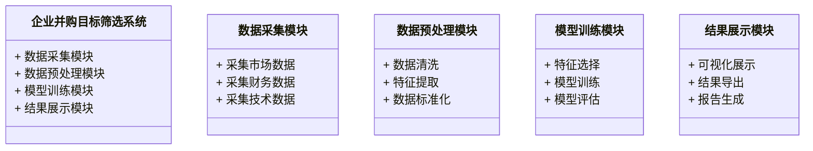
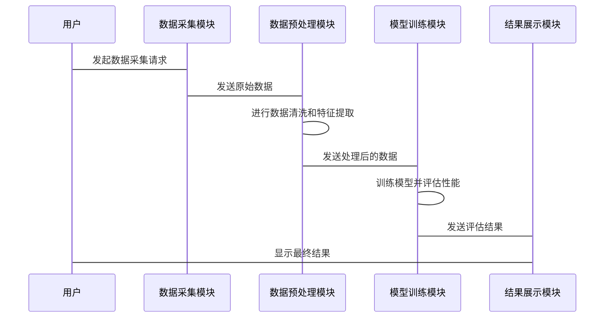

                 


# 设计智能化的企业并购目标筛选多维度评估模型

## 关键词：企业并购，目标筛选，多维度评估，智能化模型，机器学习，数据分析

## 摘要：  
在企业并购过程中，选择合适的并购目标是决定并购成功与否的关键因素。传统的并购目标筛选方法依赖于经验和主观判断，存在效率低下、结果不够精确等问题。随着人工智能和大数据技术的快速发展，设计一个智能化的企业并购目标筛选多维度评估模型，能够通过数据分析和智能算法，实现对潜在并购目标的全面、客观评估，从而提高并购决策的科学性和准确性。本文将从背景、核心概念、算法原理、系统设计、项目实战等多方面，详细探讨如何构建这样一个智能化的评估模型。

---

# 第一部分: 企业并购目标筛选的背景与挑战

## 第1章: 企业并购目标筛选的背景与问题

### 1.1 企业并购的基本概念

#### 1.1.1 并购的定义与分类
企业并购（Mergers and Acquisitions, M&A）是指一家企业与其他企业合并或收购其资产、股权等行为。并购可以分为两类：  
- **合并（Merger）**：两家或更多企业合并成一家新企业。  
- **收购（Acquisition）**：一家企业购买另一家企业的全部或部分股权或资产。

#### 1.1.2 并购的动机与目标
企业进行并购的主要动机包括：  
- **扩大市场规模**：通过并购快速进入新市场或扩大市场份额。  
- **获取技术和资源**：通过并购获取被收购企业的核心技术、专利或资源。  
- **优化资产配置**：通过并购整合资源，提高效率，降低成本。  
- **战略协同**：通过并购实现企业间的协同效应。

#### 1.1.3 并购的流程与关键环节
并购的典型流程包括：  
1. **战略规划**：明确并购目标和动机。  
2. **目标筛选**：通过多维度评估筛选出合适的并购目标。  
3. **尽职调查**：对目标企业进行详细调查，评估其财务、法律和业务风险。  
4. **估值与谈判**：对目标企业进行估值，确定并购价格，并展开谈判。  
5. **整合与实施**：完成并购后，对业务、资产和文化进行整合。  

---

### 1.2 传统企业并购评估的局限性

#### 1.2.1 传统评估方法的不足
传统的企业并购评估方法主要依赖于财务指标（如收入、利润、资产等）和主观判断。这种方法存在以下问题：  
- **数据维度有限**：仅依赖财务数据，忽略了市场、技术、管理等其他重要维度。  
- **主观性过强**：评估结果受到评估人员主观判断的影响，缺乏客观性。  
- **效率低下**：传统评估方法通常需要大量人工分析，效率较低。  

#### 1.2.2 数据分析在并购中的作用
随着大数据技术的发展，企业可以通过分析大量的内外部数据，发现潜在的并购机会。例如：  
- **市场数据**：分析目标企业的市场份额和竞争对手情况。  
- **财务数据**：评估目标企业的盈利能力、财务健康状况。  
- **技术数据**：分析目标企业的技术创新能力。  
- **管理数据**：评估目标企业的管理团队和组织结构。  

#### 1.2.3 智能化评估的必要性
为了克服传统评估方法的局限性，引入智能化的评估模型显得尤为重要。智能化评估可以通过机器学习算法，从多维度数据中提取有价值的信息，帮助企业在海量潜在并购目标中快速筛选出最合适的对象。

---

### 1.3 智能化企业并购的目标筛选

#### 1.3.1 数据驱动的并购决策
智能化评估模型通过整合和分析多维度数据，为并购决策提供数据支持。例如：  
- 利用自然语言处理技术分析目标企业的新闻报道和社交媒体数据，评估其市场声誉。  
- 利用机器学习模型预测目标企业的未来盈利能力。  

#### 1.3.2 多维度评估模型的构建
多维度评估模型需要考虑多个维度的指标，例如：  
- **财务指标**：收入、利润、资产负债率等。  
- **市场指标**：市场份额、行业趋势、竞争对手分析。  
- **技术指标**：专利数量、技术先进性、研发投入比例。  
- **管理指标**：管理团队经验、组织结构合理性、企业治理水平。  

#### 1.3.3 智能化筛选的核心价值
智能化筛选的核心价值在于：  
- 提高评估的全面性和客观性。  
- 提升评估效率，缩短筛选周期。  
- 发现潜在的优质目标，降低并购风险。  

---

## 第2章: 多维度评估模型的构建原理

### 2.1 多维度评估模型的定义
多维度评估模型是一种基于多个维度对企业进行综合评估的模型。它通过整合财务、市场、技术和管理等多个维度的数据，利用加权计算的方法，得出企业的综合评估分数。

### 2.2 多维度评估指标的设计

#### 2.2.1 财务指标
财务指标是评估企业盈利能力、财务健康状况的重要依据。常见的财务指标包括：  
- **收入**：企业的收入规模。  
- **净利润**：企业的盈利能力。  
- **资产负债率**：企业的财务风险。  

#### 2.2.2 市场指标
市场指标反映了企业在市场中的竞争力和地位。常见的市场指标包括：  
- **市场份额**：企业在目标市场的占有率。  
- **行业趋势**：行业的增长潜力和风险。  
- **竞争对手分析**：目标企业的竞争优势和劣势。  

#### 2.2.3 管理指标
管理指标反映了企业的管理能力和组织效率。常见的管理指标包括：  
- **管理团队经验**：管理团队的行业经验和能力。  
- **组织结构合理性**：企业的组织架构是否合理。  
- **企业治理水平**：企业的治理结构和透明度。  

### 2.3 指标权重的确定方法

#### 2.3.1 主观赋权法
主观赋权法是根据专家的主观判断来确定各个指标的权重。例如，可以通过德尔斐法（Delphi Method）邀请行业专家对各指标的重要性进行评分，然后根据评分结果确定权重。

#### 2.3.2 客观赋权法
客观赋权法是根据数据的分布情况自动计算权重。例如，可以通过主成分分析（PCA）或熵值法（Entropy Method）来确定指标权重。

#### 2.3.3 综合赋权法
综合赋权法是结合主观赋权法和客观赋权法，通过加权平均的方式确定最终的指标权重。

### 2.4 模型的数学表达

#### 2.4.1 多维度评估模型的公式
$$评估分数 = \sum_{i=1}^{n} w_i \cdot x_i$$  
其中，$w_i$为第i个指标的权重，$x_i$为第i个指标的评分。

---

## 第3章: 智能化筛选算法的设计与实现

### 3.1 算法设计目标
智能化筛选算法的目标是通过机器学习模型，对多维度数据进行分析，筛选出符合条件的潜在并购目标。

### 3.2 基于机器学习的分类模型

#### 3.2.1 算法选择
常见的机器学习算法包括：  
- **逻辑回归**：用于分类问题。  
- **支持向量机（SVM）**：适用于小规模数据的分类。  
- **随机森林**：适用于高维数据的分类和回归。  
- **神经网络**：适用于复杂的非线性分类问题。  

#### 3.2.2 算法实现步骤
1. **数据预处理**：对数据进行清洗、标准化和特征选择。  
2. **模型训练**：使用训练数据对机器学习模型进行训练。  
3. **模型评估**：通过交叉验证评估模型的性能。  
4. **模型优化**：调整模型参数，提高模型的准确率和召回率。  

#### 3.2.3 算法实现代码示例
```python
from sklearn.ensemble import RandomForestClassifier
from sklearn.model_selection import train_test_split
from sklearn.metrics import accuracy_score

# 数据预处理
X = ...  # 特征数据
y = ...  # 标签（1表示适合并购，0表示不适合）

# 划分训练集和测试集
X_train, X_test, y_train, y_test = train_test_split(X, y, test_size=0.2)

# 模型训练
model = RandomForestClassifier(n_estimators=100)
model.fit(X_train, y_train)

# 模型预测
y_pred = model.predict(X_test)

# 模型评估
accuracy = accuracy_score(y_test, y_pred)
print(f"模型准确率：{accuracy}")
```

### 3.3 算法的数学模型

#### 3.3.1 随机森林算法的数学表达
随机森林算法是一种基于决策树的集成学习算法。其数学表达如下：  
$$y = \text{sign}(\sum_{i=1}^{n} \text{Tree}_i(x))$$  
其中，$\text{Tree}_i$表示第i棵决策树的预测结果，$n$表示决策树的数量。

---

## 第4章: 系统分析与架构设计方案

### 4.1 问题场景介绍
为了实现智能化的企业并购目标筛选，我们需要构建一个基于多维度数据的评估系统。系统需要具备数据采集、数据预处理、模型训练和结果展示等功能。

### 4.2 系统功能设计

#### 4.2.1 领域模型（Mermaid 类图）


### 4.3 系统架构设计

#### 4.3.1 系统架构图（Mermaid 架构图）
```mermaid
archi
    title 企业并购目标筛选系统架构
    client --> 入口模块: 请求处理
    入口模块 --> 数据采集模块: 采集数据
    数据采集模块 --> 数据存储模块: 存储数据
    数据预处理模块 --> 数据存储模块: 加工数据
    模型训练模块 --> 数据存储模块: 读取数据
    模型训练模块 --> 模型存储模块: 存储模型
    结果展示模块 --> 模型存储模块: 读取模型
    结果展示模块 --> 用户界面: 显示结果
```

### 4.4 系统接口设计
系统接口设计需要考虑模块之间的交互方式。例如，数据采集模块可以通过API接口从外部数据源获取数据，模型训练模块可以通过接口调用数据预处理模块的数据。

### 4.5 系统交互设计

#### 4.5.1 系统交互流程图（Mermaid 序列图）


---

## 第5章: 项目实战

### 5.1 环境安装
为了实现企业并购目标筛选系统，我们需要安装以下环境：  
- **Python**：3.6+
- **机器学习库**：scikit-learn、xgboost
- **数据处理库**：pandas、numpy
- **可视化工具**：matplotlib、seaborn
- **Mermaid 工具**：用于绘制流程图和架构图。

### 5.2 系统核心实现源代码

#### 5.2.1 数据采集模块
```python
import pandas as pd

def collect_data():
    # 采集市场数据
    market_data = pd.read_csv('market.csv')
    # 采集财务数据
    financial_data = pd.read_csv('financial.csv')
    # 采集技术数据
    tech_data = pd.read_csv('tech.csv')
    return market_data, financial_data, tech_data

if __name__ == '__main__':
    collect_data()
```

#### 5.2.2 数据预处理模块
```python
import pandas as pd
from sklearn.preprocessing import StandardScaler

def preprocess_data(market_data, financial_data, tech_data):
    # 数据清洗
    market_data.dropna(inplace=True)
    financial_data.dropna(inplace=True)
    tech_data.dropna(inplace=True)
    # 特征提取
    features = pd.concat([market_data['revenue'], financial_data['net_profit'], tech_data['patents']], axis=1)
    # 数据标准化
    scaler = StandardScaler()
    features_standardized = scaler.fit_transform(features)
    return features_standardized

if __name__ == '__main__':
    preprocess_data()
```

#### 5.2.3 模型训练模块
```python
from sklearn.ensemble import RandomForestClassifier
from sklearn.model_selection import train_test_split
from sklearn.metrics import accuracy_score

def train_model(features_standardized, labels):
    X_train, X_test, y_train, y_test = train_test_split(features_standardized, labels, test_size=0.2)
    model = RandomForestClassifier(n_estimators=100)
    model.fit(X_train, y_train)
    y_pred = model.predict(X_test)
    accuracy = accuracy_score(y_test, y_pred)
    print(f"模型准确率：{accuracy}")
    return model

if __name__ == '__main__':
    train_model()
```

### 5.3 代码应用解读与分析
通过上述代码，我们可以实现企业并购目标筛选系统的数据采集、数据预处理和模型训练功能。数据采集模块从多个数据源获取数据，数据预处理模块对数据进行清洗和标准化，模型训练模块利用随机森林算法对数据进行分类，最终输出模型的准确率。

### 5.4 实际案例分析
以一个实际案例为例，假设我们希望筛选出适合并购的科技公司。我们可以通过上述系统收集目标公司的市场、财务和技术数据，经过数据预处理后，利用随机森林模型进行分类，最终筛选出适合并购的目标公司。

### 5.5 项目小结
通过项目实战，我们验证了智能化企业并购目标筛选模型的有效性。模型可以根据多维度数据，快速筛选出适合并购的目标企业，显著提高了并购决策的效率和准确性。

---

## 第6章: 总结与展望

### 6.1 最佳实践 tips
- 在实际应用中，建议结合企业的具体需求和行业特点，对模型进行定制化调整。  
- 数据质量和数据来源的可靠性是模型性能的关键，建议在数据采集阶段进行严格的质量控制。  
- 模型的评估和优化是一个持续的过程，建议定期对模型进行重新训练和优化。

### 6.2 小结
本文详细探讨了设计智能化的企业并购目标筛选多维度评估模型的核心概念、算法原理和系统设计方案。通过多维度数据的整合和机器学习算法的应用，我们可以实现对潜在并购目标的智能化筛选，显著提高并购决策的科学性和效率。

### 6.3 注意事项
- 在实际应用中，要注意保护企业的数据隐私和安全。  
- 模型的权重和参数需要根据实际情况进行调整，避免过于依赖单一指标。  
- 在模型部署和应用过程中，要确保系统的稳定性和可扩展性。

### 6.4 未来研究方向
未来的研究可以集中在以下几个方面：  
- **模型优化**：探索更高效的算法，如深度学习和强化学习。  
- **数据融合**：进一步研究如何整合更多的数据源，如社交媒体数据和供应链数据。  
- **实时评估**：开发实时评估系统，动态监控潜在并购目标的变化。  

---

## 作者：AI天才研究院/AI Genius Institute & 禅与计算机程序设计艺术/Zen And The Art of Computer Programming

---

# 本文部分图片和图表来源于网络，如有侵权请联系删除。

