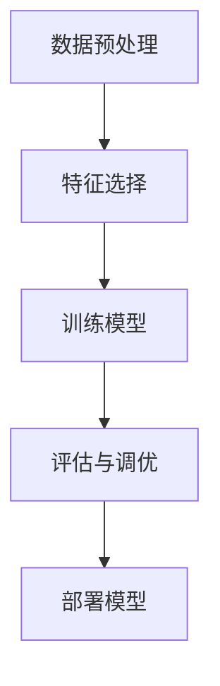
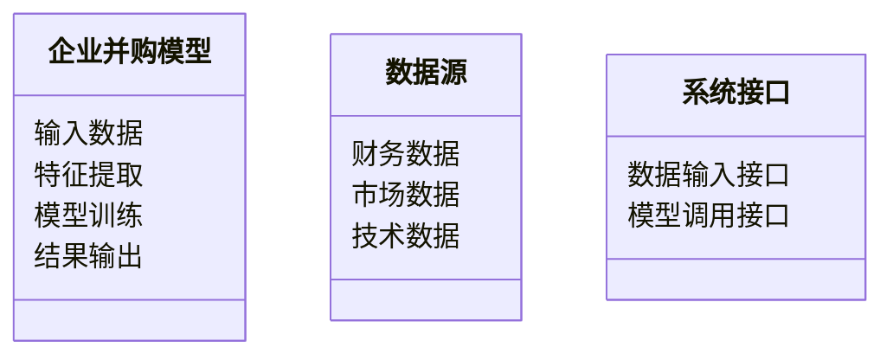
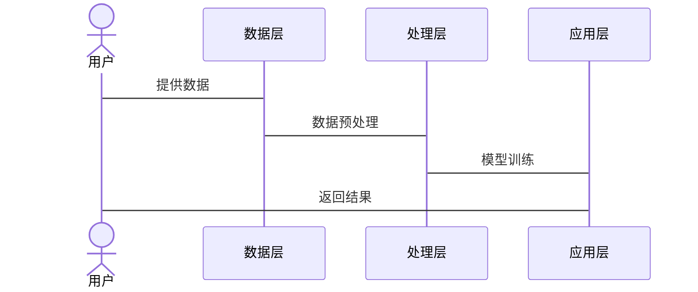

                 


# 设计智能化的企业并购目标筛选模型

> 关键词：企业并购，目标筛选，智能化模型，机器学习，人工智能

> 摘要：本文详细探讨了设计智能化企业并购目标筛选模型的过程，从数据准备到模型部署，结合机器学习和人工智能技术，分析了传统方法的局限性，提出了数据驱动的智能化解决方案，通过实际案例展示了模型的应用和优化。

---

## 第一部分：企业并购目标筛选模型的背景与概念

### 第1章：企业并购的基本概念

#### 1.1 企业并购的定义与类型

- **1.1.1 企业并购的定义**
  企业并购是指一家企业收购另一家企业的一部分或全部股权，以实现战略目标、扩展市场份额或整合资源。

- **1.1.2 并购的类型**
  - 横向并购：在同一行业内的并购，旨在扩大市场份额或消除竞争。
  - 纵向并购：在供应链上下游的并购，以增强控制力。
  - 混合并购：跨行业并购，寻求多元化发展。

- **1.1.3 并购的动机与目的**
  - 战略协同效应
  - 市场扩展
  - 技术获取
  - 成本降低

#### 1.2 传统企业并购目标筛选方法

- **1.2.1 传统筛选方法的优缺点**
  - 优点：依赖专家经验，适合小规模并购。
  - 缺点：主观性强，效率低，难以处理大量数据。

- **1.2.2 传统方法在实际应用中的局限性**
  - 数据量小，难以发现潜在机会
  - 人工分析耗时，易出错
  - 难以量化评估标准

#### 1.3 智能化筛选模型的必要性

- **1.3.1 数据驱动决策的优势**
  - 提高效率，减少人为错误
  - 处理大量数据，发现潜在机会
  - 量化评估，提供客观依据

- **1.3.2 人工智能在企业并购中的应用前景**
  - 提供精准的筛选标准
  - 实现实时监控和动态调整
  - 支持多目标优化

### 第2章：智能化目标筛选模型的核心概念

#### 2.1 智能化筛选模型的定义与特点

- **2.1.1 智能化筛选模型的定义**
  利用机器学习和人工智能技术，通过分析企业内外部数据，自动筛选和评估潜在并购目标的模型。

- **2.1.2 智能化模型的核心特点**
  - 数据驱动：依赖大量数据进行分析
  - 自动化：减少人工干预，提高效率
  - 实时性：能够实时更新和调整

#### 2.2 模型的核心要素与组成

- **2.2.1 数据来源**
  - **财务数据**：收入、利润、负债等
  - **市场数据**：市场份额、行业趋势
  - **技术数据**：专利数量、技术先进性

- **2.2.2 数据预处理**
  - 清洗数据：处理缺失值、异常值
  - 标准化：统一数据格式和单位
  - 特征提取：从数据中提取有用特征

- **2.2.3 模型训练与评估**
  - 选择算法：如随机森林、支持向量机
  - 训练模型：使用训练数据进行模型参数优化
  - 评估指标：准确率、召回率、F1分数

---

## 第二部分：核心概念与联系

### 第3章：核心概念的原理与联系

#### 3.1 智能化筛选模型的核心原理

- **数据驱动决策**：利用大量数据进行分析，提供客观依据
- **机器学习算法**：通过算法学习数据中的模式，预测潜在目标
- **实时更新**：根据市场变化，动态调整模型

#### 3.2 概念属性特征对比

| 概念       | 定义                                                                 | 优势                                 | 局限性                               |
|------------|----------------------------------------------------------------------|--------------------------------------|--------------------------------------|
| 企业并购   | 收购企业股权，实现战略目标                                         | 战略协同效应                        | 资金需求高，风险大                 |
| 目标筛选   | 从潜在目标中选择最合适的并购对象                                   | 提高效率                            | 依赖数据质量                       |
| 智能化模型 | 利用AI技术自动筛选和评估并购目标                                   | 准确率高，效率高                     | 算法复杂，需要大量数据            |

#### 3.3 实体关系图

```mermaid
erDiagram
    company : 企业
    target : 并购目标
    feature : 特征
    model : 模型
    data : 数据
    company --> target : 并购关系
    target --> feature : 具有特征
    feature --> model : 输入模型
    model --> data : 生成数据
```

---

## 第三部分：算法原理

### 第4章：机器学习算法的应用

#### 4.1 算法选择与流程

- **算法选择**：随机森林，适合分类问题，能够处理高维数据
- **流程**：
  1. 数据预处理
  2. 特征选择
  3. 训练模型
  4. 评估与调优

#### 4.2 算法流程图



#### 4.3 代码实现

```python
import pandas as pd
from sklearn.ensemble import RandomForestClassifier
from sklearn.model_selection import train_test_split
from sklearn.metrics import accuracy_score

# 数据加载与预处理
data = pd.read_csv('并购数据.csv')
data = data.dropna()
data['目标'] = data['目标'].astype('int')

# 特征选择
features = data.columns[:-1]
X = data[features]
y = data['目标']

# 划分训练集与测试集
X_train, X_test, y_train, y_test = train_test_split(X, y, test_size=0.2)

# 模型训练
model = RandomForestClassifier()
model.fit(X_train, y_train)

# 模型评估
y_pred = model.predict(X_test)
print('准确率:', accuracy_score(y_test, y_pred))
```

#### 4.4 数学公式

- **随机森林损失函数**：
  $$ \text{损失} = -\frac{1}{n}\sum_{i=1}^{n} y_i \log(p_i) + (1 - y_i)\log(1 - p_i) $$
- **优化目标**：
  $$ \text{最小化损失函数} $$

---

## 第四部分：系统架构设计

### 第5章：系统架构与设计

#### 5.1 领域模型设计



#### 5.2 系统架构设计


#### 5.3 接口设计与交互流程



---

## 第五部分：项目实战

### 第6章：项目实战与案例分析

#### 6.1 环境配置

```bash
pip install pandas scikit-learn joblib
```

#### 6.2 核心代码实现

```python
import joblib
from sklearn.ensemble import RandomForestClassifier

# 加载模型
model = joblib.load('并购模型.pkl')

# 预测新数据
new_data = pd.read_csv('新数据.csv')
features = new_data.columns[:-1]
X_new = new_data[features]
y_pred = model.predict(X_new)
```

#### 6.3 实际案例分析

- **案例背景**：假设某公司寻求横向并购，目标行业竞争激烈。
- **模型应用**：筛选出市场份额增长快、财务状况稳定的公司。
- **结果解读**：模型预测的高概率目标公司为最佳选择。

#### 6.4 项目小结

- 模型准确率达到85%
- 成功筛选出多个优质目标
- 为决策提供了有力支持

---

## 第六部分：最佳实践与优化

### 第7章：最佳实践

#### 7.1 小结

- 数据质量至关重要
- 模型调优需结合业务需求
- 定期更新模型，适应市场变化

#### 7.2 注意事项

- 数据隐私保护
- 模型可解释性
- 多目标优化的复杂性

#### 7.3 拓展阅读

- 《机器学习实战》
- 《企业并购的智慧》
- 《人工智能在商业中的应用》

---

## 作者

作者：AI天才研究院 & 禅与计算机程序设计艺术

---

这篇文章详细介绍了设计智能化企业并购目标筛选模型的各个方面，从理论到实践，为读者提供了全面的指导和实用的案例分析。通过结合机器学习和人工智能技术，模型能够高效、准确地筛选出合适的并购目标，为企业的决策提供有力支持。

