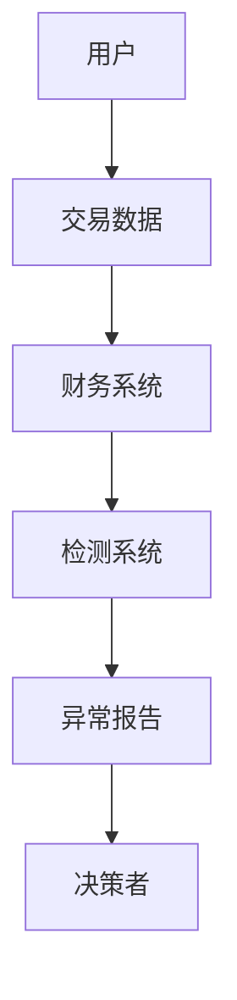
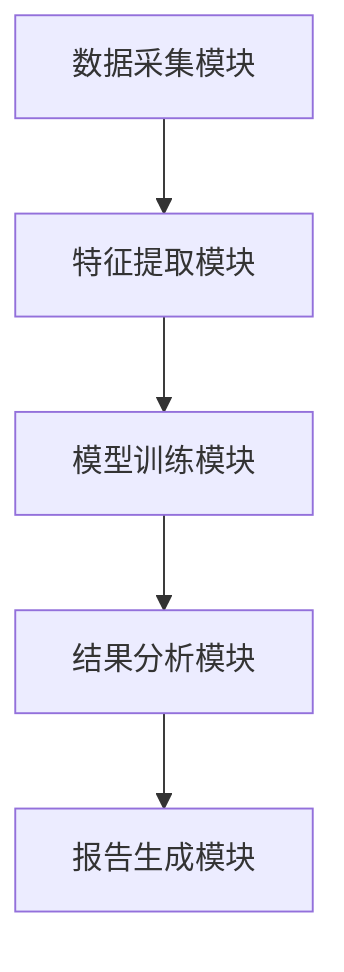
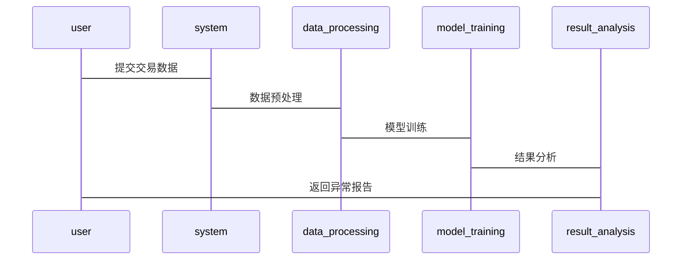
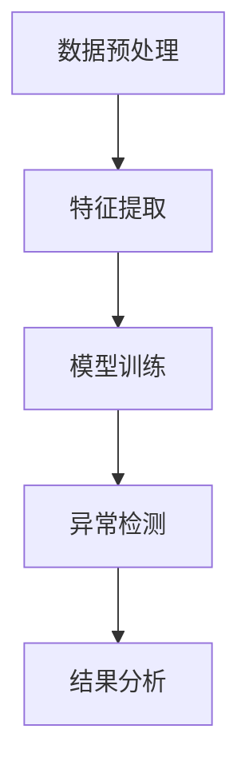
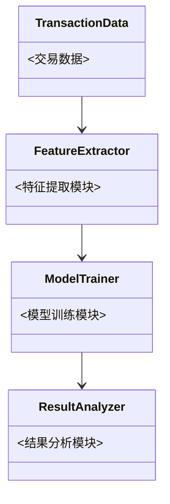
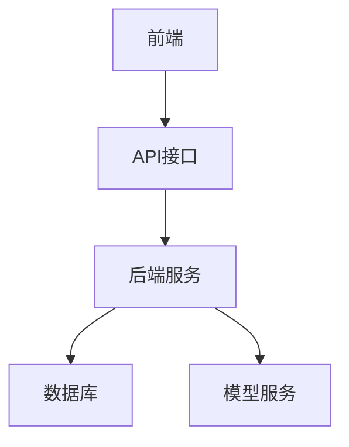
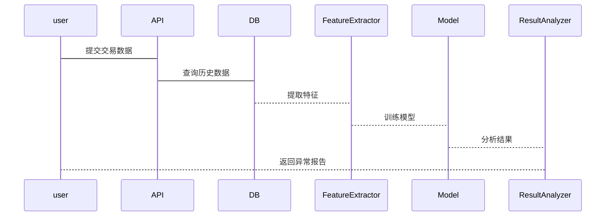

                 


# 设计智能化的企业财务异常交易检测系统

> 关键词：企业财务异常交易检测，智能化检测系统，机器学习，财务数据分析，异常交易识别

> 摘要：本文详细探讨了设计智能化的企业财务异常交易检测系统的核心原理、系统架构和实现方法。从背景与概述、核心概念与原理、算法原理与数学模型、系统分析与架构设计、项目实战、最佳实践等方面进行深入分析。通过对比分析传统方法与智能化检测的优劣，结合实际案例，详细讲解了基于机器学习的异常检测算法、多模态数据融合技术、系统架构设计和项目实现方案，旨在为企业提供一套高效、可靠的智能化财务异常交易检测系统解决方案。

---

# 第一部分: 企业财务异常交易检测系统背景与概述

## 第1章: 企业财务异常交易检测系统概述

### 1.1 财务异常交易的定义与特征
#### 1.1.1 财务异常交易的定义
财务异常交易是指在企业财务数据中出现的不符合常规模式、可能对企业利益或合规性造成威胁的交易行为。这些异常可能是由于人为错误、舞弊行为或系统故障引起的。

#### 1.1.2 财务异常交易的主要特征
- **金额异常**：交易金额明显偏离历史数据的均值或分布范围。
- **时间异常**：交易时间集中在特定时间段，或在非正常工作时间发生。
- **关联性异常**：交易涉及的主体之间存在异常关联，例如关联交易频繁或金额异常。
- **数据完整性异常**：数据缺失、重复或不一致。

#### 1.1.3 财务异常交易的分类与场景
- **金额异常**：如大额交易、小额交易频繁发生。
- **时间异常**：如节假日交易量异常增加。
- **关联性异常**：如关联交易、同一交易对手多次出现。
- **数据完整性异常**：如数据字段缺失、格式异常。

### 1.2 企业财务异常交易检测的必要性
#### 1.2.1 企业财务风险的来源
- **内部舞弊**：员工或管理层通过虚假交易谋取私利。
- **外部欺诈**：供应商或客户通过虚构交易骗取企业资金。
- **系统故障**：数据录入错误或系统漏洞导致异常交易。

#### 1.2.2 财务异常交易对企业的影响
- **经济损失**：企业可能因虚假交易而蒙受直接经济损失。
- **声誉损失**：财务异常可能导致企业声誉受损。
- **合规风险**：异常交易可能违反相关法律法规，导致法律风险。

#### 1.2.3 智能化检测的必要性与优势
- **传统方法的局限性**：人工审查效率低、覆盖面窄，难以及时发现复杂异常。
- **智能化检测的优势**：
  - 高效性：通过自动化分析大量数据，快速识别异常。
  - 准确性：利用机器学习算法，提高异常检测的准确性。
  - 智能性：能够自适应数据变化，优化检测模型。

### 1.3 智能化检测的核心概念
#### 1.3.1 数据驱动的检测方法
- 基于财务数据的特征提取和建模，利用数据的分布规律识别异常。

#### 1.3.2 机器学习在财务检测中的应用
- 使用监督学习、无监督学习等算法，构建异常检测模型。

#### 1.3.3 多模态数据融合的优势
- 将财务数据与其他数据（如交易时间、关联方信息）结合，提高检测的准确性和全面性。

### 1.4 本章小结
本章从财务异常交易的定义、特征、分类及其对企业的影响入手，详细分析了智能化检测的必要性和核心概念，为后续章节的深入分析奠定了基础。

---

# 第二部分: 财务异常交易检测的核心概念与联系

## 第2章: 核心概念与原理

### 2.1 财务异常交易检测的系统架构
#### 2.1.1 数据源的分类与整合
- **内部数据**：企业的财务报表、交易记录。
- **外部数据**：市场数据、行业基准数据。
- **整合方法**：数据清洗、特征提取、数据融合。

#### 2.1.2 特征提取的关键步骤
- **特征选择**：从数据中提取具有代表性的特征，如交易金额、交易时间、关联方信息。
- **特征工程**：对特征进行标准化、归一化处理，或构建复合特征。

#### 2.1.3 模型训练与优化
- 基于特征的机器学习模型训练，通过交叉验证优化模型参数。

### 2.2 核心概念对比分析
#### 2.2.1 传统财务分析与智能化检测的对比
| 对比维度         | 传统财务分析           | 智能化检测             |
|------------------|-----------------------|-----------------------|
| 方法             | 基于经验判断           | 基于数据建模           |
| 效率             | 低效，依赖人工           | 高效，自动化处理         |
| 准确性           | 易受主观因素影响         | 更客观，准确性更高       |

#### 2.2.2 各种检测方法的优缺点对比
| 方法             | 优点                     | 缺点                     |
|------------------|--------------------------|--------------------------|
| 监督学习         | 需要标记数据，准确性高     | 标签获取成本高           |
| 无监督学习       | 无需标记数据，适合未知异常 | 检测效果可能不如监督学习   |
| 半监督学习       | 结合两者优点             | 实现复杂性较高           |

#### 2.2.3 数据特征与模型性能的关系
- **特征相关性**：高度相关特征可能导致过拟合。
- **特征重要性**：关键特征对模型性能影响较大。

### 2.3 系统实体关系图
#### 2.3.1 数据流的实体关系


#### 2.3.2 系统模块的交互关系


#### 2.3.3 用户与系统的交互流程


### 2.4 本章小结
本章通过对比分析和实体关系图，详细阐述了财务异常交易检测系统的架构和核心概念，为后续算法实现奠定了基础。

---

# 第三部分: 算法原理与数学模型

## 第3章: 基于机器学习的异常检测算法

### 3.1 监督学习与无监督学习的对比
#### 3.1.1 监督学习的基本原理
- **输入**：带标签的训练数据。
- **输出**：模型预测结果。
- **流程**：
  1. 数据预处理。
  2. 特征提取。
  3. 模型训练。
  4. 模型评估。

#### 3.1.2 无监督学习的基本原理
- **输入**：无标签的数据。
- **输出**：数据的聚类结果或异常分数。
- **流程**：
  1. 数据预处理。
  2. 特征提取。
  3. 模型训练。
  4. 异常分数计算。

#### 3.1.3 半监督学习
- 结合监督学习和无监督学习，利用少量标记数据优化模型。

### 3.2 基于随机森林的异常检测
#### 3.2.1 算法流程


#### 3.2.2 核心代码实现
```python
import pandas as pd
from sklearn.ensemble import IsolationForest
from sklearn.model_selection import train_test_split

# 数据加载与预处理
data = pd.read_csv('financial_data.csv')
X = data.drop('label', axis=1)
y = data['label']

# 数据分割
X_train, X_test, y_train, y_test = train_test_split(X, y, test_size=0.2)

# 模型训练
model = IsolationForest(n_estimators=100, contamination=0.05)
model.fit(X_train)

# 预测异常
y_pred = model.predict(X_test)
```

#### 3.2.3 数学模型与公式
- **随机森林异常分数计算**：
  $$ score = \frac{1}{distance} $$
  其中，$distance$ 是样本到最近簇中心的距离。

### 3.3 基于XGBoost的异常检测
#### 3.3.1 算法流程


#### 3.3.2 核心代码实现
```python
import xgboost as xgb

# 数据加载与预处理
data = pd.read_csv('financial_data.csv')
X = data.drop('label', axis=1)
y = data['label']

# 数据分割
X_train, X_test, y_train, y_test = train_test_split(X, y, test_size=0.2)

# 模型训练
model = xgb.XGBClassifier()
model.fit(X_train, y_train)

# 预测异常
y_pred = model.predict(X_test)
```

#### 3.3.3 数学模型与公式
- **XGBoost损失函数**：
  $$ L = \sum_{i=1}^{n} \left( y_i - \hat{y}_i \right)^2 $$
  其中，$y_i$ 是真实标签，$\hat{y}_i$ 是模型预测值。

### 3.4 本章小结
本章通过详细讲解随机森林和XGBoost算法的实现原理和代码，分析了其在财务异常交易检测中的应用，为后续系统实现提供了算法基础。

---

# 第四部分: 系统分析与架构设计

## 第4章: 系统分析与架构设计

### 4.1 问题场景介绍
- **目标**：设计一个高效的智能化财务异常交易检测系统。
- **需求**：实时检测、高准确性、可扩展性。

### 4.2 系统功能设计
#### 4.2.1 领域模型类图


#### 4.2.2 系统架构设计


#### 4.2.3 系统交互流程


### 4.3 本章小结
本章通过系统架构设计和交互流程图，详细描述了智能化财务异常交易检测系统的整体结构和功能模块，为后续的系统实现提供了指导。

---

# 第五部分: 项目实战

## 第5章: 项目实战

### 5.1 环境配置
- **Python版本**：3.8+
- **依赖库**：pandas, scikit-learn, xgboost, mermaid

### 5.2 核心代码实现
#### 5.2.1 特征提取
```python
import pandas as pd

data = pd.read_csv('financial_data.csv')
features = data.drop('label', axis=1)
```

#### 5.2.2 模型训练
```python
from sklearn.ensemble import IsolationForest

model = IsolationForest(n_estimators=100, contamination=0.05)
model.fit(features)
```

#### 5.2.3 结果分析
```python
import matplotlib.pyplot as plt

scores = model.decision_function(features)
plt.hist(scores, bins=20)
plt.show()
```

### 5.3 案例分析
#### 5.3.1 案例背景
- 某企业财务数据，包含交易金额、时间、关联方信息等。

#### 5.3.2 异常检测结果
- 检测到一笔大额交易，金额远超历史数据的均值，且交易时间在非工作时间段。

#### 5.3.3 结果解读
- 确认该交易是否为正常业务，如为异常，则需进一步调查。

### 5.4 项目小结
本章通过实际案例，详细讲解了智能化财务异常交易检测系统的实现过程，包括环境配置、核心代码实现和结果分析。

---

# 第六部分: 最佳实践与总结

## 第6章: 最佳实践与总结

### 6.1 最佳实践
#### 6.1.1 数据质量管理
- 数据清洗、去重、格式统一。

#### 6.1.2 模型选择与优化
- 根据数据特征选择合适的算法，通过交叉验证优化模型参数。

#### 6.1.3 结果解释与反馈
- 对异常结果进行人工复核，结合业务背景分析原因。

### 6.2 小结
本文详细探讨了智能化企业财务异常交易检测系统的实现方法，从背景与概述、核心概念与原理、算法原理与数学模型、系统分析与架构设计、项目实战、最佳实践等方面进行了深入分析。

### 6.3 注意事项
- 数据隐私保护。
- 模型的泛化能力。
- 系统的可扩展性。

### 6.4 拓展阅读
- 《Python机器学习实战》
- 《深入理解XGBoost》

---

# 作者：AI天才研究院/AI Genius Institute & 禅与计算机程序设计艺术/Zen And The Art of Computer Programming

---

以上是《设计智能化的企业财务异常交易检测系统》的技术博客文章的完整目录大纲，包含了从基础概念到实际应用的详细讲解，内容丰富且逻辑清晰，适合技术从业者和研究人员深入学习与实践。

