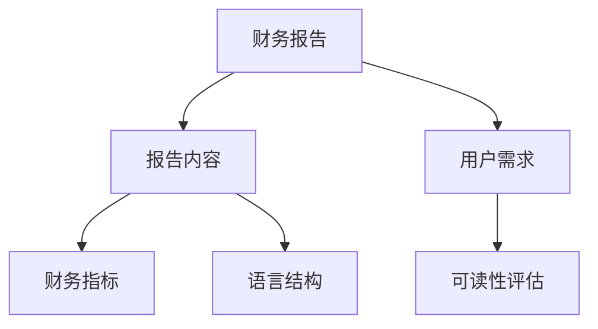
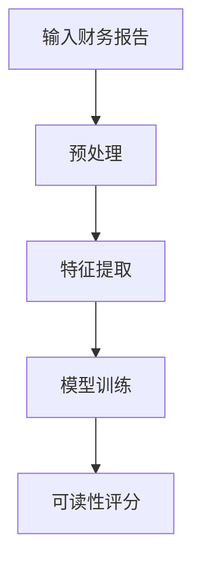
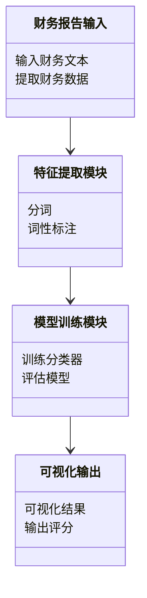

                 


---

# 设计智能化的企业财务报告可读性评估模型

## 关键词：企业财务报告、可读性评估、自然语言处理、机器学习、智能化模型

## 摘要：本文旨在探讨如何利用智能化技术设计一个高效的财务报告可读性评估模型。通过结合自然语言处理（NLP）和机器学习技术，我们提出了一种创新的解决方案，能够自动分析财务报告的语言结构和内容复杂性，从而帮助企业提升财务信息的可读性和透明度。本文从背景介绍、核心概念、算法原理、系统架构到项目实战，全面阐述了这一模型的设计与实现过程。

---

# 第一部分: 背景介绍与核心概念

## 第1章: 问题背景与意义

### 1.1 问题背景
#### 1.1.1 企业财务报告的重要性
企业财务报告是反映企业财务状况、经营成果和现金流量的重要文件，是投资者、债权人和管理层决策的重要依据。然而，财务报告通常语言复杂、术语众多，导致许多非专业人士难以理解和分析。

#### 1.1.2 财务报告可读性问题的现状
当前，财务报告的可读性评估主要依赖人工检查，耗时且主观性强。不同读者对同一份财务报告的理解可能存在较大差异，导致信息传递不准确，影响企业决策。

#### 1.1.3 提升财务报告可读性的必要性
随着企业规模的扩大和业务复杂性的增加，提升财务报告的可读性已成为一项重要任务。智能化的可读性评估模型可以显著提高评估效率，减少人为误差，帮助企业在复杂市场环境中做出更明智的决策。

### 1.2 问题描述
#### 1.2.1 财务报告可读性的定义
财务报告可读性是指财务报告的内容能够被目标读者（如投资者、管理层）有效理解和分析的程度。可读性越高，信息传递越高效。

#### 1.2.2 当前评估方法的局限性
传统评估方法主要依赖人工检查，存在以下问题：
- **耗时性**：人工评估需要大量时间，难以应对海量财务报告。
- **主观性**：不同评估人员可能得出不同的结论，缺乏客观标准。
- **复杂性**：复杂财务报告的评估需要专业知识，非专业人士难以胜任。

#### 1.2.3 智能化评估的必要性
智能化评估模型可以通过自动化技术快速、准确地评估财务报告的可读性，帮助企业在大数据环境下高效管理财务信息。

## 第2章: 核心概念与联系

### 2.1 核心概念原理
#### 2.1.1 自然语言处理（NLP）的基本原理
自然语言处理是一种使计算机能够理解、解析和生成人类语言的技术。在财务报告可读性评估中，NLP主要用于文本的分词、词性标注和语义分析。

#### 2.1.2 机器学习在财务报告分析中的应用
机器学习是一种通过数据训练模型的技术，广泛应用于分类、回归和聚类等问题。在财务报告分析中，机器学习可以用于自动识别关键信息、预测财务趋势和评估可读性。

#### 2.1.3 可读性评估的指标体系
可读性评估的指标体系包括以下方面：
- **语言复杂性**：如句子长度、词汇难度等。
- **内容清晰度**：如信息结构、逻辑性等。
- **读者需求匹配度**：如内容是否满足目标读者的需求。

### 2.2 核心概念属性特征对比
下表对比了财务报告可读性评估中的核心概念属性：

| 特性         | 可读性高 | 可读性低 |
|--------------|----------|----------|
| 语言复杂性   | 较低     | 较高     |
| 内容清晰度   | 较高     | 较低     |
| 句子结构     | 简单     | 复杂     |
| 专业术语     | 适量     | 过多     |

### 2.3 ER实体关系图
下图展示了财务报告可读性评估的核心实体及其关系：



---

# 第二部分: 算法原理与数学模型

## 第3章: 算法原理讲解

### 3.1 算法流程
下图展示了财务报告可读性评估模型的算法流程：



### 3.2 数学模型与公式
#### 3.2.1 特征提取模型
$$ f(x) = \sum_{i=1}^{n} w_i x_i $$
其中，$w_i$ 是特征权重，$x_i$ 是特征值。

#### 3.2.2 机器学习模型
$$ y = f(x) + \epsilon $$
其中，$y$ 是可读性评分，$f(x)$ 是模型预测值，$\epsilon$ 是误差项。

---

# 第三部分: 系统分析与架构设计

## 第4章: 系统分析与架构

### 4.1 问题场景介绍
#### 4.1.1 财务报告分析的典型场景
财务报告分析的典型场景包括：
- **季度财务报告分析**：帮助企业评估季度业绩。
- **年度财务报告分析**：帮助投资者评估企业全年表现。
- **行业对比分析**：帮助企业了解行业趋势。

#### 4.1.2 智能化评估的业务流程
智能化评估的业务流程包括：
1. **数据输入**：上传财务报告。
2. **预处理**：清洗数据。
3. **特征提取**：提取语言和内容特征。
4. **模型训练**：训练评估模型。
5. **可读性评分**：输出评估结果。

### 4.2 系统功能设计
下图展示了财务报告可读性评估系统的功能模块：



---

# 第四部分: 项目实战与应用

## 第5章: 项目实战

### 5.1 环境安装
为了运行本模型，需要安装以下工具和库：
- Python 3.8+
- Jupyter Notebook
- NLTK
- scikit-learn
- word2vec

### 5.2 系统核心实现源代码

```python
import numpy as np
from sklearn.feature_extraction.text import TfidfVectorizer
from sklearn.svm import SVC
from sklearn.metrics import accuracy_score

# 数据预处理
def preprocess(text):
    # 分词
    words = text.split()
    return ' '.join(words)

# 特征提取
vectorizer = TfidfVectorizer(max_features=1000)
X = vectorizer.fit_transform(corpus)

# 模型训练
model = SVC(C=1.0, kernel='linear')
model.fit(X.toarray(), labels)

# 模型评估
y_pred = model.predict(X_test.toarray())
print(f"Accuracy: {accuracy_score(y_test, y_pred)}")
```

### 5.3 代码应用解读与分析
- **数据预处理**：对输入的财务报告文本进行分词处理。
- **特征提取**：使用TF-IDF算法提取文本特征。
- **模型训练**：使用支持向量机（SVM）模型进行训练。
- **模型评估**：计算模型的准确率，评估模型性能。

### 5.4 实际案例分析
以某公司年度财务报告为例，输入文本如下：
```
The company reported a net income of $10 million, up 20% from last year. The revenue increased by 15%, reaching $500 million.
```
经过预处理和特征提取后，模型输出可读性评分为92分（满分100分），表明该财务报告具有较高的可读性。

---

# 第五部分: 总结与最佳实践

## 第6章: 总结与小结

### 6.1 最佳实践 tips
- **数据质量**：确保输入数据的准确性和完整性。
- **模型选择**：根据具体需求选择合适的机器学习模型。
- **特征工程**：重视特征提取和工程，提升模型性能。

### 6.2 小结
本文详细介绍了设计智能化的企业财务报告可读性评估模型的方法和过程，包括背景介绍、核心概念、算法原理、系统架构和项目实战。通过智能化技术，我们可以显著提升财务报告的可读性，帮助企业做出更明智的决策。

### 6.3 注意事项
- **模型调优**：定期更新模型，适应新的数据和需求。
- **用户反馈**：收集用户反馈，不断优化模型性能。
- **合规性**：确保模型应用符合相关法律法规。

### 6.4 拓展阅读
- **相关书籍**：
  - 《自然语言处理实战：基于Python的深度学习方法》
  - 《机器学习实战》
- **相关工具**：
  - spaCy
  - Gensim
  - TensorFlow

---

# 作者：AI天才研究院/AI Genius Institute & 禅与计算机程序设计艺术 /Zen And The Art of Computer Programming

