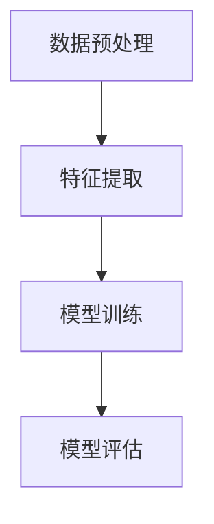
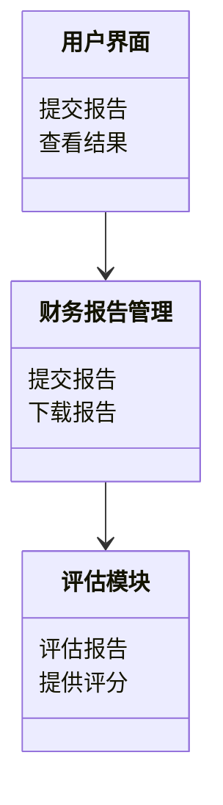
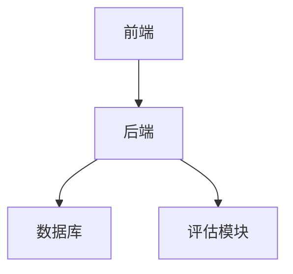

                 


# 设计智能化的企业财务报告质量评估模型

> 关键词：智能化财务报告、质量评估模型、机器学习、大数据分析、企业财务管理

> 摘要：本文详细探讨了设计智能化企业财务报告质量评估模型的全过程，从问题背景到核心概念，再到算法原理、系统设计、项目实战，最后总结经验。文章通过丰富的案例分析和详细的技术实现，展示了如何利用人工智能和大数据技术提升财务报告评估的效率和准确性。

---

## 目录

# 设计智能化的企业财务报告质量评估模型

## 第1章 问题背景与定义

### 1.1 问题背景

#### 1.1.1 传统财务报告质量评估的局限性
- **人工评估的低效性**：传统方法依赖人工审核，耗时且容易出错。
- **数据量的爆炸式增长**：企业财务数据日益复杂，人工处理难度加大。
- **评估标准的主观性**：不同评估人员可能对同一报告的评分存在差异。

#### 1.1.2 智能化评估的必要性
- **提高效率**：自动化处理海量数据，缩短评估时间。
- **提升准确性**：通过算法消除人为误差，确保评估结果客观公正。
- **实时监控**：及时发现财务异常，助力企业决策。

### 1.2 模型定义

#### 1.2.1 核心概念
- **财务数据**：企业的收入、支出、利润等财务指标。
- **评估指标**：包括数据完整性、准确性、合规性等。
- **智能化模型**：利用机器学习算法对财务数据进行分析和评分。

#### 1.2.2 模型的目标与范围
- **目标**：自动评估财务报告的质量，提供改进建议。
- **范围**：涵盖财务数据的收集、处理、分析和评估全过程。

### 1.3 核心要素与组成

#### 1.3.1 数据来源与处理
- 数据来源：企业的财务报表、审计记录、交易流水等。
- 数据处理：清洗、转换、特征提取。

#### 1.3.2 评估指标与权重
- 数据完整性：确保所有必要信息都已包含。
- 数据准确性：数据是否准确反映企业实际情况。
- 数据合规性：是否符合相关财务法规。

#### 1.3.3 模型的输入与输出
- 输入：财务数据、相关文档。
- 输出：质量评分、改进建议。

---

## 第2章 核心概念与联系

### 2.1 核心原理

#### 2.1.1 特征工程
- 数据预处理：去除缺失值、处理异常值。
- 特征选择：提取关键特征，如收入增长率、利润率波动等。

#### 2.1.2 模型选择
- 机器学习算法：随机森林、支持向量机（SVM）、神经网络。
- 算法选择依据：数据类型、样本数量、计算效率。

### 2.2 概念对比表

| 概念       | 定义                                   | 示例                     |
|------------|--------------------------------------|--------------------------|
| 数据特征   | 反映数据特性的变量                   | 收入增长率、利润率等     |
| 模型评估指标| 衡量模型性能的指标                   | 准确率、召回率、F1分数等|
| 评估标准   | 评估报告质量的准则                   | 完整性、准确性、合规性   |

### 2.3 实体关系图

```mermaid
erDiagram
    customer[企业] {
        id
        name
        industry
    }
    report[财务报告] {
        id
        report_date
        revenue
        profit
        expenses
    }
    assessment[评估结果] {
        id
        report_id
        quality_score
        comments
    }
    customer --> report: 提交
    report --> assessment: 评估
```

---

## 第3章 算法原理与实现

### 3.1 算法选择

#### 3.1.1 机器学习算法对比
| 算法         | 优点                           | 缺点                           |
|--------------|--------------------------------|--------------------------------|
| 随机森林     | 高准确性、易于实现             | 对特征重要性解释较难         |
| 支持向量机(SVM)| 适合小样本数据                 | 计算复杂度高                   |
| 神经网络     | 强大学习能力                   | 需要大量数据，易过拟合         |

### 3.2 实现流程

#### 3.2.1 数据预处理
```python
import pandas as pd
import numpy as np

# 加载数据
df = pd.read_csv('financial_reports.csv')

# 去除缺失值
df = df.dropna()

# 处理异常值
df['revenue'].replace(to_replace=np.nan, value='0', inplace=True)
```

#### 3.2.2 特征提取
```python
from sklearn.preprocessing import StandardScaler

# 标准化处理
scaler = StandardScaler()
X = scaler.fit_transform(df[['revenue', 'profit', 'expenses']])
```

#### 3.2.3 模型训练
```python
from sklearn.ensemble import RandomForestClassifier

# 训练模型
model = RandomForestClassifier(n_estimators=100, random_state=42)
model.fit(X, df['label'])
```

#### 3.2.4 模型评估
```python
from sklearn.metrics import accuracy_score

# 预测
y_pred = model.predict(X_test)

# 计算准确率
accuracy = accuracy_score(y_true, y_pred)
print(f'准确率: {accuracy}')
```

### 3.3 算法流程图



### 3.4 数学模型

#### 3.4.1 评估模型
$$ Q = \sum_{i=1}^{n} (w_i \times f_i) $$

其中：
- $Q$ 是质量评分
- $w_i$ 是第 $i$ 个评估指标的权重
- $f_i$ 是第 $i$ 个评估指标的评分

#### 3.4.2 损失函数
$$ L = \sum_{i=1}^{m} (y_i - \hat{y}_i)^2 $$

---

## 第4章 系统分析与架构设计

### 4.1 项目背景

#### 4.1.1 项目目标
- 实现一个智能化的财务报告质量评估系统。
- 提供实时评估结果和改进建议。

### 4.2 系统功能设计

#### 4.2.1 系统功能模块


### 4.3 系统架构设计



### 4.4 接口设计

#### 4.4.1 API接口
- **提交报告**：`POST /submit_report`
- **获取评估结果**：`GET /get_assessment`

---

## 第5章 项目实战

### 5.1 环境配置

#### 5.1.1 安装Python库
```bash
pip install pandas numpy scikit-learn mermaid4jupyter
```

### 5.2 核心代码实现

#### 5.2.1 加载数据
```python
import pandas as pd

# 加载数据
df = pd.read_csv('financial_reports.csv')

# 查看数据摘要
print(df.describe())
```

#### 5.2.2 训练模型
```python
from sklearn.ensemble import RandomForestClassifier

# 特征选择
features = ['revenue', 'profit', 'expenses']
target = 'label'

# 训练模型
model = RandomForestClassifier()
model.fit(df[features], df[target])
```

### 5.3 案例分析

#### 5.3.1 案例背景
某企业提交了一份财务报告，系统对其进行了质量评估。

#### 5.3.2 评估结果
- 质量评分：85分（满分100分）
- 改进建议：补充部分数据说明，优化收入结构。

---

## 第6章 最佳实践与总结

### 6.1 最佳实践

#### 6.1.1 数据预处理
- 确保数据的完整性和准确性。
- 使用适当的方法处理缺失值和异常值。

#### 6.1.2 模型选择
- 根据数据特点选择合适的算法。
- 组合多种算法进行验证，提高准确性。

### 6.2 小结
本文详细介绍了设计智能化企业财务报告质量评估模型的全过程，从问题背景到系统实现，再到实际应用，为读者提供了全面的指导。

### 6.3 注意事项

#### 6.3.1 数据隐私
- 确保财务数据的安全性和隐私性。
- 遵守相关法律法规。

#### 6.3.2 模型优化
- 定期更新模型，以适应企业财务状况的变化。
- 监控模型性能，及时调整参数。

### 6.4 拓展阅读

| 类别       | 资源推荐                          |
|------------|---------------------------------|
| 书籍       | 《机器学习实战》                 |
| 在线课程   | Coursera: 《机器学习》           |
| 工具库     | scikit-learn, TensorFlow         |

---

## 作者信息

作者：AI天才研究院/AI Genius Institute & 禅与计算机程序设计艺术/Zen And The Art of Computer Programming

---

通过以上目录和内容，读者可以系统地学习如何设计一个智能化的企业财务报告质量评估模型，从理论到实践，逐步掌握相关技术。

