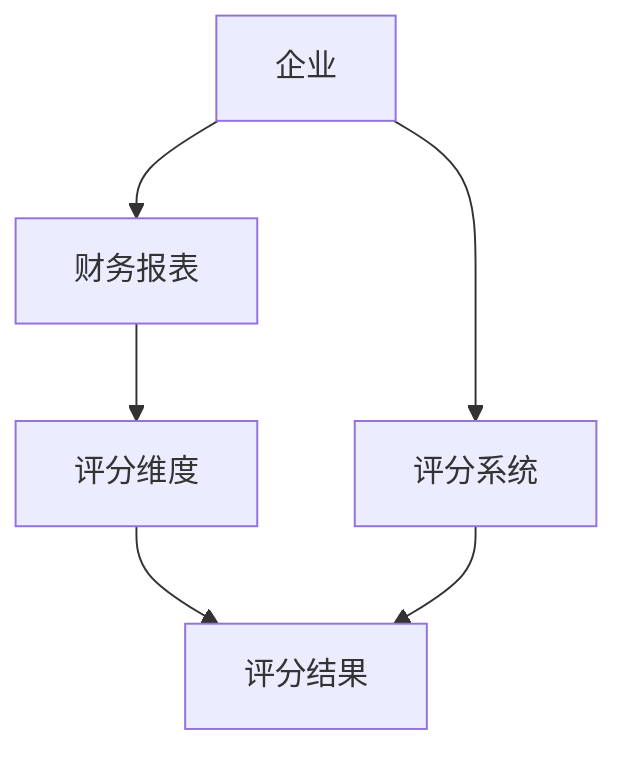
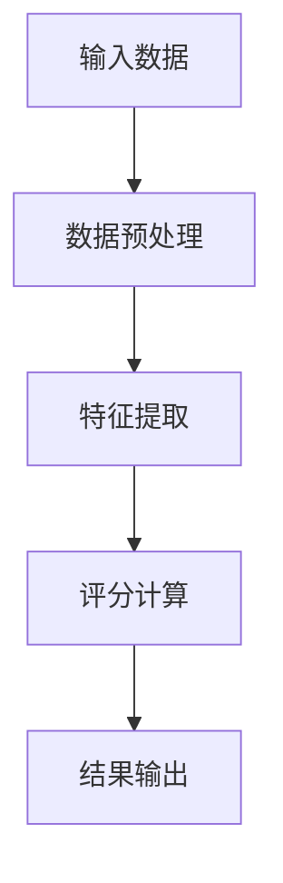
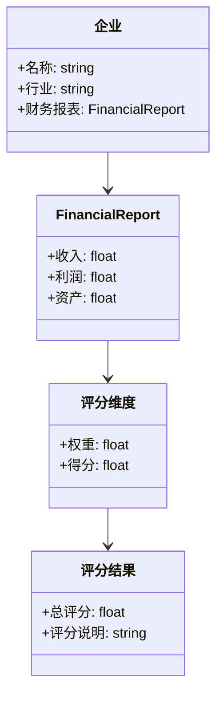
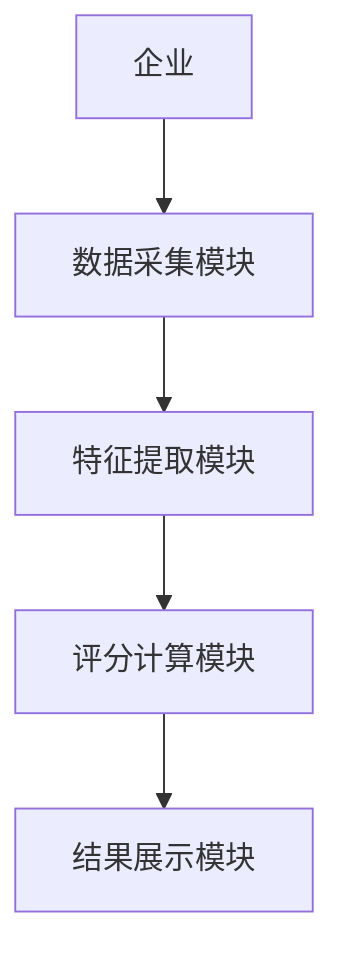
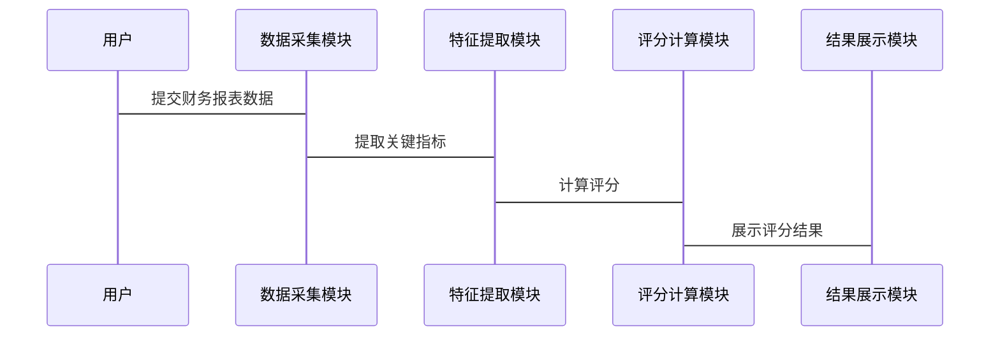

                 


# 设计智能化的企业财务报表可比性动态评分系统

> 关键词：企业财务报表，可比性动态评分，智能化评分系统，财务数据分析，人工智能技术

> 摘要：本文系统地介绍了设计智能化的企业财务报表可比性动态评分系统的核心概念、算法原理、系统架构设计以及项目实战。通过详细分析财务报表可比性评分的背景与意义，结合智能化动态评分算法，提出了基于领域模型的系统架构设计方案，并通过实际案例分析，展示了系统在企业财务分析中的应用价值。

---

## 第一部分: 智能化企业财务报表可比性动态评分系统概述

### 第1章: 财务报表可比性动态评分系统背景与概念

#### 1.1 问题背景与意义

##### 1.1.1 财务报表可比性的重要性
企业财务报表是反映企业经营状况的核心文件，其准确性、可比性和完整性对于企业的决策者、投资者和债权人具有重要意义。然而，不同企业的财务报表可能存在会计政策、会计估计等方面的差异，导致可比性不足。

##### 1.1.2 当前企业财务报表分析的痛点
传统财务报表分析依赖人工判断，存在主观性强、效率低、可比性差等问题。特别是在跨行业、跨地区的企业比较中，缺乏统一的评分标准和动态调整机制，难以满足现代企业的智能化需求。

##### 1.1.3 智能化动态评分的必要性
随着人工智能技术的发展，智能化动态评分系统可以通过自动化分析、大数据处理和机器学习算法，提高财务报表分析的客观性和可比性，为企业提供更精准的决策支持。

#### 1.2 核心概念与定义

##### 1.2.1 财务报表可比性的定义
财务报表可比性是指不同企业或同一企业在不同时期的财务报表在结构、内容和数据上具有可比较性，以便进行横向或纵向分析。

##### 1.2.2 动态评分系统的概念
动态评分系统是一种根据实时数据和历史信息，通过算法动态调整评分权重，实时更新评分结果的系统。

##### 1.2.3 智能化评分的核心要素
- **数据采集**：从企业财务报表中提取关键指标。
- **特征提取**：通过数据预处理提取可比性相关的特征。
- **评分模型**：基于机器学习算法构建评分模型。
- **动态调整**：根据市场变化和企业实际情况动态调整评分权重。

#### 1.3 系统的目标与边界

##### 1.3.1 系统的主要目标
- 提供智能化的财务报表可比性评分服务。
- 实现动态调整评分权重，提高评分的准确性。
- 提供可视化界面，方便用户查看和分析评分结果。

##### 1.3.2 系统的边界与外延
- 系统仅关注财务报表可比性评分，不涉及企业的其他业务系统。
- 系统的数据来源为企业财务报表，不涉及外部数据。

##### 1.3.3 核心功能模块的划分
- 数据采集模块
- 特征提取模块
- 评分计算模块
- 结果展示模块

#### 1.4 本章小结
本章从背景和意义入手，详细阐述了智能化企业财务报表可比性动态评分系统的核心概念和目标，为后续章节的分析奠定了基础。

---

### 第2章: 财务报表可比性评分的核心概念与联系

#### 2.1 核心概念原理

##### 2.1.1 财务报表可比性的关键维度
- **财务指标**：如收入、利润、资产等。
- **行业标准**：不同行业的财务指标差异较大。
- **时间维度**：企业不同时期的财务状况可能不同。

##### 2.1.2 动态评分的核心算法
- **加权平均法**：根据各评分维度的权重计算总评分。
- **动态调整法**：根据市场变化和企业实际情况动态调整评分权重。

##### 2.1.3 智能化评分的数学模型
$$
\text{评分} = \sum_{i=1}^{n} w_i \cdot x_i
$$
其中，$w_i$ 是第 $i$ 个评分维度的权重，$x_i$ 是第 $i$ 个评分维度的得分。

#### 2.2 核心概念属性对比

| 属性 | 可比性评分 | 动态评分 | 智能化评分 |
|------|------------|----------|------------|
| 输入数据 | 财务报表数据 | 动态变化数据 | 结构化和非结构化数据 |
| 输出结果 | 数值评分 | 动态调整评分 | 高精度评分 |
| 算法特点 | 线性回归 | 自适应调整 | 机器学习 |

#### 2.3 ER实体关系架构



#### 2.4 本章小结
本章通过对比分析，详细阐述了财务报表可比性评分的核心概念和实体关系，为后续章节的算法设计和系统实现提供了理论基础。

---

### 第3章: 动态评分系统算法原理

#### 3.1 算法概述

##### 3.1.1 动态评分的基本原理
动态评分系统通过实时数据采集和历史数据分析，动态调整评分权重，实现评分结果的实时更新。

##### 3.1.2 算法的核心思想
基于机器学习算法，利用历史数据训练评分模型，实时预测企业财务报表的可比性评分。

##### 3.1.3 算法的输入输出
- **输入**：企业财务报表数据、行业标准数据。
- **输出**：企业财务报表可比性评分。

#### 3.2 算法流程



#### 3.3 算法实现

##### 3.3.1 数据预处理
- 数据清洗：去除无效数据和异常值。
- 数据标准化：将数据归一化处理。

##### 3.3.2 特征提取
- 提取财务指标：如收入、利润、资产等。
- 提取行业标准：如行业平均值、行业趋势等。

##### 3.3.3 评分计算
$$
\text{评分} = \sum_{i=1}^{n} w_i \cdot x_i
$$
其中，$w_i$ 是第 $i$ 个评分维度的权重，$x_i$ 是第 $i$ 个评分维度的得分。

##### 3.3.4 结果输出
- 输出评分结果。
- 可视化展示评分结果。

#### 3.4 数学模型与公式

##### 3.4.1 评分计算公式
$$
\text{评分} = \sum_{i=1}^{n} w_i \cdot x_i
$$

##### 3.4.2 动态调整公式
$$
\text{新评分} = \text{旧评分} \times (1 + \alpha)
$$
其中，$\alpha$ 是调整因子。

#### 3.5 本章小结
本章详细讲解了动态评分系统的算法原理，包括算法流程、实现细节和数学模型，为后续章节的系统设计提供了技术支持。

---

### 第4章: 系统分析与架构设计方案

#### 4.1 问题场景分析

##### 4.1.1 系统目标
- 提供智能化的财务报表可比性评分服务。
- 实现动态调整评分权重，提高评分的准确性。
- 提供可视化界面，方便用户查看和分析评分结果。

##### 4.1.2 系统需求
- 数据采集模块：支持多种数据格式的输入。
- 特征提取模块：能够自动提取关键财务指标。
- 评分计算模块：支持多种评分算法。
- 结果展示模块：提供直观的评分结果展示。

##### 4.1.3 系统约束
- 数据隐私：确保企业数据的安全性。
- 系统性能：保证系统的高效运行。

#### 4.2 项目介绍

##### 4.2.1 项目背景
随着企业数字化转型的推进，智能化财务分析需求日益增长。

##### 4.2.2 项目目标
构建一个智能化的企业财务报表可比性动态评分系统。

#### 4.3 系统功能设计

##### 4.3.1 领域模型


##### 4.3.2 系统架构设计


##### 4.3.3 系统接口设计
- 数据接口：支持多种数据格式的输入。
- API接口：提供评分结果的查询接口。

##### 4.3.4 系统交互设计


#### 4.4 本章小结
本章从系统分析的角度，详细阐述了智能化企业财务报表可比性动态评分系统的功能设计和架构设计，为后续章节的项目实现提供了指导。

---

## 第二部分: 项目实战与最佳实践

### 第5章: 项目实战

#### 5.1 环境安装与配置

##### 5.1.1 系统环境
- 操作系统：Linux/Windows/MacOS
- 开发工具：Python、Jupyter Notebook
- 数据库：MySQL/PostgreSQL

##### 5.1.2 依赖安装
```bash
pip install numpy pandas scikit-learn matplotlib
```

#### 5.2 系统核心实现

##### 5.2.1 数据采集模块
```python
import pandas as pd

def load_data(file_path):
    return pd.read_csv(file_path)
```

##### 5.2.2 特征提取模块
```python
from sklearn.preprocessing import StandardScaler

def feature_extraction(data):
    scaler = StandardScaler()
    features = scaler.fit_transform(data)
    return features
```

##### 5.2.3 评分计算模块
```python
from sklearn.linear_model import LinearRegression

def calculate_score(features, labels):
    model = LinearRegression()
    model.fit(features, labels)
    return model.predict(features)
```

##### 5.2.4 结果展示模块
```python
import matplotlib.pyplot as plt

def visualize_scores(scores):
    plt.hist(scores, bins=10)
    plt.xlabel('Score')
    plt.ylabel('Frequency')
    plt.show()
```

#### 5.3 代码应用解读与分析

##### 5.3.1 数据预处理
```python
data = load_data('financial_reports.csv')
```

##### 5.3.2 特征提取
```python
features = feature_extraction(data)
```

##### 5.3.3 评分计算
```python
scores = calculate_score(features, labels)
```

##### 5.3.4 结果展示
```python
visualize_scores(scores)
```

#### 5.4 实际案例分析

##### 5.4.1 案例背景
某制造企业与同行业其他企业的财务报表比较。

##### 5.4.2 数据分析
- 收入增长率：10%
- 利润率：5%
- 资产周转率：8%

##### 5.4.3 评分计算
$$
\text{评分} = 0.4 \times \text{收入增长率} + 0.3 \times \text{利润率} + 0.3 \times \text{资产周转率}
$$
$$
\text{评分} = 0.4 \times 10 + 0.3 \times 5 + 0.3 \times 8 = 6.2
$$

##### 5.4.4 结果解读
- 评分结果为6.2，高于行业平均水平，说明该企业在财务状况上表现良好。

#### 5.5 本章小结
本章通过实际案例分析，详细讲解了系统的核心实现和代码应用，帮助读者更好地理解智能化企业财务报表可比性动态评分系统的实际应用。

---

### 第6章: 最佳实践与总结

#### 6.1 小结

##### 6.1.1 核心概念总结
- 财务报表可比性评分的核心在于数据的可比性和动态调整能力。
- 智能化评分系统通过机器学习算法实现了评分的自动化和动态调整。

##### 6.1.2 系统设计总结
- 系统设计注重模块化和可扩展性，便于后续功能的添加和优化。

#### 6.2 注意事项

##### 6.2.1 数据质量
- 数据的准确性和完整性是评分系统的核心，需注意数据清洗和预处理。

##### 6.2.2 模型优化
- 需根据实际需求不断优化评分模型，提高评分的准确性。

##### 6.2.3 系统安全
- 确保企业数据的安全性，防止数据泄露。

#### 6.3 拓展阅读

##### 6.3.1 相关技术
- 机器学习在财务分析中的应用。
- 大数据分析在企业财务管理中的应用。

##### 6.3.2 实际案例
- 智能化财务分析系统的实际应用案例。

#### 6.4 本章小结
本章通过总结和注意事项，为读者提供了系统设计和实际应用的指导，同时推荐了相关拓展阅读内容，帮助读者进一步深入学习。

---

## 作者：AI天才研究院/AI Genius Institute & 禅与计算机程序设计艺术/Zen And The Art of Computer Programming

