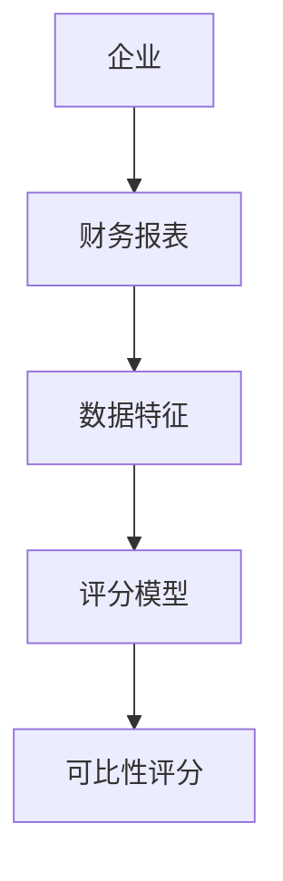
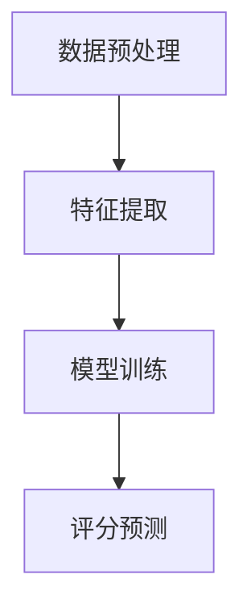

                 


# 设计智能化的企业财务报表可比性评分系统

> 关键词：企业财务报表、可比性评分、智能化设计、机器学习、财务数据分析

> 摘要：本文旨在设计一个智能化的企业财务报表可比性评分系统，通过结合人工智能和大数据分析技术，提升财务数据的可比性评估效率和准确性。文章详细探讨了系统的核心概念、算法原理、系统架构设计以及实际项目实现，为读者提供了一个全面的技术解决方案。

---

## 第一部分：企业财务报表可比性评分系统背景与核心概念

### 第1章：问题背景与定义

#### 1.1 问题背景
企业财务报表是反映企业经营状况的重要工具，但不同企业的会计政策、行业特点和财务状况差异，导致财务数据的可比性较低。传统的财务报表分析方法依赖人工经验，难以量化和标准化，导致评估结果主观性强，效率低下。

#### 1.2 核心概念
- **可比性评分系统**：通过技术手段，对企业的财务报表进行标准化处理，量化其可比性，提供客观评分。
- **数据特征提取**：从财务报表中提取关键数据特征，如收入、利润、资产负债率等。
- **评分模型**：基于机器学习算法，构建评分模型，评估财务数据的可比性。

#### 1.3 问题解决
通过智能化评分系统，解决传统方法中可比性评估主观性强、效率低下的问题，提升企业间财务数据的可比性。

### 第2章：核心概念与属性对比

#### 2.1 数据特征与评分标准
- 数据特征：包括财务指标（如收入、利润、成本）和非财务指标（如行业特性、企业规模）。
- 评分标准：根据数据特征的相似性，制定评分规则，如行业基准、财务指标标准化。

#### 2.2 核心概念对比
以下表格对比了数据特征与评分标准的核心属性：

| **属性**       | **数据特征**                | **评分标准**                |
|----------------|-----------------------------|-----------------------------|
| **定义**       | 具体的财务数据，如收入、利润 | 用于衡量可比性的标准       |
| **目的**       | 为评分提供输入              | 为评分提供规则和基准        |
| **影响因素**   | 数据的数值和分布           | 行业特性、企业规模、财务指标 |
| **应用场景**   | 数据处理阶段               | 评分阶段                   |

#### 2.3 实体关系图
以下为系统的实体关系图：



---

## 第二部分：算法原理与数学模型

### 第3章：算法原理

#### 3.1 算法选择
- 使用支持向量机（SVM）进行分类，基于财务数据特征的相似性进行评分。
- 算法流程：
  1. 数据预处理：标准化财务数据。
  2. 特征提取：选择关键财务指标。
  3. 模型训练：构建SVM分类器。
  4. 评分预测：对目标企业进行可比性评分。

#### 3.2 算法流程图


#### 3.3 数学模型
- **标准化公式**：
  $$
  z = \frac{x - \mu}{\sigma}
  $$
  其中，$\mu$ 是均值，$\sigma$ 是标准差。
- **SVM分类器**：
  $$
  y = \text{sign}(w \cdot x + b)
  $$
  其中，$w$ 是权重，$b$ 是偏置。

---

## 第三部分：系统架构设计

### 第4章：系统分析与架构设计

#### 4.1 问题场景
企业需要对多个财务报表进行可比性评估，但缺乏统一的评分标准和高效的评估方法。

#### 4.2 系统功能设计
- **领域模型**：
  ```mermaid
  classDiagram
      class 企业 {
          名称
          行业
      }
      class 财务报表 {
          收入
          利润
      }
      class 数据特征 {
          标准化收入
          标准化利润
      }
      class 评分模型 {
          支持向量机
      }
      class 可比性评分 {
          评分结果
      }
      企业 --> 财务报表
      财务报表 --> 数据特征
      数据特征 --> 评分模型
      评分模型 --> 可比性评分
  ```

#### 4.3 系统架构
- **架构图**：
  ```mermaid
  graph TD
      A[用户] --> B[前端界面]
      B --> C[数据输入]
      C --> D[数据处理]
      D --> E[评分模型]
      E --> F[评分结果]
      F --> G[结果输出]
  ```

---

## 第四部分：项目实战

### 第5章：项目实战

#### 5.1 环境安装
- 安装Python和相关库（如scikit-learn、pandas）。

#### 5.2 核心代码实现
```python
import pandas as pd
from sklearn import svm

# 数据预处理
data = pd.read_csv('financial_data.csv')
X = data[['收入', '利润']]
y = data['行业']

# 标准化处理
from sklearn.preprocessing import StandardScaler
scaler = StandardScaler()
X_scaled = scaler.fit_transform(X)

# 模型训练
model = svm.SVC()
model.fit(X_scaled, y)

# 预测评分
new_data = pd.read_csv('new_financial_data.csv')
new_X = new_data[['收入', '利润']]
new_X_scaled = scaler.transform(new_X)
predictions = model.predict(new_X_scaled)
print('预测行业:', predictions)
```

#### 5.3 案例分析
- 输入新的财务数据，通过模型预测其行业归属，进而评估可比性评分。

---

## 第五部分：总结与优化

### 第6章：总结与优化建议

#### 6.1 总结
智能化的财务报表可比性评分系统通过机器学习算法和数据处理技术，提升了财务数据的可比性评估效率和准确性。

#### 6.2 优化建议
- 引入更多数据特征，如企业规模、市场环境因素。
- 使用更复杂的模型，如深度学习模型，提升预测精度。

#### 6.3 注意事项
- 数据预处理是关键，需注意异常值和缺失值的处理。
- 模型调优时，需关注过拟合和欠拟合问题。

#### 6.4 拓展阅读
- 《Python机器学习实战》
- 《深入浅出机器学习》

---

## 作者：AI天才研究院/AI Genius Institute & 禅与计算机程序设计艺术/Zen And The Art of Computer Programming

