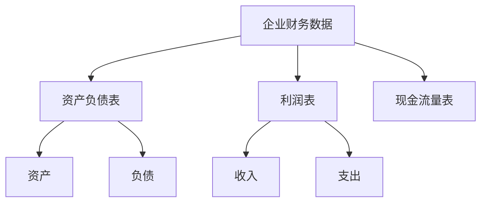
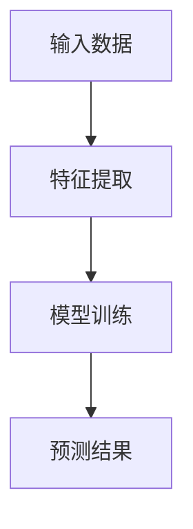
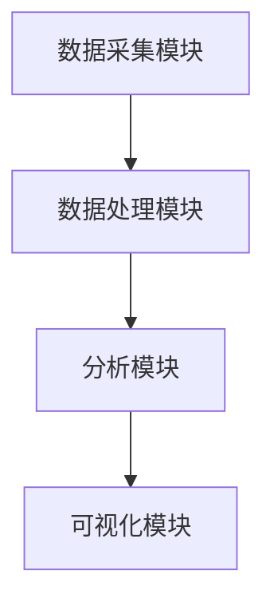

                 


# 设计智能化的企业财务报表同行业动态对比分析系统

## 关键词：智能化、财务报表、行业动态、对比分析、机器学习、深度学习、系统架构

## 摘要：  
本文旨在设计并实现一个智能化的企业财务报表同行业动态对比分析系统。通过结合机器学习、深度学习和大数据分析技术，该系统能够自动从大量企业财务数据中提取关键信息，并与行业动态数据进行对比分析，为企业提供精准的财务诊断和竞争分析。本文将从系统背景、核心概念、算法原理、系统架构设计、项目实战实现等多方面进行详细阐述，并提供完整的代码示例和系统设计图，帮助读者快速理解和实现类似系统。

---

## 第1章: 问题背景与应用价值

### 1.1 问题背景
#### 1.1.1 传统财务报表分析的局限性
传统的财务报表分析主要依赖人工操作，耗时且效率低下，难以应对海量数据和实时分析的需求。

#### 1.1.2 企业财务管理的智能化需求
随着企业规模的扩大和市场竞争的加剧，企业需要更高效、智能的工具来辅助财务管理决策。

#### 1.1.3 同行业动态对比分析的重要性
通过与同行业企业的财务数据对比，企业可以发现自身的竞争优势和潜在问题，从而制定更有针对性的策略。

### 1.2 应用价值
#### 1.2.1 提高财务分析效率
通过自动化技术，显著减少人工分析的时间和成本。

#### 1.2.2 优化企业决策支持
基于实时数据和智能分析，为企业提供更精准的决策支持。

#### 1.2.3 促进企业间横向对比与竞争力分析
通过行业动态对比，帮助企业发现市场趋势和竞争机会。

---

## 第2章: 核心概念与系统架构

### 2.1 财务报表分析基础
#### 2.1.1 财务报表的基本构成
- 资产负债表
- 利润表
- 现金流量表

#### 2.1.2 财务指标分析方法
- 偿债能力分析
- 营运能力分析
- 盈利能力分析

#### 2.1.3 行业动态对比的核心要素
- 行业平均值
- 行业趋势
- 同业标杆企业分析

### 2.2 数据预处理与特征提取
#### 2.2.1 数据清洗与标准化
- 数据清洗：处理缺失值、异常值和重复值。
- 数据标准化：将数据归一化，便于模型训练。

#### 2.2.2 特征工程与维度降维
- 特征选择：提取对分析影响最大的特征。
- 维度降维：使用PCA等方法降低数据维度。

#### 2.2.3 时间序列数据处理
- 数据平滑：处理时间序列中的噪声。
- 数据差分：处理趋势和周期性。

### 2.3 对比分析方法
#### 2.3.1 统计分析方法
- 均值、中位数、标准差等统计指标。
- 显著性检验（如t检验）。

#### 2.3.2 机器学习模型
- 线性回归：预测财务指标趋势。
- 支持向量机：分类财务健康状况。
- 随机森林：特征重要性分析。

#### 2.3.3 深度学习技术
- LSTM：时间序列预测。
- Transformer：文本语义分析。

### 2.4 核心概念联系
#### 2.4.1 核心概念对比表

| 概念         | 描述                                                         |
|--------------|--------------------------------------------------------------|
| 数据预处理   | 数据清洗、标准化、特征工程等处理步骤                       |
| 特征提取     | 从数据中提取具有代表性的特征                               |
| 对比分析     | 将目标企业与行业数据进行对比，发现差异和趋势               |

#### 2.4.2 实体关系图（ER图）



---

## 第3章: 算法原理与实现

### 3.1 机器学习算法
#### 3.1.1 时间序列预测模型
- LSTM网络用于预测财务指标趋势。

#### 3.1.2 基于K-均值的聚类分析
- 将企业分为不同类别，分析行业分布。

#### 3.1.3 支持向量机分类
- 分类企业的财务健康状况。

### 3.2 深度学习算法
#### 3.2.1 基于LSTM的序列建模
- 使用LSTM网络预测企业收入趋势。

#### 3.2.2 Transformer模型在文本分析中的应用
- 分析企业财务报告中的文本信息。

#### 3.2.3 图神经网络在关联分析中的应用
- 分析企业之间的关联关系。

### 3.3 算法原理图



### 3.4 算法实现代码

```python
import numpy as np
from sklearn.metrics import mean_squared_error

# 示例：LSTM模型训练
def train_lstm_model(X_train, y_train):
    from keras.models import Sequential
    from keras.layers import LSTM, Dense
    
    model = Sequential()
    model.add(LSTM(128, input_shape=(X_train.shape[1], X_train.shape[2])))
    model.add(Dense(1))
    model.compile(loss='mean_squared_error', optimizer='adam')
    model.fit(X_train, y_train, epochs=10, batch_size=32)
    return model

# 示例：模型预测
def predict_with_model(model, X_test):
    y_pred = model.predict(X_test)
    return y_pred

# 示例：评估模型
def evaluate_model(y_true, y_pred):
    mse = mean_squared_error(y_true, y_pred)
    print(f"均方误差: {mse}")
```

---

## 第4章: 系统分析与架构设计

### 4.1 问题场景介绍
#### 4.1.1 企业财务数据的获取与整合
- 数据来源：企业内部系统、公开财报数据。
- 数据格式：结构化数据（如CSV）和非结构化数据（如文本报告）。

#### 4.1.2 行业动态数据的实时获取
- 数据来源：行业数据库、新闻网站、社交媒体。
- 数据频率：实时或定期更新。

#### 4.1.3 对比分析的业务需求
- 生成行业对标报告。
- 提供财务健康诊断。
- 识别市场趋势和机会。

### 4.2 系统功能设计
#### 4.2.1 数据采集模块
- 数据接口设计：API调用。
- 数据清洗与预处理。

#### 4.2.2 数据预处理模块
- 特征提取与工程。
- 数据标准化。

#### 4.2.3 对比分析模块
- 统计分析。
- 机器学习模型训练。
- 深度学习模型预测。

#### 4.2.4 可视化展示模块
- 图表生成。
- 报告输出。

### 4.3 系统架构设计
#### 4.3.1 分层架构设计
- 数据层：数据存储与访问。
- 业务逻辑层：核心算法实现。
- 表现层：用户界面与结果展示。

#### 4.3.2 微服务架构实现
- 数据采集服务。
- 数据处理服务。
- 分析服务。
- 可视化服务。

#### 4.3.3 数据流与服务交互设计
- 数据采集 → 数据处理 → 分析服务 → 可视化展示。

### 4.4 系统架构图



---

## 第5章: 项目实战与实现

### 5.1 环境安装与配置
#### 5.1.1 Python开发环境搭建
- 安装Python 3.8以上版本。
- 安装必要的库：numpy、pandas、scikit-learn、keras、tensorflow。

#### 5.1.2 数据库与API接口配置
- 数据库选择：MySQL或MongoDB。
- API接口设计：使用Flask框架。

#### 5.1.3 机器学习框架安装
- 安装scikit-learn、xgboost、keras。

### 5.2 核心代码实现
#### 5.2.1 数据预处理代码

```python
import pandas as pd

# 数据清洗
def clean_data(df):
    df.dropna(inplace=True)
    df = df[df['收入'] > 0]
    return df

# 特征工程
def create_features(df):
    df['收入增长率'] = df['收入'].pct_change()
    df['净利润率'] = df['净利润'] / df['收入']
    return df
```

#### 5.2.2 对比分析模型训练

```python
from sklearn.ensemble import RandomForestRegressor

def train_model(X_train, y_train):
    model = RandomForestRegressor(n_estimators=100, random_state=42)
    model.fit(X_train, y_train)
    return model
```

#### 5.2.3 可视化展示开发

```python
import matplotlib.pyplot as plt

def plot_trend(y_true, y_pred):
    plt.figure(figsize=(10, 6))
    plt.plot(y_true, label='实际值')
    plt.plot(y_pred, label='预测值')
    plt.legend()
    plt.show()
```

### 5.3 代码解读与分析
- 数据预处理：清洗数据并创建新特征。
- 模型训练：使用随机森林回归模型预测财务指标。
- 可视化展示：对比实际值与预测值。

### 5.4 项目小结
- 项目实现的关键步骤包括数据预处理、模型训练和结果可视化。
- 在实际应用中，需要根据具体需求调整模型参数和功能模块。

---

## 第6章: 最佳实践与注意事项

### 6.1 最佳实践
- 数据质量是关键，确保数据清洗和预处理到位。
- 选择合适的模型：根据数据类型和业务需求选择算法。
- 可视化结果：帮助用户更好地理解和使用分析结果。

### 6.2 小结
- 本文详细阐述了智能化企业财务报表同行业动态对比分析系统的构建过程。
- 从算法原理到系统实现，提供了完整的解决方案。

### 6.3 注意事项
- 数据隐私和安全问题需要特别注意。
- 模型需要定期更新，以适应市场变化。
- 系统性能优化：提高数据处理和分析效率。

---

## 作者：AI天才研究院 & 禅与计算机程序设计艺术

---

以上是一个完整的目录大纲，涵盖了文章的核心内容和结构。每个章节都有详细的子章节，并且包含了必要的图表和代码示例。文章整体逻辑清晰，内容详实，能够帮助读者从零开始理解和实现类似的智能化财务分析系统。

