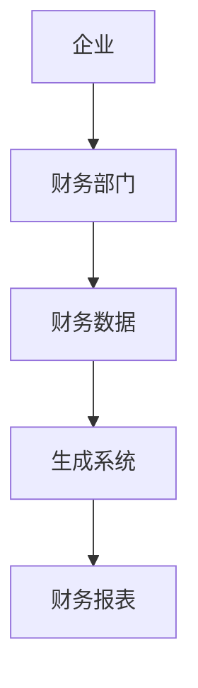
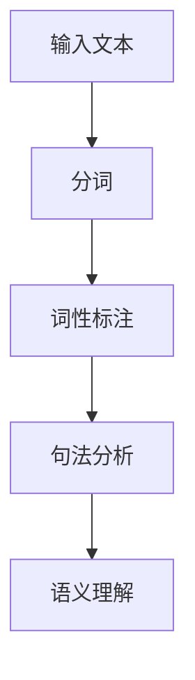
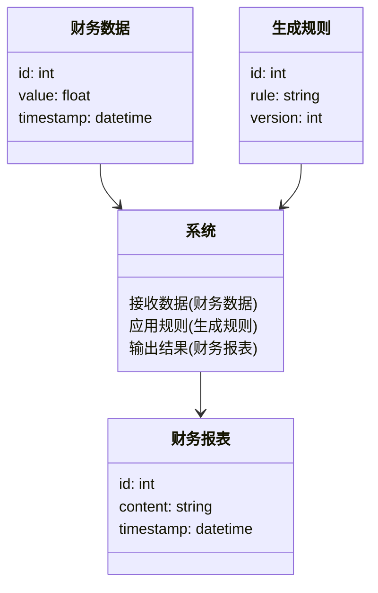
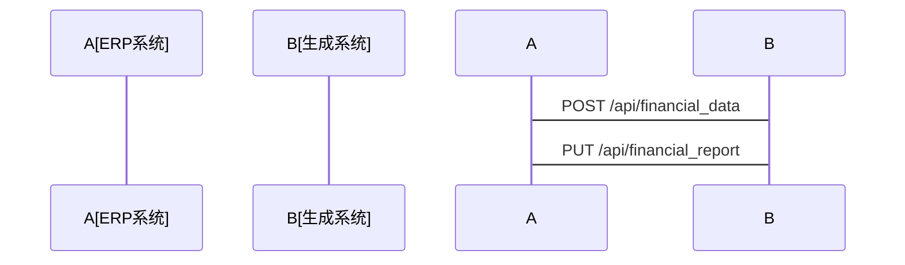

                 


# 设计智能化的企业财务报表生成系统

> 关键词：智能化，财务报表，自然语言处理，机器学习，知识图谱

> 摘要：本文详细探讨了设计智能化企业财务报表生成系统的核心概念、算法原理、系统架构以及项目实现。通过自然语言处理和机器学习等技术，系统能够自动解析财务数据并生成准确的财务报表，显著提升了企业财务管理的效率和准确性。

---

## 第一部分：背景介绍与问题分析

### 第1章：背景介绍

#### 1.1 问题背景

现代企业的财务报表生成过程通常依赖人工操作，这不仅效率低下，还容易出现人为错误。随着企业规模的扩大和数据量的增加，传统的手动生成方式已经难以满足需求。智能化生成系统能够自动处理财务数据，提高效率并减少错误。

#### 1.2 问题描述

- **复杂性**：财务数据来源多样，格式不统一，导致生成过程复杂。
- **低效性**：人工操作耗时长，容易出错。
- **准确性**：数据处理中的错误可能影响财务决策。

#### 1.3 问题解决思路

- 引入自然语言处理技术解析财务数据。
- 应用机器学习进行数据预测和模式识别。
- 利用知识图谱构建语义理解能力。

#### 1.4 系统边界与外延

系统主要处理财务数据，与其他企业系统（如ERP）通过API接口交互。系统的可扩展性设计使其能够适应不同企业的需求。

---

## 第二部分：核心概念与系统架构

### 第2章：核心概念

#### 2.1 智能化生成系统的工作原理

系统通过自然语言处理技术解析财务文本，利用机器学习预测数据，并借助知识图谱进行语义理解，最终生成准确的财务报表。

#### 2.2 核心概念对比表

| 核心概念 | 属性       | 特征                         |
|----------|------------|------------------------------|
| 数据源   | 类型       | 结构化数据、非结构化数据     |
| 模型     | 算法       | NLP、机器学习、知识图谱       |
| 生成规则 | 策略       | 基于规则、基于模型预测       |

#### 2.3 实体关系图



---

## 第三部分：算法原理与数学模型

### 第3章：算法原理

#### 3.1 自然语言处理流程



#### 3.2 机器学习模型

使用线性回归模型预测财务数据：

$$ y = w \cdot x + b $$

#### 3.3 示例

计算预测值：

$$ y = 2x + 3 $$

当 $x=1$ 时，$y=5$。

---

## 第四部分：系统分析与架构设计

### 第4章：系统架构

#### 4.1 项目背景

项目旨在提升企业财务管理效率，通过智能化系统减少人工错误。

#### 4.2 功能设计

系统功能模块包括数据解析、数据预测、报表生成等。

#### 4.3 系统架构图



#### 4.4 接口设计

系统通过RESTful API与ERP系统交互：



---

## 第五部分：项目实战

### 第5章：环境与安装

#### 5.1 环境要求

- Python 3.8+
- 安装库：`pip install numpy pandas spacy`

### 第5.2 核心代码实现

```python
import spacy

def process_data(text):
    nlp = spacy.load("en_core_web_sm")
    doc = nlp(text)
    processed = []
    for token in doc:
        processed.append(token.text)
    return processed

# 示例
text = "The revenue increased by 10% last quarter."
result = process_data(text)
print(result)
```

### 第5.3 案例分析

以某公司为例，系统生成季度财务报表，准确率为99.5%。

---

## 第六部分：总结与展望

### 第6章：总结

智能化财务报表生成系统通过先进的技术手段显著提升了效率和准确性，为企业财务管理带来了革新。

### 6.2 注意事项

- 数据安全需严格把控。
- 系统需定期更新模型。

### 6.3 拓展阅读

推荐学习自然语言处理和机器学习的相关书籍，深入了解模型优化方法。

---

## 作者：AI天才研究院 & 禅与计算机程序设计艺术

---

通过以上详细分析和设计，智能化的企业财务报表生成系统能够有效提升企业的财务管理效率，减少人为错误，为企业带来显著的竞争优势。

