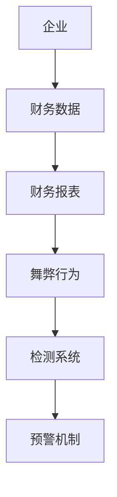
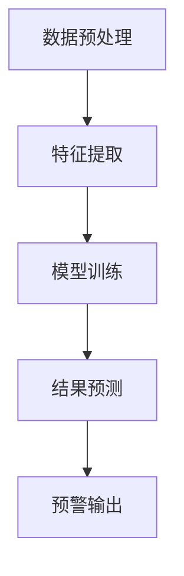
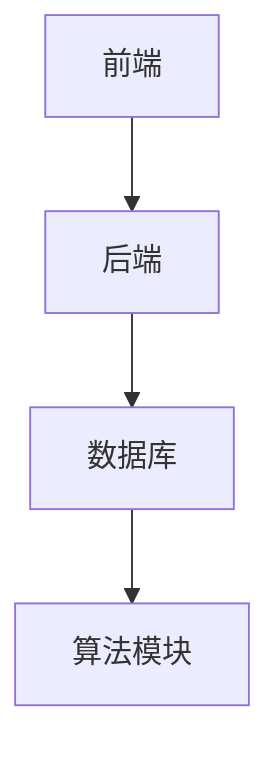
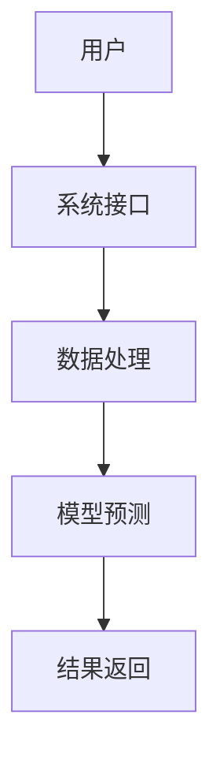

                 


# 设计智能化的企业财务报表舞弊检测系统

> 关键词：财务报表舞弊检测，人工智能，机器学习，监督学习，无监督学习，SVM，随机森林

> 摘要：本文详细探讨了设计智能化企业财务报表舞弊检测系统的核心技术与实现方案，从问题背景、核心概念、算法原理、系统架构到项目实战，全面解析了如何利用人工智能技术有效识别财务报表中的舞弊行为，为企业提供智能化的财务风险管理解决方案。

---

# 第一部分: 企业财务报表舞弊检测系统背景与概述

## 第1章: 企业财务报表舞弊检测系统概述

### 1.1 问题背景与描述

#### 1.1.1 财务报表舞弊的定义与特征
财务报表舞弊是指企业在编制财务报表时，通过虚构收入、隐瞒支出、虚增资产或虚减负债等手段，故意提供虚假或误导性财务信息的行为。其主要特征包括：
- 数据异常性：收入与支出比例失衡，资产与负债不匹配。
- 行为隐蔽性：舞弊行为通常隐藏在复杂的财务操作中，难以被传统方法发现。
- 损害严重性：舞弊可能导致投资者损失、企业信用下降，甚至引发金融危机。

#### 1.1.2 舞弊对企业与社会的影响
- 企业层面：损害企业声誉，导致信任缺失，面临法律诉讼和罚款。
- 社会层面：破坏市场公平竞争，影响金融市场稳定，降低投资者信心。

#### 1.1.3 传统舞弊检测方法的局限性
传统财务报表审计方法依赖人工审查，存在以下问题：
- 人工审查效率低，成本高。
- 审查范围有限，难以覆盖全部数据。
- 易受主观因素影响，检测精度不高。

### 1.2 系统目标与功能

#### 1.2.1 系统设计的核心目标
- 自动化检测：实现财务数据的自动化分析与舞弊识别。
- 高精度检测：通过机器学习算法提升检测准确率。
- 实时监控：提供实时数据处理能力，及时发现异常。

#### 1.2.2 系统的主要功能模块
- 数据采集模块：负责采集企业的财务数据。
- 特征提取模块：从财务数据中提取关键特征。
- 模型训练模块：基于历史数据训练舞弊检测模型。
- 结果输出模块：输出检测结果及预警信息。

#### 1.2.3 系统的边界与外延
- 系统边界：仅处理企业财务数据，不涉及其他业务数据。
- 系统外延：可与其他企业管理系统（如ERP）集成，提供更全面的财务风险管理。

### 1.3 系统的核心要素与组成

#### 1.3.1 数据来源与处理流程
- 数据来源：企业财务报表、业务系统数据、外部市场数据。
- 处理流程：数据清洗、特征提取、数据标注。

#### 1.3.2 系统架构与组件
- 数据层：存储财务数据。
- 业务层：处理数据，提取特征。
- 表示层：展示检测结果。

#### 1.3.3 系统的性能指标与评估标准
- 检测准确率：系统正确识别舞弊行为的比例。
- 检测速度：处理大规模数据所需的时间。

---

# 第二部分: 核心概念与关联分析

## 第2章: 核心概念与关联分析

### 2.1 实体关系图（ER图）



### 2.2 属性对比分析

| 实体 | 属性 |
|------|------|
| 企业 | 名称、行业、规模 |
| 财务数据 | 收入、支出、利润 |
| 财务报表 | 资产负债表、利润表、现金流量表 |
| 舞弊行为 | 虚假收入、虚增资产、隐瞒负债 |
| 检测系统 | 数据采集、特征提取、模型训练、结果输出 |

### 2.3 本章小结
通过ER图和属性对比分析，明确了企业财务报表舞弊检测系统中各实体及其属性的关联关系，为后续算法设计提供了基础。

---

# 第三部分: 算法原理与实现

## 第3章: 舞弊检测算法原理

### 3.1 算法选择与原理

#### 3.1.1 监督学习与无监督学习的对比
- 监督学习：需要标注数据，适合已知舞弊案例的分类问题。
- 无监督学习：无需标注数据，适合发现异常模式。

#### 3.1.2 支持向量机（SVM）与随机森林（RF）的优缺点
- SVM：适用于小规模数据，分类能力强。
- 随机森林：适用于大规模数据，抗过拟合能力强。

#### 3.1.3 基于深度学习的算法选择
- Transformer：适合处理序列数据，可捕捉长距离依赖关系。

### 3.2 算法流程图



### 3.3 数学模型与公式

#### 3.3.1 支持向量机（SVM）数学模型
$$ \text{目标函数} = \min_{w,b,\xi} \frac{1}{2}||w||^2 + C\sum_{i=1}^n \xi_i $$
$$ \text{约束条件}： y_i(w \cdot x_i + b) \geq 1 - \xi_i, \xi_i \geq 0 $$

---

# 第四部分: 系统分析与架构设计

## 第4章: 系统分析与架构设计

### 4.1 问题场景介绍

#### 4.1.1 财务数据异常检测
- 数据异常：收入与支出比例异常，资产与负债不匹配。

#### 4.1.2 财务报表舞弊识别
- 识别虚假收入：通过分析收入与销售数据的匹配性。
- 识别虚增资产：通过分析资产与业务规模的匹配性。

### 4.2 系统功能设计

#### 4.2.1 领域模型类图


#### 4.2.2 系统架构设计



### 4.3 系统接口设计

#### 4.3.1 接口设计
- 数据接口：从企业系统获取财务数据。
- 模型接口：调用训练好的舞弊检测模型。

#### 4.3.2 交互流程图



---

# 第五部分: 项目实战

## 第5章: 项目实战

### 5.1 环境安装

#### 5.1.1 安装Python
- 安装Python 3.8及以上版本。
- 安装Jupyter Notebook。

#### 5.1.2 安装依赖库
```bash
pip install numpy pandas scikit-learn matplotlib
```

### 5.2 系统核心实现

#### 5.2.1 数据预处理代码

```python
import pandas as pd
import numpy as np

# 数据加载
data = pd.read_csv('financial_data.csv')

# 数据清洗
data = data.dropna()
data = data.replace({np.nan: 0})

# 特征提取
features = data[['收入', '支出', '利润']]
labels = data['舞弊标志']
```

#### 5.2.2 模型训练代码

```python
from sklearn.model import SVC

# 训练模型
model = SVC(C=1.0, kernel='rb

