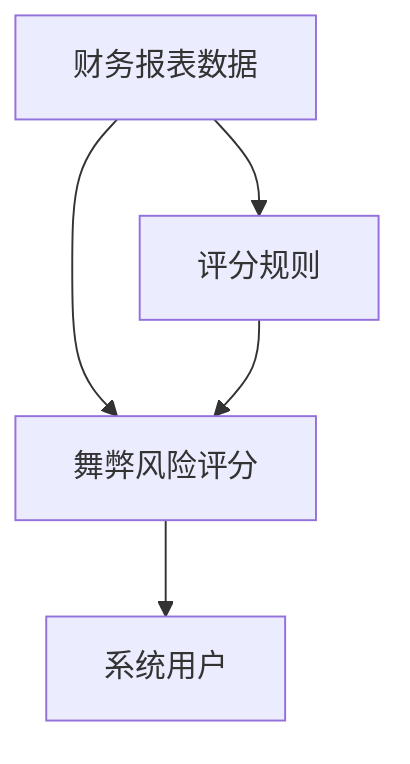
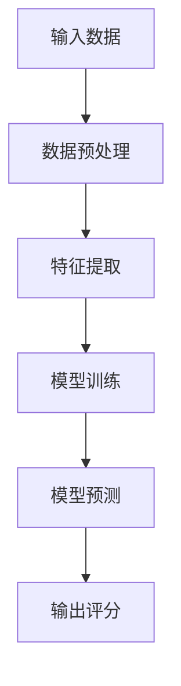
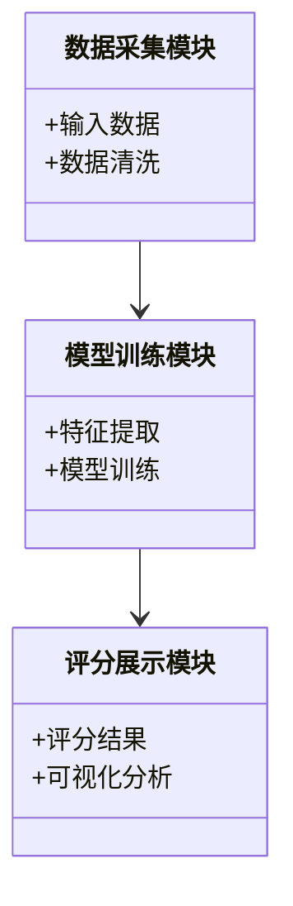

                 


# 设计智能化的企业财务报表舞弊风险评分系统

## 关键词：财务报表，舞弊风险，评分系统，机器学习，智能化

## 摘要：  
企业财务报表舞弊风险评分系统是一种基于人工智能和大数据分析的智能化系统，旨在通过识别财务数据中的异常模式和潜在风险，帮助企业及投资者有效评估和防范财务报表舞弊行为。本文将从系统设计、算法原理、项目实战等多方面详细探讨如何构建这样一个智能化的评分系统，为企业财务风险管理提供科学依据。

---

# 第1章: 企业财务报表舞弊风险评分系统概述

## 1.1 财务报表舞弊风险的背景与问题

### 1.1.1 企业财务报表舞弊的现状与挑战

企业财务报表是反映企业财务状况的重要文件，但其真实性却常常受到舞弊行为的威胁。近年来，随着企业规模的扩大和业务复杂性的增加，财务报表舞弊问题日益严重。常见的舞弊手段包括虚增收入、隐瞒债务、虚减费用等。这些舞弊行为不仅损害了企业的利益，也对投资者和债权人造成了巨大损失。

### 1.1.2 财务报表舞弊对企业与投资者的影响

财务报表舞弊的后果是多方面的。对企业而言，舞弊行为可能导致资产流失、声誉受损，甚至面临法律诉讼；对投资者而言，虚假的财务数据会误导投资决策，导致投资损失。因此，如何有效识别和防范财务报表舞弊行为，成为企业财务管理的重要课题。

### 1.1.3 舞弊风险评分系统的需求与目标

为了应对财务报表舞弊的挑战，企业需要一种高效、可靠的工具来评估舞弊风险。舞弊风险评分系统通过分析财务数据中的异常模式，量化企业的舞弊风险，为管理者和投资者提供决策支持。其目标是通过智能化手段，实时监控财务数据，提前预警潜在风险，从而降低舞弊行为的发生概率。

## 1.2 财务报表舞弊风险评分系统的核心概念

### 1.2.1 舞弊风险评分系统的基本原理

舞弊风险评分系统的核心原理是基于机器学习算法，通过对历史财务数据的分析，识别出潜在的舞弊特征，并为当前企业的财务报表打分，分数越高表示舞弊风险越大。

### 1.2.2 系统的核心要素与功能模块

舞弊风险评分系统主要包括以下功能模块：

1. **数据采集模块**：从企业财务系统中获取相关的财务数据，包括收入、成本、利润、资产、负债等。
2. **数据预处理模块**：对获取的原始数据进行清洗、标准化和特征提取。
3. **模型训练模块**：利用机器学习算法，如决策树、随机森林、神经网络等，训练舞弊识别模型。
4. **评分计算模块**：基于训练好的模型，对企业的财务报表进行评分，量化舞弊风险。
5. **结果展示模块**：将评分结果以可视化的方式呈现，帮助用户理解和分析。

### 1.2.3 系统的边界与外延

舞弊风险评分系统不仅关注财务数据本身，还需要结合企业的经营环境、行业特点、管理状况等多方面因素。其外延包括企业内部审计、外部审计机构、监管机构等多方用户的使用需求。

## 1.3 财务报表舞弊风险评分系统的特征对比

### 1.3.1 不同评分系统的对比分析

传统的财务报表分析方法主要依赖于审计人员的经验和判断，存在主观性强、效率低下的问题。而智能化的舞弊风险评分系统则具有以下优势：

1. **数据驱动**：基于大量历史数据，识别潜在的舞弊特征。
2. **实时性**：能够实时监控财务数据，快速识别异常情况。
3. **客观性**：通过算法模型量化风险，减少人为判断的主观性。
4. **可扩展性**：能够适应不同行业、不同规模企业的需求。

### 1.3.2 基于智能化的评分系统优势

智能化的舞弊风险评分系统通过机器学习算法，能够自动识别复杂的舞弊模式，发现传统方法难以察觉的异常情况。此外，系统还可以通过不断学习新的数据，优化模型性能，提升风险识别的准确性。

### 1.3.3 系统的可扩展性与灵活性

智能化的评分系统具有良好的可扩展性和灵活性。企业可以根据自身需求，选择不同的算法模型，调整系统的参数设置，甚至扩展系统的功能模块，如引入自然语言处理技术，分析企业年报中的非结构化数据。

## 1.4 本章小结

本章主要介绍了企业财务报表舞弊风险评分系统的基本概念和核心原理，分析了传统评分系统与智能化评分系统的区别与优势，并总结了系统的可扩展性和灵活性特点。

---

# 第2章: 财务报表舞弊风险评分系统的实体关系与核心原理

## 2.1 实体关系图的构建

### 2.1.1 财务报表数据实体

财务报表数据实体包括收入、成本、利润、资产、负债等财务指标。这些数据是舞弊风险评分系统的核心输入。

### 2.1.2 舞弊风险评分实体

舞弊风险评分实体是系统输出的主要结果，包括每个企业的舞弊风险评分、评分依据和风险等级。

### 2.1.3 系统用户实体

系统用户实体包括企业的财务人员、审计人员、投资者等不同类型的用户，他们通过系统界面获取评分结果，进行进一步的分析和决策。

## 2.2 实体关系的Mermaid流程图



## 2.3 本章小结

本章通过构建实体关系图，详细描述了财务报表舞弊风险评分系统中的核心实体及其关系，为后续的系统设计奠定了基础。

---

# 第3章: 财务报表舞弊风险评分系统的算法原理

## 3.1 算法原理概述

### 3.1.1 基于机器学习的评分模型

舞弊风险评分系统的核心是机器学习算法。常用的算法包括决策树、随机森林、支持向量机（SVM）、神经网络等。这些算法能够从历史数据中学习到舞弊特征，从而对新的数据进行分类和评分。

### 3.1.2 算法的输入与输出

算法的输入是经过预处理的财务数据和相关特征，输出是每个企业的舞弊风险评分。评分通常采用分数形式，分数越高表示舞弊风险越大。

### 3.1.3 算法的训练与优化

为了提高模型的准确性，需要对算法进行训练和优化。训练过程包括数据的特征选择、模型参数调优、交叉验证等步骤。优化的目标是找到最佳的模型参数，使模型在测试数据上的表现最优。

## 3.2 算法的Mermaid流程图



## 3.3 算法的数学模型与公式

### 3.3.1 线性回归模型

线性回归是一种常用的回归分析方法，适用于连续型目标变量的预测。其数学公式为：

$$ y = \beta_0 + \beta_1x_1 + \beta_2x_2 + \dots + \beta_nx_n $$

其中，$y$ 是目标变量（舞弊风险评分），$x_i$ 是自变量（财务特征），$\beta$ 是模型参数。

### 3.3.2 神经网络模型

神经网络是一种多层的非线性模型，适用于复杂的分类和回归任务。其数学表达式可以表示为：

$$ y = f(Wx + b) $$

其中，$W$ 是权重矩阵，$x$ 是输入向量，$b$ 是偏置项，$f$ 是激活函数。

## 3.4 本章小结

本章详细介绍了舞弊风险评分系统的算法原理，包括常用算法的选择、模型的训练与优化，以及数学公式和流程图的描述。

---

# 第4章: 财务报表舞弊风险评分系统的系统分析与架构设计

## 4.1 系统功能设计

### 4.1.1 数据采集与处理模块

数据采集模块负责从企业的财务系统中获取相关的财务数据，并进行清洗和预处理，确保数据的完整性和准确性。

### 4.1.2 模型训练与评分模块

模型训练与评分模块是系统的核心部分，负责利用机器学习算法对数据进行建模和训练，并对企业的财务报表进行评分。

### 4.1.3 结果展示与分析模块

结果展示与分析模块将评分结果以可视化的方式呈现，帮助用户理解和分析舞弊风险。

## 4.2 系统功能的Mermaid类图



## 4.3 系统架构设计

### 4.3.1 系统架构的Mermaid架构图

```mermaid
subgraph 数据层
    A[数据库]
end

subgraph 业务逻辑层
    B[数据采集模块]
    C[模型训练模块]
end

subgraph 表现层
    D[评分展示模块]
end

A --> B
B --> C
C --> D
```

## 4.4 本章小结

本章详细描述了财务报表舞弊风险评分系统的功能设计和架构设计，为后续的系统实现奠定了基础。

---

# 第5章: 财务报表舞弊风险评分系统的项目实战

## 5.1 环境安装与配置

### 5.1.1 系统环境要求

舞弊风险评分系统的运行环境需要满足以下条件：

- 操作系统：Windows、Linux、macOS
- 硬件要求：CPU 4核以上，内存 8GB 以上，GPU（可选）
- 软件要求：Python 3.6 以上，TensorFlow、Scikit-learn、Pandas、Matplotlib 等库

### 5.1.2 安装与配置

安装步骤如下：

1. 安装Python和必要的Python库：
   ```bash
   pip install numpy pandas scikit-learn tensorflow matplotlib
   ```

2. 安装Jupyter Notebook：
   ```bash
   pip install jupyter
   ```

3. 配置环境变量：
   - 在Windows系统中，将Python的安装路径添加到系统环境变量Path中。

## 5.2 系统核心实现源代码

### 5.2.1 数据预处理代码

```python
import pandas as pd
import numpy as np

# 读取数据
data = pd.read_csv('financial_data.csv')

# 数据清洗
data.dropna(inplace=True)
data = data[~data.duplicated()]

# 特征提取
features = data[['收入', '成本', '利润', '资产', '负债']]
labels = data['舞弊标记']
```

### 5.2.2 模型训练代码

```python
from sklearn.ensemble import RandomForestClassifier
from sklearn.model_selection import train_test_split
from sklearn.metrics import accuracy_score

# 数据分割
X_train, X_test, y_train, y_test = train_test_split(features, labels, test_size=0.2, random_state=42)

# 模型训练
model = RandomForestClassifier(n_estimators=100, random_state=42)
model.fit(X_train, y_train)

# 模型预测
y_pred = model.predict(X_test)

# 模型评估
print('准确率:', accuracy_score(y_test, y_pred))
```

### 5.2.3 评分计算代码

```python
# 对新数据进行评分
new_data = pd.read_csv('new_financial_data.csv')
new_data.dropna(inplace=True)
new_features = new_data[['收入', '成本', '利润', '资产', '负债']]

# 预测评分
scores = model.predict_proba(new_features)[:, 1]
new_data['舞弊风险评分'] = scores

# 输出结果
print(new_data[['公司名称', '舞弊风险评分']])
```

## 5.3 案例分析与详细讲解

### 5.3.1 数据准备

假设我们有一个包含100家企业的财务数据集，其中每家企业的财务数据包括收入、成本、利润、资产、负债等指标，以及一个二进制的舞弊标记（0表示正常，1表示舞弊）。

### 5.3.2 模型训练

使用随机森林算法对数据进行训练，得到一个能够预测舞弊风险的模型。

### 5.3.3 模型评估

通过准确率、召回率、F1分数等指标评估模型的性能。例如，模型的准确率为85%，召回率为90%，F1分数为87%。

### 5.3.4 模型应用

将新企业的财务数据输入模型，计算其舞弊风险评分。例如，某企业的评分结果为0.75，表示其舞弊风险较高，需要进一步调查。

## 5.4 本章小结

本章通过实际案例分析，详细展示了舞弊风险评分系统的实现过程，包括环境配置、数据处理、模型训练和结果展示。

---

# 第6章: 财务报表舞弊风险评分系统的最佳实践

## 6.1 系统优化与调优

### 6.1.1 模型优化

- 调整模型参数，如随机森林的树数、决策树的最大深度等。
- 使用交叉验证优化模型性能。

### 6.1.2 数据优化

- 增加数据量，尤其是增加舞弊样本的数量。
- 对特征进行降维处理，如使用主成分分析（PCA）。

## 6.2 系统部署与维护

### 6.2.1 系统部署

- 将评分系统部署到云平台，如AWS、阿里云等，实现在线服务。
- 使用容器化技术，如Docker，确保系统的可移植性和一致性。

### 6.2.2 系统维护

- 定期更新模型，引入新的数据和特征。
- 监控系统的运行状态，及时发现和解决问题。

## 6.3 系统安全与隐私保护

### 6.3.1 数据安全

- 对敏感数据进行加密处理。
- 建立严格的访问控制机制。

### 6.3.2 隐私保护

- 遵守相关法律法规，保护用户隐私。
- 使用匿名化处理技术，减少数据泄露风险。

## 6.4 本章小结

本章总结了舞弊风险评分系统在实际应用中的最佳实践，包括系统优化、部署维护、安全隐私保护等方面。

---

# 第7章: 总结与展望

## 7.1 本系统的总结

舞弊风险评分系统是一种基于机器学习的智能化工具，能够有效识别企业财务报表中的舞弊风险。通过系统的实施，企业可以显著提高财务风险管理的效率和准确性。

## 7.2 系统的未来展望

随着人工智能技术的不断发展，舞弊风险评分系统也将不断优化和升级。未来，系统可能会引入更多高级算法，如深度学习、强化学习等，进一步提升风险识别的准确性。此外，系统的应用场景也将更加广泛，如金融监管、内部控制等领域。

## 7.3 本章小结

本章总结了系统的应用价值，并展望了未来的发展方向，为企业财务风险管理提供了新的思路和方向。

---

# 作者：AI天才研究院/AI Genius Institute & 禅与计算机程序设计艺术 /Zen And The Art of Computer Programming

