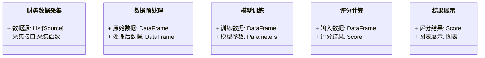

                 


# 设计智能化的企业财务报表质量动态评分系统

## 关键词：企业财务报表，动态评分系统，人工智能，机器学习，大数据分析

## 摘要：本文介绍了一种基于人工智能和大数据分析的企业财务报表质量动态评分系统的设计与实现。通过分析财务报表的关键指标，利用机器学习算法和时间序列分析，建立动态评分模型，实现对企业财务健康状况的实时评估。系统架构采用模块化设计，结合领域模型和系统架构图，详细阐述了系统实现的关键步骤和算法原理。

---

## 第一部分: 智能化企业财务报表质量动态评分系统概述

### 第1章: 问题背景与需求分析

#### 1.1 问题背景

##### 1.1.1 传统财务报表评估的局限性
传统的财务报表评估主要依赖人工审核，存在效率低、主观性强、容易出错的问题。企业财务数据量大且复杂，人工分析难以覆盖所有细节，导致评估结果可能存在偏差。

##### 1.1.2 数据驱动的财务管理趋势
随着大数据和人工智能技术的发展，企业越来越依赖数据驱动的决策。通过分析财务数据，可以发现潜在问题，优化资源配置，提升管理水平。

##### 1.1.3 企业对智能化财务分析的需求
企业需要实时了解财务健康状况，及时发现异常情况，降低财务风险。传统的静态评估方法无法满足动态变化的财务状况分析需求。

#### 1.2 问题描述

##### 1.2.1 财务报表质量评估的关键要素
财务报表的质量评估需要考虑准确性、完整性、及时性和一致性等指标。

##### 1.2.2 动态评分系统的定义与目标
动态评分系统是一种基于实时财务数据，利用人工智能技术，对企业财务状况进行动态评估的系统。其目标是提供准确、及时的评分结果，帮助企业管理者做出决策。

##### 1.2.3 系统边界与外延
系统边界包括财务数据输入、模型训练、评分计算和结果输出。外延部分涉及数据来源的多样性和模型的可扩展性。

### 第2章: 核心概念与系统架构

#### 2.1 核心概念解析

##### 2.1.1 财务报表质量评估的指标体系
指标体系包括收入、利润、资产负债率、流动比率等关键财务指标。

##### 2.1.2 动态评分的机制与算法
动态评分机制基于机器学习模型，考虑时间序列分析和聚类算法。

##### 2.1.3 系统的核心要素与组成
系统核心要素包括数据预处理、模型训练、评分计算和结果展示。

#### 2.2 系统架构设计

##### 2.2.1 系统功能模块划分
系统功能模块包括数据采集、预处理、模型训练、评分计算和结果展示。

##### 2.2.2 数据流与信息交互关系
数据从各个来源采集，经过预处理后输入模型，生成评分结果并展示。

##### 2.2.3 系统整体架构图（Mermaid）
```mermaid
graph TD
A[数据采集] -> B[数据预处理]
B -> C[模型训练]
C -> D[评分计算]
D -> E[结果展示]
```

### 第3章: 算法原理与数学模型

#### 3.1 动态评分算法原理

##### 3.1.1 基于机器学习的评分模型
使用逻辑回归算法对财务数据进行分类，判断财务健康状况。

##### 3.1.2 时间序列分析与预测
通过ARIMA模型预测未来财务趋势，识别异常波动。

##### 3.1.3 聚类分析在财务数据中的应用
利用K-means算法将企业分为不同类别，便于评分和比较。

#### 3.2 数学模型与公式

##### 3.2.1 评分函数的数学表达式
$$ \text{评分} = f(\text{收入}, \text{利润}, \text{资产负债率}) $$

##### 3.2.2 时间序列预测模型
$$ \text{预测值} = a \times \text{历史平均} + b \times \text{趋势} $$

##### 3.2.3 聚类算法示例（K-means）
目标函数：
$$ J = \sum_{i=1}^{k} \sum_{x_j \in S_i} (x_j - \mu_i)^2 $$
其中，\( k \) 是聚类数，\( S_i \) 是第i个聚类，\( \mu_i \) 是聚类中心。

### 第4章: 系统分析与架构设计

#### 4.1 系统分析

##### 4.1.1 问题场景介绍
企业财务数据复杂多样，需要实时分析和动态评分。

##### 4.1.2 系统功能需求分析
需求包括数据采集、预处理、模型训练、评分计算和结果展示。

##### 4.1.3 系统性能需求
系统需要处理大量数据，要求高并发和低延迟。

#### 4.2 系统架构设计

##### 4.2.1 领域模型类图（Mermaid）


##### 4.2.2 系统架构图（Mermaid）
```mermaid
graph TD
A[数据采集] -> B[数据预处理]
B -> C[模型训练]
C -> D[评分计算]
D -> E[结果展示]
```

##### 4.2.3 关键接口设计
数据预处理接口、模型训练接口、评分计算接口和结果展示接口。

### 第5章: 项目实战与实现

#### 5.1 环境安装与配置

##### 5.1.1 Python环境搭建
安装Python 3.8及以上版本，推荐使用虚拟环境。

##### 5.1.2 第三方库安装
安装numpy、pandas、scikit-learn、matplotlib。

#### 5.2 核心代码实现

##### 5.2.1 数据预处理代码
```python
import pandas as pd
import numpy as np

# 数据加载
df = pd.read_csv('financial_data.csv')

# 数据清洗
df.dropna(inplace=True)
df = pd.get_dummies(df)
```

##### 5.2.2 逻辑回归模型代码
```python
from sklearn.linear_model import LogisticRegression
from sklearn.model_selection import train_test_split

# 数据分割
X = df.drop('target', axis=1)
y = df['target']
X_train, X_test, y_train, y_test = train_test_split(X, y, test_size=0.2)

# 模型训练
model = LogisticRegression()
model.fit(X_train, y_train)

# 模型预测
y_pred = model.predict(X_test)
print('Accuracy:', model.score(X_test, y_test))
```

##### 5.2.3 时间序列预测代码
```python
from statsmodels.tsa.arima_model import ARIMA

# 数据准备
data = df['revenue'].values

# 模型训练
model = ARIMA(data, order=(5,1,0))
model_fit = model.fit(disp=0)

# 预测未来值
forecast = model_fit.forecast(steps=5)
print('预测值:', forecast[0])
```

#### 5.3 项目小结

##### 5.3.1 系统实现的关键步骤
数据预处理、模型训练、评分计算和结果展示。

##### 5.3.2 最佳实践 tips
确保数据质量，定期更新模型，监控系统性能。

##### 5.3.3 注意事项
注意数据隐私和安全，定期维护模型，确保系统稳定性。

##### 5.3.4 拓展阅读
建议学习时间序列分析和高级机器学习算法，如LSTM。

## 第六部分: 总结与展望

### 6.1 系统特点

#### 6.1.1 系统特点总结
系统实时性强、准确性高、可扩展性好。

#### 6.1.2 优缺点分析
优点包括高效、智能，缺点包括模型维护成本高。

### 6.2 未来展望

#### 6.2.1 系统优化方向
优化模型性能，增加更多财务指标，提升用户体验。

#### 6.2.2 新的功能拓展
引入自然语言处理技术，分析财务报告文本。

## 作者

作者：AI天才研究院 & 禅与计算机程序设计艺术

---

**全文完**

