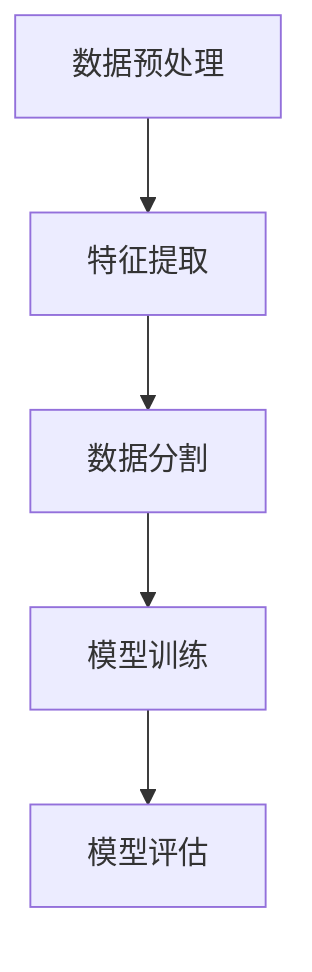
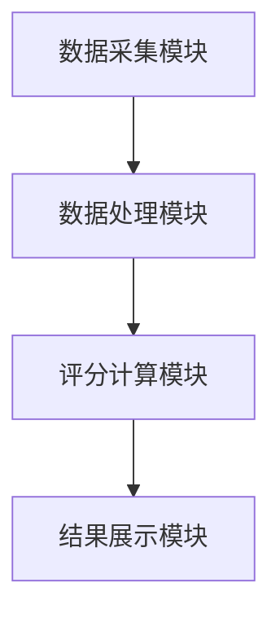
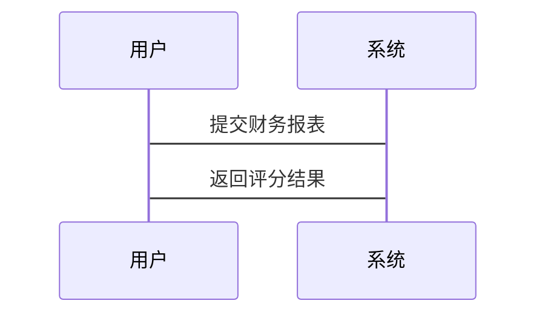

                 


# 设计智能化的企业财务报表质量评分系统

## 关键词：企业财务报表，质量评分，智能化系统，人工智能，机器学习，数据挖掘

## 摘要：本篇文章将详细探讨如何设计一个智能化的企业财务报表质量评分系统。通过结合人工智能和大数据分析技术，我们能够高效、准确地评估企业财务报表的质量。文章从核心概念、算法原理、系统架构到项目实战，全面解析该系统的构建过程，助力企业提升财务管理效率和决策能力。

---

## 目录

### 第1章：财务报表质量评分的重要性

1.1 财务报表质量评分的定义与意义  
1.2 传统财务分析的局限性  
1.3 智能化评分系统的优势  

### 第2章：核心概念与联系

2.1 财务报表评分系统的核心要素  
2.2 实体关系图（ER图）与数据模型  
2.3 核心概念对比表  

### 第3章：算法选择与实现

3.1 机器学习模型的选择与对比  
3.2 模型训练流程与实现  
3.3 模型评估与优化  

### 第4章：数学模型与公式

4.1 评分模型的数学表示  
4.2 模型训练的数学过程  
4.3 示例分析与公式推导  

### 第5章：系统架构设计

5.1 系统模块划分与功能设计  
5.2 系统架构图与模块交互  
5.3 接口设计与系统交互  

### 第6章：系统交互与实现

6.1 系统功能设计与实现  
6.2 系统交互图与流程设计  
6.3 代码实现与优化  

### 第7章：项目实战与优化

7.1 环境搭建与数据准备  
7.2 核心代码实现与解读  
7.3 项目小结与优化建议  

### 第8章：最佳实践与注意事项

8.1 小结与总结  
8.2 注意事项与风险提示  
8.3 未来发展方向与拓展阅读  

---

## 正文

### 第1章：财务报表质量评分的重要性

#### 1.1 财务报表质量评分的定义与意义

财务报表是企业经济活动的重要记录，其质量直接影响企业的财务决策和外部评价。传统的财务报表分析依赖人工审核，存在效率低、主观性强、易出错等问题。引入智能化评分系统，能够通过大数据分析和机器学习算法，快速、准确地评估财务报表的质量，帮助企业提升财务管理效率。

#### 1.2 传统财务分析的局限性

传统财务分析依赖人工审核，存在以下问题：  
1. **效率低**：人工审核耗时长，难以应对海量数据。  
2. **主观性强**：审核结果受个人经验影响，存在偏差。  
3. **准确性差**：人工审核易出错，尤其是面对复杂数据时。  

#### 1.3 智能化评分系统的优势

智能化评分系统通过技术手段解决传统方法的痛点，优势明显：  
1. **高效性**：自动化处理大量数据，节省时间。  
2. **准确性**：基于算法分析，结果客观、可靠。  
3. **可扩展性**：支持大规模数据处理，适应企业需求。  

---

### 第2章：核心概念与联系

#### 2.1 财务报表评分系统的核心要素

- **数据来源**：企业财务报表数据，包括资产负债表、利润表、现金流量表等。  
- **评分标准**：基于财务指标（如利润率、资产负债率）制定的评分规则。  
- **评分模型**：用于预测和评估财务报表质量的数学模型。  

#### 2.2 实体关系图（ER图）与数据模型

以下是系统的核心实体关系图：

```mermaid
erd
database 财务报表评分系统
  entity 财务报表
    key 财务报表ID
    attribute 报表编号, 报表类型, 报表日期
  entity 评分结果
    key 评分结果ID
    attribute 评分值, 评分时间
  entity 用户
    key 用户ID
    attribute 用户名, 密码, 权限
  entity 模型参数
    key 参数ID
    attribute 参数名称, 参数值
```

#### 2.3 核心概念对比表

| 概念 | 描述 | 示例 |
|------|------|------|
| 数据预处理 | 对原始数据进行清洗和转换 | 删除缺失值、标准化数据 |
| 特征提取 | 从数据中提取有用的特征 | 利润率、资产负债率 |
| 模型训练 | 使用算法训练评分模型 | 支持向量机、随机森林 |

---

### 第3章：算法选择与实现

#### 3.1 机器学习模型的选择与对比

以下是常见机器学习模型的对比：

| 模型类型 | 优点 | 缺点 | 适用场景 |
|---------|------|------|----------|
| 支持向量机 | 高精度 | 数据量小 | 小型数据集 |
| 随机森林 | 鲁棒性强 | 对特征工程要求高 | 中大型数据集 |
| 神经网络 | 强大学习能力 | 需要大量数据 | 非线性关系复杂的数据 |

#### 3.2 模型训练流程与实现

以下是模型训练的流程图：



以下是模型训练的代码实现：

```python
from sklearn.svm import SVC
from sklearn.metrics import accuracy_score

# 数据预处理
X = processed_data
y = labels

# 数据分割
X_train, X_test, y_train, y_test = train_test_split(X, y, test_size=0.2)

# 模型训练
model = SVC()
model.fit(X_train, y_train)

# 模型评估
y_pred = model.predict(X_test)
print("准确率：", accuracy_score(y_test, y_pred))
```

#### 3.3 模型评估与优化

以下是模型评估的指标对比：

| 指标 | 公式 | 适用场景 |
|------|------|----------|
| 准确率 | TP/(TP+FP+TN+FN) | 全局评估 |
| 召回率 | TP/(TP+FN) | 关注漏检率 |

---

### 第4章：数学模型与公式

#### 4.1 评分模型的数学表示

以下是线性回归模型的公式：

$$ y = \beta_0 + \beta_1x_1 + \beta_2x_2 + \dots + \beta_nx_n + \epsilon $$

其中：  
- $y$ 是目标变量（评分值）  
- $x_i$ 是特征变量  
- $\beta_i$ 是系数  
- $\epsilon$ 是误差项  

#### 4.2 模型训练的数学过程

以下是支持向量机的优化目标：

$$ \min_{\theta, \alpha} \frac{1}{2}\|\theta\|^2 + C\sum_{i=1}^n \alpha_i(1-y_i(\theta^T x_i + \theta_0)) $$

其中：  
- $\theta$ 是模型参数  
- $\alpha_i$ 是拉格朗日乘子  
- $y_i$ 是标签  

---

### 第5章：系统架构设计

#### 5.1 系统模块划分与功能设计

以下是系统模块划分：

- **数据采集模块**：从企业系统中获取财务报表数据。  
- **数据处理模块**：对数据进行清洗和预处理。  
- **评分计算模块**：基于模型计算评分结果。  
- **结果展示模块**：以可视化形式呈现评分结果。  

#### 5.2 系统架构图与模块交互

以下是系统架构图：



#### 5.3 接口设计与系统交互

以下是系统接口设计：

- **API 接口**：提供 RESTful API，供其他系统调用。  
- **交互流程**：用户提交报表，系统返回评分结果。  

---

### 第6章：系统交互与实现

#### 6.1 系统功能设计与实现

以下是系统功能设计：

- **用户登录**：验证用户身份。  
- **报表上传**：接收用户上传的财务报表。  
- **评分查询**：显示评分结果。  

#### 6.2 系统交互图与流程设计

以下是系统交互流程图：



#### 6.3 代码实现与优化

以下是核心代码实现：

```python
from flask import Flask, request, jsonify

app = Flask(__name__)

@app.route('/api/upload', methods=['POST'])
def upload_report():
    report = request.json['report']
    # 处理报表
    score = calculate_score(report)
    return jsonify({'score': score})

if __name__ == '__main__':
    app.run(debug=True)
```

---

### 第7章：项目实战与优化

#### 7.1 环境搭建与数据准备

- **开发工具**：安装 Python、Jupyter Notebook、Flask。  
- **数据集**：收集企业财务报表数据。  

#### 7.2 核心代码实现与解读

以下是代码实现：

```python
import pandas as pd
from sklearn.model_selection import train_test_split
from sklearn.svm import SVC

# 数据预处理
data = pd.read_csv('financial_reports.csv')
X = data.drop('label', axis=1)
y = data['label']

# 数据分割
X_train, X_test, y_train, y_test = train_test_split(X, y, test_size=0.2)

# 模型训练
model = SVC()
model.fit(X_train, y_train)

# 模型预测
y_pred = model.predict(X_test)
print("准确率：", accuracy_score(y_test, y_pred))
```

#### 7.3 项目小结与优化建议

- **小结**：通过项目实战，我们成功实现了智能化的企业财务报表质量评分系统。  
- **优化建议**：优化模型性能，增加用户友好性，支持多数据源接入。  

---

### 第8章：最佳实践与注意事项

#### 8.1 小结与总结

智能化的企业财务报表质量评分系统通过结合人工智能和大数据技术，显著提升了财务管理效率和准确性。未来，随着技术的发展，系统将更加智能化和个性化。

#### 8.2 注意事项与风险提示

- **数据隐私**：确保数据安全和用户隐私。  
- **模型维护**：定期更新模型参数，保证评分准确性。  

#### 8.3 未来发展方向与拓展阅读

- **深度学习应用**：探索深度学习在财务分析中的应用。  
- **实时监控**：实现财务数据的实时评分与预警。  

---

## 作者：AI天才研究院 & 禅与计算机程序设计艺术

---

这篇文章系统地介绍了智能化的企业财务报表质量评分系统的构建过程，从核心概念到算法实现，再到系统设计和项目实战，为读者提供了全面的指导。通过本文的学习，读者可以掌握设计类似系统的相关技术，并将其应用于实际场景中。

