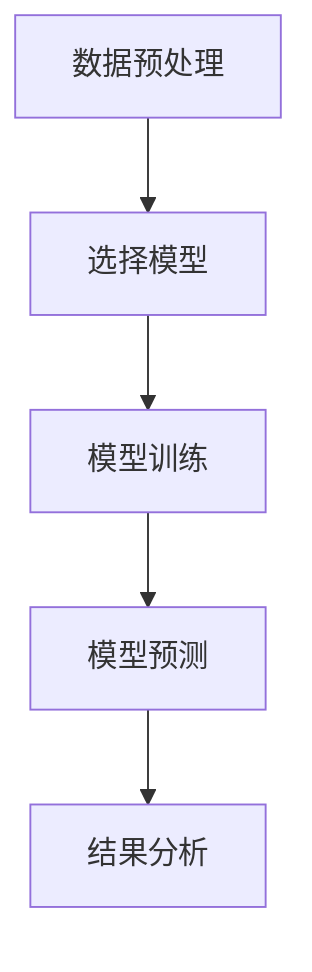
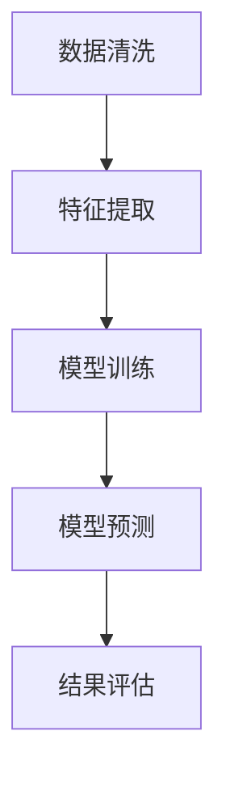
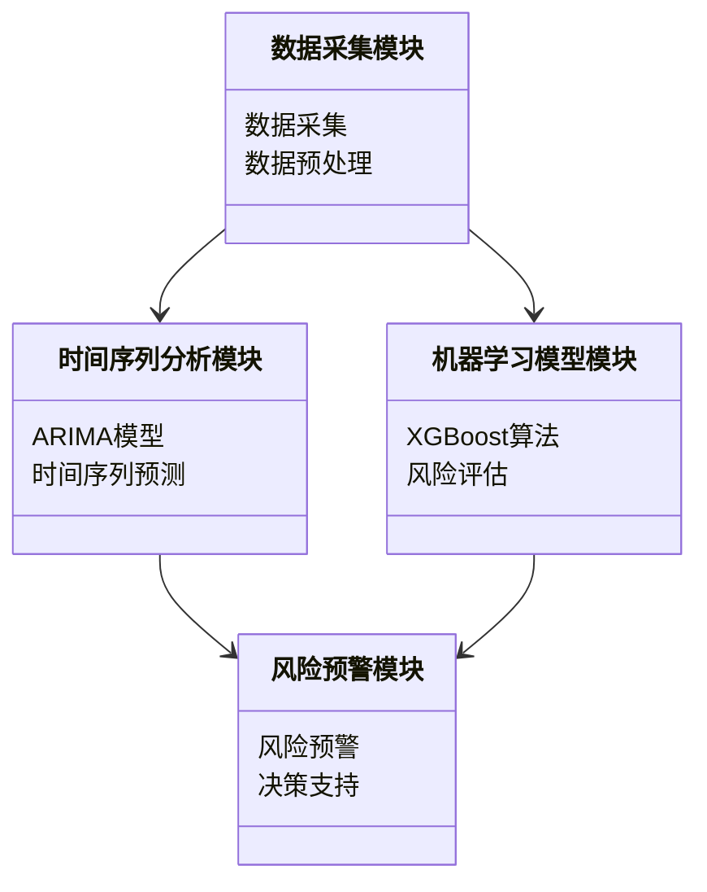
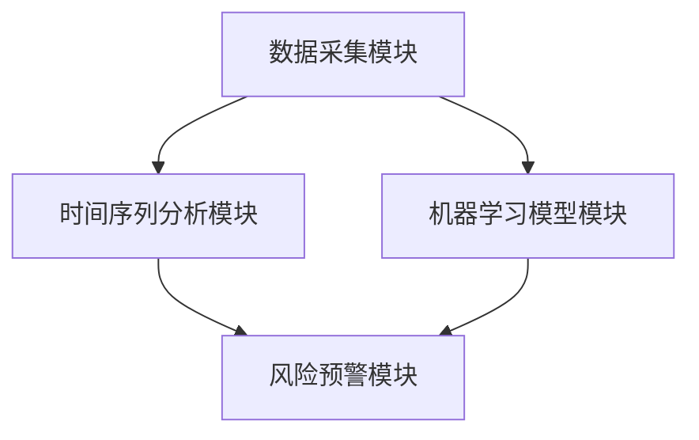
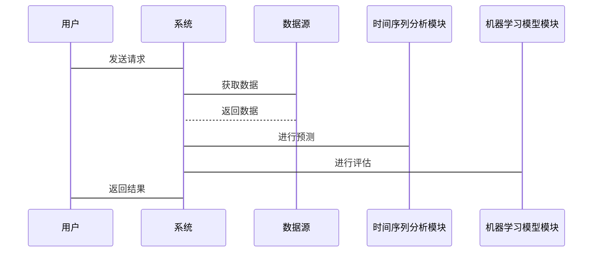

                 


# 设计智能化的企业财务风险敞口动态管理模型

> 关键词：财务风险敞口、动态管理、智能化模型、时间序列分析、机器学习算法、系统架构设计

> 摘要：本文旨在探讨如何设计和实现一个智能化的企业财务风险敞口动态管理模型。通过对财务风险敞口的核心概念、算法原理、系统架构及实现方案的深入分析，结合实际案例，提出一种基于时间序列分析和机器学习算法的智能化动态管理模型。本文从理论到实践，详细阐述了模型的设计思路、实现方法及应用场景，为企业的财务风险管理提供了新的解决方案。

---

# 第一部分: 企业财务风险敞口动态管理模型的背景与核心概念

## 第1章: 财务风险敞口的定义与问题背景

### 1.1 财务风险敞口的定义

#### 1.1.1 财务风险敞口的基本概念
财务风险敞口是指企业在经营过程中由于内外部因素的变化，导致财务状况发生不利变化的可能性和程度。它是企业财务风险管理的核心对象，反映了企业在不同市场环境和经营条件下可能面临的财务风险。

#### 1.1.2 财务风险敞口的核心特征
财务风险敞口具有动态性、复杂性和可量化性三大核心特征：
- 动态性：财务风险敞口会随着市场环境、企业经营状况的变化而实时波动。
- 复杂性：财务风险敞口的形成涉及多方面的因素，如市场波动、企业内部管理、外部政策等。
- 可量化性：通过量化指标（如波动率、VaR值等）可以对财务风险敞口进行度量和分析。

#### 1.1.3 财务风险敞口的分类与应用场景
财务风险敞口可以根据不同的分类标准进行划分，常见的分类包括：
1. 按风险来源：市场风险、信用风险、流动性风险等。
2. 按时间维度：短期风险敞口、中期风险敞口、长期风险敞口。
3. 按业务类型：投资风险敞口、融资风险敞口、运营风险敞口。

应用场景包括企业财务决策支持、风险管理策略制定、资本预算规划等。

### 1.2 企业财务风险管理的现状与挑战

#### 1.2.1 传统财务风险管理的局限性
传统财务风险管理主要依赖于静态分析和经验判断，存在以下问题：
- 缺乏实时性：传统的风险管理方法通常基于历史数据和固定模型，难以实时捕捉市场变化。
- 精度不足：由于缺乏动态调整和智能化分析，风险管理的准确性较低。
- 人工干预过多：依赖人工判断和决策，效率低下且容易受到主观因素的影响。

#### 1.2.2 数字化与智能化对企业财务风险管理的影响
随着大数据、人工智能等技术的快速发展，数字化与智能化为企业财务风险管理带来了新的机遇：
- 数据驱动的决策支持：通过大数据分析，企业可以更精准地识别和量化财务风险。
- 智能化预警与预测：利用机器学习算法，企业可以实现财务风险的智能化预警和预测。
- 实时监控与动态调整：智能化系统可以实时监控财务风险敞口的变化，并动态调整风险管理策略。

#### 1.2.3 当前企业财务风险管理的主要挑战
当前企业在财务风险管理中面临的主要挑战包括：
- 数据质量与完整性：数据的准确性和完整性直接影响风险管理的效果。
- 模型的实时性与可解释性：复杂的模型需要在实时场景中快速响应，同时保持可解释性。
- 技术与业务的结合：如何将先进的技术手段与企业实际业务需求相结合，是智能化财务风险管理的核心挑战。

### 1.3 问题背景与研究意义

#### 1.3.1 企业财务风险敞口动态管理的必要性
在复杂的经济环境中，企业面临的财务风险日益多样化和复杂化。传统的静态风险管理方法已经难以满足企业的需求，因此动态管理财务风险敞口成为必然选择。

#### 1.3.2 研究智能化动态管理模型的现实意义
智能化动态管理模型可以通过实时数据分析和预测，帮助企业提前识别和应对潜在的财务风险，从而降低财务损失，提升企业的财务稳健性。

#### 1.3.3 本课题的研究目标与创新点
本课题的目标是设计一个智能化的企业财务风险敞口动态管理模型，实现对财务风险敞口的实时监控、预测和动态调整。创新点在于结合时间序列分析和机器学习算法，构建一个高效、精准的智能化管理模型。

---

## 第2章: 智能化财务风险敞口动态管理模型的核心概念

### 2.1 模型的核心要素与组成

#### 2.1.1 财务风险敞口的量化指标
财务风险敞口的量化指标是模型的核心输入，常见的指标包括：
- 股价波动率
- 偿债能力指标（如流动比率、速动比率）
- 盈利能力指标（如净利率、毛利率）
- 资产负债率

#### 2.1.2 动态管理的驱动因素
动态管理的驱动因素是影响财务风险敞口变化的关键因素，主要包括：
- 市场环境变化（如利率、汇率波动）
- 企业内部经营状况（如销售额、成本变化）
- 外部政策变化（如税收政策、行业监管）

#### 2.1.3 智能化模型的关键组件
智能化模型的关键组件包括：
1. 数据采集与预处理模块
2. 时间序列分析模块
3. 机器学习模型模块
4. 风险预警与决策支持模块

### 2.2 核心概念的属性特征对比

| 概念         | 属性特征                                                                 |
|--------------|--------------------------------------------------------------------------|
| 财务风险敞口  | 动态性、复杂性、可量化性                                                   |
| 动态管理模型   | 实时性、精准性、可调整性                                                   |
| 智能化技术    | 数据驱动、算法驱动、实时响应、高精度                                       |

### 2.3 实体关系图（ER图）架构

```mermaid
erd
    客户
    供应商
    产品
    订单
    财务数据
    风险敞口
    时间戳
```

---

# 第二部分: 智能化财务风险敞口动态管理模型的算法原理

## 第3章: 基于时间序列分析的算法原理

### 3.1 时间序列分析的基本原理

#### 3.1.1 时间序列分析的定义与特点
时间序列分析是一种通过分析历史数据的变化规律，预测未来趋势的方法。其特点包括：
- 数据的有序性：时间序列数据具有明确的时间属性。
- 变化的趋势性：数据可能呈现趋势性、周期性等特征。
- 模型的可解释性：时间序列模型通常具有较高的可解释性。

#### 3.1.2 时间序列分析的主要方法
时间序列分析的主要方法包括：
1. 平稳时间序列分析（如ARIMA模型）
2. 非平稳时间序列分析（如GARCH模型）
3. 状态空间模型（如Kalman滤波）

### 3.2 基于ARIMA模型的算法实现

#### 3.2.1 ARIMA模型的基本原理
ARIMA（Autoregressive Integrated Moving Average）模型是一种常用的时间序列预测模型，由自回归部分、差分部分和移动平均部分组成。

#### 3.2.2 ARIMA模型的参数估计
ARIMA模型的参数估计通常采用最大似然估计方法。

#### 3.2.3 ARIMA模型的优缺点
- 优点：模型简单，易于实现，适用于平稳时间序列。
- 缺点：对非平稳时间序列的预测能力较弱。

### 3.3 时间序列分析的流程图



---

## 第4章: 基于机器学习的风险评估算法

### 4.1 机器学习在财务风险管理中的应用

#### 4.1.1 机器学习的基本概念
机器学习是一种通过数据学习规律，并利用规律进行预测的技术。其在财务风险管理中的应用包括风险评估、欺诈检测等。

#### 4.1.2 机器学习在风险评估中的优势
- 高精度：通过学习大量数据，机器学习模型可以实现高精度的预测。
- 实时性：机器学习模型可以实时处理数据，实现动态风险管理。

### 4.2 基于XGBoost算法的风险评估模型

#### 4.2.1 XGBoost算法的基本原理
XGBoost是一种基于树的集成学习算法，通过构建多棵决策树并进行加权投票实现预测。

#### 4.2.2 XGBoost算法的参数调优
XGBoost的参数调优通常包括学习率、树的深度、正则化参数等。

#### 4.2.3 XGBoost算法的优缺点
- 优点：高精度、强健性好。
- 缺点：对参数敏感，调优复杂。

### 4.3 机器学习算法的流程图



---

# 第三部分: 智能化财务风险敞口动态管理模型的系统架构与实现

## 第5章: 系统架构设计方案

### 5.1 系统功能模块划分

#### 5.1.1 数据采集与预处理模块
- 数据源：财务报表数据、市场数据、行业数据等。
- 数据清洗：处理缺失值、异常值等。
- 数据转换：将数据转换为模型可接受的格式。

#### 5.1.2 时间序列分析模块
- 数据输入：经过预处理的财务数据。
- 数据分析：利用ARIMA模型进行时间序列预测。
- 结果输出：生成预测结果和相关统计指标。

#### 5.1.3 机器学习模型模块
- 数据输入：经过预处理的财务数据。
- 模型训练：利用XGBoost算法训练风险评估模型。
- 预测结果：生成风险评估结果和预警信号。

#### 5.1.4 风险预警与决策支持模块
- 数据输入：时间序列分析结果和机器学习模型预测结果。
- 风险预警：根据预测结果生成风险预警信号。
- 决策支持：提供风险管理建议和策略优化方案。

---

## 第6章: 系统架构设计与实现

### 6.1 系统架构设计

#### 6.1.1 系统功能设计（领域模型）


#### 6.1.2 系统架构设计


#### 6.1.3 系统接口设计
- 数据接口：与财务系统、市场数据源对接。
- 预测接口：提供时间序列预测和风险评估结果。
- 预警接口：提供风险预警信号和决策支持建议。

#### 6.1.4 系统交互设计


---

## 第7章: 项目实战与案例分析

### 7.1 项目环境安装与配置

```bash
# 安装依赖
pip install pandas numpy sklearn xgboost
```

### 7.2 核心代码实现

```python
import pandas as pd
import numpy as np
from sklearn.metrics import mean_absolute_error
from xgboost import XGBRegressor

# 数据加载
data = pd.read_csv('financial_data.csv')

# 数据预处理
data = data.dropna()
X = data.drop(columns=['target'])
y = data['target']

# 模型训练
model = XGBRegressor()
model.fit(X, y)

# 预测
predictions = model.predict(X)
print(mean_absolute_error(y, predictions))
```

### 7.3 案例分析与实际应用

假设我们有一家上市公司，其财务数据如下：

| 时间 | 收入 | 利润 | 资产 | 负债 |
|------|------|------|------|------|
| 2020 | 100  | 20   | 500  | 300  |
| 2021 | 120  | 25   | 600  | 350  |
| 2022 | 130  | 30   | 700  | 400  |

通过模型分析，预测2023年的收入、利润、资产和负债，并评估其财务风险敞口。

---

## 第8章: 总结与最佳实践

### 8.1 总结

本文详细探讨了智能化的企业财务风险敞口动态管理模型的设计与实现，提出了基于时间序列分析和机器学习算法的解决方案。通过系统架构设计和实际案例分析，验证了模型的有效性和实用性。

### 8.2 最佳实践 tips

1. 数据质量是模型准确性的关键，需确保数据的完整性和准确性。
2. 模型的实时性与可解释性需要在设计中重点关注。
3. 定期对模型进行调优和更新，以适应市场环境的变化。

### 8.3 注意事项

- 模型的部署需要考虑企业的实际需求和 IT 资源。
- 数据隐私和安全问题需严格遵守相关法律法规。

### 8.4 拓展阅读

建议进一步研究区块链技术在财务风险管理中的应用，以及强化学习算法在复杂风险场景中的应用。

---

作者：AI天才研究院/AI Genius Institute & 禅与计算机程序设计艺术/Zen And The Art of Computer Programming

