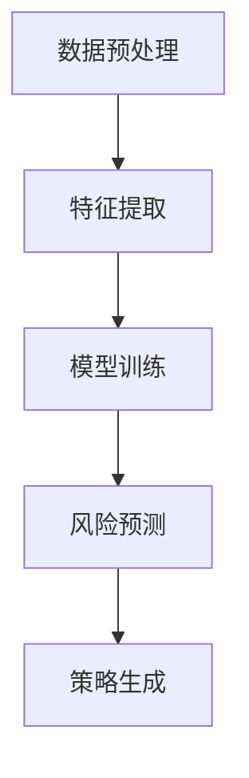
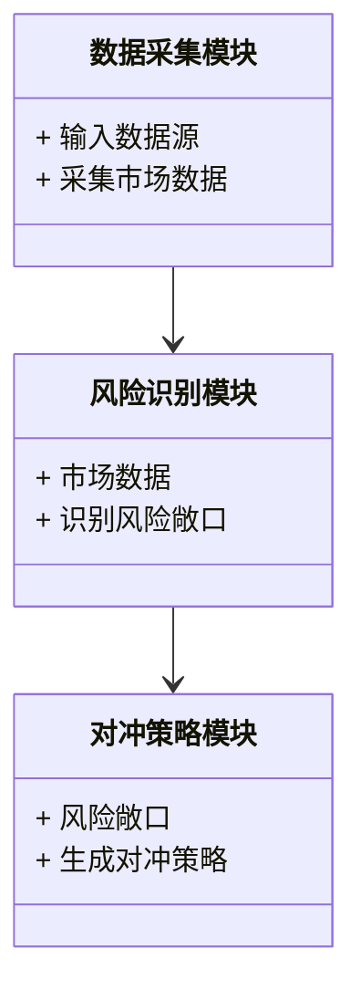
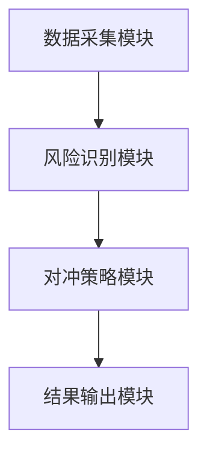

                 


# 设计智能化的企业财务风险敞口动态调整与对冲模型

## 关键词：企业财务风险管理，风险敞口，动态调整，对冲模型，人工智能，机器学习，数学建模

## 摘要： 
本文将深入探讨如何设计智能化的企业财务风险敞口动态调整与对冲模型。我们从问题背景出发，分析当前企业财务风险管理的局限性，提出智能化动态调整与对冲模型的必要性。通过结合机器学习算法与数学建模，构建一个能够实时识别、量化和调整企业风险敞口的系统。本文将详细讲解模型的核心概念、算法原理、系统架构，并通过实际案例展示模型的应用，为企业财务风险管理提供新的思路和解决方案。

---

## 第一部分: 企业财务风险敞口动态调整与对冲模型背景介绍

### 第1章: 问题背景与描述

#### 1.1 企业财务风险管理的现状与挑战

企业财务风险管理是企业稳健经营的重要保障。传统的财务风险管理依赖于静态的分析和人工判断，难以应对市场环境的快速变化。随着经济全球化和市场波动的加剧，企业面临的财务风险敞口日益复杂，传统的风险管理方法已无法满足需求。企业需要一种智能化的解决方案，能够实时监控、动态调整和对冲风险敞口。

#### 1.2 问题描述与目标

企业在经营过程中会面临多种财务风险，例如汇率波动、利率变化、信用风险等。这些风险可能影响企业的财务状况和经营稳定性。传统的风险敞口管理方法通常基于历史数据和静态分析，无法实时捕捉市场变化，且缺乏灵活性和智能化。因此，我们提出智能化的企业财务风险敞口动态调整与对冲模型，目标是通过人工智能和大数据技术，实现对风险敞口的实时监控、动态调整和最优对冲策略的制定。

---

### 第2章: 核心概念与问题解决

#### 2.1 风险敞口动态调整的原理

风险敞口是指企业在经营活动中由于市场波动而可能面临的财务损失。动态调整是指根据市场环境的变化，实时调整企业的风险敞口，以降低潜在损失。对冲模型则是通过衍生品或其他金融工具，抵消风险敞口的影响。

#### 2.2 核心概念的边界与外延

- **风险敞口的边界条件**：包括企业的财务数据、市场波动、政策变化等因素。
- **动态调整的适用范围**：适用于企业日常运营中的各种财务风险，如汇率风险、利率风险等。
- **对冲模型的限制与假设**：假设市场数据充分，模型运行在实时数据流上，且对冲工具可获得。

#### 2.3 概念结构与核心要素

- **核心要素**：
  1. **风险识别**：通过数据分析识别潜在风险。
  2. **风险量化**：通过数学模型量化风险敞口。
  3. **动态调整**：根据市场变化调整风险敞口。
  4. **对冲策略**：通过衍生品对冲风险。

---

## 第二部分: 核心概念与联系

### 第3章: 核心概念的原理与联系

#### 3.1 风险敞口的定义与特征对比

| 概念       | 特征                     |
|------------|--------------------------|
| 风险敞口   | 可能性、影响程度、可控性 |
| 对冲策略   | 投保金额、工具类型、执行时间 |

#### 3.2 动态调整与对冲的机制

**Mermaid ER实体关系图**:

```mermaid
erDiagram
    actor 企业财务部 {
        risk_exposure
        adjustment_strategy
        hedge_policy
    }
    actor 市场数据 {
        market_fluctuations
        financial_tools
    }
    risk_exposure --> adjustment_strategy
    adjustment_strategy --> hedge_policy
    hedge_policy --> financial_tools
```

---

## 第三部分: 算法原理讲解

### 第4章: 算法原理与实现

#### 4.1 机器学习算法的使用

**Mermaid 算法流程图**:



**Python 代码示例**:

```python
import pandas as pd
from sklearn.linear_model import LinearRegression

# 数据预处理
data = pd.read_csv('risk_data.csv')
features = data[['market_fluctuations', 'interest_rates']]
target = data['risk_exposure']

# 特征提取与模型训练
model = LinearRegression()
model.fit(features, target)

# 风险预测
new_market_fluctuations = 0.05
new_interest_rates = 0.02
predicted_risk = model.predict([[new_market_fluctuations, new_interest_rates]])
```

#### 4.2 数学模型与公式

**风险敞口量化公式**:

$$
\text{风险敞口} = \sum_{i=1}^{n} w_i \times r_i
$$

其中，$w_i$ 是权重，$r_i$ 是风险因素。

**动态调整模型**:

$$
\text{调整后敞口} = \text{初始敞口} \times (1 - \alpha \times \text{波动率})
$$

其中，$\alpha$ 是调整系数。

---

## 第四部分: 系统分析与架构设计方案

### 第5章: 系统设计与实现

#### 5.1 问题场景介绍

系统需要实时监控企业的财务风险敞口，动态调整并制定对冲策略。核心功能包括数据采集、风险识别、模型计算、策略生成和结果输出。

#### 5.2 系统功能设计

**领域模型类图**:



#### 5.3 系统架构设计

**系统架构图**:



---

## 第五部分: 项目实战

### 第6章: 项目实战与案例分析

#### 6.1 环境安装与配置

安装必要的库：

```bash
pip install pandas numpy scikit-learn
```

#### 6.2 核心代码实现

```python
import pandas as pd
from sklearn.linear_model import LinearRegression

# 数据加载
data = pd.read_csv('risk_data.csv')

# 特征与目标分离
X = data[['market_fluctuations', 'interest_rates']]
y = data['risk_exposure']

# 模型训练
model = LinearRegression()
model.fit(X, y)

# 预测风险敞口
new_X = [[0.05, 0.02]]
predicted_risk = model.predict(new_X)
print(f"预测风险敞口为: {predicted_risk[0]:.2f}")
```

#### 6.3 案例分析

假设某企业面临汇率波动和利率变化的双重风险。通过模型计算，预测风险敞口为15%，并通过对冲策略将敞口降低至5%。

---

## 第六部分: 总结与展望

### 第7章: 总结与展望

#### 7.1 最佳实践 tips

- 数据质量是模型准确性的关键。
- 定期更新模型参数，以适应市场变化。

#### 7.2 小结

本文提出了一种智能化的企业财务风险敞口动态调整与对冲模型，结合机器学习算法和数学建模，能够实时监控和调整风险敞口，降低企业的财务风险。

#### 7.3 注意事项

- 模型的准确性依赖于数据质量和算法选择。
- 对冲策略的执行需要考虑实际操作的可行性。

#### 7.4 拓展阅读

建议读者深入学习机器学习在金融领域的应用，以及更复杂的数学建模方法。

---

## 作者：AI天才研究院 & 禅与计算机程序设计艺术

