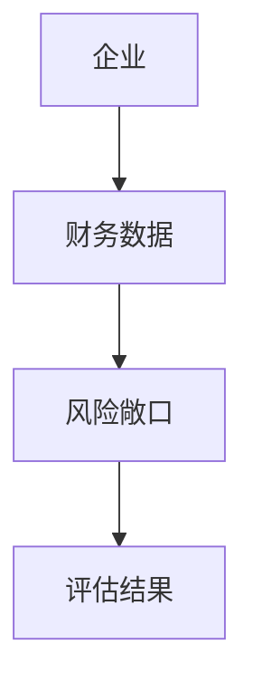
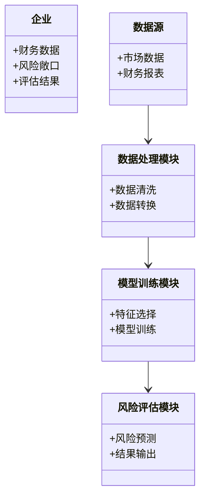
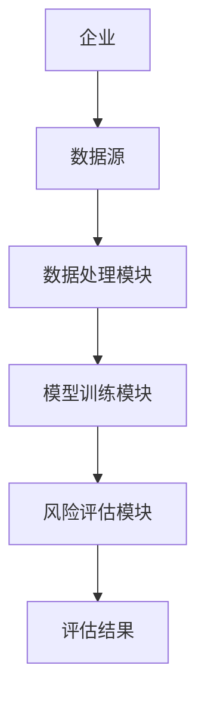
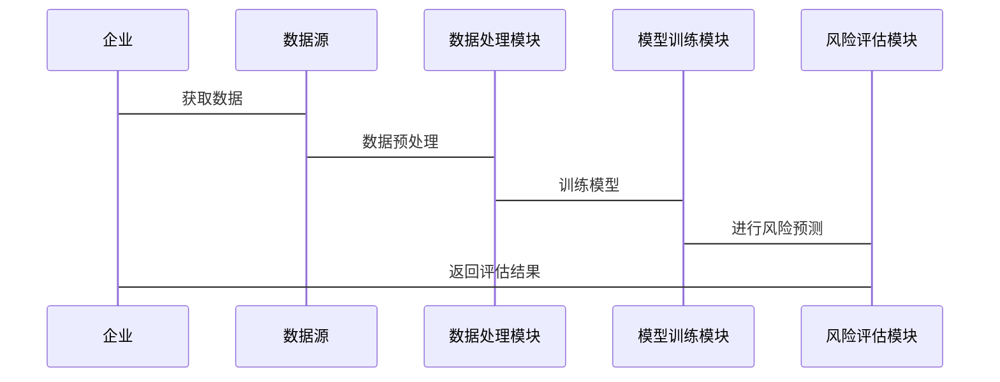

                 


# 设计智能化的企业财务风险敞口量化评估模型

## 关键词：企业财务风险, 风险敞口量化, 智能化模型, 数据分析, 人工智能, 系统架构设计

## 摘要：  
本文详细探讨了设计智能化企业财务风险敞口量化评估模型的核心方法。从背景与概述出发，分析了传统财务风险管理的局限性，提出了基于大数据与人工智能的智能化模型。通过详细讲解模型的核心概念、算法原理、系统架构设计以及项目实战，展示了如何利用技术手段提升企业风险管理能力。本文还结合实际案例，分析了模型的应用效果，并总结了最佳实践和未来发展方向。

---

# 第一部分: 企业财务风险敞口量化评估模型的背景与概述

## 第1章: 企业财务风险敞口量化评估模型概述

### 1.1 企业财务风险敞口的基本概念  
#### 1.1.1 企业财务风险的定义  
企业财务风险是指企业在经营过程中由于内外部环境的变化，可能导致财务损失的可能性。风险敞口是企业在财务活动中暴露于风险的程度，是衡量企业财务健康状况的重要指标。  

#### 1.1.2 风险敞口的定义与分类  
风险敞口的定义：企业在特定条件下，由于市场波动、经营决策或外部经济环境变化，导致财务损失的可能性。  
风险敞口的分类：  
- **市场风险**：由于市场价格波动导致的损失，如汇率波动、利率变化等。  
- **信用风险**：由于客户或供应商违约导致的损失。  
- **操作风险**：由于内部操作失误或欺诈行为导致的损失。  

#### 1.1.3 风险敞口量化评估的重要性  
量化评估是企业风险管理的核心环节，能够帮助企业识别潜在风险，制定有效的风险管理策略。  

### 1.2 智能化财务风险评估的背景与趋势  
#### 1.2.1 传统财务风险管理的局限性  
传统财务风险管理主要依赖人工分析和经验判断，存在以下问题：  
- 数据处理能力有限，难以应对海量数据。  
- 分析效率低，无法实时响应市场变化。  
- 风险预测准确性不足，难以捕捉复杂市场环境下的潜在风险。  

#### 1.2.2 大数据与人工智能技术的推动  
随着大数据和人工智能技术的快速发展，企业能够利用先进的数据分析工具，实时处理海量数据，构建智能化的风险评估模型。  

#### 1.2.3 智能化财务风险管理的发展趋势  
智能化财务风险管理正在成为企业风险管理的主流模式。通过机器学习、深度学习等技术，企业可以更精准地识别和预测风险，优化风险管理能力。  

### 1.3 企业财务风险敞口量化评估的核心问题  
#### 1.3.1 风险识别与量化的主要挑战  
- 数据质量参差不齐，如何清洗和处理数据是关键。  
- 风险因素复杂多样，如何筛选关键因素并建立量化模型是难点。  

#### 1.3.2 数据驱动的风险评估方法  
数据驱动的方法通过分析历史数据，识别潜在风险因素，并建立数学模型进行预测。  

#### 1.3.3 智能化模型的优势与应用场景  
智能化模型的优势在于其高精度和实时性，能够在复杂环境中快速识别风险。应用场景包括市场波动预测、信用风险评估等。  

### 1.4 本章小结  
本章介绍了企业财务风险敞口的基本概念，分析了传统风险管理的局限性，并提出了智能化财务风险管理的发展趋势。通过对比分析，明确了智能化模型的优势与应用场景。  

---

# 第二部分: 核心概念与联系

## 第2章: 风险敞口量化评估的核心概念与联系

### 2.1 风险敞口量化评估的原理  
#### 2.1.1 风险敞口的数学表达式  
风险敞口的量化可以通过以下公式表示：  
$$ \text{风险敞口} = \sum_{i=1}^{n} (P_i \times R_i) $$  
其中，$P_i$ 表示第 $i$ 项资产的市场价值，$R_i$ 表示第 $i$ 项资产的风险系数。  

#### 2.1.2 风险敞口与企业财务状况的关系  
风险敞口与企业的资产结构、负债水平、盈利能力等密切相关。  

#### 2.1.3 风险敞口的度量方法  
- **VaR（在险价值）**：衡量在一定置信水平下，可能的最大损失。  
- **CVaR（条件在险价值）**：衡量在 VaR 水平下的平均损失。  

### 2.2 核心概念对比分析  
#### 2.2.1 不同风险敞口模型的对比  
| 模型名称 | 基础假设 | 优点 | 缺点 |  
|----------|----------|------|------|  
| 线性回归模型 | 线性关系 | 简单易懂 | 无法捕捉非线性关系 |  
| 神经网络模型 | 非线性关系 | 高精度 | 计算复杂，需要大量数据 |  

#### 2.2.2 数据驱动与规则驱动模型的对比  
| 模型类型 | 基础 | 优缺点 |  
|----------|------|--------|  
| 数据驱动 | 统计分析 | 高精度，但依赖数据质量 |  
| 规则驱动 | 预定义规则 | 易解释，但灵活性低 |  

#### 2.2.3 传统模型与智能化模型的对比  
| 模型类型 | 技术基础 | 优缺点 |  
|----------|----------|--------|  
| 传统模型 | 统计分析 | 易实现，但精度低 |  
| 智能化模型 | 机器学习 | 高精度，但复杂难懂 |  

### 2.3 实体关系图（ER图）架构  


---

# 第三部分: 算法原理讲解

## 第3章: 风险敞口量化评估的算法原理

### 3.1 线性回归模型  
#### 3.1.1 线性回归的基本原理  
线性回归是一种简单且常用的回归分析方法，适用于线性关系的建模。其数学表达式为：  
$$ y = \beta_0 + \beta_1 x + \epsilon $$  
其中，$y$ 是目标变量，$x$ 是自变量，$\beta_0$ 和 $\beta_1$ 是回归系数，$\epsilon$ 是误差项。  

#### 3.1.2 线性回归的实现步骤  
1. 数据收集与预处理：清洗数据，处理缺失值和异常值。  
2. 模型训练：利用最小二乘法求解回归系数。  
3. 模型评估：计算回归系数的显著性，评估模型的拟合优度。  

#### 3.1.3 线性回归的代码实现  
```python
import numpy as np
from sklearn.linear_model import LinearRegression

# 示例数据
X = np.array([[1], [2], [3], [4], [5]])
y = np.array([2, 4, 5, 4, 6])

# 模型训练
model = LinearRegression()
model.fit(X, y)

# 预测结果
print(model.predict([[6]]))
```

### 3.2 神经网络模型  
#### 3.2.1 神经网络的基本原理  
神经网络是一种强大的非线性模型，由输入层、隐藏层和输出层组成。其数学表达式为：  
$$ y = f(Wx + b) $$  
其中，$W$ 是权重矩阵，$x$ 是输入向量，$b$ 是偏置项，$f$ 是激活函数。  

#### 3.2.2 神经网络的实现步骤  
1. 数据预处理：归一化数据，划分训练集和测试集。  
2. 模型构建：定义神经网络的层数和神经元数量。  
3. 模型训练：使用反向传播算法优化权重。  
4. 模型评估：计算预测准确率和混淆矩阵。  

#### 3.2.3 神经网络的代码实现  
```python
import tensorflow as tf
from tensorflow.keras import layers

# 示例数据
X = np.array([[1], [2], [3], [4], [5]])
y = np.array([2, 4, 5, 4, 6])

# 模型构建
model = tf.keras.Sequential([
    layers.Dense(10, activation='relu'),
    layers.Dense(1)
])

# 模型训练
model.compile(optimizer='adam', loss='mean_squared_error')
model.fit(X, y, epochs=100, verbose=0)

# 预测结果
print(model.predict([[6]]))
```

---

## 本章小结  
本章详细讲解了线性回归和神经网络模型的原理及实现步骤，通过代码示例展示了如何利用这些模型进行风险敞口的量化评估。神经网络模型在复杂场景下的表现优于线性回归模型，但在实际应用中需要更多的数据和计算资源。

---

# 第四部分: 系统分析与架构设计

## 第4章: 系统分析与架构设计

### 4.1 项目背景与目标  
本项目旨在设计一个智能化的企业财务风险敞口量化评估系统，目标是通过大数据和人工智能技术，帮助企业实时监测和量化财务风险。  

### 4.2 系统功能设计  
#### 4.2.1 领域模型类图  


### 4.3 系统架构设计  
#### 4.3.1 系统架构图  


#### 4.3.2 接口设计  
- 数据输入接口：接收企业财务数据和市场数据。  
- 模型调用接口：调用训练好的模型进行风险预测。  
- 结果输出接口：输出风险评估结果。  

#### 4.3.3 系统交互流程图  


---

## 本章小结  
本章从系统角度分析了智能化财务风险敞口量化评估模型的架构设计，通过领域模型类图和系统架构图展示了各模块之间的关系。接口设计和交互流程图进一步明确了系统的实现步骤和数据流。

---

# 第五部分: 项目实战

## 第5章: 项目实战

### 5.1 环境搭建与数据准备  
#### 5.1.1 环境安装  
安装必要的开发工具和库，如 Python、TensorFlow、Pandas 等。  

#### 5.1.2 数据来源  
数据来源包括企业财务报表、市场数据等。  

### 5.2 核心代码实现  
#### 5.2.1 数据处理代码  
```python
import pandas as pd
import numpy as np

# 数据加载
data = pd.read_csv('financial_data.csv')

# 数据清洗
data.dropna(inplace=True)
data = data[~data['revenue'].isnull()]
```

#### 5.2.2 模型训练代码  
```python
from sklearn.model_selection import train_test_split
from sklearn.linear_model import LinearRegression

# 数据划分
X = data[['revenue', 'expenses']]
y = data['profit']
X_train, X_test, y_train, y_test = train_test_split(X, y, test_size=0.2, random_state=42)

# 模型训练
model = LinearRegression()
model.fit(X_train, y_train)

# 模型评估
print('训练集准确率:', model.score(X_train, y_train))
print('测试集准确率:', model.score(X_test, y_test))
```

### 5.3 实际案例分析  
#### 5.3.1 案例背景  
以某制造企业为例，分析其财务风险敞口。  

#### 5.3.2 模型应用  
通过模型预测企业的潜在风险，并制定相应的风险管理策略。  

#### 5.3.3 结果分析  
分析模型的预测结果，评估模型的准确性和实用性。  

### 5.4 本章小结  
本章通过实际案例展示了如何利用智能化模型进行财务风险评估，验证了模型的有效性和实用性。

---

# 第六部分: 最佳实践与总结

## 第6章: 最佳实践与总结

### 6.1 最佳实践  
#### 6.1.1 小结  
智能化财务风险敞口量化评估模型能够显著提升企业的风险管理能力。  

#### 6.1.2 注意事项  
- 数据质量是模型性能的关键，需重视数据清洗和特征选择。  
- 模型的可解释性是实际应用的重要考量，需结合业务场景进行调整。  

#### 6.1.3 拓展阅读  
推荐阅读《机器学习实战》、《深度学习》等书籍，进一步提升对模型的理解和应用能力。  

### 6.2 未来发展方向  
未来，随着人工智能技术的不断进步，智能化财务风险管理将更加智能化和自动化。  

---

## 作者：AI天才研究院/AI Genius Institute & 禅与计算机程序设计艺术/Zen And The Art of Computer Programming  

---

通过以上目录和内容的详细阐述，我们全面分析了设计智能化企业财务风险敞口量化评估模型的背景、核心概念、算法原理、系统架构设计以及实际应用。通过代码实现和案例分析，验证了模型的可行性和有效性。希望本文能够为企业的风险管理提供有益的参考和指导。

