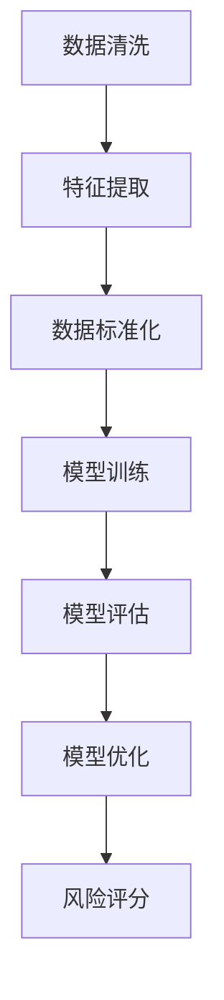
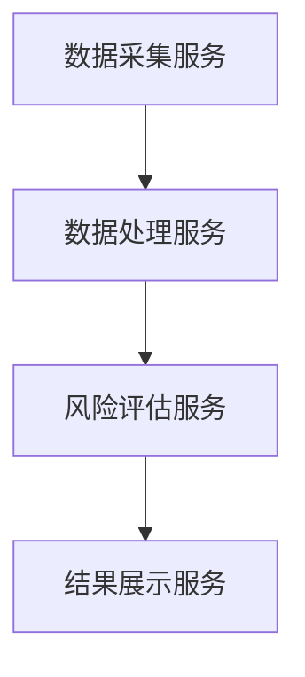
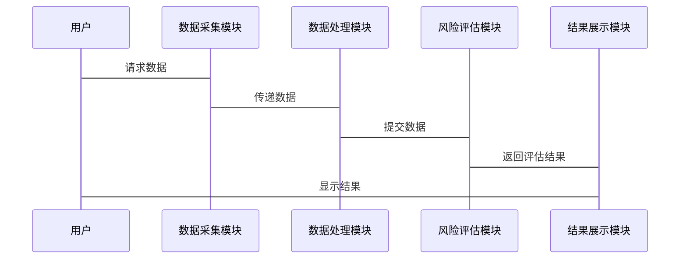

                 


# 设计智能化的企业财务风险量化评估模型

> 关键词：企业财务风险管理，人工智能，机器学习，风险量化评估，智能化模型

> 摘要：本文详细探讨了设计智能化的企业财务风险量化评估模型的关键步骤和方法。通过结合传统财务分析方法与现代人工智能技术，提出了一种基于机器学习的风险评估模型，旨在帮助企业更精准地识别和量化财务风险。文章从背景介绍、核心概念、算法原理、系统设计、项目实战到最佳实践，全面阐述了模型的设计思路和实现方案。

---

# 第1章: 企业财务风险量化评估模型的背景

## 1.1 企业财务风险的基本概念

### 1.1.1 财务风险的定义与内涵

财务风险是指企业在经营过程中由于内外部环境的变化，导致财务状况恶化、偿债能力下降或财务目标无法实现的可能性。它通常与企业的资本结构、现金流、资产质量等因素密切相关。

### 1.1.2 企业财务风险的主要来源

1. **市场风险**：如利率、汇率波动对企业财务状况的影响。
2. **信用风险**：客户或供应商无法履行合同义务导致的损失。
3. **流动性风险**：企业无法及时获得所需资金的风险。
4. **操作风险**：由于内部管理或操作失误导致的财务损失。
5. **法律风险**：因法律法规变化或合规问题引发的财务风险。

### 1.1.3 财务风险对企业经营的影响

财务风险若未能有效管理，可能导致企业资金链断裂、信用评级下降、融资成本增加，甚至引发企业破产。

---

## 1.2 传统财务风险评估方法的局限性

### 1.2.1 传统财务分析方法的局限性

传统财务分析主要依赖财务报表数据，如资产负债表、利润表和现金流量表，通过财务比率分析（如流动性比率、偿债能力比率、运营能力比率）进行评估。然而，这些方法存在以下问题：

1. **静态性**：传统分析方法通常基于历史数据，难以捕捉实时变化。
2. **主观性**：财务比率的解读需要依赖经验，存在主观判断。
3. **单一性**：传统方法往往只考虑单一风险因素，忽视了多因素的综合影响。

### 1.2.2 传统模型在实际应用中的不足

1. **缺乏动态性**：无法实时更新数据，难以应对快速变化的市场环境。
2. **信息不全面**：仅依赖财务数据，忽视了非财务因素（如市场环境、政策变化）的影响。
3. **计算复杂性**：复杂的财务模型难以快速部署和应用。

### 1.2.3 技术进步对企业财务风险管理的推动

随着人工智能和大数据技术的快速发展，企业可以通过智能化模型实现更精准、更高效的财务风险管理。

---

## 1.3 智能化财务风险评估的必要性

### 1.3.1 人工智能在财务风险管理中的应用前景

人工智能技术（如机器学习、自然语言处理）可以处理海量数据，识别潜在风险，提供实时预警。

### 1.3.2 数据驱动的财务风险评估的优势

1. **数据丰富性**：可以利用企业内外部的多源数据，进行更全面的分析。
2. **实时性**：基于实时数据更新，提供动态风险评估。
3. **自动化**：通过算法自动识别风险因素，减少人工干预。

### 1.3.3 智能化模型对企业财务风险管理的提升作用

智能化模型可以实现风险的早期预警、风险源的精准识别和风险缓解方案的智能化推荐。

---

## 1.4 本章小结

本章介绍了企业财务风险的基本概念，分析了传统财务风险评估方法的局限性，并强调了智能化财务风险评估的必要性和优势。接下来，我们将深入探讨模型的核心概念与联系。

---

# 第2章: 企业财务风险量化评估模型的核心概念与联系

## 2.1 企业财务风险量化评估模型的构成

### 2.1.1 模型的核心要素

1. **输入数据**：包括财务数据、市场数据、行业数据等。
2. **风险因素**：如流动性风险、信用风险、市场风险等。
3. **评估算法**：基于机器学习的模型，如随机森林、XGBoost等。
4. **评估结果**：包括风险评分、风险类型、风险概率等。

### 2.1.2 各要素之间的关系

输入数据通过特征提取和数据预处理后，输入到评估算法中，算法输出风险评分和风险类型。

### 2.1.3 模型的输入与输出

- **输入**：多源异构数据，包括结构化数据（如财务报表）和非结构化数据（如新闻文本）。
- **输出**：风险评分（如0-10分）、风险类型（如高、中、低风险）。

---

## 2.2 财务风险量化评估的关键指标

### 2.2.1 财务比率分析

- **流动性比率**：如速动比率（Quick Ratio）。
- **偿债能力比率**：如债务-to-股权比率（Debt-to-Equity Ratio）。
- **运营能力比率**：如存货周转率（Inventory Turnover Ratio）。

### 2.2.2 现金流分析

- **经营活动现金流**：企业通过日常经营产生的现金流。
- **投资活动现金流**：企业投资活动产生的现金流。
- **筹资活动现金流**：企业筹资活动产生的现金流。

### 2.2.3 财务风险评分模型

基于机器学习的评分模型，通过加权平均的方式，综合考虑各项财务指标，输出风险评分。

---

## 2.3 模型核心概念的ER实体关系图

以下是一个简单的ER图，展示了模型的核心实体及其关系：

```mermaid
erDiagram
    customer[企业] {
        key: id
        string: 企业名称
        string: 所属行业
        string: 注册地址
    }
    risk_factor[风险因素] {
        key: id
        string: 风险类型
        string: 风险描述
    }
    assessment[评估结果] {
        key: id
        integer: 风险评分
        date: 评估时间
    }
    customer --|{n}--> assessment : 评估记录
    risk_factor --|{n}--> assessment : 风险因素
```

---

## 2.4 本章小结

本章详细介绍了企业财务风险量化评估模型的核心概念与联系，包括模型的构成要素、关键指标以及实体关系图。下一章将深入探讨模型的算法原理。

---

# 第3章: 企业财务风险量化评估模型的算法原理

## 3.1 算法原理概述

### 3.1.1 基于机器学习的模型选择

选择适合的机器学习模型，如随机森林、XGBoost等。

### 3.1.2 数据预处理

- **数据清洗**：处理缺失值、异常值。
- **特征提取**：从多源数据中提取特征。
- **数据标准化**：对数据进行标准化处理。

### 3.1.3 模型训练

- 使用训练数据训练模型，调整模型参数。

### 3.1.4 模型评估

- 使用测试数据评估模型的准确率、召回率等性能指标。

### 3.1.5 模型优化

- 根据评估结果优化模型参数，提升模型性能。

---

## 3.2 算法流程图

以下是一个基于机器学习的算法流程图：



---

## 3.3 算法实现的Python代码示例

以下是一个基于随机森林的模型实现示例：

```python
import pandas as pd
from sklearn.ensemble import RandomForestClassifier
from sklearn.metrics import accuracy_score, recall_score

# 数据加载
data = pd.read_csv('financial_risk.csv')

# 特征提取
X = data.drop('risk_label', axis=1)
y = data['risk_label']

# 数据分割
from sklearn.model_selection import train_test_split
X_train, X_test, y_train, y_test = train_test_split(X, y, test_size=0.2, random_state=42)

# 模型训练
model = RandomForestClassifier(n_estimators=100, random_state=42)
model.fit(X_train, y_train)

# 模型预测
y_pred = model.predict(X_test)

# 模型评估
print('准确率:', accuracy_score(y_test, y_pred))
print('召回率:', recall_score(y_test, y_pred))
```

---

## 3.4 数学公式与模型解释

### 3.4.1 风险评分模型

风险评分公式如下：

$$
\text{风险评分} = \sum_{i=1}^{n} w_i \times f_i
$$

其中，$w_i$ 是第 $i$ 个特征的权重，$f_i$ 是第 $i$ 个特征的值。

---

## 3.5 本章小结

本章详细介绍了企业财务风险量化评估模型的算法原理，包括数据预处理、模型选择、训练与评估等内容。下一章将探讨系统分析与架构设计。

---

# 第4章: 企业财务风险量化评估模型的系统分析与架构设计

## 4.1 系统应用场景

### 4.1.1 企业内部财务部门

- 风险评估、资金管理、预算制定。

### 4.1.2 银行与金融机构

- 贷款审批、信用评级、风险控制。

### 4.1.3 投资者与分析师

- 投资决策、市场分析。

---

## 4.2 系统功能设计

### 4.2.1 数据采集模块

- 数据源：财务报表、市场数据、行业报告、新闻数据。
- 数据格式：结构化数据与非结构化数据。

### 4.2.2 风险评估模块

- 输入：多源异构数据。
- 输出：风险评分、风险类型、风险概率。

### 4.2.3 结果展示模块

- 可视化展示：风险评分分布、风险因素分析、风险缓解建议。

---

## 4.3 系统架构设计

### 4.3.1 系统架构图

以下是一个基于微服务架构的系统架构图：



---

## 4.4 系统接口设计

### 4.4.1 API接口定义

- 数据接口：数据采集模块提供REST API，供其他模块调用。
- 评估接口：风险评估模块提供评估接口，供外部系统调用。

### 4.4.2 接口协议

- 数据接口：使用RESTful API。
- 评估接口：使用WebSocket实时通信。

---

## 4.5 系统交互设计

### 4.5.1 用户与系统的交互流程

1. 用户提交数据请求。
2. 数据采集模块获取数据。
3. 数据处理模块清洗数据。
4. 风险评估模块生成评估结果。
5. 结果展示模块展示结果。

### 4.5.2 系统交互图



---

## 4.6 本章小结

本章详细介绍了企业财务风险量化评估模型的系统分析与架构设计，包括系统应用场景、功能设计、架构设计、接口设计和交互设计。下一章将通过项目实战进一步验证模型的可行性。

---

# 第5章: 企业财务风险量化评估模型的项目实战

## 5.1 项目环境与工具安装

### 5.1.1 开发环境

- 操作系统：Linux/Mac/Windows。
- 开发工具：Jupyter Notebook、VS Code。
- 数据库：MySQL、MongoDB。

### 5.1.2 工具安装

- 安装Python：`python --version`
- 安装Pandas：`pip install pandas`
- 安装Scikit-learn：`pip install scikit-learn`

---

## 5.2 系统核心实现源代码

### 5.2.1 数据预处理代码

```python
import pandas as pd
import numpy as np

# 数据加载
data = pd.read_csv('financial_risk.csv')

# 数据清洗
data = data.dropna()
data = data.drop_duplicates()

# 特征提取
X = data.drop('risk_label', axis=1)
y = data['risk_label']

# 数据标准化
from sklearn.preprocessing import StandardScaler
scaler = StandardScaler()
X_scaled = scaler.fit_transform(X)
```

---

## 5.3 代码功能解读与分析

### 5.3.1 数据预处理功能

- 数据清洗：处理缺失值和重复值。
- 特征提取：从数据中提取有用的特征。
- 数据标准化：对特征进行标准化处理，消除量纲影响。

### 5.3.2 模型训练功能

- 使用标准化后的数据训练随机森林模型。
- 调整模型参数，优化模型性能。

---

## 5.4 实际案例分析

### 5.4.1 案例背景

某制造企业面临现金流紧张、应收账款回收期延长等问题，希望通过模型评估其财务风险。

### 5.4.2 数据分析

- 财务比率：速动比率低于行业平均水平。
- 现金流：经营活动现金流为负。
- 风险评分：模型评估结果为高风险。

### 5.4.3 模型输出

- 风险评分：8分（满分10分）。
- 风险类型：高风险。
- 风险因素：现金流不足、应收账款回收慢。

---

## 5.5 本章小结

本章通过项目实战，详细介绍了企业财务风险量化评估模型的实现过程，包括环境配置、核心代码实现、案例分析等内容。下一章将总结最佳实践和注意事项。

---

# 第6章: 企业财务风险量化评估模型的最佳实践与总结

## 6.1 最佳实践

### 6.1.1 数据质量管理

- 确保数据的准确性、完整性和及时性。
- 定期更新数据，保持数据的实时性。

### 6.1.2 模型更新与维护

- 定期重新训练模型，更新模型参数。
- 监控模型性能，及时优化模型。

### 6.1.3 风险缓解策略

- 根据模型输出的风险评分和风险类型，制定相应的风险缓解策略。

---

## 6.2 小结

企业财务风险量化评估模型通过结合传统财务分析方法与人工智能技术，实现了对企业财务风险的智能化评估与管理。该模型具有动态性、实时性和自动化的特点，能够帮助企业更好地应对复杂的财务风险。

---

## 6.3 注意事项

- 数据隐私与安全：确保数据的安全性，遵守相关法律法规。
- 模型可解释性：确保模型的决策过程可解释，便于企业理解和应用。
- 模型泛化能力：模型应具有较强的泛化能力，能够适应不同行业和规模的企业。

---

## 6.4 拓展阅读

- 《Python机器学习实战》
- 《深入浅出：企业风险管理》
- 《人工智能在金融领域的应用》

---

# 作者：AI天才研究院/AI Genius Institute & 禅与计算机程序设计艺术/Zen And The Art of Computer Programming

---

**总结：**本文从企业财务风险的背景出发，详细探讨了智能化财务风险量化评估模型的设计与实现。通过结合机器学习算法和系统架构设计，提出了一个高效、准确的财务风险管理方案。

