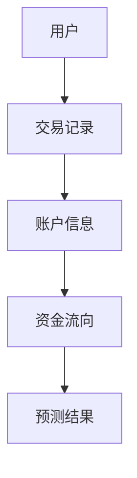
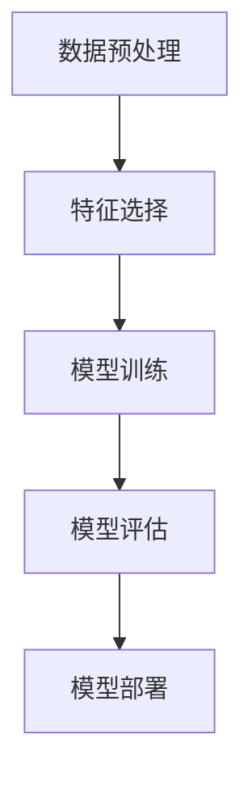
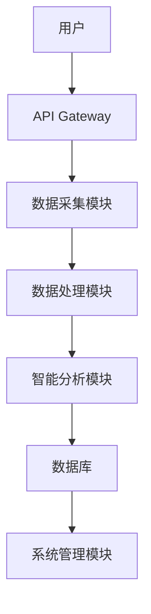
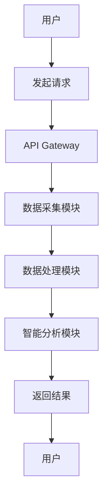

                 


# 设计智能化的企业资金管理系统

> 关键词：智能化资金管理、人工智能、大数据、企业财务、系统设计

> 摘要：随着企业规模的不断扩大和业务复杂性的增加，传统的资金管理系统已经难以满足现代企业的需求。智能化的资金管理系统通过结合人工智能和大数据技术，能够实现资金管理的自动化、智能化和高效化。本文将从背景介绍、核心概念、算法原理、系统架构、项目实战和最佳实践等方面，详细探讨如何设计智能化的企业资金管理系统。

---

# 第一部分: 背景介绍与核心概念

# 第1章: 智能化企业资金管理系统的背景与需求

## 1.1 传统企业资金管理的痛点与挑战

### 1.1.1 传统资金管理的效率问题

传统资金管理通常依赖人工操作，存在效率低下、错误率高、处理时间长等问题。例如，手动录入数据、复杂的审批流程以及人工核对账单等，都会浪费大量时间，影响企业的资金周转效率。

### 1.1.2 传统资金管理的准确性问题

由于人为操作的不可避免性，传统资金管理容易出现数据错误，尤其是在复杂的财务数据处理和多部门协作中，容易出现账单错配、数据遗漏等问题，导致资金管理的准确性难以保证。

### 1.1.3 传统资金管理的实时性不足

传统资金管理系统往往无法实现实时监控和动态调整，资金流动信息滞后于实际业务需求，难以满足企业对快速决策的需求。

## 1.2 智能化资金管理的必要性

### 1.2.1 企业对智能化资金管理的需求

随着企业规模的扩大和业务的全球化，资金管理的复杂性不断增加。企业需要一个能够实时监控资金流动、预测资金需求、优化资金分配的系统，以提高资金使用效率和决策能力。

### 1.2.2 智能化资金管理的优势

智能化资金管理系统能够通过人工智能和大数据技术，实现以下优势：

- **实时监控**：实时跟踪资金流动，及时发现异常情况。
- **智能预测**：基于历史数据和市场趋势，预测资金需求和风险。
- **自动化处理**：自动完成数据录入、审批流程和账单核对等操作。
- **优化决策**：通过数据驱动的分析，提供最优的资金分配方案。

### 1.2.3 智能化资金管理的边界与外延

智能化资金管理的边界主要集中在企业的内部资金流动和外部银行账户管理。外延则包括与企业财务、供应链管理和风险管理等其他系统的集成。

## 1.3 智能化资金管理的核心要素

### 1.3.1 数据采集与处理

智能化资金管理系统需要从企业内部和外部（如银行账户）采集资金流动数据，并进行清洗、转换和标准化处理。

### 1.3.2 智能分析与预测

通过机器学习算法，对资金流动数据进行分析和预测，识别趋势和潜在风险。

### 1.3.3 自动化决策与执行

系统根据预测结果和企业目标，自动执行资金分配、投资决策等操作。

---

# 第2章: 智能化资金管理的核心概念与联系

## 2.1 智能化资金管理的原理

### 2.1.1 数据驱动的决策机制

智能化资金管理系统通过收集和分析大量数据，利用数据驱动的决策机制，帮助企业在资金管理中做出更科学的决策。

### 2.1.2 AI算法在资金管理中的应用

人工智能算法（如机器学习、深度学习）在资金预测、风险评估和投资决策等方面发挥重要作用。

### 2.1.3 大数据技术在资金管理中的作用

大数据技术能够处理和分析海量数据，为资金管理提供实时、全面的支持。

## 2.2 核心概念对比分析

### 2.2.1 传统资金管理与智能化资金管理的对比

| 特性                | 传统资金管理             | 智能化资金管理             |
|---------------------|--------------------------|--------------------------|
| 数据处理            | 手动录入、处理效率低     | 自动采集、处理高效       |
| 决策方式            | 依赖人工经验             | 数据驱动、智能决策       |
| 实时性              | 延时性                   | 实时性                   |

### 2.2.2 数据采集、分析、决策的对比

| 阶段                | 传统方式             | 智能化方式             |
|---------------------|----------------------|----------------------|
| 数据采集            | 手工记录             | 自动采集（API、传感器）|
| 数据分析            | 人工统计             | AI算法自动分析       |
| 决策                | 经验驱动             | 数据驱动             |

### 2.2.3 系统架构的对比

| 架构                | 传统系统             | 智能化系统             |
|---------------------|----------------------|----------------------|
| 中心化              | 单体架构             | 微服务架构           |
| 扩展性              | 较差                 | 较好                 |
| 可维护性            | 低                   | 高                   |

## 2.3 实体关系图（ER图）



---

# 第3章: 智能化资金管理的算法原理

## 3.1 数据预处理与特征提取

### 3.1.1 数据清洗与标准化

数据清洗包括去除重复数据、处理缺失值和异常值。标准化则是将数据转换到统一的范围内。

### 3.1.2 特征选择与提取

通过统计分析和机器学习算法，选择对资金流动预测影响较大的特征（如交易金额、时间间隔等）。

### 3.1.3 时间序列数据的处理

时间序列数据的处理包括数据的滑动窗口、差分等方法，以消除趋势和季节性。

## 3.2 机器学习算法在资金预测中的应用

### 3.2.1 算法选择与原理

常用的算法包括线性回归、随机森林和LSTM（长短期记忆网络）。其中，LSTM适合处理时间序列数据，能够捕捉长期依赖关系。

### 3.2.2 算法实现步骤



### 3.2.3 算法代码实现

```python
from sklearn.linear_model import LinearRegression
from sklearn.metrics import mean_squared_error
import pandas as pd

# 数据加载与预处理
data = pd.read_csv('financial_data.csv')
X = data[['transaction_amount', 'time_interval']]
y = data['balance']

# 模型训练
model = LinearRegression()
model.fit(X, y)

# 模型预测
y_pred = model.predict(X)
print(mean_squared_error(y, y_pred))
```

### 3.2.4 数学模型与公式

线性回归模型的数学公式为：

$$ y = \beta_0 + \beta_1 x + \epsilon $$

其中，$\beta_0$是截距，$\beta_1$是回归系数，$\epsilon$是误差项。

---

# 第4章: 系统分析与架构设计方案

## 4.1 问题场景介绍

企业资金管理系统需要处理大量的资金流动数据，包括收入、支出、转账等操作，并需要实时监控和预测资金流动。

## 4.2 项目介绍

### 4.2.1 系统功能设计

- 数据采集模块：从银行账户和其他数据源采集资金流动数据。
- 数据处理模块：清洗、转换和存储数据。
- 智能分析模块：利用机器学习算法进行资金流动预测和风险评估。
- 系统管理模块：包括用户管理、权限设置和日志管理。

### 4.2.2 系统架构设计



### 4.2.3 系统接口设计

- 数据采集接口：通过API从银行获取资金流动数据。
- 数据处理接口：将数据存储到数据库中。
- 智能分析接口：提供预测结果给前端展示。

### 4.2.4 系统交互设计



---

# 第5章: 项目实战

## 5.1 环境安装

### 5.1.1 安装Python

```bash
python --version
pip install --upgrade pip
```

### 5.1.2 安装Jupyter Notebook

```bash
pip install jupyter
jupyter notebook
```

### 5.1.3 安装机器学习库

```bash
pip install scikit-learn
pip install numpy
pip install pandas
```

## 5.2 系统核心实现源代码

### 5.2.1 数据处理代码

```python
import pandas as pd

# 数据加载
data = pd.read_csv('financial_data.csv')

# 数据清洗
data.dropna(inplace=True)
data['date'] = pd.to_datetime(data['date'])
data.set_index('date', inplace=True)
```

### 5.2.2 模型训练代码

```python
from sklearn.model_selection import train_test_split
from sklearn.linear_model import LinearRegression

# 数据分割
X_train, X_test, y_train, y_test = train_test_split(data[['transaction_amount']], data['balance'], test_size=0.2)

# 模型训练
model = LinearRegression()
model.fit(X_train, y_train)

# 模型预测
y_pred = model.predict(X_test)
```

### 5.2.3 模型评估代码

```python
from sklearn.metrics import mean_squared_error

mse = mean_squared_error(y_test, y_pred)
print(f'均方误差: {mse}')
```

## 5.3 代码应用解读与分析

通过上述代码，我们可以实现对资金流动的预测。数据处理部分包括数据的加载、清洗和转换，模型训练部分使用线性回归算法，模型预测部分对测试数据进行预测，并计算均方误差来评估模型的性能。

## 5.4 实际案例分析

以某企业为例，假设我们有以下数据：

| 日期     | 交易金额 | 账户余额 |
|----------|----------|----------|
| 2023-01-01 | 1000     | 50000    |
| 2023-01-02 | 2000     | 48000    |
| 2023-01-03 | 1500     | 46500    |

通过模型训练，我们可以预测未来的账户余额。

## 5.5 项目小结

通过本项目，我们实现了智能化的资金管理系统，能够对资金流动进行预测和监控，帮助企业做出更科学的资金管理决策。

---

# 第6章: 最佳实践与总结

## 6.1 小结

智能化的资金管理系统通过结合人工智能和大数据技术，能够显著提高资金管理的效率和准确性。本文详细探讨了系统的背景、核心概念、算法原理、系统架构和项目实现。

## 6.2 注意事项

- 数据隐私和安全问题需要特别注意，确保资金数据的安全性。
- 系统的实时性和稳定性需要通过优化算法和架构设计来保证。
- 系统的可扩展性需要考虑未来的业务需求变化。

## 6.3 未来趋势

随着人工智能和大数据技术的不断发展，智能化资金管理系统将更加智能化和自动化，进一步提升企业的资金管理能力。

## 6.4 拓展阅读

- 《机器学习实战》
- 《大数据分析与应用》
- 《企业级应用架构设计》

---

# 作者：AI天才研究院/AI Genius Institute & 禅与计算机程序设计艺术 /Zen And The Art of Computer Programming

