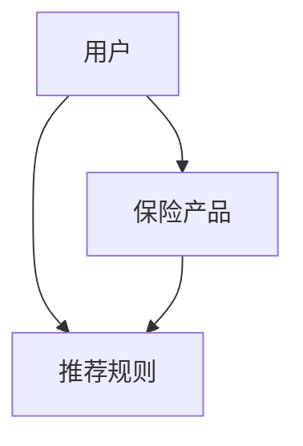
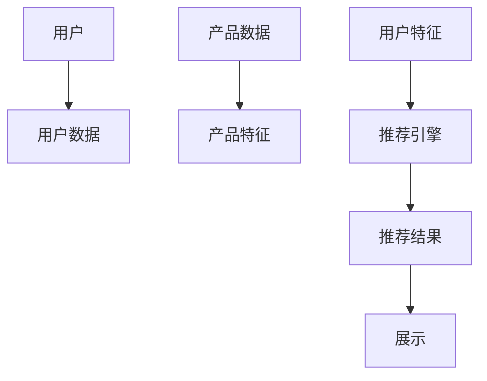
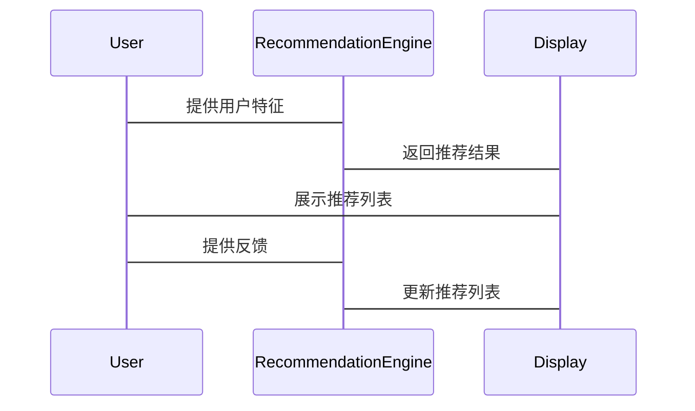

                 


# 设计智能化的保险产品推荐系统

> 关键词：保险产品推荐系统、人工智能、协同过滤、推荐算法、系统架构设计

> 摘要：本文详细探讨了设计智能化保险产品推荐系统的各个方面，包括背景分析、核心概念、算法原理、系统架构设计、项目实战以及最佳实践。通过系统的分析和实际案例，本文旨在帮助读者理解如何利用人工智能技术来优化保险产品的推荐过程，从而提高客户满意度和业务效率。

---

## 第1章: 保险产品推荐系统的背景与问题

### 1.1 保险行业的现状与挑战

#### 1.1.1 保险行业的现状分析
保险行业正面临着数字化转型的挑战，传统的产品推荐方式已难以满足客户多样化的保险需求。保险公司需要更高效、精准的方法来推荐保险产品，以提高客户满意度和市场竞争力。

#### 1.1.2 保险产品推荐的重要性
推荐系统能够帮助保险公司筛选出最适合客户的产品，减少客户的决策疲劳，提高购买转化率。同时，推荐系统还能帮助保险公司优化产品组合，降低营销成本。

#### 1.1.3 智能化推荐系统的优势
智能化推荐系统通过分析客户的个性化需求和行为数据，能够提供更精准的推荐结果。相比传统的规则引擎，智能化推荐系统能够处理更复杂的数据关系，推荐效果更加显著。

### 1.2 保险产品推荐系统的核心概念

#### 1.2.1 问题背景与问题描述
保险产品推荐的核心问题是：如何基于客户的行为数据、需求偏好和市场动态，推荐最适合的保险产品。传统方法依赖经验规则，难以应对复杂多变的市场环境。

#### 1.2.2 问题解决的思路
利用人工智能技术，特别是机器学习算法，构建一个能够动态调整推荐策略的系统，以满足客户的个性化需求。

#### 1.2.3 边界与外延
保险产品推荐系统的边界包括客户数据采集、产品特征提取、推荐算法实现和推荐结果展示。外延则涉及客户反馈收集、系统优化和新产品的动态添加。

#### 1.2.4 核心要素与概念结构
- 用户画像：包括年龄、职业、收入水平等信息。
- 保险产品特征：包括保费、保险期限、保险金额等。
- 推荐算法：协同过滤、基于内容的推荐、混合推荐模型。

---

## 第2章: 智能化保险产品推荐系统的原理与联系

### 2.1 核心概念与原理

#### 2.1.1 用户画像的构建
用户画像是基于客户的 demographic、psychographic 和 behavioral 数据构建的。通过数据挖掘和机器学习技术，可以提取出客户的保险需求特征。

#### 2.1.2 保险产品特征提取
保险产品的特征包括基本属性（如保费、保险期限）和风险评估指标（如风险等级）。特征提取是推荐系统的基础，决定了推荐的准确性。

#### 2.1.3 推荐算法的原理
推荐算法的目标是找到最适合客户的保险产品。常用的算法包括协同过滤、基于内容的推荐和混合推荐模型。

### 2.2 概念属性对比

| 概念           | 特征描述 |
|----------------|----------|
| 规则引擎       | 基于预定义的规则进行推荐，灵活性低 |
| 机器学习模型    | 基于数据训练模型，灵活性高 |

### 2.3 实体关系图


---

## 第3章: 基于协同过滤的推荐算法

### 3.1 协同过滤算法的原理

#### 3.1.1 基于用户的协同过滤
基于用户的历史购买行为和偏好，找到相似的用户群体，推荐相似的产品。

#### 3.1.2 基于物品的协同过滤
基于产品的相似性，推荐与当前产品相关的产品。

### 3.2 协同过滤的实现

#### 3.2.1 数据预处理
- 数据清洗：去除缺失值和异常值。
- 特征提取：提取客户和产品的关键特征。

#### 3.2.2 相似度计算
使用余弦相似度或欧氏距离计算客户或产品之间的相似度。

#### 3.2.3 推荐生成
根据相似度排序，选择相似度最高的产品进行推荐。

### 3.3 协同过滤的代码实现

```python
import numpy as np
from sklearn.metrics.pairwise import cosine_similarity

# 示例数据矩阵
X = np.array([[1, 2, 3],
              [4, 5, 6],
              [7, 8, 9]])

# 计算余弦相似度
similarity = cosine_similarity(X)
print(similarity)
```

### 3.4 协同过滤的数学模型

#### 3.4.1 相似度计算公式
$$ \text{similarity}(i, j) = \frac{\sum_{k=1}^{n} X_{ik} \cdot X_{jk}}{\sqrt{\sum_{k=1}^{n} X_{ik}^2} \cdot \sqrt{\sum_{k=1}^{n} X_{jk}^2}}} $$

---

## 第4章: 基于内容的推荐算法

### 4.1 基于内容的推荐原理
通过分析产品的特征，找到与当前产品最相关的其他产品进行推荐。

### 4.2 内容特征提取
使用文本挖掘技术提取产品的描述信息，构建产品特征向量。

### 4.3 基于内容的推荐实现

#### 4.3.1 特征向量化
将产品描述转换为数值向量，使用TF-IDF或Word2Vec进行特征提取。

#### 4.3.2 相似度计算
计算产品特征向量之间的余弦相似度，选择相似度最高的产品进行推荐。

### 4.4 基于内容的推荐代码实现

```python
from sklearn.feature_extraction.text import TfidfVectorizer

# 示例产品描述
product_descriptions = [
    "健康保险计划 健康保险计划 高保额",
    "人寿保险计划 终身寿险",
    "汽车保险计划 车辆保险 车险"
]

# 特征向量化
vectorizer = TfidfVectorizer()
tfidf = vectorizer.fit_transform(product_descriptions)
print(tfidf)
```

---

## 第5章: 混合推荐模型

### 5.1 混合推荐模型的原理
结合协同过滤和基于内容的推荐，利用两者的优势，提高推荐的准确性和多样性。

### 5.2 混合推荐模型的实现

#### 5.2.1 协同过滤部分实现
基于用户的历史行为数据，计算用户相似度。

#### 5.2.2 基于内容的部分实现
基于产品特征进行推荐。

#### 5.2.3 结果融合
将两种推荐结果进行加权融合，生成最终的推荐列表。

### 5.3 混合推荐模型的代码实现

```python
import numpy as np
from sklearn.metrics.pairwise import cosine_similarity

# 示例用户数据
X = np.array([[1, 2, 3],
              [4, 5, 6],
              [7, 8, 9]])

# 协同过滤推荐
similarity = cosine_similarity(X)

# 基于内容的推荐
product_descriptions = [
    "健康保险计划 健康保险计划 高保额",
    "人寿保险计划 终身寿险",
    "汽车保险计划 车辆保险 车险"
]
vectorizer = TfidfVectorizer()
tfidf = vectorizer.fit_transform(product_descriptions)

# 结果融合
weights = [0.6, 0.4]
final_recommendation = np.dot(similarity, tfidf)
print(final_recommendation)
```

---

## 第6章: 系统分析与架构设计

### 6.1 项目背景

保险产品推荐系统的开发旨在提高客户的保险购买体验，减少客户的决策负担，同时帮助保险公司优化产品组合，提升市场竞争力。

### 6.2 系统功能设计

#### 6.2.1 用户数据采集模块
- 数据源：用户填写的问卷、历史购买记录、浏览记录。
- 数据处理：数据清洗、特征提取。

#### 6.2.2 产品数据管理模块
- 数据源：保险产品的详细信息。
- 数据处理：特征提取、产品分类。

#### 6.2.3 推荐引擎模块
- 输入：用户特征和产品特征。
- 输出：推荐结果。

#### 6.2.4 推荐结果展示模块
- 展示方式：网页、移动端应用。
- 交互设计：用户反馈收集。

### 6.3 系统架构设计



### 6.4 系统交互设计



---

## 第7章: 项目实战

### 7.1 环境搭建

#### 7.1.1 安装Python和相关库
- 安装Python 3.x
- 安装必要的库：scikit-learn, numpy, pandas, mermaid。

#### 7.1.2 数据准备
- 获取保险产品的详细信息和客户的购买记录。

### 7.2 系统核心实现

#### 7.2.1 数据预处理
- 清洗数据：去除缺失值和异常值。
- 特征提取：提取客户的 demographic 和 behavioral 数据。

#### 7.2.2 模型训练
- 训练协同过滤模型和基于内容的推荐模型。
- 融合模型结果，生成最终推荐。

#### 7.2.3 系统部署
- 部署推荐系统到云服务器。
- 配置前端和后端接口。

### 7.3 实际案例分析

#### 7.3.1 数据分析
分析客户的购买记录和产品特征，找出客户的保险需求规律。

#### 7.3.2 模型评估
通过准确率、召回率和F1分数评估推荐系统的性能。

#### 7.3.3 系统优化
根据客户反馈，优化推荐算法，提高推荐效果。

---

## 第8章: 最佳实践与总结

### 8.1 最佳实践 tips

- 数据质量是推荐系统的核心，确保数据的完整性和准确性。
- 定期更新模型，适应市场变化和客户需求。
- 保护客户隐私，遵守数据安全法规。

### 8.2 小结

智能化保险产品推荐系统通过结合人工智能技术，能够显著提高推荐的准确性和客户满意度。本文详细介绍了推荐系统的各个方面，从理论到实践，帮助读者全面理解如何设计和实现一个高效的推荐系统。

### 8.3 注意事项

- 数据安全和隐私保护是系统设计的重要部分。
- 系统的可扩展性和可维护性需要在设计阶段充分考虑。
- 定期监控系统性能，及时优化和调整。

### 8.4 拓展阅读

- 《推荐系统实战：基于机器学习的推荐算法》
- 《保险产品设计与市场营销》
- 《人工智能在金融行业的应用》

---

## 作者：AI天才研究院/AI Genius Institute & 禅与计算机程序设计艺术 /Zen And The Art of Computer Programming

