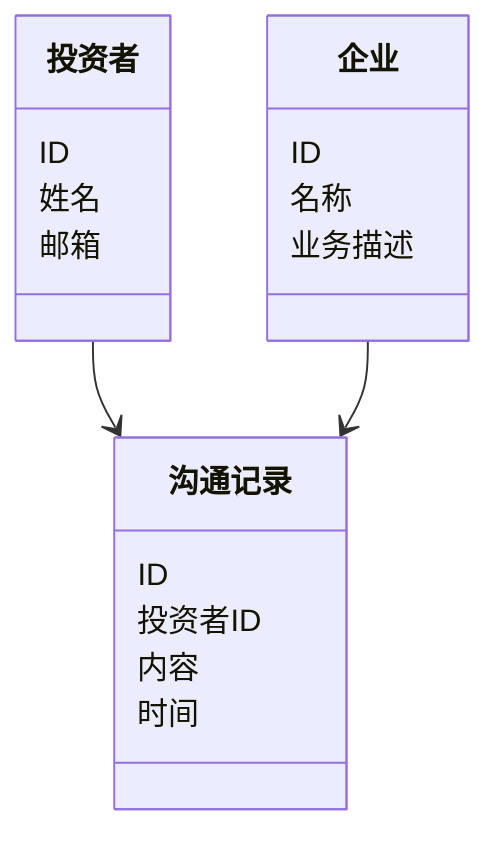
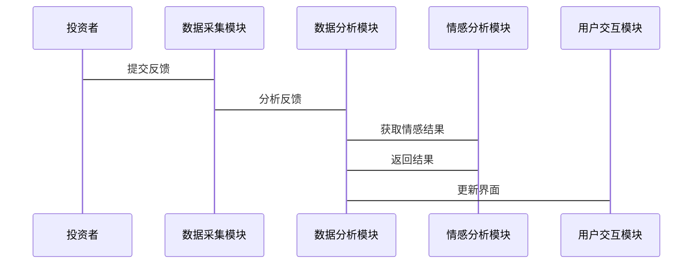

                 


```markdown
# 设计智能化的投资者关系管理系统

> 关键词：投资者关系管理，人工智能，自然语言处理，机器学习，系统架构，智能化

> 摘要：  
智能化投资者关系管理系统通过结合自然语言处理、机器学习和情感分析等技术，实现投资者与企业之间的高效、智能互动。本文详细探讨了系统的设计背景、核心概念、算法原理、系统架构及项目实战，为读者提供全面的技术指导。

---

## 第一部分: 背景与核心概念

### 第1章: 投资者关系管理的智能化需求

#### 1.1 投资者关系管理的现状与挑战
##### 1.1.1 投资者关系管理的定义与传统模式
投资者关系管理（Investor Relations Management，IRM）是指企业通过与投资者保持有效沟通，提升投资者对企业的信任与满意度。传统模式依赖人工操作，效率低下且难以满足多样化的投资者需求。

##### 1.1.2 传统投资者关系管理的痛点与局限性
- **信息不对称**：投资者难以及时获取企业动态，企业难以精准理解投资者需求。
- **沟通效率低**：人工处理大量投资者咨询和反馈耗时耗力。
- **数据碎片化**：缺乏统一的数据平台，难以进行数据分析和挖掘。

##### 1.1.3 智能化投资者关系管理的必要性
随着科技的发展，投资者对信息的需求更加多样化和个性化。智能化投资者关系管理系统能够通过AI技术实现自动化、智能化的沟通与服务，提升效率和精准度。

#### 1.2 问题背景与问题描述
##### 1.2.1 投资者需求的多样化与复杂化
投资者群体包括机构投资者、个人投资者等，其需求和关注点各不相同。传统管理模式难以满足个性化需求。

##### 1.2.2 信息传播的即时性与准确性要求
投资者需要实时获取企业信息，且要求信息的准确性。传统模式难以满足这一需求。

##### 1.2.3 企业与投资者之间沟通效率的提升需求
通过智能化系统，企业可以快速响应投资者的咨询和反馈，提升沟通效率。

#### 1.3 问题解决与边界定义
##### 1.3.1 智能化投资者关系管理的核心目标
- 提供智能化的投资者互动平台。
- 实现投资者需求的精准识别与满足。
- 提升投资者体验和满意度。

##### 1.3.2 系统的边界与外延
系统专注于投资者关系管理的核心功能，边界包括投资者信息采集、分析、互动以及反馈优化。外延则不涉及企业的财务数据处理或其他业务模块。

##### 1.3.3 核心要素与组成结构
系统由数据采集模块、数据分析模块、用户交互模块和反馈优化模块组成。

---

### 第2章: 核心概念与联系

#### 2.1 核心概念原理
##### 2.1.1 自然语言处理（NLP）在投资者关系中的应用
- 文本分类：识别投资者的反馈类型。
- 情感分析：分析投资者情绪，帮助企业调整沟通策略。

##### 2.1.2 机器学习在投资者行为预测中的作用
- 预测投资者的潜在需求。
- 建模分析投资者行为模式。

##### 2.1.3 情感分析在投资者情绪识别中的应用
- 通过情感分析识别投资者情绪，优化企业沟通策略。

#### 2.2 核心概念属性对比
##### 2.2.1 传统投资者关系管理与智能化投资者关系管理的对比
| 特性               | 传统模式                   | 智能化模式                 |
|--------------------|---------------------------|--------------------------|
| 沟通效率           | 低                        | 高                      |
| 数据处理能力       | 有限                     | 强大                    |
| 个性化服务         | 较少                     | 丰富                    |

##### 2.2.2 不同投资者群体的需求特征对比
| 投资者类型         | 关注点                     | 示例需求                 |
|--------------------|---------------------------|--------------------------|
| 机构投资者         | 财务数据、公司战略         | 定期财务报告、战略规划   |
| 个人投资者         | 股价波动、投资建议         | 实时股价提醒、投资建议   |

##### 2.2.3 系统功能模块的属性特征分析
- 数据采集模块：实时采集投资者行为数据。
- 数据分析模块：利用NLP和机器学习技术分析数据。
- 用户交互模块：提供个性化界面和实时反馈。

#### 2.3 ER实体关系图
```mermaid
er
    actor 投资者
    actor 企业
    actor 系统管理员
    entity 投资者信息
    entity 企业信息
    entity 沟通记录
    entity 投资者行为数据
    entity 情感分析结果
    relation 投资者 -> 拥有 -> 投资者信息
    relation 企业 -> 拥有 -> 企业信息
    relation 投资者 -> 与 -> 沟通记录
    relation 沟通记录 -> 包含 -> 投资者行为数据
    relation 投资者行为数据 -> 影响 -> 情感分析结果
```

---

## 第二部分: 算法原理与数学模型

### 第3章: 自然语言处理（NLP）算法

#### 3.1 NLP算法概述
##### 3.1.1 NLP的基本概念与技术栈
- 分词：将文本分割成词语。
- 词性标注：识别词语的词性。
- 句法分析：分析句子结构。

##### 3.1.2 常见的NLP任务与应用场景
- 文本分类：识别投资者的反馈类型。
- 情感分析：分析投资者情绪。

##### 3.1.3 NLP在投资者关系管理中的具体应用
- 自动回复投资者咨询。
- 情感分析识别投资者情绪。

#### 3.2 情感分析算法
##### 3.2.1 情感分析的数学模型
情感分析是通过分类模型对文本进行情感判断，常用算法包括朴素贝叶斯和深度学习模型如LSTM。

##### 3.2.2 情感分析的流程


##### 3.2.3 情感分析的代码实现
```python
from textblob import TextBlob

def sentiment_analysis(text):
    blob = TextBlob(text)
    sentiment = blob.sentiment.polarity
    return "积极" if sentiment > 0 else "消极"

text = "这个公司发展前景很好"
print(sentiment_analysis(text))  # 输出: 积极
```

---

## 第三部分: 系统分析与架构设计

### 第4章: 系统架构设计

#### 4.1 问题场景介绍
系统需要处理大量投资者的咨询和反馈，通过智能化算法快速响应。

#### 4.2 系统功能设计
##### 4.2.1 领域模型


##### 4.2.2 系统架构
```mermaid
container 投资者关系管理系统 {
    component 数据采集模块 {
        [投资者信息采集]
        [企业信息采集]
    }
    component 数据分析模块 {
        [NLP处理]
        [情感分析]
    }
    component 用户交互模块 {
        [投资者界面]
        [企业界面]
    }
}
```

##### 4.2.3 系统接口设计
- API接口：投资者信息查询、情感分析结果获取。

##### 4.2.4 系统交互流程


---

## 第四部分: 项目实战

### 第5章: 项目实战

#### 5.1 环境安装
- Python 3.8+
- NLP库：spaCy、TextBlob
- 机器学习库：scikit-learn

#### 5.2 核心代码实现
##### 5.2.1 数据采集模块
```python
import requests
from bs4 import BeautifulSoup

def fetch_investor_feedback(url):
    response = requests.get(url)
    soup = BeautifulSoup(response.text, 'html.parser')
    feedbacks = soup.find_all('div', class_='feedback-item')
    return [f.text for f in feedbacks]

url = 'http://example.com/feedback'
feedbacks = fetch_investor_feedback(url)
print(feedbacks)
```

##### 5.2.2 情感分析模块
```python
from textblob import TextBlob

def analyze_sentiment(feedback):
    blob = TextBlob(feedback)
    return blob.sentiment.polarity

feedbacks = ['公司发展前景很好', '我对公司业绩很不满意']
for f in feedbacks:
    print(f, analyze_sentiment(f))
```

#### 5.3 案例分析与解读
分析一组投资者反馈，使用情感分析模块识别情绪，优化企业沟通策略。

#### 5.4 项目小结
总结项目实现过程，指出系统的优势和改进方向。

---

## 第五部分: 最佳实践与总结

### 第6章: 最佳实践

#### 6.1 最佳实践 Tips
- 数据质量是关键，确保数据的准确性和完整性。
- 定期优化模型，提升算法的准确率。

#### 6.2 小结
智能化投资者关系管理系统通过AI技术实现高效、智能的投资者互动，为企业和投资者带来双赢的效果。

#### 6.3 注意事项
- 保护投资者数据隐私。
- 系统需具备良好的扩展性和可维护性。

#### 6.4 拓展阅读
推荐相关书籍和论文，深入学习NLP和机器学习技术。

---

作者：AI天才研究院/AI Genius Institute & 禅与计算机程序设计艺术 /Zen And The Art of Computer Programming
```

