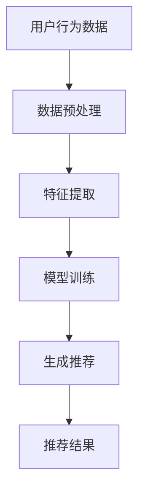
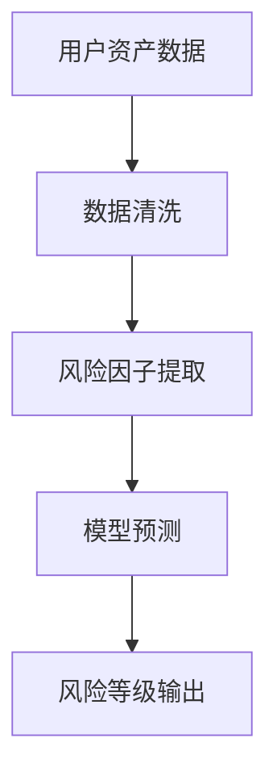
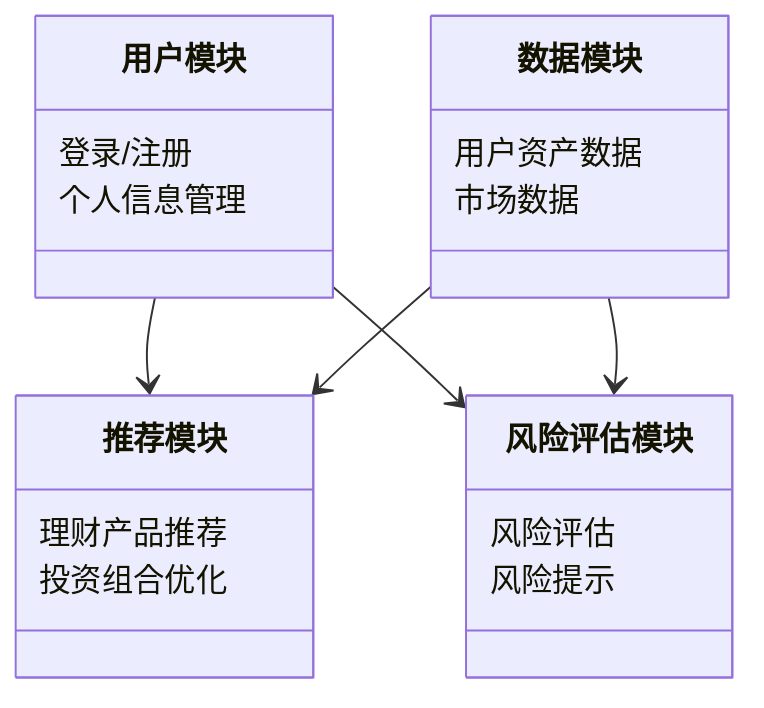

                 


# 设计直观易用的投资理财智能助手用户界面

> 关键词：投资理财，智能助手，用户界面设计，用户体验，金融科技

> 摘要：本文详细探讨了设计直观易用的投资理财智能助手用户界面的核心原则、算法原理、系统架构及项目实现。通过分析用户需求，结合现代金融科技的发展，提出了基于机器学习的投资推荐系统和风险评估模型，并通过系统架构设计和实际案例分析，展示了如何构建一个高效、易用的投资理财智能助手。

---

# 第一部分: 投资理财智能助手用户界面设计背景与核心概念

## 第1章: 投资理财智能助手的背景与用户需求

### 1.1 投资理财智能助手的背景

#### 1.1.1 金融科技的发展与智能投资的兴起
金融科技（FinTech）的快速发展，使得投资理财变得更加智能化和个性化。传统的投资理财工具逐渐被基于人工智能的智能助手所取代，这些智能助手能够根据用户的财务状况、市场趋势和投资目标，提供个性化的投资建议和实时监控。

#### 1.1.2 用户对投资理财工具的需求变化
随着投资者对金融产品的多样化需求增加，用户对投资理财工具的要求也从简单的数据查询扩展到个性化推荐、风险评估和投资组合优化等高级功能。然而，复杂的金融市场信息和多样化的投资选项也让用户感到困惑，他们需要一个直观易用的界面来简化操作。

#### 1.1.3 智能助手在投资理财中的作用
智能助手通过自然语言处理、机器学习和大数据分析等技术，帮助用户快速获取投资信息、制定投资策略并监控投资表现。智能助手的核心目标是降低投资门槛，提高用户体验，让用户能够轻松实现财富增值。

---

### 1.2 用户痛点与需求分析

#### 1.2.1 投资者的行为特征与需求
投资者的行为特征包括对实时信息的需求、对个性化建议的依赖以及对简单操作的偏好。用户通常希望投资工具能够提供直观的图表展示、个性化的投资建议以及便捷的操作流程。

#### 1.2.2 现有投资工具的不足
现有的投资工具往往过于复杂，界面繁琐，缺乏个性化的推荐功能。用户在使用这些工具时，常常需要面对大量的专业术语和复杂的操作流程，这导致用户体验较差，使用门槛较高。

#### 1.2.3 智能助手如何解决用户痛点
智能助手通过简化操作流程、提供个性化的投资建议和直观的数据展示，解决了传统投资工具的痛点。它能够通过自然语言处理技术与用户进行交互，实时理解用户需求并提供相应的解决方案。

---

## 第2章: 投资理财智能助手的核心概念与界面设计原则

### 2.1 投资理财智能助手的核心概念

#### 2.1.1 智能助手的基本定义
智能助手是一种基于人工智能技术的工具，能够通过自然语言处理、机器学习和大数据分析等技术，为用户提供个性化的投资建议和实时监控服务。

#### 2.1.2 投资理财助手的功能模块
投资理财助手的功能模块通常包括用户身份认证、投资目标设定、投资组合优化、风险评估和实时监控等。

#### 2.1.3 界面设计的核心目标
界面设计的核心目标是提高用户体验，降低使用门槛，让用户能够快速理解并使用智能助手的各项功能。

---

### 2.2 界面设计原则

#### 2.2.1 直观性原则
直观性原则要求界面设计简洁明了，避免使用复杂的术语和繁琐的操作流程。用户应该能够通过直观的图表和简洁的文字快速理解投资信息。

#### 2.2.2 简洁性原则
简洁性原则强调界面设计要避免信息过载，只展示用户当前需要的信息。通过合理的布局和信息筛选功能，用户可以轻松找到所需信息。

#### 2.2.3 一致性原则
一致性原则要求界面设计在风格、颜色和操作流程上保持一致，避免让用户感到混乱。一致的设计能够提高用户的学习效率和使用体验。

#### 2.2.4 可用性原则
可用性原则强调界面设计要注重用户体验，确保用户能够快速完成操作。通过合理的导航设计和反馈机制，用户可以在使用智能助手时感到轻松自如。

---

# 第二部分: 投资理财智能助手的算法与系统架构

## 第3章: 投资理财智能助手的核心算法原理

### 3.1 理财推荐算法

#### 3.1.1 基于用户行为的推荐算法
基于用户行为的推荐算法通过分析用户的交易记录、浏览历史和搜索行为，预测用户的兴趣偏好，并推荐相关的产品。

#### 3.1.2 基于机器学习的理财推荐
基于机器学习的理财推荐算法通常采用协同过滤或基于内容的推荐方法。协同过滤通过分析用户的相似性来推荐产品，而基于内容的推荐则通过分析产品的特征来推荐相关产品。

#### 3.1.3 算法流程图
以下是基于协同过滤的理财推荐算法流程图：



---

### 3.2 风险评估算法

#### 3.2.1 风险评估模型的构建
风险评估模型通常基于用户的历史投资数据和市场数据，通过机器学习算法预测投资的风险等级。

#### 3.2.2 基于历史数据的风险预测
基于历史数据的风险预测算法通过分析市场波动、经济指标和用户资产分布等因素，预测投资组合的风险。

#### 3.2.3 风险评估流程图
以下是风险评估算法的流程图：



---

## 第4章: 投资理财智能助手的系统架构设计

### 4.1 系统功能模块设计

#### 4.1.1 用户模块
用户模块负责用户的身份认证和信息管理，包括登录、注册和个人信息维护。

#### 4.1.2 数据模块
数据模块负责管理和存储用户资产数据和市场数据，确保数据的准确性和实时性。

#### 4.1.3 推荐模块
推荐模块基于用户行为和市场数据，提供个性化的投资产品推荐和投资组合优化建议。

#### 4.1.4 风险评估模块
风险评估模块通过分析用户资产和市场数据，评估投资组合的风险等级，并提供相应的风险提示。

---

### 4.2 系统架构图



---

# 第三部分: 投资理财智能助手的项目实战

## 第5章: 项目实战

### 5.1 环境搭建

#### 5.1.1 安装Python
```bash
python --version
pip install --upgrade pip
```

#### 5.1.2 安装依赖库
```bash
pip install numpy pandas scikit-learn matplotlib
```

---

### 5.2 核心代码实现

#### 5.2.1 数据预处理
```python
import pandas as pd
from sklearn.model_selection import train_test_split

# 加载数据
data = pd.read_csv('investment_data.csv')

# 数据分割
X = data.drop(columns=['label'])
y = data['label']
X_train, X_test, y_train, y_test = train_test_split(X, y, test_size=0.2, random_state=42)
```

#### 5.2.2 模型训练
```python
from sklearn.neighbors import KNeighborsClassifier
from sklearn.metrics import accuracy_score

# 训练模型
model = KNeighborsClassifier(n_neighbors=3)
model.fit(X_train, y_train)

# 预测结果
y_pred = model.predict(X_test)
print(f'Accuracy: {accuracy_score(y_test, y_pred)}')
```

---

### 5.3 实际案例分析

#### 5.3.1 投资组合优化
假设用户的投资目标是稳健型，风险承受能力较低。智能助手会根据用户的资产状况和市场数据，推荐适合稳健型投资者的理财产品，并生成投资组合优化建议。

#### 5.3.2 风险评估
通过分析用户的资产分布和市场数据，智能助手会评估投资组合的风险等级，并提供相应的风险提示。例如，如果市场波动较大，用户的投资组合风险较高，智能助手会建议用户调整投资策略。

---

### 5.4 项目小结

通过本章的实战，我们了解了投资理财智能助手的核心算法和系统架构设计。通过实际案例分析，我们验证了算法的有效性和系统的可行性。在后续的开发中，我们还需要进一步优化算法性能，提升用户体验。

---

# 第四部分: 最佳实践与注意事项

## 第6章: 最佳实践与注意事项

### 6.1 设计注意事项

#### 6.1.1 简化操作流程
避免复杂的操作步骤，确保用户能够快速完成目标操作。

#### 6.1.2 提供清晰的反馈
在用户进行操作时，提供及时的反馈，让用户知道操作是否成功。

#### 6.1.3 注重数据安全
保护用户的敏感数据，确保系统的安全性。

---

### 6.2 小结与展望

投资理财智能助手的设计是一个复杂而有趣的过程。通过本文的探讨，我们了解了设计直观易用的投资理财智能助手的核心原则和实现方法。未来，随着人工智能技术的不断发展，投资理财智能助手的功能和界面设计将更加智能化和个性化。

---

# 作者信息

作者：AI天才研究院/AI Genius Institute & 禅与计算机程序设计艺术 /Zen And The Art of Computer Programming

--- 

希望这篇文章能够为设计直观易用的投资理财智能助手提供有价值的参考和启发。

