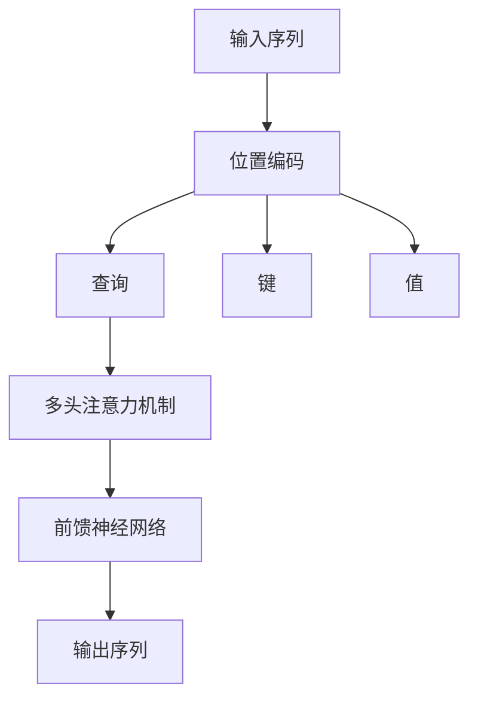
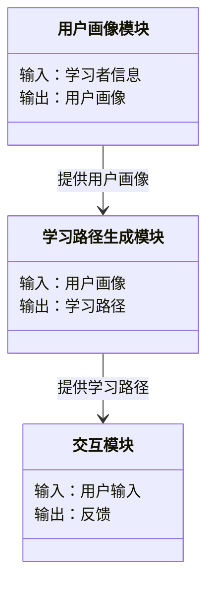

                 


# 语言学习AI Agent：个性化外语教学助手

---

## 关键词：
语言学习，AI Agent，个性化教学，自然语言处理，机器学习，深度学习

---

## 摘要：
本文深入探讨了语言学习AI Agent的概念、技术原理及其在个性化外语教学中的应用。通过分析AI Agent的核心概念、算法原理和系统架构设计，结合实际项目案例，详细展示了如何利用自然语言处理、机器学习等技术实现智能化、个性化的语言学习助手。文章还提供了代码实现和系统设计的详细指导，为读者理解并应用语言学习AI Agent提供了全面的参考。

---

## 目录：

1. [语言学习AI Agent的背景与概念](#语言学习AI-Agent的背景与概念)
2. [AI Agent的核心概念与原理](#AI-Agent的核心概念与原理)
3. [语言学习AI Agent的算法原理](#语言学习AI-Agent的算法原理)
4. [语言学习AI Agent的系统架构设计](#语言学习AI-Agent的系统架构设计)
5. [语言学习AI Agent的项目实战](#语言学习AI-Agent的项目实战)
6. [语言学习AI Agent的未来展望](#语言学习AI-Agent的未来展望)

---

## 语言学习AI Agent的背景与概念

语言学习AI Agent是一种基于人工智能技术的辅助工具，旨在为学习者提供个性化的外语学习支持。随着全球化的加速和跨文化交流的增多，语言学习的需求日益增长，传统的教学方式难以满足个性化、高效化的需求。AI Agent通过自然语言处理、机器学习等技术，能够实时分析学习者的需求，提供针对性的学习建议和反馈，从而优化学习效果。

---

## AI Agent的核心概念与原理

### 自然语言处理技术

自然语言处理（NLP）是AI Agent实现语言学习功能的核心技术之一。NLP能够理解、生成和处理人类语言，通过文本分析、语义理解等技术，帮助学习者解决语言学习中的问题。

#### 常见的NLP任务
- **文本分类**：将文本分为不同的类别，如情感分析、主题分类等。
- **命名实体识别（NER）**：识别文本中的实体，如人名、地名、组织机构名等。
- **机器翻译**：将一种语言翻译成另一种语言。
- **问答系统**：回答用户提出的问题。

#### NLP在语言学习中的应用
- **语法检查**：AI Agent可以检查用户的语法错误，并提供改进建议。
- **词汇推荐**：根据学习者的水平，推荐合适的词汇和短语。
- **对话练习**：模拟真实对话场景，帮助学习者提高口语能力。

---

### 机器学习与深度学习

机器学习（ML）和深度学习（DL）是AI Agent实现个性化教学的关键技术。ML通过训练模型，能够预测用户的需求和行为；DL则通过多层神经网络，能够处理复杂的语言模式和语义关系。

#### 机器学习在语言学习中的应用
- **学习者画像**：通过收集学习者的行为数据，构建学习者的知识水平和学习风格的模型。
- **学习路径推荐**：根据学习者的需求和水平，推荐合适的学习内容和进度。
- **效果评估**：通过监督学习，评估学习者的学习效果，并提供反馈。

---

### AI Agent的实体关系分析

为了更好地理解AI Agent的结构，我们可以绘制一个实体关系图（ER图）。以下是AI Agent的实体关系示意图：

```mermaid
er
    %% AI Agent的实体关系图
    %% 学习者实体
    class 学习者 {
        学习者ID : int
        姓名 : string
        语言水平 : int
        学习目标 : string
        学习记录 : string
    }

    %% 内容实体
    class 学习内容 {
        内容ID : int
        内容类型 : string
        内容难度 : int
        内容主题 : string
    }

    %% AI Agent实体
    class AI-Agent {
        AgentID : int
        功能模块 : string
        状态 : string
    }

    %% 关系
    学习者 --o> 学习内容 : 学习
    AI-Agent --o> 学习内容 : 提供
    学习者 --o> AI-Agent : 使用
```

---

## 语言学习AI Agent的算法原理

### Transformer模型

Transformer模型是当前自然语言处理领域的主流模型，广泛应用于机器翻译、文本生成等领域。以下是Transformer模型的简要流程图：



Transformer模型的核心在于多头注意力机制，它能够捕捉到输入序列中的长距离依赖关系，从而更好地理解语义。

#### Transformer模型的数学公式

多头注意力机制的计算公式如下：

$$
\text{Attention}(Q, K, V) = \text{softmax}\left(\frac{QK^T}{\sqrt{d_k}}\right)V
$$

其中：
- $Q$ 表示查询矩阵
- $K$ 表示键矩阵
- $V$ 表示值矩阵
- $d_k$ 表示键的维度

---

### 语言模型的训练与优化

语言模型的训练目标是通过最大化条件概率来生成连贯的文本。以下是语言模型的训练流程：

1. **数据预处理**：对原始数据进行清洗、分词、标注等处理。
2. **模型构建**：选择合适的模型架构，如RNN、LSTM或Transformer。
3. **模型训练**：使用训练数据训练模型，并通过反向传播算法优化模型参数。
4. **模型评估**：使用验证集评估模型的性能，调整超参数以提高准确率。

#### 梯度下降优化算法

梯度下降是机器学习中常用的一种优化算法，其数学公式如下：

$$
\theta_{\text{new}} = \theta_{\text{old}} - \eta \cdot \nabla J(\theta_{\text{old}})
$$

其中：
- $\theta$ 表示模型参数
- $\eta$ 表示学习率
- $\nabla J(\theta_{\text{old}})$ 表示损失函数的梯度

---

## 语言学习AI Agent的系统架构设计

### 系统功能模块

语言学习AI Agent的系统架构设计包括以下几个核心模块：

1. **用户画像模块**：收集并分析学习者的基本信息、学习目标和学习风格，构建用户画像。
2. **学习路径生成模块**：根据用户画像，生成个性化的学习路径和内容推荐。
3. **交互模块**：通过自然语言处理技术，与学习者进行实时对话，提供即时反馈和指导。

#### 系统功能模块的Mermaid类图



---

## 语言学习AI Agent的项目实战

### 环境搭建

要开始使用语言学习AI Agent，首先需要搭建开发环境。以下是主要步骤：

1. **安装Python**：选择合适的Python版本，推荐使用Python 3.8或以上。
2. **安装依赖库**：安装必要的库，如TensorFlow、Keras、NLTK等。

#### 核心代码实现

以下是AI Agent的核心代码示例：

```python
import numpy as np
from tensorflow.keras.models import Model
from tensorflow.keras.layers import Input, LSTM, Dense, Bidirectional

# 定义输入层
inputs = Input(shape=(max_len, embedding_dim))
# 定义双向LSTM层
lstm_layer = Bidirectional(LSTM(units=hidden_units, return_sequences=True))(inputs)
# 定义全连接层
dense_layer = Dense(units=output_dim, activation='softmax')(lstm_layer)
# 定义模型
model = Model(inputs=inputs, outputs=dense_layer)
model.compile(optimizer='adam', loss='categorical_crossentropy', metrics=['accuracy'])

# 训练模型
model.fit(X_train, y_train, epochs=num_epochs, batch_size=batch_size, validation_data=(X_val, y_val))
```

---

## 总结

语言学习AI Agent通过自然语言处理、机器学习等技术，为学习者提供了个性化的学习体验。本文详细介绍了AI Agent的核心概念、算法原理和系统架构设计，并通过项目实战展示了如何实现一个简单的语言学习AI Agent。未来，随着AI技术的不断发展，语言学习AI Agent将变得更加智能化和个性化，为学习者提供更高效、更精准的语言学习支持。

---

## 作者

作者：AI天才研究院/AI Genius Institute & 禅与计算机程序设计艺术 /Zen And The Art of Computer Programming

